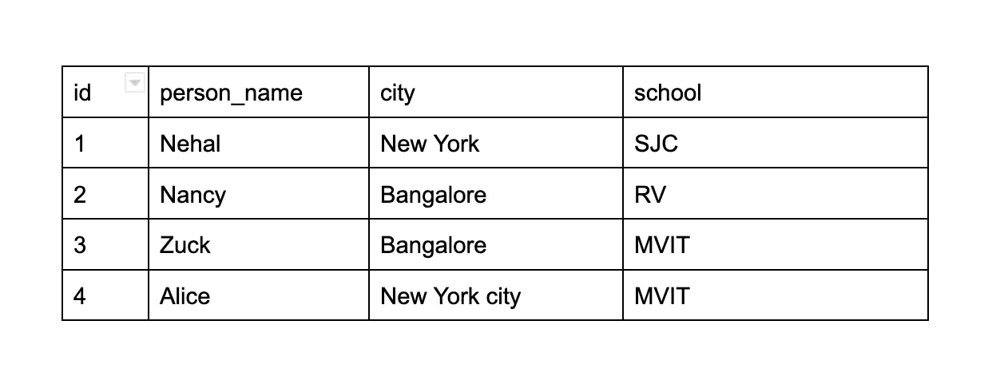

# 让我们来谈谈抽象

> 原文：<https://medium.com/codex/lets-talk-about-abstractions-426c6f1f554?source=collection_archive---------9----------------------->

我认为抽象是任何软件设计中最重要的部分，我们可以看到这些原则在现实世界中也很有效。


层层叠叠！

# 我的第一本编程书籍

我清楚地记得我的第一本编程书籍是如何试图用电视机的例子来解释抽象概念的。事实上，你可以看电视而不知道它是如何工作的，这是一个抽象概念！虽然这可能是一个很好的例子，但我的大脑在很长一段时间内肯定没有理解它。经过这么多年，我想我真正理解了抽象的力量，以及它在可伸缩软件设计中扮演的可怕的重要角色！那么，我们来谈谈吧。

# 什么是抽象？

通过抽象的过程，**程序员隐藏除了关于对象的相关数据之外的所有数据，以降低复杂性并提高效率**。—这是你在谷歌上得到的定义！我们来分解一下。

**抽象用简单的术语来说就是契约。**我们关心合同，而不是底层实现。

例如，Android 操作系统已经公开了使用摄像头的合同/API，只要您提供正确的输入等，您的程序就可以访问设备摄像头。你不需要了解所有算法在操作系统上工作的细节。如果明天，Android 团队找到一个更好的算法来更快地启动你的相机应用程序，他们只需改变底层实现，你就可以免费获得好处。

抽象不仅仅是一个软件设计概念。先说现实世界的例子。例如，如果你想看电影，你只需要知道位置和如何购票(也许还有爆米花)。而不是剧院业务如何运作，或者如何制作一部电影等等(你注意到抽象的多层了吗？).你看，抽象随处可见。我们可以运行、存在，甚至创造奇迹，而不需要考虑那么多实现细节。

在软件设计的世界中，抽象有助于减少认知负荷，这是指开发人员需要知道多少才能完成任务。

做软件已经够难了！如果你每次写代码的时候，都要考虑 Linux 内核的一切，那就不可能完成任何事情！

# 变化是唯一不变的

说到软件设计，变化是唯一不变的。任何系统都会随着时间而发展。正确的抽象有助于可演进性，并使保持变化变得容易。在这篇文章中，我们将通过一组例子来看看是如何做到的。

抽象创建了多个层，每个层都通过一个契约进行通信，只要我们保持契约的完整性，我们就可以继续试验或增强底层的实现。

# 给我看一些例子

假设您正在创建一个人和他们居住的城市的数据库。这是目前的设计。现在让我们关注城市字段，它是一个字符串。这种做法有什么问题？



首先，你可以看到这是多么容易出错。如果城市名只是字符串，我们很容易在实际的城市名中出错。这仍然可以通过使用下拉菜单来避免。

但是如果有一天“班加罗尔”被改成了“Bengaluru”，你必须确保所有你放这个城市名字的地方都被改了！

让我们采取不同的方法，使用 id 而不是实际的字符串。


这是做什么的？为什么用 id 替换城市名字符串？

ID 在这里做两件事:

1.  对人类有意义的信息(例如实际的城市名称)只存储在一个地方
2.  它创建了一个抽象层。现在，这个 ID 可以保持不变，即使它标识的信息发生了变化。考虑到这一点很重要，因为任何对人类有意义的事情在未来都可能改变。

# 给我看另一个例子

为什么不呢！

抽象创造了模块化设计。每个模块可以而且应该通过查看其契约/接口来理解。

这个例子显示了合同读取 ETA 值的时刻。现有的实现 **RequestEtaProvider** 对 endpointX 进行 API 调用，以获取 ETA 值并实现这些方法。使用 RequestEtaStream 的任何其他代码只关心 ETA，而不关心它调用哪个端点等等。

```
**interface** RequestEtaStream {
**fun** eta(): Observable<Optional<Map<VehicleViewId, Eta>>>
**fun** eta(vehicleViewId: VehicleViewId): Observable<Optional<Eta>>
}
```

现在有趣的部分来了。

假设我们现在想将 ETA 从现有的 endpointX 中分离出来，并将其从 endpointY 中取出，同时保持每 5 秒轮询一次(ETA 可能会频繁变化:P)。

我们现在要做的就是创建一个新的实现**requesteaproviderv 2**，它调用这个新的端点，实现轮询逻辑等，并正确设置 ETA！当然，在创建具体对象时使用这个新的实现。我们可以随着时间的推移弃用**request eta provider**等等...

你意识到力量了吗？我们没有触及任何现有的代码！(因为这是产生最多 bug 的部分)。我们可以很容易地创建一个新的实现，并用旧的实现替换它。

它很容易就打开了一个选择的世界。一些选项可以是实验，看看通过新的端点延迟是否更好，或者如果用户看到更好的 eta，他们是否预订得更快，等等。

# 如何创建正确的抽象？

现在，抽象是有用的。这并不意味着我们应该盲目地创建大量难以管理的接口！

当我考虑抽象来创建灵活的设计时，以下几点是最有用的:

1.  深层模块:提供强大的功能，同时拥有简单的接口。
2.  通过接口提供选择，但尽可能使常见情况简单。
3.  想想要隐藏什么信息。这个想法很简单:你在接口中暴露的任何信息都会产生连锁反应，如果你决定改变它的话！这需要在设计中做出一些深思熟虑的决定，以确定其他模块需要什么信息，不需要什么信息。

希望这篇文章能帮助你理解抽象在软件设计中的重要性以及它在现实世界中的概念。