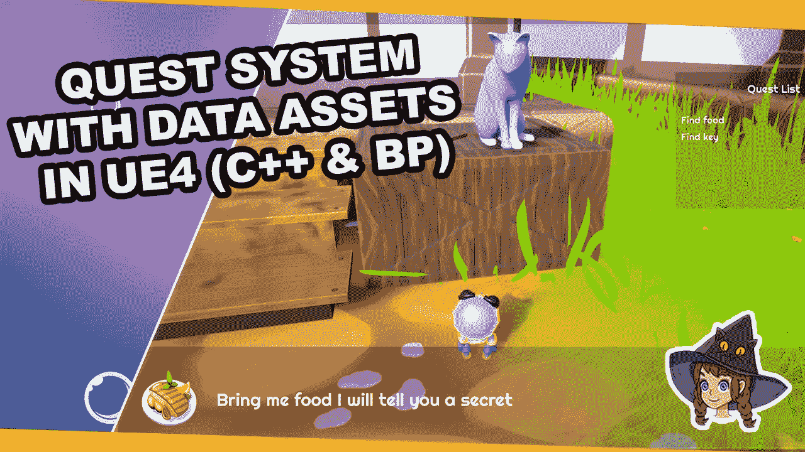

# 让我们来谈谈电子游戏中的数据表

> 原文：<https://medium.com/codex/lets-talk-about-datatables-in-videogames-636084504fb?source=collection_archive---------5----------------------->

## [法典](http://medium.com/codex)

## 使用虚幻引擎 4 (C++和蓝图)中的数据资源创建一个简单的任务系统

当你想在游戏中加入对话或任务时，虚幻引擎 4 会给你不同的选项来处理数据。