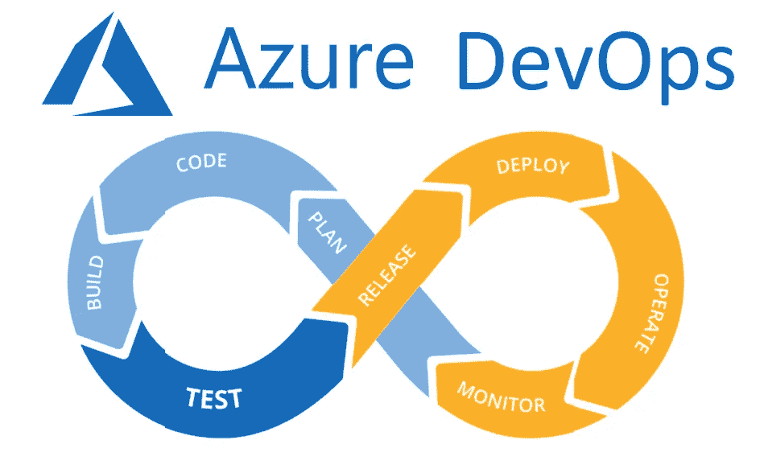
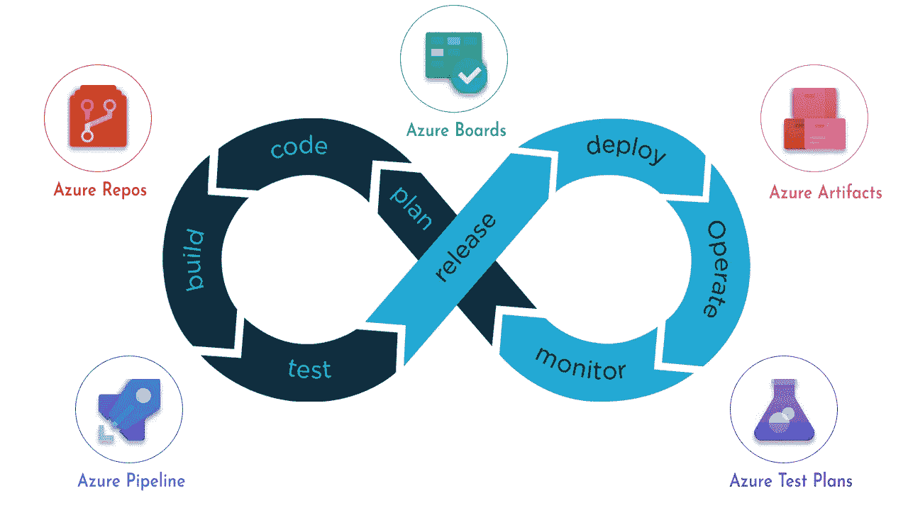

# 我们来谈谈 DevOps

> 原文：<https://medium.com/codex/lets-talk-about-devops-8de6081c905f?source=collection_archive---------5----------------------->

IT 协作世界中的超级文化。

照片由 [Unsplash](https://unsplash.com?utm_source=medium&utm_medium=referral) 上的[尼克·费因斯](https://unsplash.com/@jannerboy62?utm_source=medium&utm_medium=referral)拍摄

对 DevOps 的一个非常笼统的解释是，它是 it 开发和运营团队的联姻。它开始是一场运动，并成为一种文化，通过改变团队互动的方式，从而创造更好的用户体验，它已经改善并继续改善今天领先的软件质量，如微软、亚马逊、网飞等等。

在开发运维对话开始之前，一个企业通常会将开发团队和运营团队孤立起来，或者换句话说，相互隔离并独立工作。这种隔离在参与软件开发的多方之间建立了冲突的“墙”。下面是为客户创建和部署可靠软件的过程:

1.  客户需要技术解决方案(应用程序、数据库等)。)
2.  将客户的需求传达给开发团队，开发出全栈软件。
3.  在开发过程的最后，软件被发送到运营团队，然后他们测试用户体验并处理发布。

这听起来很简单，但是很混乱，因为这些“墙”扼杀了开发人员、项目经理和贡献者之间的合作潜力。这对客户来说最终是一个糟糕的体验。很慢。

戴夫说教

# **为什么 DevOps 如此重要**

DevOps 允许开发人员不断地向客户交付价值。客户发现错误，他们也可能要求新的功能。DevOps 让开发人员能够更快地实施积极的变革，而不是经常发布补丁或让客户等待应用程序的下一个版本来消除错误。有了 DevOps，开发和运营部门之间就有了持续的沟通，从而提高了计划、开发和部署产品的效率，最终这就是任何产品的开发计划。让这成为现代实践的一个例子是 Slack 和 Github 等协作平台的使用。但是等等，还有更多:

# **CI/CD**

Azure Devops CI/CD 周期

DevOps 的采用使得代表持续集成和持续发展的 CI/CD 得以成功实践。例如，CI/CD 可以被看作是一个管道，在这个管道中，软件开发人员继续对代码进行增量更改(CI ),并且快速交付/部署(CD)

人们努力工作，却乐在其中。

CI/CD 允许 DevOps 将诸如可扩展性之类的东西带到桌面上。

可扩展性是指应用程序、存储、数据库和网络等技术对更高或更低的使用需求做出响应的能力。能够根据需要增加或减少资源，以确保这些技术在规模或用户量发生变化时继续正常运行。通过合作，DevOps 团队可以更好地为他们的项目实现可伸缩性和其他有益的品质。

# **实施**

开发运维周期中的微软开发运维解决方案

企业需要适当的工具和技术来在自己的领域中实施开发运维。有大量的资源可以做到这一点，但出于示例的目的，我将使用微软的 DevOps 解决方案的程序套件进行解释。微软套件的程序处理 CI/CD 过程的不同部分。让我们看看每个人都做了什么:

*   **Azure Boards** 用在了循环的每一个环节。是项目的“管理中心”,团队可以在这里跟踪正在进行的任务及其状态、要完成的任务、用户注释、跟踪任何人都可能注意到的错误等。
*   **Azure Repos** 是针对 Github 这样的版本控制，但不同的是 Azure Repos 是私有的而不是开源的。
*   **Azure Pipeline** 用于创建一种类型的管道(构建、发布等。).
*   **Azure 工件**允许用户使用或共享公共库(比如 npm)。
*   **Azure 测试计划**管理多种浏览器上的代码测试，并将它们分为三个测试套件:基于查询、基于需求和静态。

当我第一次听说 DevOps 时，我不知道它是什么样子。一个部门？一个领域？单一软件解决方案？不，不止这些。DevOps 文化改变了开发人员处理产品生命周期的模式。随着越来越多的企业采用这种文化，开发人员发现更多的机会使他们的工作有价值，更多的客户可以放心，高质量的产品不断交付给他们。