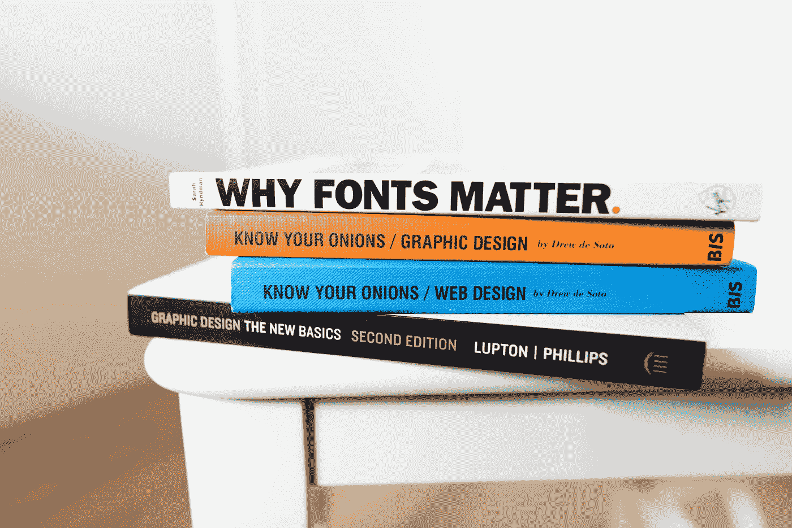

# 让我们来谈谈字体的易读性:形状、字距和颜色。

> 原文：<https://medium.com/codex/lets-talk-about-font-legibility-shapes-kerning-and-colours-ef9313896f0a?source=collection_archive---------1----------------------->

照片由[耶鲁安穴獭](https://unsplash.com/@jeroendenotter?utm_source=medium&utm_medium=referral)在 [Unsplash](https://unsplash.com?utm_source=medium&utm_medium=referral)

当我意识到从长度上看，这几乎是一篇文章的时候，我开始写一篇对这篇深思熟虑的文章的回复——尽管我觉得有点误传——这篇文章是由[罗德里戈·S-C](https://medium.com/u/6866fdd9b40d?source=post_page-----ef9313896f0a--------------------------------)写的，内容是“[黑底白字让我想把自己的眼睛挖出来](/writers-blokke/white-text-on-black-makes-me-want-to-gauge-my-eyes-out-like-oedipus-4ba9fa70318)”。

*对于你们这些目不识丁的 TLDR“啊，文字之墙”推特一代人来说，直接跳到* …