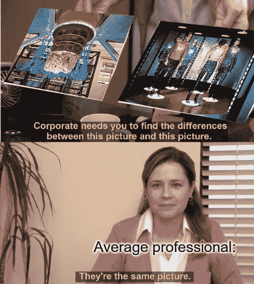

# 我们来谈谈“即插即用”的量子计算工具和知识

> 原文：<https://medium.com/codex/lets-talk-about-plug-and-play-quantum-computing-tools-and-knowledge-3564e59bc49c?source=collection_archive---------7----------------------->

大约 2 年前，我开始实施一个策略:每天发布关于量子计算的文章，但有一个特定的目标。我的任务是向与量子生态系统不完全相关的人提供策略、工具和资源，以帮助他们跳入这个令人惊叹的领域。主要目标是(现在仍然是)为不同类型的专业人士和企业提供替代方案，以融入量子计算时代及其当前和潜在的好处。但是最近我停止了“Linkedin 发布热潮”,去思考和过滤我正在分享甚至开发的东西。

我们几乎每天都能在量子新闻中看到什么？

*   量子公司/创业公司被授予百万富翁基金。
*   展示特定科学进展或成就的量子公司或研究中心。
*   传统期刊谈论量子计算将如何改变世界。
*   关于人们反对“量子计算神话”的文章。
*   押注量子计算的大公司与这个生态系统中的相关硬件或软件提供商结成联盟或合作伙伴关系。
*   政府在全国范围内投资量子计算项目，创造了一种“量子世界竞赛”。

新闻和文章背后的所有这些主题都非常有趣，并对这项技术的发展产生了重大影响，也对这种趋势朝着更加清晰和切实的量子优势呈指数增长的方式产生了重大影响。假设，在我看来，要实现在科学研究和市场之间架起一座桥梁的目标，还有很多工作要做。这主要是因为上面的话题针对的是量子专家消费者或者投资者。在这个例子中跟随我:

如果你是一名物流经理或风险分析师，甚至是一家资产管理公司的所有者，你会理解并给予纠错概念和挑战足够的重视吗？或者可以加快量子优势的光子量子计算机方法？或者“X”创业公司筹集了 2000 万美元来开发一项特定的技术？从我的观点来看，答案是一个很难回答的“不”(排除那个人已经是量子爱好者的罕见情况)。量子生态系统必须推动以下战略:

1.  为数据科学家和软件工程师提供的工具，帮助他们在友好的结构中跳入 QML，或使用任何对他们有意义的语言进行量子优化或模拟(Qiskit IBM 是目前在这一主题上处于领先地位的公司)。
2.  即插即用解决方案、SaaS、平台或任何其他与量子计算机使用相关的无“眼泪”工具。
3.  开发为行业和团队设计的培训课程，使他们能够轻松使用和分析量子算法及其生态系统中的潜在优势。
4.  更深入地研究真实世界数据的用例与示例，而不仅仅是一些数据点或语言包提供的内置理论数据集。
5.  不仅为 quantum 工程师，也为 quantum 经理或领导者创造职业道路。
6.  投入更多时间和资源为公司创建量子路线图。

这些只是一些想法，但是我们可以通过思考需要什么来缩小炒作、学术界、资助新闻和现实世界用例之间的差距来发现更多的想法。让我分享一些对每个人都有用的材料示例(在我看来):

1.  [量子助推](https://www.amazon.com/-/es/Brian-Thomas-Lenahan/dp/1989478123/)来自[布莱恩·莱纳汉](https://www.linkedin.com/in/brian-lenahan-innovation/)(书)。
2.  [Qiskit 文档](https://qiskit.org/documentation/getting_started.html) (Python SDK)。
3.  [Q-CTRL 学习中心](https://q-ctrl.com/learning-center/)(教育平台)。
4.  管理人员 BIMTECH Quantum(教育项目)。
5.  [MIT xPro 量子计算基础](https://learn-xpro.mit.edu/quantum-computing)(教育项目)。
6.  像 María Gragera Garcés [【量子普及教育】](https://github.com/Quantum-Universal-Education/Quantum-Universal-Education.github.io/blob/master/_posts/2022-06-05-qubits-vs-bits.md) (GitHub Repository)这样的库。

除了许多人致力于扩展量子生态系统之外，还有更多可用的资源。所以让我们继续一起战斗，展现现在(NISQ 时代)的优势，推动我们走向更光明的量子未来。

如果你想看更多类似于此的建议和内容，可以在 Linkedin [这里](https://www.linkedin.com/in/mancillamontero/)关注我。