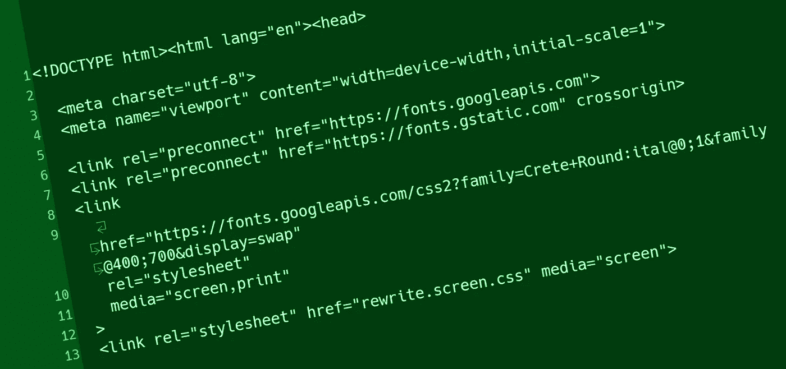

# 我们来谈谈 HTML 和<link>

> 原文：<https://medium.com/codex/lets-talk-html-meta-and-link-27fef51eeedf?source=collection_archive---------0----------------------->

**哪些是你需要的，哪些是毫无意义的？**

我最近为他们网站上的某人重写了一份报告，他们对我从他们网站上删除的所有和<link>标签感到震惊和担忧。正确地使用可以提高你的网站的性能，获取额外的文件，针对用户的可访问性，提高搜索排名和社会推广，并使你的网站表现良好。