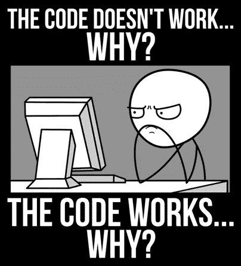
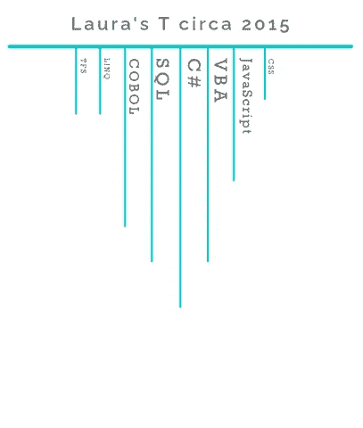
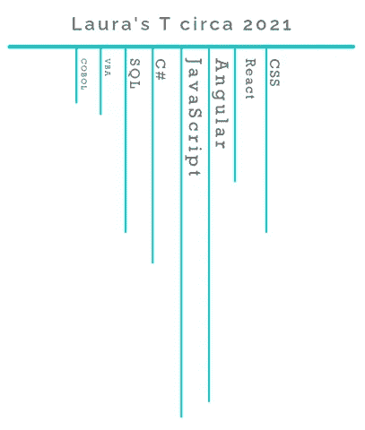

# 升级:如何成为高级软件工程师

> 原文：<https://medium.com/codex/level-up-how-to-become-a-senior-software-engineer-532dea2607?source=collection_archive---------7----------------------->

等级上升

你已经完成了技术培训，并作为软件工程师找到了你的第一份工作。恭喜你！也许你遇到过一些令人印象深刻的工程师，你想知道“我如何成为像他们一样的高级工程师？”。当然，时间和成长起着巨大的作用，但是你现在可以采取一些行动来加快你的时间表。

# 阅读博客

好消息！如果你正在读这篇文章，你已经迈出了成为更好工程师的第一步！当我们决定走上这条令人兴奋的职业道路时，我们与 devil 签订了一项协议，永不停止学习。我们必须记住，技术是一个不断变化的目标。我们永远不会知道这一切。我们总会有更多的东西要学。

那么你是如何跟上这一切的呢？答案很简单。阅读。承诺每周至少阅读一篇新文章。它可能是你目前正在做的一个主题，或者是一些新的令人兴奋的事情。紧跟最新趋势将使您能够跟上技术对话。你也可以加入进来，用事实说话。 [Daily dev](https://daily.dev/) 是寻找科技文章的好资源。

# 参加聚会和会议

你有没有看过一篇文章，结尾比开始前更迷茫？你有时会希望有人在你身边讨论你提出的想法和概念吗？聚会和会议是学习新概念，然后就该主题提问的好地方。你可以在谈话结束后继续与他人的谈话。这些是**结识其他工程师和人脉的最佳**地点。前往[meetup.com](https://www.meetup.com/find/events/)寻找您附近的活动。

# 建立你的关系网

与他人交谈可以扩展你的世界观。你会交到新朋友，找到新工作。我的网络启动了一个不和谐的服务器。他们邀请了他们的网络，谁邀请了他们的网络，等等。现在我们和从初级 UI/UX 设计师到导演的每一个人都有不和谐的对话。涉及数据库、安全性、UI 设计等一系列主题。每当我工作陷入困境时，我就把问题抛给小组，他们帮助我集思广益。当有人在找新工作，或者一家公司在招聘时，我们会互相帮助找到合适的地方/合适的人。建立关系网和讨论技术话题会让你的职业生涯达到新的高度！🚀

# 提问

我知道你在想什么。“我不善于和别人交谈，这就是我整天坐在电脑后面的原因”，或者“我不想听起来很愚蠢”。让我们面对现实吧。我们都是书呆子。没人觉得你傻。没有人会在技术演讲或会议中说“这是个愚蠢的问题”。如果你不理解一个概念，很有可能其他人也在苦苦挣扎。向其他工程师或建筑师提问让其他人看到:

1.  你很关心这个问题。
2.  你很想知道更多。
3.  你乐于倾听新的想法。

它也展示了你所知道的，以及你有兴趣发展的领域。

我一直是一个不怕直言不讳的人(这让我陷入了几次麻烦)。我问问题并表达我的观点。我从来没有被指责过于安静。我也观察过一些更喜欢在家工作的人，他们在整个会议期间都关着相机。过了一段时间，人们甚至会忘记他们在那里工作过。他们只是安静地做他们的工作，当他们有问题或不同意时不会大声说出来。这些人只是生活费用提高了。他们很少得到提升。他们被排除在“酷”项目之外，是第一批被解雇的人。

为什么？因为他们不会引起别人的注意。没有人知道他们在想什么，甚至不知道他们的激情是什么。如果你没有告诉任何人你真的喜欢 CSS 并且想成为一名摇滚明星 UI 工程师，那么你将会得到和你一直得到的一样的 API 工作。如果你因为你的公关总是被拒绝而感到沮丧，但你从来没有问为什么或如何做得更好，那么这将被认为是你不想尝试。他们会给你更多的补救工作。你必须让别人听到你的声音！

# 看文件！

我们都花了 3 天时间在同一个问题上绞尽脑汁，结果却完全搞不清楚到底发生了什么，为什么你的代码会出错。或者，更糟糕的是，您的代码可以工作，但是您不知道如何工作！你已经谷歌了，你已经阅读了[栈溢出](https://stackoverflow.com/)，你已经梳理了 git hub 问题，但是你仍然不知所措。你猜怎么着，那些来自编写技术的人的无聊文档很可能包含了你所有问题的答案。文件可能很枯燥，难以阅读。把你的搜索范围缩小到你遇到问题的具体领域。如果你一点都没明白，那就从头开始。

# 呈 T 形

t 型的人对一门学科了解很多，对多门学科也有所了解。这些人很适合成为某个话题的“焦点”。他们也有助于在团队通常不工作的领域帮助团队。

你测试会随着时间的推移而改变。这很好。它显示了成长和学习新技能的决心。

在我职业生涯的初期，我沉迷于 C#和 VBA (Visual Basic for Applications)。我在 Excel 里做了很多开发工作。我测试在许多方面还是有点肤浅。几年后，当我换工作时，我迷上了 JavaScript 和 React。又一次换工作把我推向了棱角分明。这些天我很少写 C#，但是我总是可以加入并帮助关闭一张卡片。

# 编写好的、干净的代码

如果你不能执行，拥有世界上关于一个主题的所有知识并不重要。进入下一个层次是关于编写清晰、简洁、高效的代码的能力。你应该遵循干净的编码实践，[坚实的原则](https://en.wikipedia.org/wiki/SOLID)，以及你的公司制定的标准。尽可能热情地编写最好的代码，这将反映在你的工作中。惊人的工作将会获得其他工程师、建筑师和经理的关注。他们会开始邀请你参加设计会议，听取你的意见。查看我关于[清洁编码实践](https://lauraslocum.medium.com/clean-coding-practices-4ab1e8a5cb0e)的博客。

# 要谦虚。

不要让这一新发现冲昏了你的头脑。我们必须记住，技术是一个不断变化的目标。我们永远不会知道这一切。我们总会有更多的东西要学。你的团队和组织中的每个人在职业生涯和生活中都处于不同的水平。我们都有自己的目标。你不仅要努力实现自己的目标，还要帮助别人实现他们的目标。当一个工程师同事正在为一个概念苦苦挣扎时，不要嘲笑和取笑那个人。相反，试着用他们能理解的术语解释事情。在某个特定的话题上，永远不要用高人一等的口气跟知识或经验较少的人说话。你永远不知道你什么时候会从事一项他们比你更了解的技术。高级工程师应该提高他们周围工程师的技能。做导师。交个朋友。拓展你的人际网络。

# 学习设计模式

学习设计模式对于编写可维护的代码至关重要。建筑师的工作是阐明公司和项目的方向。他们将研究项目的需求，并选择要遵循的设计模式。当架构师说这是您将要使用的模式时，知道模式是什么将有助于您立即投入工作。有很多学习模式的好资源。最流行的是“[头先设计图案](https://www.oreilly.com/library/view/head-first-design/0596007124/)”。当架构师说我们将使用工厂模式，但是您忘记了它是什么的时候，这本书很好的保存在手边。如果你不是读者，Christopher Okhravi 有一个 [YouTube 系列](https://www.youtube.com/watch?v=v9ejT8FO-7I&list=PLrhzvIcii6GNjpARdnO4ueTUAVR9eMBpc)讨论这本书的模式。在那里，你可以搜索其他关于设计模式的视频。例如，DevSage 有几个 [JavaScript 设计模式](https://www.youtube.com/channel/UCV4AXpDSxschk8I0sCl8JXw)的视频。提示:设计模式不限于特定的语言。所以“JavaScript 设计模式”也适用于。NET，Java 等。

当你看到模式时，学会识别它们会强化你的知识。试着找出使用过的模式，为什么要使用它们，看看你是否能想出另一个可以使用的模式。这是一个有趣的游戏，当它是你冲刺的最后一天，你没有任何事情要做的时候。权衡每种模式的利弊，看看是否能找出架构师做出这些决策的原因。这将帮助你像建筑师一样思考，看到更大的图景。

学会用模式思考将有助于你看到更大的图景，创造出可扩展的设计。这是一项经过多年学习、识别和编写这些模式后获得的技能。这是建筑师所拥有的，这就是为什么你应该总是听从你的建筑师。这并不是说你不应该提出问题和建议。

# 结论

成为一名高级软件工程师不仅仅是写代码。你必须学会用模式思考，看到更大的画面，指导他人，并保持在当前趋势的顶端。这些技能中的许多都需要时间和经验。你必须努力提高你的技能来扩展你的技能。当你认为你已经掌握了某项技术的所有知识时，再学一项新技能。学点别的。致力于不断学习新事物的人永远不会发现自己失业很久。