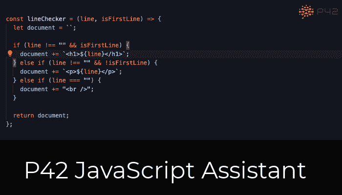

# 用这 60 个针对 VS 代码的快速修复提升你的 JavaScript 水平

> 原文：<https://medium.com/codex/level-up-your-javascript-with-these-60-quick-fixes-for-vs-code-e938a33c266f?source=collection_archive---------10----------------------->

在编程时，我们经常直接编辑文本来达到目的。这种手动编辑既慢又容易出错。对于保留行为的变更(重构)，**自动化可以节省您的时间，确保转换正确执行，并警告潜在的破坏**。你可以更直接地传达你的意图，例如，“我想将这个表达式提取到一个变量中”，并让机器找出细节。

我为 Visual Studio 代码编写了一个名为 P42 JavaScript Assistant 的[扩展，它为 JavaScript 和 TypeScript 添加了 60 个自动重构、快速修复和清理功能，让您的生活更加轻松。这篇博文概述了不同的代码动作及其类别。但首先，这里有一个 P42 如何工作的例子，让你了解它如何帮助你:](https://marketplace.visualstudio.com/items?itemName=p42ai.refactor)

# 核心重构

视觉研究代码已经包含基本的重构，如重命名和提取功能。P42 增加了额外的重构或扩展功能，如安全检查。

*   [提取变量](https://p42.ai/documentation/code-action/extract-variable)
*   [将子串提取到变量](https://p42.ai/documentation/code-action/extract-substring-to-variable)
*   [行内变量](https://p42.ai/documentation/code-action/inline-variable)
*   [内联成模板](https://p42.ai/documentation/code-action/inline-into-template)
*   [内嵌返回](https://p42.ai/documentation/code-action/inline-return)

# 反应重构和快速修复

在 [React](https://reactjs.org/) 中，组件通常包含 [JSX](https://reactjs.org/docs/introducing-jsx.html) ，一种 JavaScript 的语法扩展。P42 提供了代码操作，使得使用 JSX 和 React 更容易:

*   [提取反应功能组件](https://p42.ai/documentation/code-action/extract-jsx-element)
*   [将{…}添加到 JSX 属性](https://p42.ai/documentation/code-action/add-braces-to-jsx-attribute) & [从 JSX 属性](https://p42.ai/documentation/code-action/remove-braces-from-jsx-attribute)中删除{…}
*   [折叠 JSX 元素](https://p42.ai/documentation/code-action/collapse-jsx-element) & [展开 JSX 元素](https://p42.ai/documentation/code-action/expand-self-closing-jsx-element)
*   [用<>……</>](https://p42.ai/documentation/code-action/surround-with-jsx-fragment)&[围住去掉不必要的<>……</>](https://p42.ai/documentation/code-action/remove-unnecessary-jsx-fragment)

# ECMAScript 现代化

得益于 [TC39](https://tc39.es/) 的伟大工作，Javascript 生态系统进展迅速。然而，很难用较新的 JavaScript 特性来保持代码库的更新，并且 codemods 并不总是一个选项，因为它们有很大的变动和损坏的可能性。P42 既支持类似 codemod 的大规模代码重构，也支持针对以下升级的更多机会性代码现代化:

# ES2015

*   [将对象属性折叠成速记](https://p42.ai/documentation/code-action/collapse-property-into-shorthand)
*   [转换。apply()使用扩展语法](https://p42.ai/documentation/code-action/convert-apply-to-spread-syntax)
*   [将函数转换为箭头函数](https://p42.ai/documentation/code-action/convert-function-to-arrow-function)
*   [将函数转换为对象方法](https://p42.ai/documentation/code-action/convert-function-to-object-method)
*   [将循环转换为](https://p42.ai/documentation/code-action/convert-loop-to-for-of)的 For…
*   [将 Var 转换为 Let & Const](https://p42.ai/documentation/code-action/replace-var-with-let-and-const)
*   [解除默认进入参数](https://p42.ai/documentation/code-action/lift-default-into-parameter)
*   [使用 string . starts with()](https://p42.ai/documentation/code-action/use-string-starts-with)&[使用 String.endsWith()](https://p42.ai/documentation/code-action/use-string-ends-with)
*   [使用模板文字](https://p42.ai/documentation/code-action/use-template-literal)

# ES2016

*   [将 Math.pow 转换为取幂运算符](https://p42.ai/documentation/code-action/convert-math-pow-to-exponentiation)
*   [使用 Array.includes()](https://p42.ai/documentation/code-action/use-array-includes)

# ES2020

*   [在默认表达式中使用 Nullish 合并](https://p42.ai/documentation/code-action/use-nullish-coalescence-in-default-expression)
*   [使用可选链接](https://p42.ai/documentation/code-action/use-optional-chaining)

# ES2021

*   [添加数字分隔符](https://p42.ai/documentation/code-action/add-numeric-separator)
*   [将操作员推入赋值](https://p42.ai/documentation/code-action/push-operator-into-assignment)(用于[短路](https://p42.ai/blog/2021-11-25/short-circuiting-operators-and-assignments-in-javascript)表达式)

# 逻辑表达式的操作

布尔逻辑很难读懂，尤其是当表达式变得更加复杂的时候。P42 提供了几个重构，可以帮助你简化和梳理逻辑表达式，使它们更容易理解:

*   [翻转操作符](https://p42.ai/documentation/code-action/flip-operator)
*   [反转条件](https://p42.ai/documentation/code-action/invert-condition)
*   [拔起否定](https://p42.ai/documentation/code-action/pull-up-negation) & [推倒否定](https://p42.ai/documentation/code-action/push-down-negation)
*   [简化二元表达式](https://p42.ai/documentation/code-action/simplify-binary-expression)
*   [去除双重否定](https://p42.ai/documentation/code-action/remove-double-negation)
*   [使用==空值比较](https://p42.ai/documentation/code-action/use-eq-eq-null)
*   [提取变量](https://p42.ai/documentation/code-action/extract-variable)
*   [使用可选链接](https://p42.ai/documentation/code-action/use-optional-chaining)

# If-Else 语句的操作

If-else 语句是许多程序的核心元素。重构它们可以增加程序的可读性，通常与重构它们的条件相结合:

*   [将语句从 If-Else 中取出](https://p42.ai/documentation/code-action/lift-statement-out-of-if-else)
*   [合并嵌套的 If 语句](https://p42.ai/documentation/code-action/merge-nested-if)
*   [将 Else 中嵌套的 If 合并到 Else-If 中](https://p42.ai/documentation/code-action/merge-nested-else-if)
*   [将条件分离成嵌套 If](https://p42.ai/documentation/code-action/separate-condition-into-nested-if)
*   [清除空 If 块](https://p42.ai/documentation/code-action/remove-empty-if-block) & [清除空 Else 块](https://p42.ai/documentation/code-action/remove-empty-else-block)
*   [删除多余的 Else](https://p42.ai/documentation/code-action/remove-redundant-else)
*   [将 If-Else 转换为 Guard 子句](https://p42.ai/documentation/code-action/convert-if-else-to-guard-clause)
*   [将条件表达式转换为 If-Else](https://dev.todocumentation/code-action/convert-conditional-expression-to-if-else) & [将 If-Else 转换为条件表达式](https://p42.ai/documentation/code-action/convert-if-else-to-conditional-expression)
*   [将 If-Else 转换为 Switch](https://p42.ai/documentation/code-action/convert-if-else-to-switch)

# 语法转换

通过编辑文本进行小的语法更改通常很烦人。通常需要编辑不止一个位置，在编辑过程中代码会被破坏，导致不正确的错误和自动完成。您可以通过一个 P42 快速修复来执行以下语法转换:

*   [将{…}添加到箭头功能](https://p42.ai/documentation/code-action/add-braces-to-arrow-function) & [从箭头功能](https://p42.ai/documentation/code-action/remove-braces-from-arrow-function)中删除{…}
*   [将{…}添加到 JSX 属性](https://p42.ai/documentation/code-action/add-braces-to-jsx-attribute) & [从 JSX 属性](https://p42.ai/documentation/code-action/remove-braces-from-jsx-attribute)中移除{…}
*   [折叠 JSX 元素](https://p42.ai/documentation/code-action/collapse-jsx-element) & [展开 JSX 元素](https://p42.ai/documentation/code-action/expand-self-closing-jsx-element)
*   [将对象属性折叠成速记](https://p42.ai/documentation/code-action/collapse-property-into-shorthand) & [展开速记属性](https://p42.ai/documentation/code-action/expand-shorthand-property)
*   [将属性访问转换为点符号](https://p42.ai/documentation/code-action/convert-bracket-notation-property-access-to-dot-notation) & [将属性访问转换为括号符号](https://p42.ai/documentation/code-action/convert-dot-notation-property-access-to-bracket-notation)
*   [分割变量声明](https://p42.ai/documentation/code-action/split-variable-declaration)

# 转换语言元素

有时你想换一种更适合你正在做的事情的语言元素。例如，`for..of`循环更加简洁，在很多情况下可以代替常规的 For 循环。

*   [将条件表达式转换为 If-Else](https://dev.todocumentation/code-action/convert-conditional-expression-to-if-else) & [将 If-Else 转换为条件表达式](https://p42.ai/documentation/code-action/convert-if-else-to-conditional-expression)
*   [将函数转换为箭头函数](https://p42.ai/documentation/code-action/convert-function-to-arrow-function) & [将函数转换为对象方法](https://p42.ai/documentation/code-action/convert-function-to-object-method)
*   [将 If-Else 转换为 Switch](https://p42.ai/documentation/code-action/convert-if-else-to-switch)
*   [将循环转换为 For…Of](https://p42.ai/documentation/code-action/convert-loop-to-for-of) & [将循环转换为 ForEach](https://p42.ai/documentation/code-action/convert-loop-to-for-each)
*   [将操作员推入任务](https://p42.ai/documentation/code-action/push-operator-into-assignment) & [将操作员拉出任务](https://p42.ai/documentation/code-action/pull-operator-out-of-assignment)
*   [将 Var 转换为 Let & Const](https://p42.ai/documentation/code-action/replace-var-with-let-and-const) & [将 Let 转换为 Const](https://p42.ai/documentation/code-action/convert-let-to-const)

# 代码清理

代码清理删除不必要的代码。这种代码可能来自代码变动，例如，通过应用其他重构、添加新功能或修复错误。P42 显示提示并自动清除以下情况:

*   [去除双重否定](https://p42.ai/documentation/code-action/remove-double-negation)
*   [清除空 If 块](https://p42.ai/documentation/code-action/remove-empty-if-block) & [清除空 Else 块](https://p42.ai/documentation/code-action/remove-empty-else-block)
*   [删除多余的 Else](https://p42.ai/documentation/code-action/remove-redundant-else)
*   [删除不必要的条件表达式](https://p42.ai/documentation/code-action/remove-unnecessary-conditional-expression)
*   [删除不必要的表达式语句](https://p42.ai/documentation/code-action/remove-unnecessary-expression-statement)
*   [去除不必要的 JSX 片段](https://p42.ai/documentation/code-action/remove-unnecessary-jsx-fragment)
*   [删除不必要的模板文字](https://p42.ai/documentation/code-action/remove-unnecessary-template)
*   [简化二元表达式](https://p42.ai/documentation/code-action/simplify-binary-expression)

# 其他行动

*   [插入变量](https://p42.ai/documentation/code-action/insert-console-log)的 console.log
*   [用 Try-Catch 包围](https://p42.ai/documentation/code-action/surround-with-try-catch)

如果你觉得这些重构和操作有用，你可以从 VS 代码市场安装 [**P42 JavaScript 助手**。
关于反馈和更新，你可以在](https://marketplace.visualstudio.com/items?itemName=p42ai.refactor) [Twitter](https://twitter.com/p42ai) 或 [LinkedIn](https://www.linkedin.com/company/p42-software/) 找到 P42。

干杯！