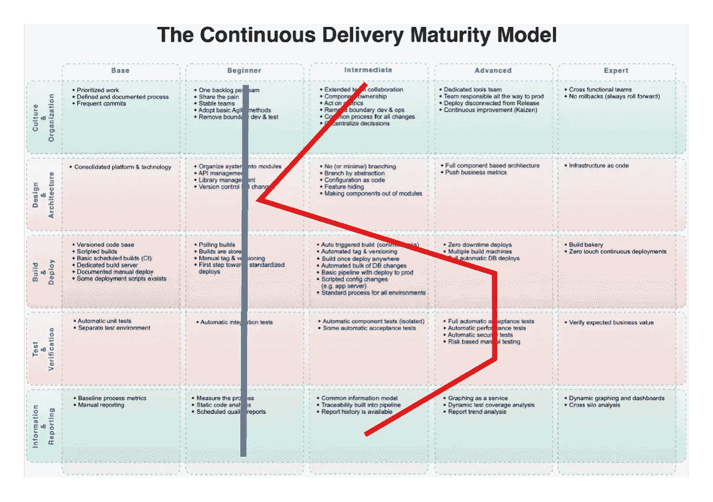
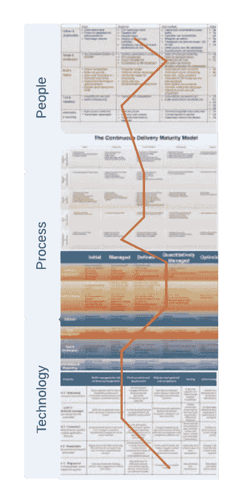

# 提升您的软件交付能力(第 1 部分)

> 原文：<https://medium.com/codex/leveling-up-your-software-delivery-capabilities-part-1-60e5c79ec676?source=collection_archive---------12----------------------->

我们从来没有能力创建一个大规模可伸缩的应用程序，在全球范围内接触用户，由一个单独的开发团队构建和操作具有惊人的生产力。这听起来像是许多供应商承诺的圣杯，用匹配的过程和组织框架如 Scrum、SAFe、BizDevOps 来执行。

> 不是每个赶时髦的人都要去这个云原生的天堂。

所以这篇文章探究了导致性能下降的原因之一。这是能力的不均衡分布，或者不同交付能力之间的不均衡成熟度。高性能的软件交付被束缚在链条中最薄弱的一环。让我提供一些我工作过的团队的趣闻。如果你认识到这个问题，你也可以跳到下一章。

有一个团队已经到了一键部署应用程序的阶段。最初，变更批准过程还需要一个外部依赖(需要几天)，但是在对变更集进行标准化之后，我们最终可以通过一个按钮进行部署。然而，在基础设施方面，公司网络没有达到标准。网络路由更改只能在周日晚上进行。需要申请 DNS 更改，很容易就花了一周时间。在这个例子中，不拥有整个体系，再加上功能不匹配，就抵消了在许多其他领域建立更成熟的体系所带来的大部分好处。

大多数人都能理解的例子是变更批准委员会 CAB 需要签署部署。一些公司竭尽全力让工程团队制造法拉利级别的产品，然后在其中安装远程驾驶系统。就是没有用。

我敢打赌，这个行业的每个人都能想出他们*最喜欢的*扼杀他们项目流程的“组织打嗝例子”。当我和以前的队友回顾过去的项目时，这是许多午餐和酒吧谈话的主题。在所有这些情况下，实际的性能受到不成熟的能力的限制，不符合其他人的能力水平。

这里要认识到的重要的一点是不要高估成熟度，因为一些异常值看起来非常闪亮和成熟。让我们考虑一下来自 [InfoQ](https://www.infoq.com/articles/Continuous-Delivery-Maturity-Model/) 的这个著名模型。红线描绘了当前的事态。这是一个典型的例子，我经常看到一个团队通过拥有完全自动化的测试和部署能力而在自动化方面表现出色，但是没有一个足够成熟的架构(第二个紫色的行)来获得好处。真正的成熟是用蓝线描绘的。最低成熟度能力总是决定了您软件交付的实际能力！

成熟度模型示例(图片来自 [InfoQ](https://www.infoq.com/articles/Continuous-Delivery-Maturity-Model/)

# 提升您的软件交付能力

因此，一个大问题出现了:如何确定整体和详细的性能？Accelerate 一书提供了四个关键指标:部署频率(新版本投入生产的频率)、变更的交付时间(提交到生产的时间)、平均恢复时间(解决生产中的服务缺陷所需的时间)和变更失败率(导致错误和成功部署的部署与生产的比率)。除了这些顶级指标之外，您还需要对较低级别的功能进行详细的扇出，以诊断和改进低级别的功能的性能，这些功能加起来就是这些高级别的指标。Accelerate 中描述的 24 项功能很好，我喜欢它们对整体性能有显著贡献的想法。然而，我确实认为创业团队需要一个更精细的底层框架。许多团队还没有准备好从优化顶级功能中获益。

虽然 Accelerate 的作者声称用成熟度矩阵来拉平会有负面影响，但我坚信许多人已经发现它是他们旅程中有用的路线图。具有 Shu-Ha-Ri 性质的成熟度矩阵在不断自我优化的情况下完成成熟度，而不是在稳定状态下！如果您对 DevOps 感兴趣，您可能已经使用过下面描述的一个或多个模型。

这些模型中的大多数都没有提供足够广泛的覆盖面，选择专注于其中任何一个都有失败的风险。**建立高效的交付能力需要全局观点。对我来说，这已经成为一个不断扩大的需要考虑的主题。在我的咨询工作中，我使用当前流行的 DevOps 框架的组合，并辅以组织成熟度框架。**

形象地说，我认为一个合适的成熟度基准是一个全面的概述，它包含了人、技术和过程拓扑中的广泛主题。

整体成熟度基准

[在第 2 部分](https://kevin-van-ingen.medium.com/leveling-up-your-software-delivery-capabilities-part-2-c19436ffdd48)，我将详细说明我个人是如何使用这些成熟度模型的。它将提供一些实践建议和实施过程。