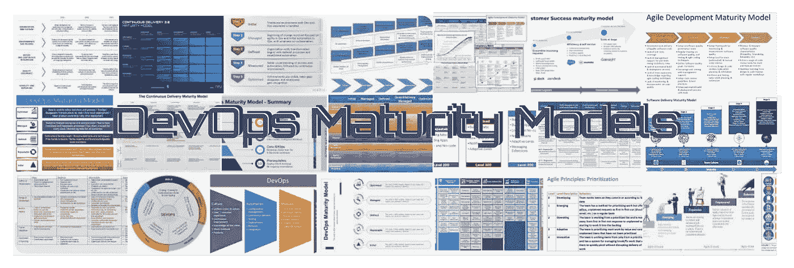
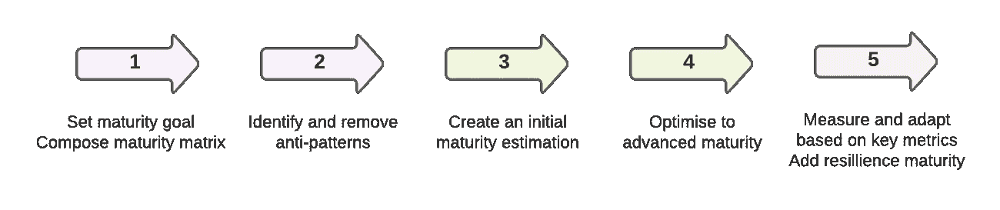

# 提升您的软件交付能力(第 2 部分)

> 原文：<https://medium.com/codex/leveling-up-your-software-delivery-capabilities-part-2-c19436ffdd48?source=collection_archive---------15----------------------->

先前(第 1 部分)我展示了我对使用成熟度模型来提高软件交付能力的观点。在这篇博客中，我将展示我如何使用这些模型来提高成熟度。

# 使用成熟度模型

在过去的十年中，我已经使用了广泛的软件交付成熟度模型。一旦你内化了成熟度模型是如何发展的，它就会成为你在团队和组织中自然规划成长的一部分。简而言之:在任何增长情况下，你都会立即绘制出一张从不太成熟到自我优化最终目标的路线图。正是这种心态带来了回报。其次，实现自我优化的旅程本身就很重要。在许多情况下，不经过成熟期就跳跃到更成熟的状态会限制你的表现和整体成熟度。自我提升的过程带来了文化的改变，并确保你在你的组织中植入了基本的提升哲学。有人会说，旅程和目的地一样重要。

我定期搜索新的成熟度模型，以帮助我的应用工程领域。模型被重新发明，成熟度级别被重新平衡。八年前的成熟，今天是初学者水平。组织动态、技术和流程至少每五年改变一次，这取决于您的环境有多“现代”。我发现合并行业标准成熟度模型来创建情景模型是值得的。

# 我的首选总体流程

因此，为了给你一些参考，我认为所有这些模型仍然可以提供很多价值。下面更详细地解释了这些步骤。

使用成熟度模型来提高性能

1.  第一个是设定一个与环境相关的目标。我们不应该都努力成为成熟的 Spotify 或网飞，因此设定一个现实的预期是有意义的。根据这一目标和背景，可以构建正确的成熟度矩阵(超出行业标准),创建定制和情景成熟度模型。这里的关键是不要教条，而是要有语境。
2.  一个经常被忽视的步骤是识别可能存在的反模式，这些反模式目前限制了我们在模型上成熟的能力。这是一个值得写博客的话题。但是公平地说，尤其是围绕技术团队的组织环境需要与期望的改进保持一致。另一个例子是，高技术债务正在破坏许多伟大的改进想法。
3.  下一步是基线化当前的成熟度级别。虽然这个基线的结果在比较未来的改进时非常有价值，但是它也有很多附带的好处。要求团队反思他们自己的“事务状态”迫使他们从日常事务中抬起头来，我已经看到这激发了“成长思维”。成熟度等级的划分是即将到来的变革文化的巨大散热器。它为接下来的事情做好了准备。
4.  下一步是优化所有不同能力领域的成熟度。如前所述，这是一个过程，在这个过程中，成熟度级别最好以一种水平的方式递增。因此，实际上，要确保你的组织和文化与技术软件的改进同步。
5.  一旦你达到一个相当成熟的状态，你就可以转换到一个基于度量的优化阶段。Accelerate 的四个关键指标是一个不错的默认值，但是，我也会考虑其他选项。在这个层次上，团队可以检查和调整它的过程和技术。对于单个团队来说，适应文化和组织有时仍然更加困难，因为它们通常需要管理层的影响。此外，我建议增加弹性的额外成熟度目标。当外部因素突然推翻你的现状时，只优化关键指标总是会带来惊喜。你可能会觉得自己做得不错，但是增加弹性目标会确保你晚上能睡得着。

# 包扎

从根本上说，我希望我说服了你对你的改进过程有一个整体的看法。它总是需要过程、技术和人的三位一体来获得改进的平衡的整体观点。改进框架来来去去，它们随着现代软件团队的需求一起成熟。这可能不是一个改进的银弹，但我相信，当充分利用时，成熟度模型提供了一个学习和反思的地方。