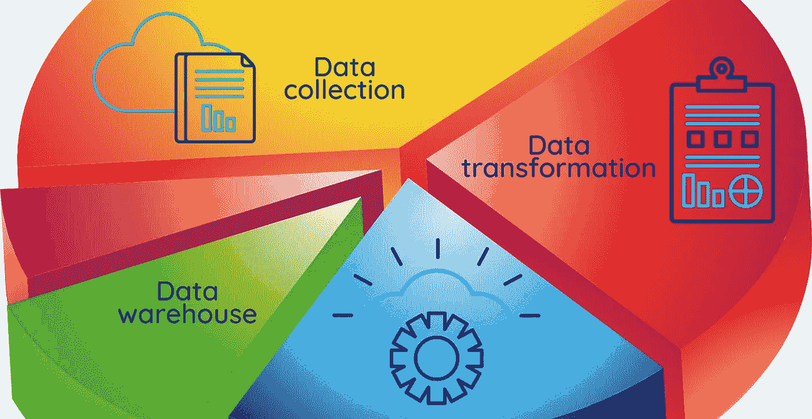

# 利用数据工程进行数据驱动的决策

> 原文：<https://medium.com/codex/leveraging-data-engineering-for-data-driven-decision-making-c385f0bcef39?source=collection_archive---------12----------------------->

数据工程作为一个领域近年来越来越受欢迎，尤其是在大型科技公司。它专注于大数据的收获和应用。在任何领域，工程师都会设计和制造东西。数据工程也是如此:数据工程师也设计和构建。

例如，与设计和建造物理基础设施的土木工程师不同，数据工程师设计和建造数据管道。这些管道将数据传输和转换为数据科学家可以理解的格式。数据工程师使用他们创建的数据管道从许多不同的来源提取数据，并将其放入数据科学家可以分析的单个仓库中。

因此，我们可以将数据工程定义为设计和构建收集、传输和转换大数据以供数据科学家进行分析的管道所涉及的所有流程。数据工程师设计、开发、构建、测试和维护大型处理系统和数据库。在大多数情况下，他们使用特定的技术和工具处理含有大量错误的未经验证的原始数据，从而提高其质量、效率和可靠性。

最终，数据工程旨在提供一致且有组织的数据流，支持数据科学家的数据驱动型工作，包括:

*   探索性数据分析
*   机器学习模型训练

数据工程师创建支持信息访问和流动的机制和接口。数据工程围绕着:

*   系统结构
*   数据库设计和配置
*   编程；编排
*   传感器和接口配置

# 推动数据科学的力量

因为数据工程的性质，数据工程师得不到太多的赞美和认可；他们通常在幕后，不参与吸引赞誉的任务，例如从大数据中获得令人难以置信的见解和查询大数据源。然而，他们的工作对数据科学家的成功至关重要；他们是构建数据存储的人，使难以置信的洞察力成为可能。

数据工程师设计数据库、数据分析基础设施和数据仓库/市场/湖泊。他们制定了数据科学家和其他数据用户用来从数据中获取所需信息的查询。因此，一名合格的数据工程师必须了解数据结构、数据库、云环境和硬件基础设施。

因为数据工程师处理结构化和非结构化数据，所以他们必须清楚地了解数据应用和架构的各种方法。数据工程师的工具包包括数据接收和处理的开源数据框架。

大型科技公司产生数十亿字节的数据，不得不开发从海量数据中提取有用见解的方法。在他们从数据中获得任何见解之前，他们必须首先找到可靠地存储数据、处理和查询数据流入的方法。因此，数据基础设施必须是可靠的、分布式的和可伸缩的。

鉴于所涉及的数据量巨大，数据工程师必须完成的任务在本质上绝不是微不足道的。数据工程师和数据科学家组成了数据团队，数据团队已经成为现代科技公司技术团队的核心部分。

# Excel 电子表格分析的不足

数据工程围绕着从数据源获取数据并保存它以供分析。对于小公司来说，在他们的 CRM、Google Analytics、应用程序数据库以及其他一些工具中跟踪结果可能就足够了。他们的分析数据管道管理起来相对简单，Excel 电子表格分析就足够了。

但随着时间的推移(在快速增长的初创公司中，有时在几个月内)，这一渠道的不足变得明显。现在，该公司发现自己希望从数据中获得更多见解，特别是当它增加了更多数据源和要跟踪的字段时。越来越有必要创建一个自动化系统，它可以聚集来自不同来源的所有数据，并利用这些数据进行分析。

# 自动化数据收集和转换

这是数据工程开始的地方；数据工程师介入并自动化了数据提取、转换和加载过程，创建了一个 ETL(提取、转换、加载)管道。ETL 管道通常使用 API 连接提取数据，并对其进行转换以消除错误、更改格式、将相同类型的记录相互映射、验证数据是否正常，最后将其加载到 MySQL 等数据库中。数据工程师创建一个脚本，使这个过程每周或每月重复一次。

该团队现在可以使用商业智能(BI)工具访问数据，这些工具以地图、垂直和水平条形图、饼图等形式表示信息。通过方便地获取见解，利用数据的理念已经深入到公司文化中，成为数据驱动型企业的旅程开始了。

营销团队现在可以跟踪从潜在客户访问公司网站到他们购买产品或服务的整个销售漏斗。另一方面，产品团队可以在管理团队审查高级 KPI 的同时探索客户行为。

# 创建数据仓库

但这通常是短暂的，因为标准的 ETL 管道利用了 MySQL 等事务数据库，而这些数据库并没有针对处理复杂查询和进行大量分析进行优化。有必要创建一个数据仓库，将公司从不同来源收集的数据以有组织的方式整合在一起。

创建仓库有助于公司以有意义的方式组织数据，以用于分析目的。这种仓库将被设计成运行甚至最复杂的分析查询。与使用标准数据库不同，创建一个仓库包括与公司的不同团队进行几次坐下来讨论和反复讨论，然后才能得出最佳的仓库设计。

# Python 的开源数据框架

在当今的许多公司中，Python 数据框架是创建连接到不同数据源的数据仓库的首选方式，这些数据源包括 BigQuery、亚马逊 S3、雪花、亚马逊红移、Oracle 等。近年来，数据科学家已经不再在他们的研究和分析工作中使用 MATLAB，而是更喜欢 Python，因为它有出色的数学库。通过利用 Python 的开源数据框架，公司可以开始他们的数据工程之旅，成为数据驱动的企业。