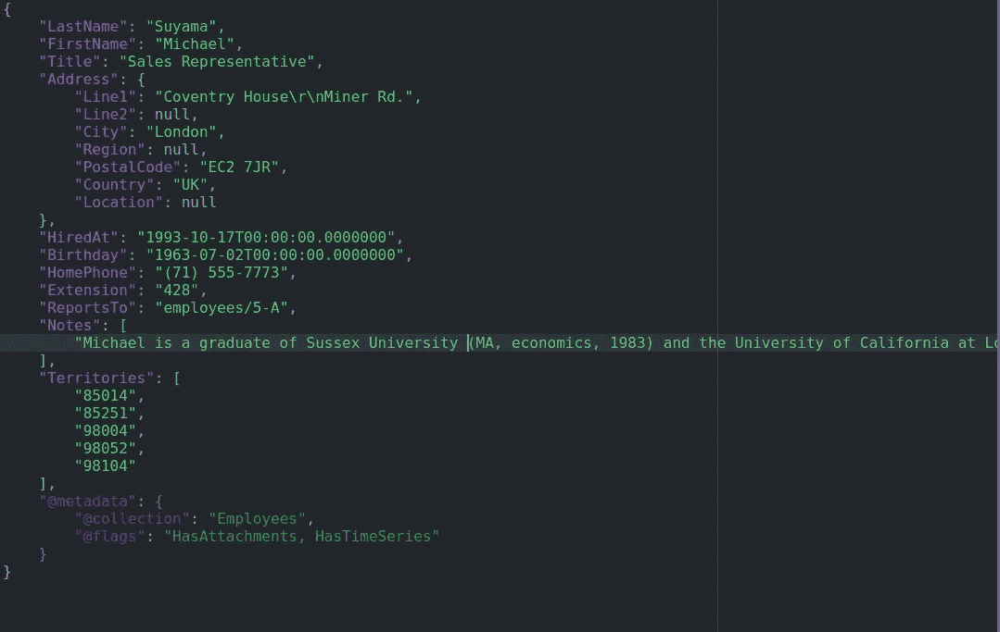

# 利用 RavenDB 作为文档存储的 NoSql 选项

> 原文：<https://medium.com/codex/leveraging-ravendb-as-nosql-option-for-document-storage-8758b8c0d3cc?source=collection_archive---------6----------------------->

## 每个人都可以从开源 DocumentDB 选项中获益，该选项为您的登录数据层提供了 ACID 属性。

萨拉·库菲在 [Unsplash](https://unsplash.com?utm_source=medium&utm_medium=referral) 上拍摄的照片

嘿伙计们，你们好吗？今天我想介绍一下 [RavenDB](https://ravendb.net/) ，这是一个针对文档类型的 [OLTP](https://www.techopedia.com/definition/4604/on-line-transaction-processing-oltp) 系统的开源选项。但是在你翻白眼之前，怀疑者说:“是啊，我现在的选择就是这样，甚至给我倒了一杯咖啡。”

我想向你保证，这不是一个长期的承诺。利用 RavenDB 作为满足 NoSql 需求的一个选项可以给你带来一些好处。比如它对 [OLAP](https://searchdatamanagement.techtarget.com/definition/OLAP) 建模的原生支持，与主要云的集成以及它的 [ACID](https://www.techopedia.com/definition/23949/atomicity-consistency-isolation-durability-acid-database-management-system) 属性，等等。

听起来不错？因此，如果你有一些空闲时间，我想向你介绍 RavenDB 做什么，为什么它可以成为你的 OLTP 系统的竞争者；然后我们将看到如何查询一些数据。我们将总结一些用例，以及每种用例需要考虑的事项。

# 什么是 RavenDB

RavenDB 是一个 [NoSql](https://searchdatamanagement.techtarget.com/definition/NoSQL-Not-Only-SQL) 文档类型的数据库，具有令人兴奋的特性，例如允许您的团队使用 Sql 来浏览您的半结构化数据，就像您浏览结构化数据一样。

为了理解它的帮助，让我们快速回顾一下 NoSql 和关系数据库。首先，我们要记住，我们的数据是按照生成方式分类的，可以采用以下格式:

*   结构化(关系数据库或分隔的平面文件)；
*   半结构化(由键值对分隔的嵌套结构，如下所示)；
*   非结构化(多媒体内容，如照片和视频)。

JavaScript 对象符号(JSON)

有时，我们的报告不能有结构化和干净的数据，所以如果你仔细想想，这是一个优雅的特性。您的分析师将从简单代码的生产力中获益。

用更少的部署时间实现更多的数据探索可以将现有管道中的相同逻辑重用到新管道中。允许他们像集成表格数据源一样集成非表格数据源。对一些分析师来说，就像大热天的冰淇淋一样美味。

# 好吧，但是我为什么要把它当作 NoSql 选项呢？

既然我们已经打好了基础，那就让我们更深入吧。先从酸属性说起。这个特性是关系数据库的固有特性，但在 NoSql 数据库中并不常见，因为它们位于 [BASE](https://queue.acm.org/detail.cfm?id=1394128) 属性下。

RavenDB 的另一个简洁的特性是他们所谓的“[多模型数据库](https://ravendb.net/why-ravendb/multi-model)，”是的，你说对了，我的好朋友；顾名思义，它允许您创建与应用程序分离的规范模型。

更简单地说，您与运行时对象而不是实际的表进行交互。这些对象向您公开了您的数据，消除了导入半结构化数据或为结构化数据创建转储的需要。RavenDB 生成一个逻辑层，您可以在其中使用统一的语言来质疑您的数据。好消息是他们的类似 SQL 的语言叫做 RQL，所以不需要复杂的专有语言。

最后一个技巧，但肯定不是最不重要的，我想提到的是 RavenDB 带来的 NoSql 数据库选项是本机 ETL [集成](https://ravendb.net/learn/inside-ravendb-book/reader/4.0/8-sharing-data-and-making-friends-with-etl)。它使用 JavaScript 而不是我之前说过的类似 SQL 的脚本语言(Raven Query Language，或者类似的 [RQL](https://ravendb.net/learn/inside-ravendb-book/reader/4.0/9-querying-in-ravendb#fn:1) ),但总比没有好。

# 是啊，没错；我现在能看一些数据吗？

我们将在教程中使用 RavenDB 沙盒。要跟进，请访问此[链接](http://live-test.ravendb.net/studio/index.html#dashboard)进行探索。正如我们在下面看到的，RavenDB 接口并没有那么差。它快速显示有用的信息，如存储使用情况和可用的数据库，如下所示。

渡鸦工作室控制台

在“索引”下(左上第二个选项)，您可以看到现有的索引，您可以根据这些索引查询您的数据。这些索引就是我们之前提到的 RavenDB 运行时对象。

在“索引列表”页面下，您可以看到哪些索引存在并创建您的索引。您可以查看该索引是否健康，并根据您的需要定制它，甚至创建您自己的索引。

对于我们的演示，让我们快速查看一下在“Products”组下生成“Product/Rating”索引的查询。为了节省你的工作，我得到了你，下面是你应该找到的:

用于索引创建的 RQL 代码

我们可以轻松地实时展开您的嵌套数据结构，这使您能够在不需要不必要的开发冲刺的情况下质疑您的数据。

多亏了[点符号](https://www.cs.utah.edu/~germain/PPS/Topics/structures.html)，为您的特定需求创建特设组件或将它们升级为可重复使用的[模块](https://www.techopedia.com/definition/24771/modular)。有了它，任何数量的数据库都可以重用数据管道中的现有业务逻辑。

使用 RQL 查询结果

# 是的，我想看起来还可以；让我们总结一下，我来分享一些最后的考虑。

你还在，太好了！通过这篇文章，我希望大家能清楚 RavenDB 是什么。但是记住我们应该在哪里使用它以及如何使用它总是好的。虽然这是一个优秀的高可伸缩性选项，但要记住在数据存储方面没有[银弹](https://danielpaes.ca/nosql-for-data-storage-11e054ba0746)。

RavenDB 的用例是为了更快地与多维数据库进行数据集成。也就是说，RavenDB 在 OLTP 层上与数据交互时，可以提供更快的响应时间。

RavenDB 功能远未全部列出，因为它支持全文查询、图形查询功能和更容易访问的数据迁移。这是一个完整的数据平台，要了解更多细节，我会加强访问这个[链接](https://ravendb.net/features/#migration)；如果你认为这不适合你，它会让你安心。如果你确信并准备好了，看看他们的[文档](https://ravendb.net/learn/inside-ravendb-book/reader/4.0/1-welcome-to-ravendb)就能得到它所能提供的最好的东西。

您甚至可以从增强的数据湖功能中受益。有些人可能想探索如何将 RavenDB 与对象存储选项关联起来，比如 [MinIO](https://min.io/) 或 [Ceph](https://ceph.io/en/) 。当你加载你的 OLAP 层时，无论是使用他们的 OLAP 版本，还是与另一个工具如 [DBT](https://www.getdbt.com/) 配合使用，你都将获得惊人的性能，因为 [LakeFS](https://docs.lakefs.io/) 提供了数据摄取或 GitOps 功能。

下次见！

*资源:*

https://ravendb.net/

RavenDB 开发者指南—[https://RavenDB . net/learn/inside-RavenDB-book/reader/4.0/1-welcome-to-RavenDB](https://ravendb.net/learn/inside-ravendb-book/reader/4.0/1-welcome-to-ravendb)

RavenDB 工作室—[http://live-test.ravendb.net/studio/index.html#dashboard](http://live-test.ravendb.net/studio/index.html#dashboard)

米尼奥—[https://min.io/](https://min.io/)

ceph—[https://ceph.io/en/](https://ceph.io/en/)

https://www.getdbt.com/ DBT

https://docs.lakefs.io/