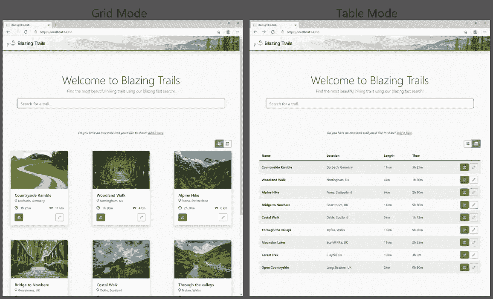
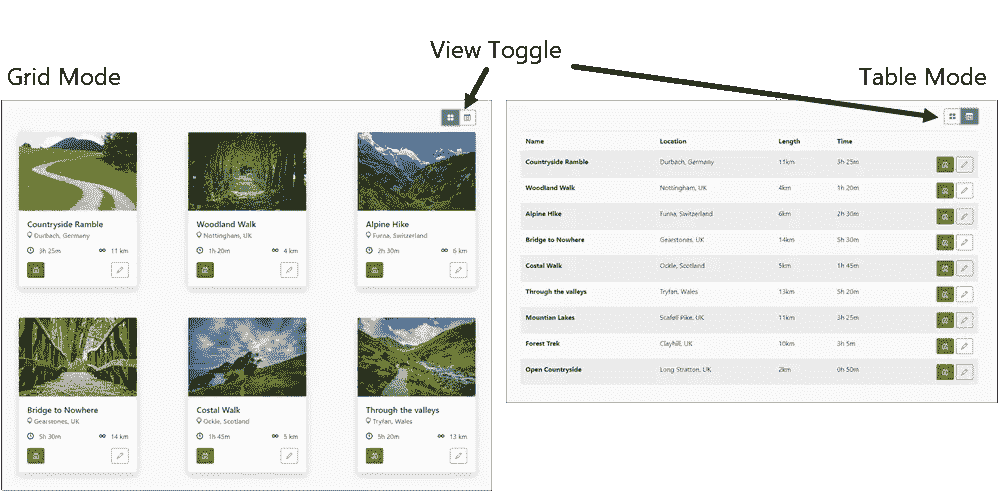

# 利用模板制作可重用的组件

> 原文：<https://medium.com/codex/leveraging-templates-to-make-reusable-components-b561fb9b33d2?source=collection_archive---------2----------------------->

## 文章节选

## *节选自克里斯·塞恩蒂*的[*Blazor in Action*](https://www.manning.com/books/blazor-in-action?utm_source=medium&utm_medium=referral&utm_campaign=book_sainty_blazor_10_7_20)

**本文涵盖**

**使用模板定义 UI 的特定区域**

**用泛型增强模板**

*如果你是一个全栈 C#和。NET web 开发人员，他想了解更多关于 Blazor 的知识。*

*在[manning.com](https://www.manning.com/books/blazor-in-action?utm_source=medium&utm_medium=referral&utm_campaign=book_sainty_blazor_10_7_20)的结账处，将 **fccsainty** 输入折扣代码框，即可享受*[*Blazor in Action*](https://www.manning.com/books/blazor-in-action?utm_source=medium&utm_medium=referral&utm_campaign=book_sainty_blazor_10_7_20)八五折优惠。**

**在本文中，我们将把可重用性提升到一个新的层次。我们将学习如何利用模板和泛型来制作最终的可重用组件。为了给我们一个实际的例子，我们将用一个组件来增强一个名为 Blazing Trails 的网站的主页，该组件允许用户在网格和表格之间切换布局(图 1)。**

****

**图 1 显示了我们将在本章构建的最后一个`ViewSwitcher`组件的首页。该组件允许用户在可用踪迹的网格视图和表格视图之间切换。**

**一旦我们构建了我们的`ViewSwitcher`组件，我们将通过学习 Razor 类库(RCL)来结束这一章。RCLs 允许我们捆绑任何公共组件，并在应用程序之间共享它们。这可以通过一个项目引用来完成，或者 rcl 可以通过 NuGet 打包和运输——就像任何其他方式一样。NET 库。**

## ****定义模板****

**在构建可重用组件时，模板是一个强大的工具。它们允许我们指定由消费者提供的标记块，然后我们可以将它们输出到任何我们想要的地方。在前几章构建`FormSection`和`FormFieldSet`组件时，我们已经使用了一些基本的模板。在这些组件中，我们定义了一个类型为`RenderFragment`名称为`ChildContent`的参数。**

```
**[Parameter] public RenderFragment ChildContent { get; set; }**
```

**这是一个特殊的惯例。用这个特定的名称和类型定义一个参数允许我们捕获在组件的开始和结束标记之间指定的任何标记。然而，对于我们的`ViewSwitcher`组件，我们需要更高级的东西。**

**`ViewSwitcher`组件允许用户在可用轨迹的卡片视图和表格视图之间切换。为了使这个组件尽可能地可重用，我们不想对网格或表格视图的标记进行硬编码。相反，我们希望将它们定义为模板，允许组件的消费者自己定义这些区域。**

**让我们看看`ViewSwitcher`组件的初始标记。现在，我们将在客户端项目中的 Features > Home > Shared 下创建这个组件。请参见下面的清单。**

****清单 1 ViewSwitcher.razor:初始代码****

```
**<div>
     <div class="mb-3 text-right">
         <div class="btn-group">
             <button @onclick="@(() =>
 [CA]_mode = ViewMode.Grid)" title="Grid View" type="button"
 [CA]class="btn @(_mode == ViewMode.Grid ? "btn-secondary"
 [CA]: "btn-outline-secondary")">    #A
                 <i class="bi bi-grid-fill"></i>
             </button>
             <button @onclick="@(() =>
 [CA]_mode = ViewMode.Table)" title="Table View" type="button"
 [CA]class="btn @(_mode == ViewMode.Table ? "btn-secondary"
 [CA]: "btn-outline-secondary")">     #A
                 <i class="bi bi-table"></i>
             </button>
         </div>
     </div>

     @if (_mode == ViewMode.Grid)
     {
         @GridTemplate    #B
     }
     else if (_mode == ViewMode.Table)
     {
         @TableTemplate    #C
     }
 </div>

 @code {
     private ViewMode _mode = ViewMode.Grid;

     [Parameter, EditorRequired]
     public RenderFragment GridTemplate { get; set; }
 [CA]= default!;    #D
     [Parameter, EditorRequired]
     public RenderFragment TableTemplate { get; set; }
 [CA]= default!;    #E

     private enum ViewMode { Grid, Table }    #F
 }**
```

****#A 这两个按钮允许用户在组件提供的两个视图之间切换。****

****#B 指定消费者为 GridTemplate 提供的标记应该输出到哪里****

****#C 指定消费者为 TableTemplate 提供的标记应该输出到哪里****

****#D 定义 GridTemplate 参数****

****#E 定义了 TableTemplate 参数****

****#F 枚举定义了两种视图模式，避免使用神奇字符串。****

**该组件从呈现两个按钮的一些标记开始。这些按钮允许用户在组件提供的两种视图之间切换。为此，我们将`_mode`的值设置为`Grid`或`Table`。`_mode`字段在代码块中定义，默认为`Grid`。这些按钮还使用一个简单的表达式来应用不同的 CSS 类，以突出显示当前处于活动状态的模式。**

**根据激活的模式，组件呈现代码块中定义的两个模板之一，`GridTemplate`或`TableTemplate`。模板只是一个类型为`RenderFragment`的参数。**

**我们还将为组件添加一些样式。我们将添加一个名为 ViewSwitcher.razor.scss 的新文件，并添加以下代码。**

****清单 2 ViewSwitcher.razor.scss****

```
**.grid {    #A
     display: grid;
     grid-template-columns: repeat(3, 288px);
     grid-column-gap: 123px;
     grid-row-gap: 75px;
 }

 table {    #B
     width: 100%;
     margin-bottom: 1rem;
     color: #212529;
     border-collapse: collapse;

     ::deep th, ::deep td {
         padding: .75rem;
         vertical-align: middle;
     }

     ::deep thead tr th {
         border-bottom: 4px solid var(--brand);
         border-top: none;
     }

     ::deep tbody tr:nth-of-type(odd) {
         background-color: rgba(0,0,0,.05);
     }
 }**
```

**这个类定义了网格视图的样式。**

**这个类定义了表格视图的样式。**

**这就是我们目前所需要的。让我们跳到`HomePage.razor`并实现`ViewSwitcher`。然后我们可以运行应用程序，看看一切是什么样子。我们将用下面清单中显示的代码替换当前呈现轨迹网格的代码。**

****清单 3 HomePage.razor:使用 ViewSwitcher****

```
**<ViewSwitcher>
     <GridTemplate>    #A
         <div class="grid">
             @foreach (var trail in _trails)
             {
                 <TrailCard Trail="trail" OnSelected="HandleTrailSelected" />
             }
         </div>
     </GridTemplate>
     <TableTemplate>    #B
         <table class="table table-striped">
             <thead>
                 <tr>
                     <th>Name</th>
                     <th>Location</th>
                     <th>Length</th>
                     <th>Time</th>
                     <th></th>
                 </tr>
             </thead>
             <tbody>
                 @foreach (var trail in _trails)
                 {
                     <tr>
                         <th scope="col">@trail.Name</th>
                         <td>@trail.Location</td>
                         <td>@(trail.Length)km</td>
                         <td>@trail.TimeFormatted</td>
                         <td class="text-right">
                             <button @onclick="@(() =>
 [CA]HandleTrailSelected(trail))" title="View" class="btn btn-primary">
                                 <i class="bi bi-binoculars"></i>
                             </button>
                             <button @onclick="@(() => NavManager
 [CA].NavigateTo($"/edit-trail/{trail.Id}"))" title="Edit"
 [CA]class="btn btn-outline-secondary">
                                 <i class="bi bi-pencil"></i>
                             </button>
                         </td>
                     </tr>
                 }
             </tbody>
         </table>
     </TableTemplate>
 </ViewSwitcher>**
```

****#A 定义了 GridTemplate 的标记****

****#B 定义 TableTemplate 的标记****

**为了指定特定模板的标记，我们定义了与参数名匹配的子元素。在我们的例子中，那就是`GridTemplate`和`TableTemplate`。我们上面为`GridTemplate`和`TableTemplate`定义的标记将由`ViewSwitcher`输出，这里我们指定了`@GridTemplate`和`@TableTemplate`表达式。**

**我们现在可以运行应用程序，看看一切看起来像什么。图 2 显示了这两个视图的并排比较。**

****

**图 2 显示了由`ViewSwitcher`组件提供的网格和表格视图**

**太好了！我们现在已经有了组件的初始版本。接下来，我们将向`ViewSwitcher`介绍泛型。**

## ****用泛型增强模板****

**目前，我们的组件运行良好。它允许我们为表格和网格视图定义标记，并允许用户在它们之间切换。然而，我认为我们可以做一些改进。现在，当我们使用组件时，我们必须在`HomePage`中定义很多标记。我们在网格模板中的`foreach`块周围定义了一个带有`.grid`类的 div。然后对于表格模板，我们为表格提供整个标记。**

**因为我们知道我们将显示一个网格或一个表格，我们可以将一些样板标记放入组件中。然后，当我们使用组件时，我们只需指定特定于该用法的标记和数据。为此，我们将把泛型引入到我们的`ViewSwitcher`组件中。下面的清单显示了更新后的代码。**

****清单 4 ViewSwitcher.razor:更新为使用泛型****

```
**@typeparam TItem    #A
 // code omitted
 @if (_mode == ViewMode.Grid)
 {
     <div class="grid">
         @foreach (var item in Items)
         {
             @GridTemplate(item)    #B
         }
     </div>
 }
 else if (_mode == ViewMode.Table)
 {
     <table>
         <thead>    #B
             <tr>    #B
                 @HeaderTemplate    #B
             </tr>    #B
         </thead>    #B
         <tbody>
             @foreach (var item in Items)
             {
                 <tr>
                     @RowTemplate(item)    #C
                 </tr>
             }
         </tbody>
     </table>
 }
 // code omitted
 @code {
     private ViewMode _mode = ViewMode.Grid;

     [Parameter, EditorRequired]
     public IEnumerable<TItem> Items { get; set; }
 [CA]= default!;    #D
     [Parameter, EditorRequired]
     public RenderFragment<TItem> GridTemplate { get;
 [CA]set; } = default!;    #C
     [Parameter, EditorRequired]
     public RenderFragment HeaderTemplate { get; set; }
 [CA]= default!;    #B
     [Parameter, EditorRequired]
     public RenderFragment<TItem> RowTemplate { get;
 [CA]set; } = default!;    #C
     // code omitted
 }**
```

**使用 typeparam 指令指定类型参数。**

**我们现在只要求在使用组件时指定标题单元格，而不是表格标题的所有标记。**

**使用类型参数定义 RenderFragments 允许消费者在定义模板时使用该类型的属性。**

****#D 组件现在接受要显示的项目列表。****

**我们首先向组件引入一个类型参数。我们使用`@typeparam`指令来完成这项工作。一旦我们这样做了，我们就可以在代码块中定义模板参数时引用类型参数。我们现在声明`GridTemplate`和`RowTemplate`将包含`TItem`类型的项目。当我们在标记部分调用这些`RenderFragments`时，我们可以传入一个类型为`TItem`的对象。这些项目来自我们创建的新的`Items`参数。当我们更新`HomePage`时，我们会更详细地看到它的好处，但是通过用一个类型定义我们的模板参数，我们将能够在定义模板时访问那个类型的属性。**

**让我们去更新`HomePage`，以配合我们对`ViewSwitcher`所做的更改。下面的清单显示了`HomePage.razor`的更新代码。**

****清单 5 HomePage.razor:替换现有的 ViewSwitcher 代码****

```
**<ViewSwitcher Items="_trails">    #A
     <GridTemplate>     #B
         <TrailCard Trail="context"
 [CA]OnSelected="HandleTrailSelected" />    #C
     </GridTemplate>
     <HeaderTemplate>    #D
         <th>Name</th>
         <th>Location</th>
         <th>Length</th>
         <th>Time</th>
         <th></th>
     </HeaderTemplate>
     <RowTemplate>
         <th scope="col">@context.Name</th>    #C
         <td>@context.Location</td>    #C
         <td>@(context.Length)km</td>    #C
         <td>@context.TimeFormatted</td>    #C
         <td class="text-right">
             <button @onclick="@(() =>
 [CA]HandleTrailSelected(context))" title="View"
 [CA]class="btn btn-primary">    #C
                 <i class="bi bi-binoculars"></i>
             </button>
             <button @onclick="@(() =>
 [CA]NavManager.NavigateTo($"/edit-trail/{context.Id}"))"
 [CA]title="Edit" class="btn btn-outline-secondary">    #C
                 <i class="bi bi-pencil"></i>
             </button>
         </td>
     </RowTemplate>
 </ViewSwitcher>**
```

****#A 轨迹列表现在被传递到 ViewSwitcher 中，而不必在模板中定义 foreach 循环。****

**GridTemplate 现在更清晰了，因为我们不再需要定义网格和 foreach 循环。**

**在使用 RenderFragment < T >的模板中，我们现在可以通过一个名为 context 的变量来访问对象的属性。这允许在构建我们的标记时有很大的灵活性。**

**标题模板允许我们定义表格需要的列，但是没有我们以前所有的样板文件。**

**轨迹列表现在通过`Items`参数传递到`ViewSwitcher`中。这意味着我们不再需要像以前一样担心在各种模板中定义`foreach`循环。这样就把`GridTemplate`整理了很多。我们现在只需要为单个项目定义标记。**

**由于`GridTemplate`被定义为`RenderFragment<T>`，我们可以在模板中访问`T`的任何属性。我们通过一个名为`context`的特殊参数来访问它们。由于`TrailCard`组件需要一个`Trail`的实例，我们可以将`context`传递给`Trail`参数。`RowTemplate`在更大程度上显示了对`T`属性的访问。**

**我们做的另一个改变是添加了一个`HeaderTemplate`,这样我们就可以定义我们的表的列，而不需要我们以前所有的额外的样板标记。如您所见，我们现在只需要定义单个单元格。这大大减少了我们需要编写的代码量。**

**这看起来很棒，但是我们还可以做一个小的改进来提高代码的可读性——`context`参数。如果我们正在扫描一个组件，我们必须暂停一秒钟来理解上下文在这个场景中的含义。在我们的例子中，`context`是一个`Trail`。如果只是叫`trail`代替岂不是很棒？我也这么认为好消息是，我们可以给它起任何我们喜欢的名字！下面的清单显示了带有重命名的上下文参数的`HomePage`上的`ViewSwitcher`。**

****清单 6 HomePage.razor:重命名上下文变量****

```
**<ViewSwitcher Items="_trails">
     <GridTemplate Context="trail">    #A
         <TrailCard Trail="trail"
 [CA]OnSelected="HandleTrailSelected" />    #B
     </GridTemplate>
     <HeaderTemplate>
         <th>Name</th>
         <th>Location</th>
         <th>Length</th>
         <th>Time</th>
         <th></th>
     </HeaderTemplate>
     <RowTemplate Context="trail">    #A
         <th scope="col">@trail.Name</th>
         <td>@trail.Location</td>    #B
         <td>@(trail.Length)km</td>    #B
         <td>@trail.TimeFormatted</td>    #B
         <td class="text-right">
             <button @onclick="@(() =>
 [CA]HandleTrailSelected(trail))" title="View"
 [CA]class="btn btn-primary">    #B
                 <i class="bi bi-binoculars"></i>
             </button>
             <button @onclick="@(() =>
 [CA]NavManager.NavigateTo($"/edit-trail/{trail.Id}"))"
 [CA]title="Edit" class="btn btn-outline-secondary">    #B
                 <i class="bi bi-pencil"></i>
             </button>
         </td>
     </RowTemplate>
 </ViewSwitcher>**
```

****#A 可使用上下文属性重命名上下文参数。****

****#B 一旦重命名，新名称可以在模板内用来引用对象。****

**我们可以使用模板上的`Context`属性重命名`context`参数。仅当模板被定义为`RenderFragment<T>`时才可用。重命名后，新名称可用于引用模板中显示的对象。如您所见，这使得代码可读性更强，一目了然。**

**我们可以更进一步。我们可以在组件级重命名`context`参数，所有的模板都会自动继承这个名称。请参见下面的清单。**

****清单 7 HomePage.razor:在组件级别重命名上下文****

```
**<ViewSwitcher Items="_trails" Context="trail">    #A
     <GridTemplate>
         <TrailCard Trail="trail"
 [CA]OnSelected="HandleTrailSelected" />    #B
     </GridTemplate>
     <HeaderTemplate>
         <th>Name</th>
         <th>Location</th>
         <th>Length</th>
         <th>Time</th>
         <th></th>
     </HeaderTemplate>
     <RowTemplate>
         <th scope="col">@trail.Name</th>
         <td>@trail.Location</td>    #B
         <td>@(trail.Length)km</td>    #B
         <td>@trail.TimeFormatted</td>    #B
         <td class="text-right">
             <button @onclick="@(() =>
 [CA]HandleTrailSelected(trail))" title="View"
 [CA]class="btn btn-primary">    #B
                 <i class="bi bi-binoculars"></i>
             </button>
             <button @onclick="@(() =>
 [CA]NavManager.NavigateTo($"/edit-trail/{trail.Id}"))"
 [CA]title="Edit" class="btn btn-outline-secondary">    #B
                 <i class="bi bi-pencil"></i>
             </button>
         </td>
     </RowTemplate>
 </ViewSwitcher>**
```

****#A 上下文参数在组件级被重命名。****

****#B 一旦重命名，新名称可以在模板内用来引用对象。****

**通过在组件级别重命名`context`参数，我们可以从每个模板中删除单独的名称。**

**本文到此为止。感谢阅读。**