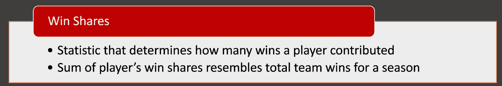
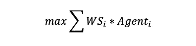
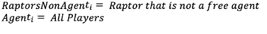
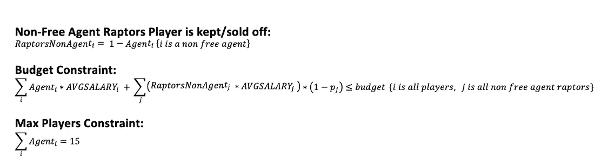
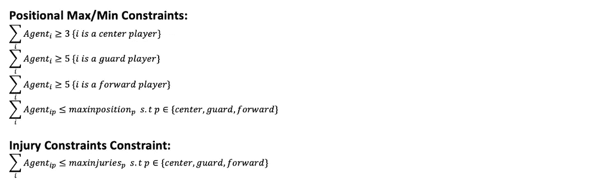
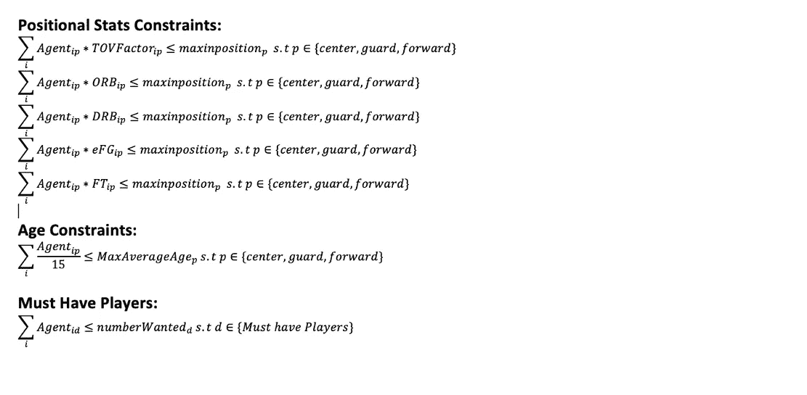
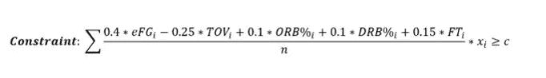
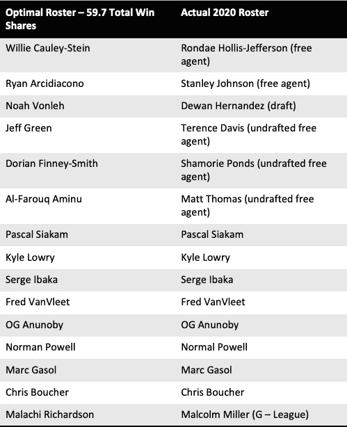
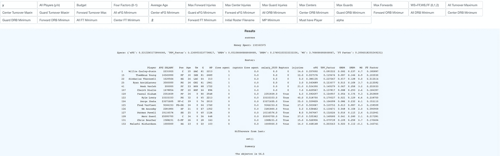
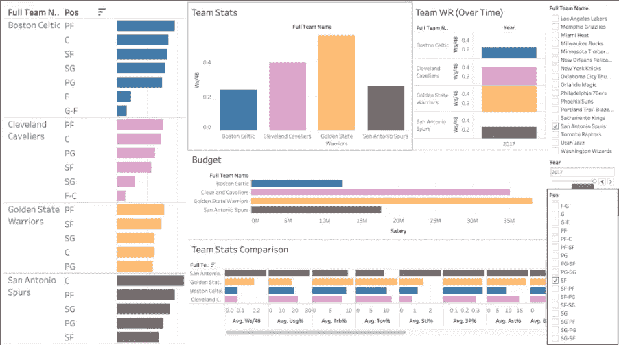

# 为什么迅猛龙失败了:利用 Python 和 Pulp 进行自动化决策

> 原文：<https://medium.com/codex/levering-pulp-to-make-automated-decisions-b40cc55b946b?source=collection_archive---------12----------------------->

想要利用优化的力量做出最佳决策吗？如果有，继续读下去！

## 定义挑战

你有没有想过，你是否可以自动决策，但也确保最好的结果？也许，比如预算，资源分配，甚至招聘？在这篇文章中，我们将使用 Python 纸浆库来完成这个任务。我们的用例将是猛禽队在 2020 年自由球员期间的名单。现在，几乎每个加拿大人都知道迅猛龙，科怀·伦纳德和德雷克。这也意味着几乎每个人都知道科怀·伦纳德的释放和第二年被踢出锦标赛。这让我想知道猛龙队还有什么其他选择，我们是否可以使用决策分析来模拟和解释他们在淡季的行为。如果你对猛龙在预算限制和其他关键限制(如伤病和攻防指标)下可能建立的潜在球队感兴趣，为什么猛龙没有留住像林书豪和科怀这样的球员，或者对学习如何使用决策分析优化你的业务感兴趣，请继续阅读！

# 定义团队力量

为了自动化决策，首先要做的是收集数据供我们的模型使用。在这样的项目中，有必要考虑你要优化什么。是时间花了吗？是预算吗？如果有，你有什么数据？比如在组建团队的时候，我们如何定义一个团队有多强？如果你是一个铁杆体育分析师，你可能已经知道这些。在这个项目中，我们用获胜份额来衡量篮球运动员的素质。作为参考，像科怀·伦纳德这样的球员在 2019 年后的胜率为 9.3，而像诺曼·鲍威尔这样的球员(当时主要是替补)的胜率为 2.3。如果您希望更好地了解如何计算赢得份额，请访问[basketball-reference.com。](https://www.basketball-reference.com/about/ws.html)

赢股的定义

太好了！既然我们已经定量地定义了什么是一个好的玩家，让我们开始优化。

# **优化目标**

优化听起来很花哨。然而，在这种情况下，我们真正要做的只是最大化团队的总体 WS 份额。我们称最大化总 WS 为目标函数。我们考虑目标函数使用的任何其他变量(即在这种情况下，Agent_i)是“决策变量”。我们认为 Agent_i = 1 意味着我们将该代理添加到我们的花名册中。Agent_i = 0 意味着他们不在我们的花名册上。这实际上就是最大化乘积之和:即。如果我们选择 WS 为 9.5 的科怀和 WS 为 2.3 的诺曼·鲍威尔，我们的结果将是 9.5 *代理 _ 科怀+2.3 *代理 _ 鲍威尔= 11.8。

目标函数

我们使用的一些决策变量。

# 限制

既然我们已经定义了目标和决策变量，我们还必须定义一些约束。显然，我们有一些支出和名册限制，让我们来定义这些。

预算限制，最大球员限制和非自由球员定义。

预算限制规定，花在工资上的钱必须少于 NBA 规定的官方球队支出上限。非自由球员猛龙队球员被保留/出售限制定义了非自由球员猛龙队球员的释放。因为球员有合同，我们不得不考虑卖掉猛禽的合同，或者冒险释放球员，同时支付整个合同期限的费用。他们收回整个合同的可能性是由他们的百分位数和赢得份额决定的。因此我们使用他们被出售的平均工资的期望值。例如，就 win 份额而言，Kawhi 处于 99%的百分位数。因此，收回合同的期望值是他平均工资的 99%。

位置约束

篮球有三个主要位置:中锋、后卫和前锋。我们必须至少有 3 名中锋，5 名后卫和 5 名前锋。此外，我们可能不希望有球员有受伤的历史，所以我们会试图将过去受伤的总人数限制在一定的数量。

每个位置的四个因素位置约束

四个因素制约着整个团队

位置统计是 NBA 中很多决策的驱动力。虽然我们的目标是最大限度地赢得市场份额，但记住诸如失误率、投篮、篮板和罚球之类的东西也很重要。我们将使用 Dean Oliver 的四个因素衡量标准，这只是一个问题的答案——篮球队如何赢得比赛？在他定义的统计数据中，他认为投篮是最重要的因素，其次是失误，然后是篮板，最后是罚球。他给每个方面分别分配了 40%、25%、20%、15%的权重。他用有效投篮命中率(eFG%)、失误率(TOV%)、篮板率(进攻和防守篮板率)(ORB%和 DRB%)来衡量投篮，最后用罚球次数除以投篮次数(FT/FGA)来衡量罚球。因此，当一个团队的四个因素公式的值很高时，这表明该团队的球员在游戏的所有重要方面都很好地互补。在我们的例子中，我们选择给游戏中的每个位置一个最大/最小阈值。举例来说，这确保了我们不会有一支胜率很高的球队，但我们的前锋失误率极高，或者我们的中锋篮板率很低。

最后，我们有年龄限制，必须有球员(即。我们必须有 Kawhi 等…)。

# 编写代码

您可以在 helper.py 文件中看到包含以下代码和数据处理函数的存储库。

 [## RScicomp/Teambuilder

### 在 GitHub 上创建一个帐户，为 RScicomp/Teambuilder 的开发做出贡献。

github.com](https://github.com/RScicomp/Teambuilder/blob/main/helper.py) 

为了运行我们的优化，我们需要纸浆库。您可以从命令行安装这个库:pip3 install pulp。纸浆是一个惊人的图书馆，我推荐任何有兴趣的人在这里找到更多:[https://coin-or.github.io/pulp/](https://coin-or.github.io/pulp/)

上面我们看到了多个不同的目标函数。我们通过使用 lpSum 函数来定义目标。该函数会将您的数组转换为产品的总和，纸浆库可以对其进行线性优化。如第 13 行所示，我们的目标是赢得份额。我们在第 14 行也有一个四因素目标函数，我们可以交替切换。我们还使用这些优化函数中使用的 LpVariable.dicts 函数在第 7–10 行定义了决策变量。这个函数将创建多个代理，并将它们存储在一个字典中(从 0 到代理的数量:存储在我们的变量 free_agents 中)。我们确保它们是二进制的，这意味着要么代理被保留，要么被出售。

上面我们有约束。我们使用 addConstraint 函数来创建约束。positionalconstraint 函数是我创建的简单函数，用于定义每个位置的约束。您可以在存储库中的 helper.py 文件中找到详细信息。

为了运行优化，我们使用 prob.solve()函数。这将通过我们的二元决策变量返回最佳花名册。即。如果模型决定保留科怀，与科怀相关的决策变量将为 1。否则它将是 0。

# 结果

**2020 年模型总赢股份— 52**

**2020 年实际总赢股— 47.8**

既然我们理解了我们的目标函数是如何建模/预测团队成功的，我们可以看看由我们的模型生成的最佳名单，并将其与猛龙队 2020 赛季的实际名单进行比较。最佳名册在 2019 年有 59.7 个 Win 份额，四因素值为 0.23。就上下文而言，当我们运行一个模型来单独最大化四个因素的值时，目标函数的最佳值是 0.24，因此我们的最佳解决方案在赢得份额和四个因素之间取得了良好的平衡。我们看到很多核心球员被保留了下来。我们的优化问题做出类似的决定，比如让科怀和林书豪走。通过敏感性分析，我们发现这仅仅是因为预算限制。如果科怀继续留在车队，我们会发现我们根本无法满足所有的限制。然而，当涉及到新玩家时，它会做出非常不同的决定。

很明显，猛龙不想过于激进地接近自由球员，因为他们签下了多个廉价的未选秀自由球员。我们的模型是建立在这样一个理念上的，一个团队想要在即将到来的赛季给自己最好的成功机会，而不是计划未来。很可能一旦猛龙队意识到科怀·伦纳德不会随队辞职，他们就决定通过节省一些钱和带走年轻球员来为未来建立更多的基础，而不是为即将到来的赛季建立最好的球队。也有可能猛龙确实瞄准了这些球员中的一些，只是无法签下他们，但我们无法知道这是不是真的。

然而，我们可以看到，就胜利份额而言，2020 赛季最佳球队比实际的 2020 年猛龙队更好(还要注意，2020 年的胜利份额数字更低，因为球队由于新冠肺炎而打了更少的比赛)。这并不保证球队会比实际的球队表现得更好，但是由于名册之间近 5 胜的差距，他们很可能会这样做。这表明，我们的解决方案是有意义的，并且可以向希望在即将到来的赛季中改善球队的 NBA 球队提供可靠的建议，考虑到球队面临的所有限制。也许，如果猛龙签下这些自由球员中的一些，他们可以重复成为 NBA 冠军。

# 额外见解

如果您想看看用 Plotly Dash 和 Tableau 构建的仪表板，可以在存储库代码中查看。您可以调整模型的预算、最小和最大周转因素输入等，以便建立您的最佳团队版本。此外，还可以浏览 Tableau 仪表盘，了解团队绩效和位置绩效的一些可视化信息。你可能会发现一些有趣的事情，比如小前锋的崛起正在成为获胜球队的一部分。

交互式仪表板

2017 年，金州勇士队在中锋上的花费(前 4 名球队中)最少。

你可以从 Tableau 仪表盘上看到金州勇士队在 2017 年赢得冠军时，在小前锋身上花了最多的钱，远离了对巨型中锋的传统支出，更多地关注快速和矮小的球员。事实上，我们看到这位小前锋在金州勇士队的场均 WS/48 排名第二。当你建立自己的团队时，这可能是需要考虑的事情！

如果您希望有一篇关于这些仪表板是如何创建的独立文章，请在下面发表评论！

# 承认

山姆·格林:提供了 NBA 球员实力的数据和指标，并将模型的名单与 2020 年的实际名单进行了比较。

袁凯马:帮助写下优化函数

吴彦祖:结束语中的帮助。