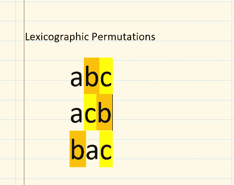

# Ruby 中的字典排列算法

> 原文：<https://medium.com/codex/lexicographic-permutation-algorithm-in-ruby-85149c7fac66?source=collection_archive---------3----------------------->

## 一个用 Ruby 编码的简单算法，用来寻找下一个字典排列，详细解释。

**什么是词典排列？**

字符串或整数的排列是指集合中字符或数字的可能排列。例如，“ab”有两种排列:“ab”和…