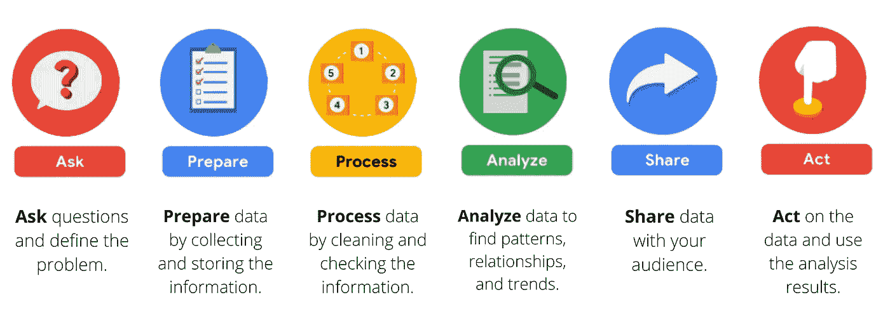

# 用 6 个步骤着手下一个数据分析项目

> 原文：<https://medium.com/codex/life-cycle-of-a-data-analytics-project-954d0e6926fe?source=collection_archive---------12----------------------->

***从谷歌数据分析计划*** 中学习

在处理数据分析项目时，为了达到预期的结果，必须完成一些固定的任务。因此，在本节中，我们将创建一个数据分析项目周期，这将是一组标准的数据驱动的流程，用于有效地将数据导向洞察。项目的生命周期定义了数据分析过程应遵循的顺序，以便使用输入数据集有效地实现目标。识别数据分析问题、设计和收集数据集、数据分析和数据可视化都是数据分析过程的一部分。

数据分析流程由六个步骤组成: ***提问、准备、处理、分析、分享、*** 和 ***行动*** 。这六个步骤适用于任何类型的数据分析。请继续阅读，了解一群分析师如何使用这六个步骤来解决业务问题。

一家公司的新员工流动率很高。许多员工在公司的第一年还没结束就辞职了。分析师使用数据分析过程来回答以下问题:

> **组织如何提高新员工的保留率？**

这是这个团队所完成的一步一步的分析。

# **1。询问**

首先，分析师需要定义项目需要什么，以及什么会构成成功的结果。结果，他们提出了有效的问题，并与对人员分析结果感兴趣的领导和经理合作来确定这些事情。

他们问了以下类型的问题:

*   你认为新员工需要学习什么才能在工作的第一年取得成功？
*   你以前收集过新员工的数据吗？如果是这样，我们可以访问历史数据吗？
*   你认为拥有较高保留率的经理会给新员工提供额外或独特的东西吗？
*   你认为新员工不满意的主要原因是什么？
*   您希望下一财年的员工保留率提高多少？

# 2.准备

这一切都始于周密的计划。该小组制定了一个三个月的时间表，并决定如何向感兴趣的各方传达他们的进展。在此步骤中，分析师还确定了他们需要哪些数据来实现上一步中确定的成功结果；在这种情况下，分析师选择从新员工的在线调查中收集数据。他们通过做以下准备:

*   他们提出了具体的问题，询问员工对不同业务流程的满意度，如招聘和入职，以及他们的整体薪酬。
*   他们为谁有权访问收集的数据制定了规则，在这种情况下，组外的任何人都无权访问原始数据，但可以查看汇总或聚合数据。例如，个人的薪酬是不可用的，但是群体的工资范围是可见的。
*   他们最终确定将收集哪些具体信息，以及如何以最佳方式直观地呈现数据。分析师们集体讨论了可能的项目和数据相关问题以及如何避免这些问题。

# 3.过程

该调查由该小组分发。优秀的分析师知道如何尊重他们的数据以及提供数据的人。因为数据是由员工提供的，所以所有员工都同意参与是非常重要的。数据分析师还确保员工了解他们的数据将如何收集、存储、管理和保护。他们采取了以下步骤来保持机密性并有效地保护和存储数据:

*   他们限制有限数量的分析师访问数据。
*   他们清理了数据，以确保它是完整的、正确的和相关的。对某些数据进行了汇总和总结，但没有透露个人的回答。
*   他们将原始数据上传到内部数据仓库，以增加一层安全性。

# 4.分析

然后分析师们做了他们最擅长的事情:他们分析！数据分析师发现，根据已完成的调查，员工对某些流程的体验是整体工作满意度的关键指标。这些是他们的发现:

*   经历了漫长而复杂的招聘过程的员工最有可能离开公司。
*   经历了高效透明的评估和反馈流程的员工最有可能留在公司。

# 5.分享

分析师们在分享报告时就像保护数据一样谨慎。他们以下列方式陈述了他们的发现:

*   他们与达到或超过提交调查回复的直接下属最低数量的经理分享报告。
*   他们向经理们展示了结果，以确保他们了解全部情况。
*   他们要求经理亲自将结果传达给他们的团队。

这一过程给了经理们一个在恰当的背景下交流结果的机会。因此，他们可以就提高员工参与度的后续步骤进行富有成效的团队对话。

# 6.行动

分析师团队的最后阶段是与公司领导合作，以确定如何最好地实施变革，并根据调查结果采取行动。他们的建议如下:

*   基于最高效、最透明的实践规范员工的招聘和评估流程。
*   每年进行相同的调查，并将结果与前一年的结果进行比较。

一年后，同样的调查也分发给员工。分析家预测，两组结果的比较将表明行动计划是有效的。事实证明，这些变化提高了新员工的保留率，而且领导的行动是成功的！

# ***数据+商业知识=谜团解开***

将数据与商业知识相结合，再加上一点直觉，将是你作为初级数据分析师过程中常见的一部分。关键是找出每个特定项目的确切组合。很多时候，这取决于你分析的目标。这就是为什么分析师经常问，“我如何定义这个项目的成功？”

此外，试着问自己这些关于项目的问题，以帮助找到完美的平衡:

*   需要什么样的结果？
*   会通知谁？
*   我在回答被问到的问题吗？
*   需要多快做出决定？

**谢谢你！**

这是我的第一篇文章，我想有一个好的开始。你可以在这里联系我。