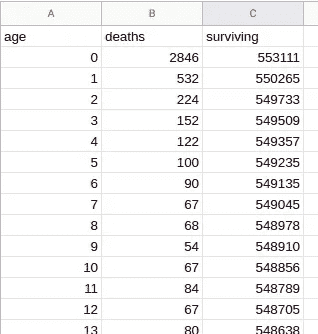

# 预期寿命计算:学会掌控数据构造

> 原文：<https://medium.com/codex/life-expectancy-calculation-learn-to-take-ownership-over-data-constructions-4fee8fde9fd8?source=collection_archive---------8----------------------->

为害羞而不敢开始的人介绍数据挖掘

# 介绍

暑期和假期给了你更多的自由时间，也给了你更多的机会去质疑一年中你所收到的所有信息。我的一个朋友想知道预期寿命是如何计算的。因为我目前正在学习数据挖掘，所以我决定拿这个话题做个练习。这个计算似乎是某种平均值，所以应该很容易。然后开始了这一旅程…我现在能够回答我的朋友，但我决定创建这个职位，以帮助那些不满意没有解释的数据结构的人。我认为质疑信息是好的，我们不应该不使用原始数据来得出我们自己的答案。本文档试图帮助人们迈出数据探索的第一步，解释如何用很少的计算技能从零开始计算预期寿命。

# 关于预期寿命

生命周期

预期寿命是由国家统计局提供的一个众所周知的指标，它显示了每个国家和每一年从特定年龄开始你可以预期活的时间。通常你会得到某一年出生时的预期寿命，并且趋势是按性别划分的。一个典型的趋势是这样的:

出生时预期寿命的典型趋势

这一信息的第一个用途是显示预期寿命随着医疗和技术的进步而增长，以及女性比男性长寿。但是是怎么算出来的呢？

# 直觉并不总是好主意

我的第一个直觉是，他们正在追踪特定年份出生的人口的死亡情况，并且他们正在计算人们死亡时的平均年龄:问题解决了。

这种方法的问题在于，你必须等待特定年份出生的所有人都死去。我出生于 1975 年，所以我必须等到 2090 年左右才能知道我的预期寿命是多少。这里有一个主要问题:我也必须等到死了才能计算它。当我们展望遥远的过去时，我天真的直觉是正确的，但预测我从现在开始还能活多少年似乎是低效的。

# 基础研究往往令人沮丧

从法语的[维基百科](https://fr.wikipedia.org/wiki/Esp%C3%A9rance_de_vie_humaine#Calcul)开始(我是法国人，根据你的语言，你可能有另一个公式)我有这个公式:

预期寿命计算

*pi* 是年龄 I 时的生存概率

如果你不习惯数学，你可能会在这个阶段放弃:这似乎太理论化了，我们应该能够找到一种更实用的方法来计算预期寿命。然后我上了 INSEE 的网站，这是我们国家统计和经济研究所的网站。他们提供了大量关于人口统计学的数据。数据很容易找到，您可以将结果可视化并下载为趋势或表格。但是他们是如何得到这些数据的就更复杂了。他们提供了许多关于方法论的文件，很难找到数据预测和创建它的计算之间的关系。

# 找例子:一个切入点？

我开始了一项关于预期寿命的研究，使用“如何做”、“举例”或“教程”作为关键词:它给了我更好的结果。我找到一份文件，解释了美国人实际上是如何计算预期寿命的。

这是文件的链接:【https://www.cdc.gov/nchs/data/nvsr/nvsr61/nvsr61_03.pdf

2008 年美国生命表

在文档中，我学到了新的重要关键词:

*   死亡率表
*   致死率

我还理解了以下几点:当你想计算某一年的预期寿命时，你需要关注那一年发生的死亡人数。由于这些人口数量庞大，每年都会有大量的人死亡，从 0 岁到 100 岁甚至更大年龄的人都会死亡。您可以开始创建一个表格，显示每年在该年龄死亡的人数。预期寿命是从死者身上推算出来的一年:它并不代表现实，而是一种统计估计。这似乎不是很直观，你可能会怀疑它的有效性。在实践中，统计估计通常会给出一个你可以预期的好主意。这里有一个例子:如果你掷骰子，你数 1000 次你得到 6 的次数，你会得到一个接近 167 的数字(如果你的骰子是标准的)。将这个数除以 1000，你掷骰子时很有可能得到 6。你掷的骰子越多，你的结果就越准确。将生命表比作骰子，不同的死亡年龄是骰子的不同数字(骰子上大约有 120 个不同的数字)，每个年龄的死亡人数除以一年的总死亡人数将代表在该年龄死亡的概率。

当然，这种预测不能预测未来，你必须考虑到情况不会改变。年复一年地追踪这些信息有助于理解这一预测的演变。

在这一点上，我对这个问题有了更好的理解，但是在试图理解生命表时，我发现了一个名为`qx`的关键列，它被描述为:

*第二栏。死亡概率(qx)* —显示年龄 x 到 x + 1 之间的死亡概率。例如，对于 20-21 岁年龄段的男性，死亡概率为 0.001225(表 2)。这一栏是生命表的基础；所有后续列都是从它派生的。

这个定义没有给出任何关于它是如何被计算出来的指示。我需要更深入地搜索…

# 使用新的关键词进一步挖掘

我在网上搜索的时候把栏目的名字作为关键词:类似于“如何计算生命表的`qx`栏”。

这就是我如何想出一个新的文件，给出了如何创建生命表的新线索。

这是一个重要的教训:在一项研究的开始，你没有正确的关键词:你的第一个问题不会帮助你找到答案，但解锁关键词。

下面是链接:[https://faculty . Weber . edu/JCA vitt/wildlifemanagementsmaterials/Lab/Life % 20 table % 20 construction . pdf](https://faculty.weber.edu/jcavitt/WildlifeManagementMaterials/Lab/Life%20Table%20Construction.pdf)

生命表构造

该文件有一个建立生命表的协议:

*   您首先需要一个表，其中包含每个年龄(或一年中的一段时间)的一行，以及特定年份中该年龄的死亡人数
*   然后，您可以构建一个新列，包含每个年龄活到特定年龄的人:从您的表中添加一个名为`surviving`的列。从生命表的最后一行开始，你设定存活的人数等于那一年的死亡人数(下一年没有人会活着)。然后你回到过去，爬上你的桌子，把一个时代的死亡人数加到下一个时代的存活人数上。当你到了 0 岁，你的存活数将会是那一年死亡数的总和
*   `surviving`列现在表示在每个年龄减少的虚拟人口，直到所有人口消失
*   您现在可以向生命表中添加一个`qx`列，该列将计算每个年龄的死亡率，用每个年龄的死亡人数除以存活人数
*   您还可以创建一个`px`列，其中包含每个年龄的存活人口除以初始人口。你会得到一个从 1 到 0 的数字，代表仍然生活在 x 岁的人的比例
*   使用`px`列，您现在可以表示一个创建了`lx`列的标准化总体(在生命表中，他们通常使用 100000 的总体)。使用数字 100000 可以更容易地读取数据，并确保每年都有相同的人口样本，这样就可以很容易地将生命表与其他生命表进行比较

`qx`列是计算所有其他列的关键元素。我们现在需要从那一栏计算预期寿命。

# 计算预期寿命

**注:**本段旨在解释计算背后的逻辑。这可能比帮助更令人困惑。不要担心:当我们在一个真实的用例中使用它时，它会变得更加清晰。

预期寿命(名为`ex`)是根据死亡率计算出来的。但是如果我们看看我们不同的知识来源:

*   维基百科(法语):`ex`对于一个年龄来说，x 是每个年龄的生存概率(1-qx)从 x 到 k (k 是一个从 0 到最老的年龄)的乘积之和(我们将在后面看到如何计算)
*   “国家生命统计报告”:`ex`是存活 x 岁的人所活的总人年数除以 x 岁时的存活人口数。 *ex = Tx/lx*
*   “生命表构建”:`ex`使用与“国家人口动态统计报告”相同的计算方法，但`Tx`的计算方法不同。

使用同一数据源计算预期寿命的这 3 种方法将给出 3 种不同的结果。这是一个重要的发现:当你处理数据构造时，方法论总是会对结果产生影响。方法论通常是隐藏的，代表相同概念的不同结构可以共存，增加了混淆和误解。

## 维基百科计算

*   从死亡率的列`qx`中，我们可以创建一个新的列`plx`，包含活到 x 岁的概率，其中 *plx = 1- qx。*这代表等式中的变量 *pi*
*   然后我们可以创建一个列`prod_plx`，它是从 plx(0)到 plx(x)的`plx`值的乘积。举例: *prod_plx(0) = plx(0)* 当*prod _ plx(20)= plx(0)* plx(1)* plx(2)*…* plx(20)*。这表示等式中π从 0 到 k 的乘积

从 P0 到 Pk 的圆周率乘积

*   从`prod_plx`我们现在可以创建列`ex`，它将计算从 x 到表中最老年龄的每个 prod_plx 的总和。举例:*ex(0)= prod _ plx(0)+prod _ plx(1)+prod _ plx(2)+…prod _ plx(117)*(其中 117 是表的最老年龄)当*ex(20)= prod _ plx(20)+prod _ plx(21)+prod _ plx(22)+…prod _ plx(117)*。这表示π从 k 到无穷大的乘积之和

## “生命表构建”计算

*   从列`lx`(标准化存活人口)中，我们创建了列`Tx`，它是当年龄大于或等于 x 时 lx 值的总和。通过示例*Tx(0)= LX(0)+LX(1)+LX(2)+…+LX(117)*(其中 117 是表中最老的年龄)当*Tx(20)= Tx(20)+Tx(21)+Tx(22)+…+Tx(117)时*
*   通过计算 *ex = Tx/lx* 创建列`ex`

## “国家生命统计报告”的计算

`ex`的计算需要另一个信息源。他们使用名为`Lx`的列，其定义为:

*第五栏。人-年寿命(Lx)* —显示在 x 到 x + 1 的年龄区间内，假设寿命表群组的人-年寿命数。第 5 栏中的每个数字代表所有到达较早生日的人在两个指定生日之间的总寿命(以年计)。”

我不明白这一列是如何计算的，我不得不使用 Lx 计算作为关键字进行另一次搜索。

以下是提供答案的来源:

[https://www . SSA . gov/OACT/HistEst/CohLifeTables/life table definitions . pdf](https://www.ssa.gov/OACT/HistEst/CohLifeTables/LifeTableDefinitions.pdf)

生命表函数的定义

`Lx`列代表某一年龄 x 的存活人口的总寿命。一些在 x 岁死亡的人将在 x 岁零 364 天死亡，但相反的其他人将在 x 岁零 1 天死亡。为了有一个更好的估计，科学家认为一半在 x 岁死亡的人活不到 6 个月，另一半活超过 6 个月。他们创建了 Lx 列，将在 x 岁时死亡、生日后存活超过 6 个月的人纳入预期寿命。则公式为 Lx(x) = lx(x)-( 0.5*dx(x))，其中 dx 是在 x 岁时死亡的人数。对于第一年，计算另一个值来表示存活超过 6 个月的婴儿的平均值。因为婴儿的死亡大多发生在前 6 个月，所以 Lx(0)应该低于其他年份的正常分布。我不知道这个公式(可能基于出生月份的平均值)，但是在“国家生命统计报告”文件中，这个公式大约是 *Lx(0) = lx(0)-(0.87*dx(0))* 。

*   一旦列`Lx`被计算出来，`Tx`的计算方式与“生命表构建”中的相同，但是`Lx`值被求和，而不是`lx`值。
*   `ex`的计算方法如下: *ex = Tx/lx* 与“生命表构建”中的方法完全相同

你还在吗？

至少我们可以肯定地知道，计算并不那么困难，但仍然需要一个复杂的协议，它似乎会随着文化的变化而变化。似乎不同来源提供的预期寿命会导致不同的结果，只是因为方法不同。

嗯，这很有趣，但我们想发表自己的意见。让我们用这些新知识在真实数据上进行测试！

# 运用理论:用原始数据计算我们自己的预期寿命

## 从原始数据中提取有用信息

为了构建一个生命表来帮助我们计算特定年份的预期寿命，我们需要该特定年份的所有死亡人数。我们可以在哪里找到数据？在法国，政府通过统计和人口研究所向公众提供数据。搜索“法国疾病数据”会找到这个网站:

 [## 被拘留者的小说- data.gouv.fr

### 作家的名字从没出现过...

www.data.gouv.fr](https://www.data.gouv.fr/en/datasets/fichier-des-personnes-decedees/) 

你可以找到每年的各种文本文件，包含一年中登记的所有病例。文件的每一行都包含死者的姓名、出生日期、死亡日期和位置信息。我们从那些文件中需要的只是死亡年龄，而这是没有提供的。我们必须提取死亡年份并减去出生日期，然后按年龄对每个死亡进行分组，计算每个年龄的死亡人数，并按年龄从低值(0)到高值(最大死亡年龄)排序。这部分涉及到一个令人恐惧的技能:编码！有人可能认为这太复杂了。幸运的是，有一些语言和框架对操纵数据很有帮助。一种非常受数据科学家欢迎的语言是 Python，它有许多在线解释器和许多处理数据的工具。文档和样本是巨大的:带着许多好奇心和一点毅力(或者相反？)我们可以很容易地用几行代码来完成这项工作。这里不会有任何教程，但我将复制我用来证明我们想要实现的不需要很多技能的代码。

我下载了法国 2008 年的 deceases 文件，名为“deces-2008.txt ”,然后用 Python 运行以下代码(使用 pandas 模块):

Python 代码生成 3 个生命表(总数、男性、女性)

上面的代码是从法国人口统计数据的原始文件生成生命表所需要的全部内容。

*   文件被读取
*   提取性别列(1 为男性，2 为女性) :提取信息来自数据提供者文档
*   出生年份被提取为一个数字
*   死亡年份被提取为一个数字
*   死亡年龄的计算方法是用出生年份减去死亡年份
*   创建全人口的生命表，按年龄分组行(每一行是一个死亡数):对分组行进行计数，生成`deaths`列
*   与生命表的操作相同，但按性别过滤数据以创建基于性别(男性和女性)的生命表
*   生命表作为文本文件保存，可以用任何电子表格打开

**注意:**我们可以使用 Python 代码来计算整个生命表，但我更喜欢使用电子表格来计算预期寿命，这对大多数人来说更容易处理。

如果您有兴趣开始编码:

*   Python:开始处理数据的好语言:[https://www.python.org/about/gettingstarted/](https://www.python.org/about/gettingstarted/)
*   Google Colab:一个很好的在线代码解释器(可以让你不用安装任何东西就能运行 python 代码):[https://colab.research.google.com/notebooks/intro.ipynb?utm_source=scs-index](https://colab.research.google.com/notebooks/intro.ipynb?utm_source=scs-index)
*   熊猫:一个重要的数据 api(可以为你实现读取数据、保存数据、过滤等大量数据任务的代码模块……):[https://colab . research . Google . com/github/Google/eng-edu/blob/master/ml/cc/exercises/pandas _ data frame _ ultra quick _ tutorial . ipynb](https://colab.research.google.com/github/google/eng-edu/blob/master/ml/cc/exercises/pandas_dataframe_ultraquick_tutorial.ipynb)
*   熊猫文献网站:[https://pandas.pydata.org/docs/](https://pandas.pydata.org/docs/)

## 使用电子表格进行计算

现在我有了 csv (csv 表示逗号分隔值)文件，我可以在电子表格中打开它们。请注意，我最终得到了 3 个文件，但我将只使用第一个文件来演示计算。男性和女性生命表的处理方式完全相同。

以下是我在电子表格中导入 csv 生命表时得到的结果:

原始数据生命表

你可以看到 12 岁。这可能是登记死亡日期时的错误。我会把这条线从桌子上拿掉。

在文件的结尾我有:

寿命表的终点

2008 年去世的最老的人是 117 岁(干得好！).没有人在 114、115 和 116 岁时死亡(所有其他年龄都有人死亡):我将手动添加这些行以保持一致，在这些行的死亡列中设置 0。

**注意:**处理原始数据时出现错误或意外结果是完全正常和常见的。获得正确的数据是最耗时的任务，这可能是他们称之为数据挖掘的原因。

我现在可以建立一个虚拟的人口，其中所有人都在同一年出生，并在 117 年后灭绝(人们逐渐死亡，没有孩子，没有人来自外部或离开人口)。

我将从 117 岁开始，那时有一个人死亡:我在那个年龄存活的人口只有一个人。

在我 116 岁、115 岁和 114 岁时，我的人口仍然是 1，但在我 113 岁时，幸存的人口中有 2 个人:一个死于那一年，另一个死于 117 岁。往上走，用每个年龄的死亡人数，我可以用规则计算人口:*存活(x) =存活(x+1) +死亡(x)*

这是我们使用自动计算得到的结果。从 117 岁开始:

正在创建幸存列

至 0 岁:

存活时间为 0 的列

在 0 岁时，人口是完整的:553111 是 2008 年法国的死亡人数(根据我的档案)。根据这个数字，我们创建了一个 553111 人的虚拟人口，他们出生在同一年。每年都会有一些人死去。预期寿命是根据人口中一个人预期能活多少年来计算的。这个投影代表了这个数据样本的统计分布。

使用规则创建列`qx`:*qx(x)=死亡数(x)/存活数(x)* :

计算 qx

使用规则创建列`px`:*px(x)= surviving(x)/surviving(0)*:

计算 px

`px`列很有趣:它表示活到特定年龄的人口百分比。你可以通过例子观察到，80%的人活到 64 岁，但是只有 48%的人活到 82 岁。18%的人口年龄仍在 90 岁。这个百分比也可以用来创建 100000 的标准化总体，以确保每年都有相同的引用。

列`lx`使用以下规则计算:*LX(x)= round(px(x)* 100000)*:

计算 lx

然后，我们可以使用上面的 3 个公式计算预期寿命:

1.  维基百科的公式不需要任何人口。它只使用`qx`来计算`plx`然后`prod_plx`然后`ex_wiki`:

*   *plx(x) = 1-qx(x)*
*   *prod _ plx(x+1)= prod _ plx(x)* plx with prod _ plx(0)= plx(0)*
*   *ex _ wiki(x)= sum(prod _ plx(x):prod _ plx(117))*

`ex_wiki`是使用维基百科法语公式计算的预期寿命。

ex_wiki(x) =当你在 x 岁时，你预期能活的年数

当你出生时，你可以预期活 76.6 岁，但是如果你到了 80 岁，你仍然可以预期活 4.4 年。

来自维基百科的寿命预期

2.“生命表构建”方法是先创建`Tx`再计算`ex`。

*   *Tx(x)= sum(LX(x):LX(117))*
*   *ex_2(x) = Tx(x)/lx(x)*

在我看来*Tx(x)= sum(LX(x):LX(117))*有问题

应该是*Tx(x)= sum(LX(x+1):LX(117))*:Tx 代表一年幸存者的年数总和。0 岁时的 lx 是整个种群，但不是所有的种群都存活到了那个年龄。我的观点得到了以下事实的支持:如果我们使用 1 作为 lx 的偏移量来计算 ex，则 ex_2 和 ex_wiki 成比例:

*ex _ wiki(x)=(ex _ 2(x))* px(x)*

我创建了一个专栏 ex_test 来演示这一点。

我选择使用*Tx(x)= sum(LX(x+1):LX(117))*而不是遵循“生命表构建”协议进行 Tx 计算。

记住 px 是各年龄段存活人口的比例。这意味着维基百科的计算是将 Tx(x)除以整个人口，而不是 LX(x ), LX(x)是 x 岁时的存活人口。

下面是电子表格中的结果:

“生命表创建”中的计算实例

ex_2 和 ex_wiki 在 0 岁时的预期寿命相同，但在 80 岁时，预期寿命变为 8.1，而不是 4.4。随着年龄的增长，你可能会有想知道哪种计算最准确的冲动！

3.最后但并非最不重要的是“国家生命统计报告”方法。首先计算 Lx，去除每个 lx(x)的一半死亡，但 lx(0)除外，它使用 87%的死亡。Tx_2 是通过求和 lx 而不是 Lx 建立的，ex_3 是用 Tx(x)除以 lx(x)计算的

*   *Lx(x)= Lx(x)-(0.5 *(Lx(x)-Lx(x+1))*同*Lx(0)= Lx(0)-(0.87 *(Lx(0)-Lx(1))*
*   *Tx _ 2(x)= sum(Lx(x):Lx(117))*
*   *ex _ 3(x)= tx2(x)/LX(x)*

因为 Lx 有更大的数字，这个计算的预期寿命更乐观。当我们变老时，Tx 的部分是存活的人口，而不是整个人口，我们可以预期活得更长。

我很乐观，所以我倾向于选择第三种方法。

下面是电子表格中的结果:

根据“国家人口动态统计报告”计算 ex

# 了解不同的方法

如果您有兴趣了解 3 种计算方法的区别:

维基百科的方法不使用人口，只使用存活率(1-死亡率),但仍然有一个结果。这怎么可能？

如果你看看 lx 是怎么计算的:lx(x+1) = lx(x) * qx(x)

你把之前存活的人口数乘以死亡率。另一种描述方式是考虑在 x 岁存活的人必须从 0 到 x 每年存活。lx(x)可以计算为初始人口(lx(0))乘以从 0 到 x 的所有存活率(plx)的乘积。

*LX(x+1)= LX(0)* plx(0)* plx(1)* plx(2)*…* plx(x)*

as*prod _ plx(x)= plx(0)* plx(1)* plx(2)*…* plx(x)*

我们可以写成 lx(x+1) = prod_plx(x) * lx(0)

在我们的档案中:

*   *ex _ wiki(x)= sum(prod _ plx(x):prod _ plx(117))*从 x 到最老年龄的所有 plx 乘积的总和
*   *Tx(x)= sum(LX(x+1):LX(117))*
*   ex_2(x) = Tx(x)/lx(x)

因为*LX(x+1)= prod _ plx(x)* LX(0)*

我们可以写成*Tx(x)= LX(0)* sum(prod _ plx(x):prod _ plx(117))*

并且 *Tx(x) = lx(0) * ex_wiki(x)*

又如 *ex_2(x) = T(x)/lx(x)*

我们可以写成*ex _ 2(x)= LX(0)* ex _ wiki/LX(x)*

又因为 *lx(0)/lx(x) = 1/px(x)* 由定义

*ex _ 2(x)= ex _ wiki(x)/px(x)*

ex_2 和 ex_wiki 之间的唯一区别是，对于 ex_wiki，我们将存活率的乘积之和与初始人口进行比较，而在 ex_2 中，我们将其与每个年龄的存活人口进行比较。

最后，第三种方法建议考虑一半在 x 岁死亡的人应该被视为活了 x+1 年，因为他们接近 x+1 岁。

# 将我的计算与官方数据进行比较

我对男女生命表进行了同样的计算(使用最乐观的方法),得出了这些数字:

*   2008 年法国男性出生时的预期寿命:73.2 岁
*   2008 年法国女性出生时的预期寿命:81.2 岁

看着[https://www.insee.fr/fr/statistiques/2416631](https://www.insee.fr/fr/statistiques/2416631)，我发现了这些结果:

*   男性 77.6 岁
*   女性为 84.3

他们的结果比我最好的结果更乐观。

对此有许多可能的原因:

*   我在某个地方犯了一个错误
*   我没有使用相同的数据源
*   他们正在做其他的计算
*   …

仔细查看原始数据，我发现文件中的许多死亡数据来自 2007 年和更早的时间，我发现从 2008 年到 2018 年的文件中有申报的死亡数据..即使只使用 2008 年的数据，我也没有得到同样的结果。我试图在方法论中寻找答案，发现他们试图将移民考虑在内，因为人口不是静态的，人们在生活或到来。他们还进行了一些计算，包括财政申报，并使用 5 年死亡人数的平均值进行计算。

简而言之，我发现当你试图面对现实世界的预测时，你会意识到由于偏见，你不得不考虑很多参数。

# 结论

从每年计算的单个数据指标(例如性别)开始，并试图理解它代表什么，我自己计算教会了我很多东西:

*   我对这些数据的直觉很差
*   我发现有不同的方法来计算它
*   我了解到了关于预期寿命的新预测(例如活到一定年龄的人口比例)
*   原始数据没有直接的答案:你必须转换它
*   完成一个基本的计算并用一些真实的数据进行测试也相对较快(几个小时)。但是当我将我的结果与官方结果进行比较时，我意识到现实世界需要仔细考虑这些参数，并在这上面花费更多的时间
*   找到一个结果很容易，但是找到导致这个结果的方法或公式要困难得多
*   对问题有更好的理解可能会导致你不同意某个方法论(以“生命表构建”中的 Tx 计算为例)
*   公众可以获得许多有趣的原始数据
*   数据挖掘变得非常非常混乱

我希望你喜欢这次数据之旅，就像我喜欢分享它一样，并且你现在已经准备好开始你自己的数据调查了。

祝你生活愉快！