# 移动增强现实中的光照估计(上)

> 原文：<https://medium.com/codex/lighting-estimation-for-mobile-ar-part-i-8c548affc7e5?source=collection_archive---------4----------------------->

# 概观

在这篇文章中，我将简要比较最近的两篇研究论文， [*【熙和】*](https://dl.acm.org/doi/abs/10.1145/3458864.3467886?sid=SCITRUS) 和 [*GLEAM*](https://dl.acm.org/doi/10.1145/3307334.3326098) ，它们在移动设备上提供**实时光照估计**。简而言之，光照估计是指从环境场景中获取光照信息。对于增强现实，场景是物理环境(例如，您的客厅)，因此可以在时间和空间上有自然的光照条件变化。

***动态场景光照*** 是物理环境光照估计具有挑战性的一个关键原因。由于照明条件可能从一帧到下一帧变化，这种快速变化需要快速估计(例如，30 fps)；此外，照明条件可能从房间的一个角落到另一个角落变化(例如，由于光源位置)，这使得导出感兴趣位置的照明估计很重要。

现有的商业 AR 平台包括 ARCore 和 ARKit 已经开始提供光照估计 API，如[***ARLightEstimate***](https://developer.apple.com/documentation/arkit/arlightestimate)***。*** 然而，现有的支持仍处于早期阶段，仅提供整个场景的环境光信息。换句话说，现有的商业 AR 平台包括 ARCore 和 ARKit 仍然缺乏对精确光照估计的支持，因此经常导致**不真实的渲染**效果。下面是两张图，演示了使用 ARKit vs. GLEAM/Xihe 提供的光照信息的渲染效果。GLEAM 和 Xihe 都产生了视觉上更连贯的虚拟对象。

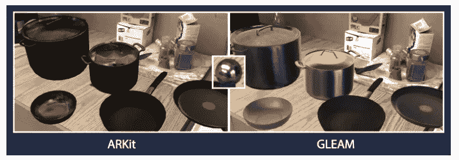

截图自 GLEAM 论文原文:AR 场景渲染对比。

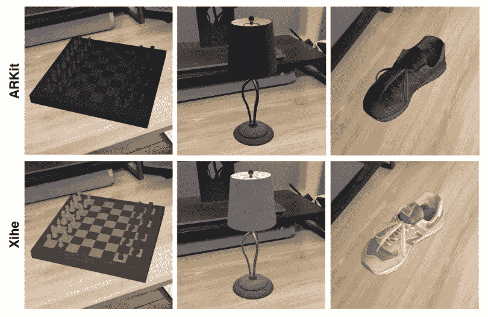

截图自西河论文原文:AR 场景渲染对比。

# GLEAM(MobiSys 2019)

简而言之，GLEAM 使用**物理光探测器**捕捉环境照明信息，然后将这些信息提供给图形渲染器，以照亮物理世界中的虚拟物体。

## 最初的

什么是物理光探头？它通常是一个反射球，放置在特定的物理位置，用于感应光线。下图显示了一个铬球形式的光探头示例。

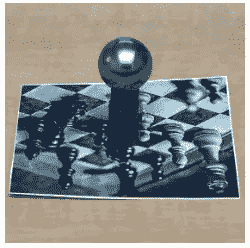

原始 GLEAM 论文截图:物理光探针示例

什么是立方体贴图？立方体贴图是环境贴图的常见表示形式之一。环境贴图通过将入射光线方向映射到光线强度来帮助我们建模照明。下图显示了 GLEAM 捕获的立方体贴图示例。

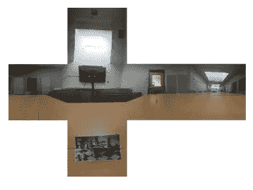

来自原始 GLEAM 论文的截图:立方体贴图的例子。

## 微光:引擎盖下

GLEAM 概念上由以下两个关键步骤组成。

第一步:生成辐射样本。首先，将在场景中放置一个微光探头(一个物理光探头和一个 AR 定位标记)。然后，AR 用户将捕捉微光探头的图像，通过将每个像素与反射光线相关联来生成辐射样本。捕获的辐射样本将作为构建环境地图的基础。

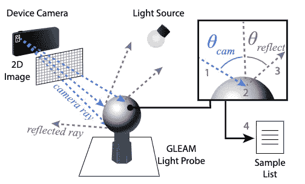

来自原始 GLEAM 文件的截图

**第二步:从多个辐射样本合成一个立方体贴图。**由于辐射样本本质上是稀疏的，例如受到光探测器或 FOV 数量的限制，GLEAM 使用*一种改进的反距离加权(IDW)插值算法*和*一种最近邻算法*来为每个立方体贴图纹理元素赋值。纹理元素值分配是一个两阶段的过程。

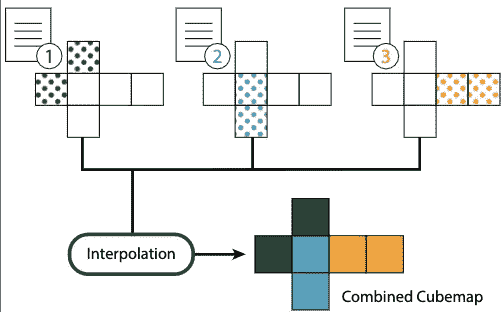

来自原始 GLEAM 文件的截图

具体而言，每个纹理元素 **u(x)** 将首先*使用以下等式由来自合格辐射样本的相应值填充*。这里， **wi(x)** 表示分配给辐射样本 I 的权重， **d(x，xi)** 描述辐射样本 I 和纹理元素 x 之间的距离。GLEAM 使用基于可靠性的权重函数和 L1 距离函数。理论上，可以选择其他权重和距离函数。对于每个纹理元素，合格的辐射样本必须满足半径检查。在第二阶段，任何空的纹理元素将使用它们的相邻纹理元素值来填充。

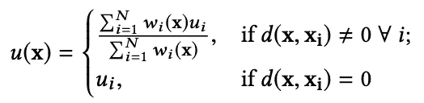

## 包裹

GLEAM 为移动 AR 中的光照估计提供了一个端到端的框架。正如论文所述，“GLEAM 建立在图形社区丰富的光照估计历史之上。”事实上，基于物理光探针的方法在移动 AR 之外被广泛使用；但看到这一想法实现并证明对移动 AR 的有效性仍然令人高兴。

如果您对基于物理探针的照明估计感兴趣，作者已经指出了一些限制。例如，如何在坚持实时目标的同时，从辐射样本中实现更好的立方体贴图插值质量？网络对 GLEAM 的性能有什么影响，尤其是在多视口配置下？

# 西河(MobiSys'21)

简而言之，Xihe 利用 **3D 视觉**数据(RGB-D)在渲染位置生成点云，然后将其传递给轻量级神经网络，以预测用 ***球谐(SH)系数*** 表示的光照。

*(你可能也会对 MobiSys’21 上展示的其他移动 AR 相关论文感兴趣。查看* [*我之前的帖子*](https://belindanju.medium.com/why-mobile-ar-excites-me-582b79abf3f0) *。)*

## 最初的

什么是 SH 和 SH 系数？SH 是定义在球面上的函数，由 Ramamoorthi 等人引入，用于创建逼真的渲染。SH 系数可用作漫射辐照度图的紧凑照明表示。

放置位置，估计位置，观察位置有什么区别？*观察位置*定义为摄像机(和移动用户)所在的位置；*放置位置*是指被渲染虚拟物体的几何中心，而*估计位置*对应光照表示。换句话说，较大的物体可以受益于具有一个以上的估计位置。

## 西河:引擎盖下

第一个关键的新颖性是 ***一种新的点云采样技术*** 既快速又保持精度。这种新的采样技术被称为单位球点云采样，它通过将原始点云投影到单位球上来有效地压缩原始点云。下图举例说明了将三个点(p1，p2，p3)投影到单位球上，并产生两个彩色锚点(a1，a2)。本质上，这种采样技术利用球体几何信息，根据观察方向对点进行采样，以尽可能保持观察覆盖范围。

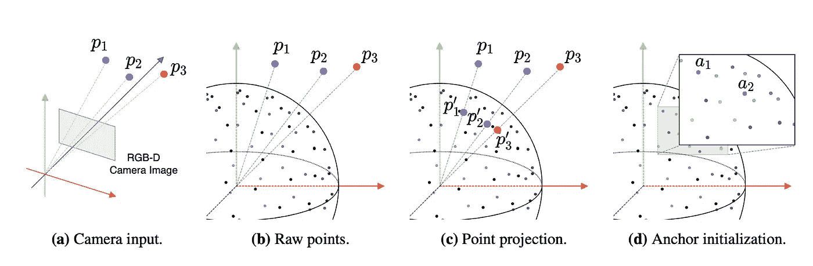

截图自西河论文原文

抛开理论不谈，在移动设备上(甚至在 iPad Pro 等高端设备上)支持这种采样技术可能具有挑战性，这在很大程度上是由于点的数量和最近邻算法。西河如何满足实时目标？西河设计了 ***一个定制的 GPU 流水线*** 用于管理捕获的点云样本和 ***一个密集采样的 2D 加速网格*** 用于权衡存储和计算。

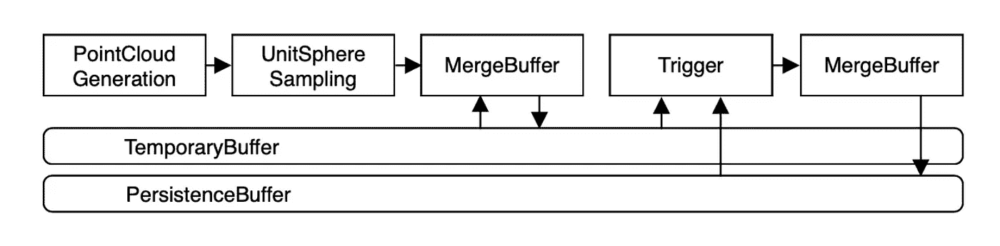

截图自西河论文原文

第二个关键的新颖性是 ***一个名为 XiheNet*** 的合作设计的神经网络，它采用向下采样的点云并生成照明信息，以 SH 系数的形式呈现。由于缺乏一些运营商对移动设备的支持，XiheNet 将被托管在运行 Ubuntu 发行版的边缘设备上。为了最小化网络对基于边缘的推理性能的影响，Xihe 使用以下方案来编码缩减采样的点云。不是使用 float32 来编码(R，G，B，X，Y，Z)，而是使用较低精度的数据格式和锚索引来编码每个点。此外，在将编码版本从设备发送到边缘之前，Xihe 在剥离步骤中移除所有未初始化的锚。

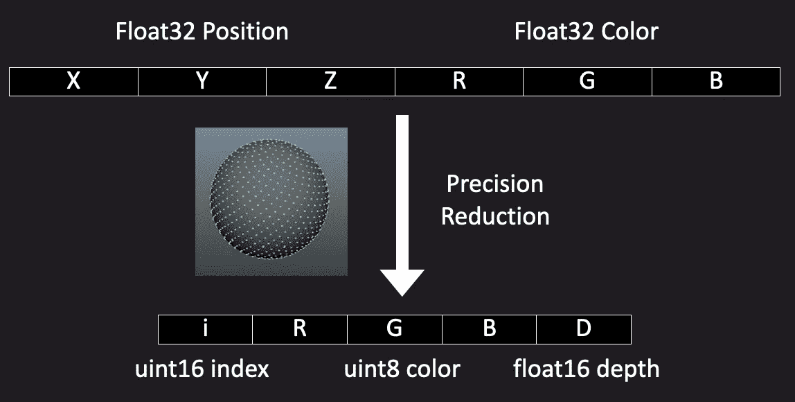

原西河幻灯片截图

最后一个新颖之处是 ***一种自适应触发策略*** ，它基于连续帧之间基于单位球体的点云差异跳过向边缘发送光照估计请求。通过使用这种自适应策略，Xihe 可以有效地响应动态环境，同时避免不必要的网络通信。该策略目前是使用球体池和经验得出的阈值和池窗口大小来实现的。

挑战之一在于如何评估自适应触发策略的有效性。为什么难？很大程度上是因为(1)我们无法获得照明地面真相，以及(2)照明条件难以控制。为了解决这一挑战，Xihe 开发了一个 AR 会话记录器，允许*记录和重放！*

## 包裹

Xihe 提出了一个基于 3D 视觉的框架，实现实时光照估计。Xihe 是完全 [**开源的**](https://github.com/cake-lab/Xihe) ，由客户端和服务器 API 组成，如下所示。

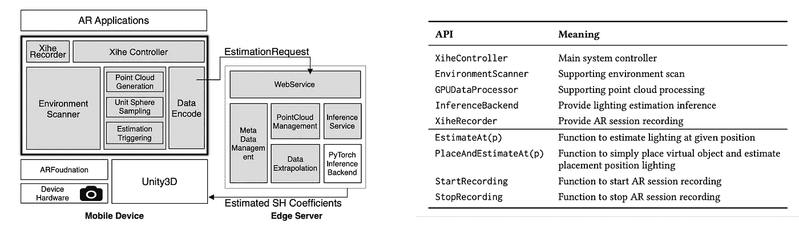

截图自西河论文原文

此外，Xihe 还提供了一个附带的 iOS 应用程序，具有便于调试的功能。

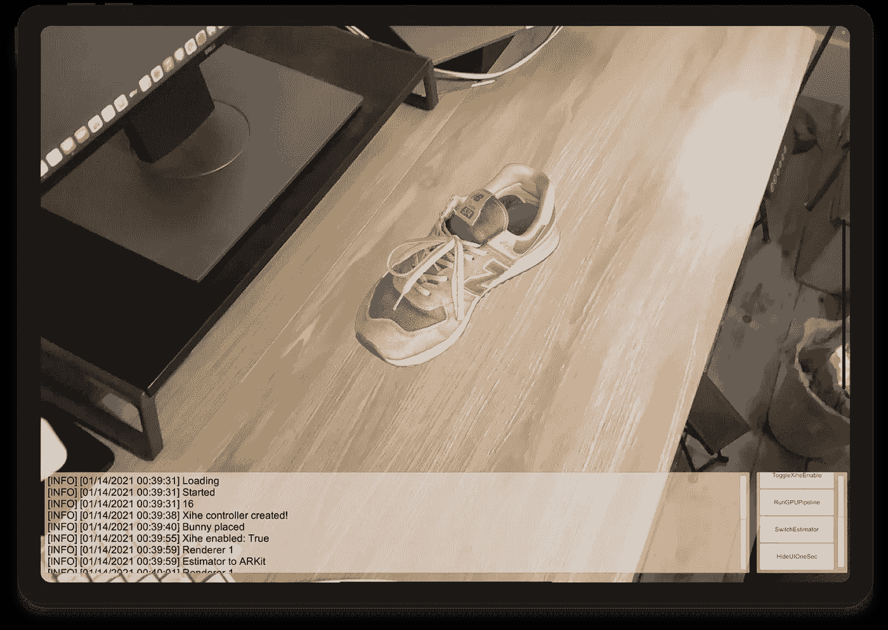

原西河幻灯片截图

在利用 3D 视觉来提供功能丰富的移动 AR 体验方面，有许多开放的挑战和机遇。我们目前正致力于改进西河，以更逼真地渲染不同形状和材料的 3D 对象！敬请期待！

# 编后记

如果你对增强现实感兴趣，可以考虑在 Twitter 上关注我，获取商业和研究领域的最新消息。

## 参考

[1] Prakash，s .等人，2019 年。GLEAM:一个用于移动设备上实时真实感增强现实的光照估计框架。第 17 届移动系统、应用和服务国际年会论文集(美国纽约州纽约市，2019 年 6 月)，142–154 页。

[2]赵，杨，郭，T. 2021 .Xihe:基于 3D 视觉的移动增强现实光照估计框架。*第 19 届移动系统、应用和服务国际年会会议录*(美国纽约州纽约市，2021 年 6 月)，第 28–40 页。