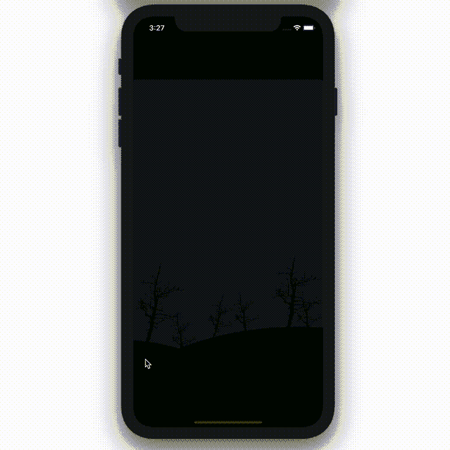

# 如何在 Swift 中生成闪电[递归]

> 原文：<https://medium.com/codex/lightning-generation-in-swift-8afa4c663852?source=collection_archive---------3----------------------->

## [法典](http://medium.com/codex)

## 在 Swift 中生成逼真的雷击

了解如何在 Swift 中生成逼真的闪电。

**免责声明:**本帖包含附属链接。

# 设置