# Pytorch 分类基线代码的逐行解释

> 原文：<https://medium.com/codex/line-by-line-explanation-of-pytorch-classification-baseline-code-e9f792dd94c?source=collection_archive---------12----------------------->

当您第一次进入神经网络领域时，最常用的两个 python 包是 Keras 和 Pytorch。在这两者之间，我将逐行讨论 Pytorch 的基线代码，主要由 [SM Sajideen](https://www.kaggle.com/code/smsajideen/tps-nov-pytorch-baseline-nn) 编写。所以跟着走。

照片由在 [Unsplash](https://unsplash.com?utm_source=medium&utm_medium=referral) 上拍摄

和往常一样，您首先需要导入必要的包。

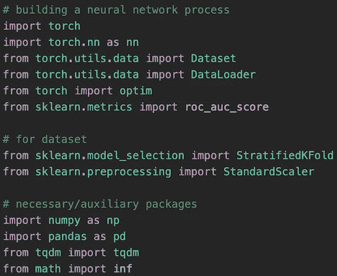

导入报表

第一个 import 语句块用于构建 Pytorch 神经网络过程。在解释这些之前，我将假设你知道神经网络训练如何工作的一般过程。如果你不是，检查下面的[视频](https://youtu.be/bfmFfD2RIcg?t=33)。

首先，“进口火炬”使我们能够在这款笔记本上使用 Pytorch。除此之外，我还添加了几个常用的子包。简单解释一下，“nn”包含了基本的构建模块，比如层和激活函数。“Dataset”是一个抽象类，需要 __len__()和 __getitem__()，它用于向“DataLoader”提供输入和输出，后者负责在 epochs 期间控制批处理大小。“optim”代表优化器。因此，您可以用它来实现各种优化方法。对于评估指标，我将使用 ROC AUC 分数，它可以从 sklearn 包中获得。

第二个模块用于进行分层 k 折叠以减少训练期间的方差，并缩放数据点以为神经网络创建更好的学习环境。这些都是 sklearn 包里的。

最后一块是额外的包装。导入 tqdm 包是为了在训练时显示进度条。其他的就不言自明了。

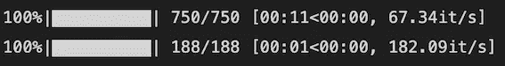

tdqm 进度条

安装并导入这些包后，下一步是导入数据。对于这个笔记本，我用的是[表格游乐场系列——2021 年 11 月](https://www.kaggle.com/competitions/tabular-playground-series-nov-2021/data)。

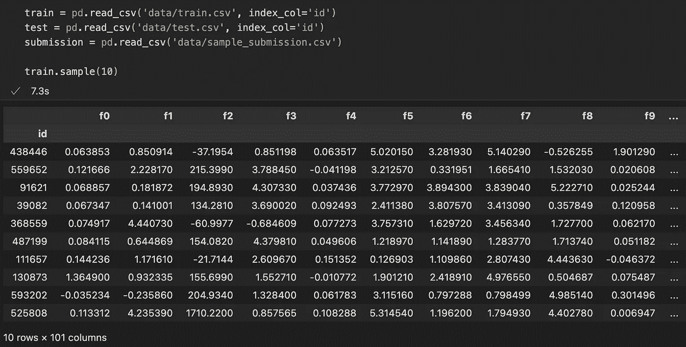

导入数据集

如您所见，有 100 个数字特征和 1 个目标列。因为这篇文章不是关于数据科学的整个过程，所以我不会重复 EDA 的过程。简单提一下，目标列名是‘target ’,它有 0 和 1 的均衡分布。

在我们进入任何神经网络的东西之前，我们需要缩放输入。这一点很重要，因为大的输入值可能会导致大的权重，从而导致网络不稳定。在本例中，我使用了 sklearn 包中的 StandardScaler()。它对值进行缩放，使平均值为 0，方差为 1。

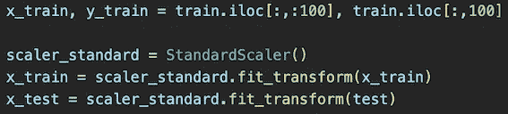

提取 x 和 y 并缩放 x

缩放后，x_train 不再是熊猫数据帧。所以以后，当我需要用索引访问它的条目时，我应该记住这一点。

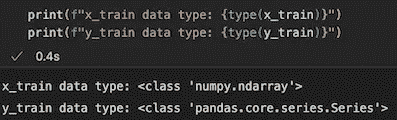

拆分和缩放后其数据类型如何变化

使用 Pytorch 时，您需要的第一个代码是包含您的数据集的 CustomDataset。这个 CustomDataset 类通常继承 Pytorch 包中名为 Dataset 的抽象类，它的两个要求是拥有 __len__()和 __getitem__()。

“if self.y is None”的原因是为了在我们处理没有目标值的测试集时避免错误。而且因为 Pytorch 接受的是张量数据类型而不是 numpy 数组，所以我们在用 __getitem__()返回值的时候需要把 X 和 y 转换成张量。

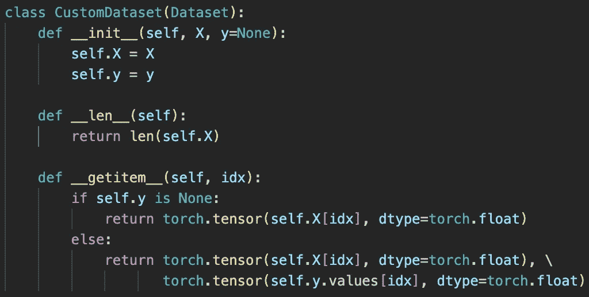

自定义数据集的代码

稍后，这个 CustomDataset 将通过 batch_size 参数提供给 DataLoader，因为如上所述，DataLoader 负责在 epochs 期间控制批处理大小。

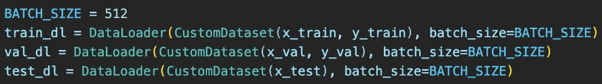

下一步是建立神经网络模型。但在进入实际模型之前，我创建了返回线性()、路斯()和 Dropout()的顺序层的块函数。

线性层用作密集层或完全连接层。它采用的两个参数是输入要素和输出要素大小。不像 Keras 应用程序，如果你熟悉它，它的激活函数，路斯()在这种情况下，位于线性层之外。然后，为了避免过度拟合，我添加了 Dropout 层，它有 0.2 的概率使输入张量中的每个元素为零。

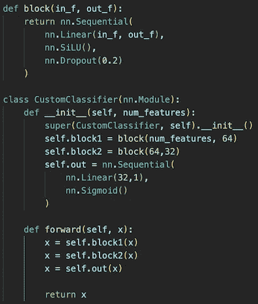

神经网络的代码

一旦块函数准备好了，我需要构建我的分类器类。第一步是创建 nn.Module 的子类，然后，它应该覆盖 __init__()和 forward()。在 __init__()内部，首先要做的是调用 super()来使用在父类中完成的初始化。之后，我应该定义我将在神经网络中使用的层。在 forward 函数中，我使用上面定义的层来构建神经网络如何从起点流向终点。

__init__()和 forward()的具体结构取决于问题以及您希望如何实现神经网络。简单解释一下，它调用 block 函数两次，从 100 (num_features)到 32 个节点。然后，它创建遵循二元分类的一般结构的输出层:1 个具有 sigmoid 激活函数的节点。

作为一个旁注，你不需要实现 backward()进行反向传播，除非你想计算的不是由[亲笔签名的](https://pytorch.org/docs/stable/autograd.html?highlight=autograd#module-torch.autograd)计算的真实梯度，或者使用不由亲笔签名处理的 forward()。这是由[阿尔巴德](https://discuss.pytorch.org/t/when-to-implement-backward/98067)回答的 Pytorch 讨论。

下一步是明确使用哪种设备，并建立一个培训功能。

一般有两种选择。“cpu”或“cuda”。在这里，“cuda”是一个计算的统一设备架构，允许代码使用 Nvidia GPU 进行计算。但是如果你和我一样用的是苹果处理器，你需要传入“mps”而不是“cuda”来使用 GPU。然而，截至目前，完全使用“mps”仍是一个持续的过程。因此，您需要设置环境变量“[py torch _ ENABLE _ MPS _ FALLBACK = 1](https://stackoverflow.com/questions/72416726/how-to-move-pytorch-model-to-gpu-on-apple-m1-chips)”，以便在“MPS”不起作用时使用 CPU。

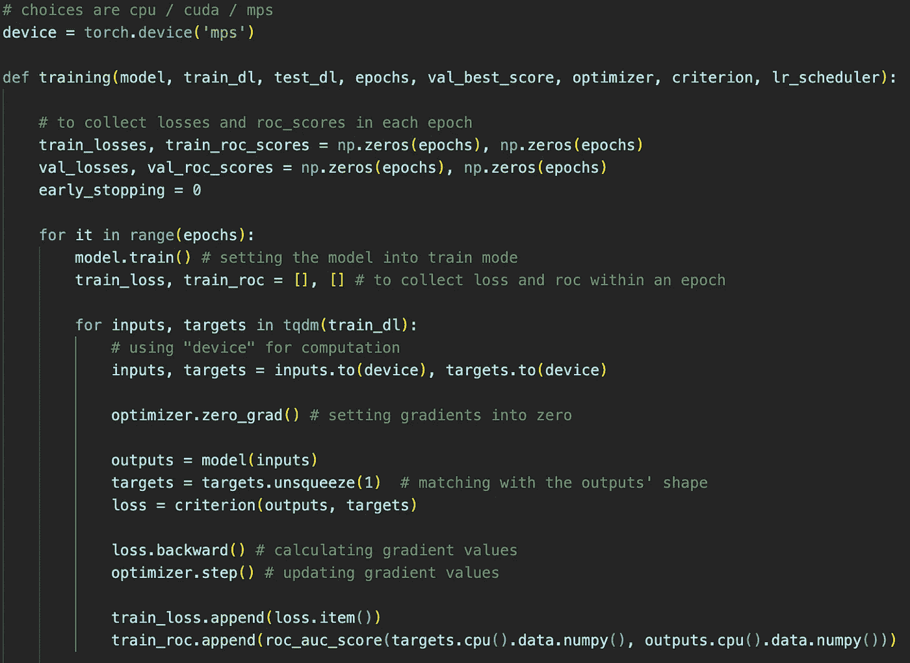

培训功能的第一部分

在训练函数中，train _ losses、train_roc_scores、val _ losses 和 val_roc_scores 是包含长度为零的历元的 numpy 数组。当我们遍历各个时期时，我将用适当的值替换 0 来记录训练历史。下一行中的 early_stopping 用于计算 val_loss 没有改善的时期，以确定何时停止训练。

然后，作为开始，我们应该通过设置 model.train()将模型设置为训练模式。这一点很重要，因为当它不是的时候，它可能不会更新模型的权重。下一行是两个列表，收集一个时期内每批的列车损失和 roc，正如您在上面图像的最后一部分所看到的。请注意，item()用于从 0 维张量中提取一个数字，cpu()用于在将张量转换为 numpy 数组以传入 roc_auc_score()之前复制张量。

第二个 for 循环遍历 train_dl 给出的批次。如您所见，它给出了批量大小的输入和目标。因为我们将批量大小设置为 512，所以第二个 for 循环每次将加载 512 个样本。然后，由于使用 GPU 比使用 CPU 快得多，所以我通过调用“inputs.to(device)”和“targets.to(device)”将输入和输出传递给我们上面设置的设备。

然后，我应该显式调用“optimizer.zero_grad()”以在每批中执行任何计算之前将梯度设置为 0。这一点很重要，因为如果没有“optimizer.zero_grad()”，它将从所有以前的批次中累积梯度，即使它们已经得到反映。因此，学习不会如你所愿。

之后，我给模型输入数据以产生预测(输出)。但是预测值和真实值(目标值)之间的形状不匹配。因此，我对目标应用了“unsqueeze(1)”。然后，我将预测值和真实值传递给网络将使用的损失函数标准。这是我调用训练函数时给出的一个参数。

然后通过调用 loss.backward()和 optimizer.step()，分别计算和更新渐变值。

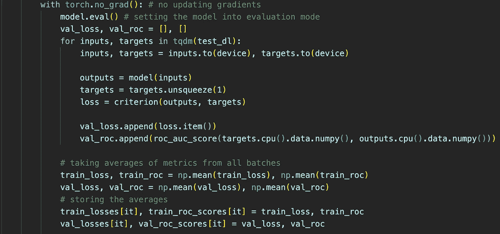

培训功能的第二部分

注意，上面的代码仍然在训练函数的第一个 for 循环中。在神经网络检查了整个训练集之后，是时候检查模型在验证集上的表现了。在这个过程中，最关键的代码是“with torch.no_grad()”和“model.eval()”，因为这两个代码会阻止神经网络使用验证集更新其权重。

接下来，整个过程类似于训练过程，除了缺少一些代码，因为它不打算更新权重。它们是 optimizer.zero_grad()、loss.backward()和 optimizer.step()。

在检查了整个验证数据之后，它存储了我上面提到的每个时期的训练和验证损失以及 ROC AUC 分数。

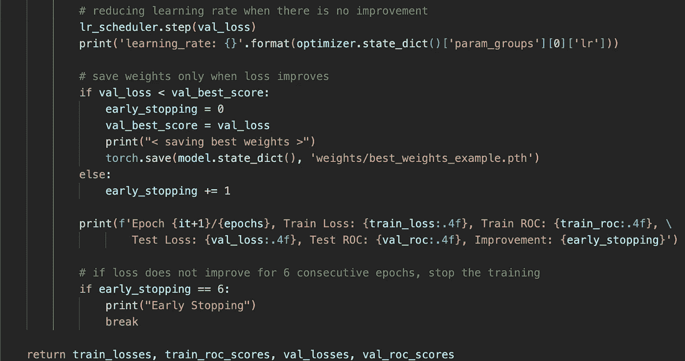

第三部分培训功能

尽管如此，我们仍然在第一个 for 循环中。最后一步是检查训练进行得如何，并做出一些决定。第一行根据 val_loss 的值移动到 lr_scheduler 的下一步。因此，例如，如果 val_loss 在过去 5 个时期没有改善或减少，则改变学习速率以查看是否有任何变化。

第二个模块检查 val_loss 与 val_best_score 相比是否有所改善。如果是，它将 val_best_score 更新为当前 val_loss。如果不是，它将 early_stopping 递增 1，这样当它变成 6 时，它将停止训练。

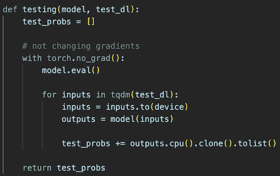

测试功能

我需要的下一个函数是一个测试函数。与训练函数中的验证过程一样，它需要“torch.no_grad()”和“model.eval()”来防止模型改变其渐变。

然后，这个过程与验证过程非常相似。不同之处在于，它不是计算 loss 和 roc，而是返回输出，即属于类 1 的概率。

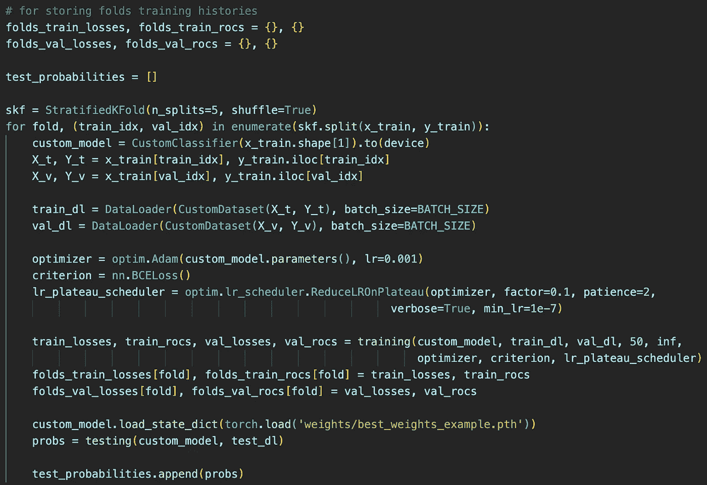

最后，它准备好训练神经网络。因为简单地训练一次可能会导致很高的方差，所以我使用了具有 5 个分割的 StratifiedKFold。这意味着我将把训练集分成 5 个折叠，并用不同的折叠组合训练模型 5 次。

在 for 循环中，我首先调用上面创建的分类器类，并将其传递给使用 GPU 的设备。然后，使用 skf.split()提供的索引，我将训练数据分成训练和验证集，并将其放入 DataLoader。

对于优化器，您可以尝试 Pytorch 提供的不同优化器函数。完整列表可在[这里](https://pytorch.org/docs/stable/optim.html#algorithms)找到。其中，我为这个笔记本实现了 Adam。它需要一个名为 params 的强制参数。因此，我在模型上调用 parameters()来传递所需的参数。然后，根据您的选择，您可以修改一些默认值。在我的例子中，我将学习率设置为 0.001。

对于标准，这取决于你试图解决什么类型的问题。在我的情况下，这是二进制分类，二进制交叉熵损失工作得很好。可用损失函数的完整列表在这个[链接](https://pytorch.org/docs/stable/nn.html#loss-functions)中。

对于[学习率调度器](https://pytorch.org/docs/stable/optim.html#how-to-adjust-learning-rate)，我使用了 ReduceLROnPlateau。这意味着当模型停止改进时，降低学习率以微调模型。简单解释一下参数是什么，“factor”是满足条件时减少多少，“patience”是减少学习率之前要等待多少个历元，“min_lr”是学习率的一个下界。

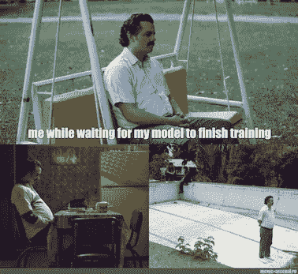

来自 [meme 军火库](https://www.meme-arsenal.com/en/create/meme/2495515)

最后，我准备运行我在上面创建的训练函数。训练完成后，我加载了训练期间获得的最佳权重，并用测试函数进行了预测。然后，根据您想要的输出，您可以定制您所做的预测。例如，在我的例子中，我需要属于类别 1 的观察值的概率。所以我把它附加到了 test_probabilities 列表中。

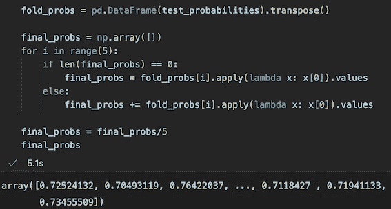

概率预测是如何与神经网络一起进行的

然后，我取 5 次折叠的平均值作为我的最终预测。我在这里没有包括它，但是查看 folds_train_losses 和 fold_val_losses 来确认训练是否顺利是一个很好的做法。

# 参考

[1][https://www . ka ggle . com/code/smsajideen/TPS-nov-py torch-baseline-nn](https://www.kaggle.com/code/smsajideen/tps-nov-pytorch-baseline-nn)

[2][https://www.youtube.com/watch?v=bfmFfD2RIcg&t = 33s](https://www.youtube.com/watch?v=bfmFfD2RIcg&t=33s)

[3][https://www . ka ggle . com/competitions/tabular-playground-series-nov-2021/data](https://www.kaggle.com/competitions/tabular-playground-series-nov-2021/data)

[4][https://discuse . py torch . org/t/when-to-implement-backward/98067](https://discuss.pytorch.org/t/when-to-implement-backward/98067)

[5][https://stack overflow . com/questions/72416726/how-to-move-py torch-model-to-GPU-on-apple-m1-chips](https://stackoverflow.com/questions/72416726/how-to-move-pytorch-model-to-gpu-on-apple-m1-chips)

[6]https://pytorch.org/docs/stable/optim.html#algorithms

[7][https://pytorch.org/docs/stable/nn.html#loss-functions](https://pytorch.org/docs/stable/nn.html#loss-functions)

[8][https://py torch . org/docs/stable/optim . html # how-to-adjust-learning-rate](https://pytorch.org/docs/stable/optim.html#how-to-adjust-learning-rate)