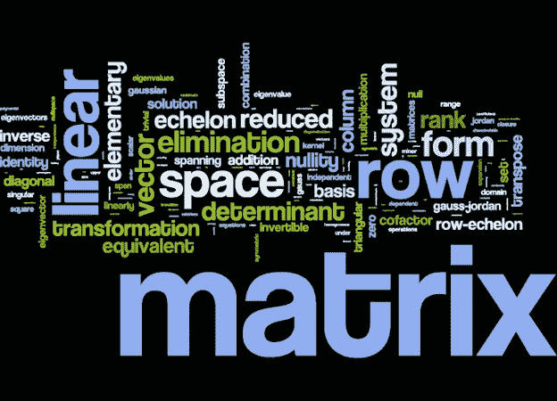
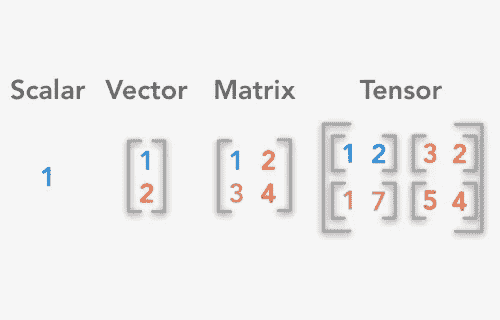

# 数据科学中的线性代数

> 原文：<https://medium.com/codex/linear-algebra-in-data-science-5dc2e5eb4174?source=collection_archive---------0----------------------->


图片来源:NCBI

数据科学是 3 个核心部分的交叉:黑客技能、数学和统计知识以及实质性的专业知识。从上图可以看出，作为一名数据科学家，需要具备这 3 个部分的基本知识。这里很危险(**危险地带！**)要在不懂数学和统计的情况下，具备黑客技术和实质性的专业知识(领域知识)。

虽然您不需要了解数学的每一部分就能成为一名实践数据科学家，但基本知识是必需的。

数据科学家需要的 **3 个主要数学领域**是:

1.  结石
2.  线性代数
3.  概率与统计

对于这篇博文，我们将关注线性代数。**线性代数**是数学、统计、物理、数据科学与工程中最基础的学科之一。在数据科学和机器学习中，线性代数的应用可以在主成分分析中找到，以减少数据的**维度，它也应用于深度学习、神经网络、自然语言处理等。**

在这里，我们将只讨论线性代数中你需要知道的**基本要求**，我们将使用 Python 的数值库 **Numpy** 来实践这些要求。

# 什么是线性代数



图片来源:ICS UCI

根据**大英百科全书**，线性代数是一门处理**向量和矩阵**以及更一般的向量空间和线性变换的数学学科。



图片来源:Kindpng

一个矩阵可以定义为一个**二维**(或矩形)数字数组。该数组中的每个数字被称为矩阵的**元素，矩阵由**维**定义:逐列。向量不同于矩阵，因为它只有一个维度，因此只有一列(列向量)或一行(行向量)。张量有两个以上的维度，但是在这篇文章中我们将只关注向量和矩阵。**

# 在 Numpy 中创建向量和矩阵


图片来源:维基媒体

Numpy，也称为数字 Python，是一个对 Python 中的计算和数字操作有用的库。Numpy 数组保存在数据类型 **numpy.ndarray** 中。

## 创建 Numpy 数组的其他方法

*   使用 np.zeros()我们可以创建一个数组，它的元素在指定的维度上都是零

```
Creates a Vector with 10 rows and 1 column
array1 = np.zeros(10)Creates a matrix with 3 rows and 2 columns
sarray2 = np.zeros((3,2))
```

*   使用 np.ones()类似地，我们可以创建一个数组，它的元素都是具有指定维度的元素。

```
Creates a Vector with 10 rows and 1 column
array1 = np.ones(10)Creates a matrix with 3 rows and 2 columns
sarray2 = np.ones((3,2))
```

*   在这里，我们使用 np.full()来指定维数和数组中需要的数字，不仅仅是 1 和 0，而是我们选择的任何数字。

```
 Create vector of twos with 3 rows and 1 columnarray1 = np.full((3),2)Creates a matrix of fours with 3 rows and 2 columns
sarray2 = np.full((3,2),4)
```

*   与 range()函数一样，使用 np.arange()返回一个区间内等间距的值。它创建一个向量，可以使用 numpy reshape()函数将其转换为矩阵。和 range 一样，它遵循的模式是:np.arange(start，stop，step)。

```
import numpy as np
array1 = np.arange(12)
array2 = np.arange(10,130,10)
array2 = array2.reshape(3,4)
```

# 线性代数运算

## 向量加法

只有当两个向量(矩阵)适合相加时，才能将它们相加，也就是说，如果它们具有**相同的维数**。这意味着 2x2 矩阵只能添加到另一个尺寸为 2x2 的矩阵中。同样，矢量加法遵循**加法交换律**。因此，向量 A 和 B 的相加等于或等价于向量 B 和 A 的相加。下面是使用 Numpy 的向量相加的图示。

## 纯量乘法

标量乘法是向量或矩阵与标量的乘法。标量乘以向量或矩阵中的每个元素。

```
array1 = np.array([[1,2],[3,4]])
array2 = 2*array1
```

## 矩阵乘法

对于要相乘的两个矩阵，第一个矩阵中的列数必须等于第二个矩阵中的行数。与向量加法不同，矩阵乘法**不**遵循乘法的交换律。因此，矩阵 A 乘以矩阵 B 不等于矩阵 B 乘以矩阵 A。

## 矩阵的行列式

在确定矩阵的行列式之前，需要注意的是行列式只能从方阵中得到。如果矩阵的列数等于其维数中的行数，则该矩阵是正方形的。

```
array1 = np.array([[1,2],[3,4]])
determinant = np.linalg.det(new_array)
```

## 矩阵/向量的转置

矩阵/向量的转置是通过将行与列互换来找到的，反之亦然。因此，它交换了矩阵/向量的维数。转置将行向量转换为列向量，反之亦然。

```
array1 = np.array([[1,2],[3,4]])
transpose= array1.T
```

## 矩阵的逆矩阵

得到矩阵的行列式后，我们就可以求出它的逆矩阵。正如数有倒数一样，方阵有逆矩阵。矩阵与其逆矩阵相乘得到单位矩阵。

```
array1 = np.array([[1,2],[3,4]])
inverse = np.linalg.inv(array1)
```

## 单位矩阵

单位矩阵是对角元素为 1，非对角元素为 0 的矩阵。当一个矩阵乘以它的逆矩阵时就得到它。在 Numpy 中使用 np.identity()可以很容易地获得一个单位矩阵

```
np.identity(2) #Creates a 2x2 identity matrix 
```

> 在这篇博文中，我们已经能够看到线性代数在数据科学中的重要性，以及使用 Numpy 创建向量和矩阵并执行流行的向量运算。
> 
> 如果你从这篇文章中学到了什么，请鼓掌和分享。也想在评论区听听大家的看法。谢谢大家！