# 线性回归:机器学习之门

> 原文：<https://medium.com/codex/linear-regression-a-gateway-to-machine-learning-c07078662a6f?source=collection_archive---------8----------------------->

马库斯·温克勒在 [Unsplash](https://unsplash.com?utm_source=medium&utm_medium=referral) 上的照片

在过去的几十年里，人工智能和机器学习取得了巨大的发展，因为它在工业中的实时问题上有着广泛的应用，并且它使我们的任务变得容易，精度提高，时间缩短。例如，医生正在使用人工智能来预测癌症和各种疾病，经济学家正在使用它来预测未来的市场价格，它使我们的生活变得更容易。如果你是机器学习的新手，那么你就在正确的地方，因为线性回归是机器学习的基础。听到很多人说我们在现实生活中哪里用到数学？我们曾经用它吗？或者它只是用来学习。好吧，今天你将通过精彩例子和数学直觉得到答案。

机器学习分为三类:I)有监督的机器学习 ii)无监督的机器学习 iii)强化学习。在监督机器学习中，我们以输入和输出(目标)的形式向我们的算法提供一些过去的数据(标记的数据)，以便它可以高效和有效地学习。在无监督类型中，模型自动从它的经验中学习。换句话说，我们在没有任何监督的情况下提供未标记的数据集来训练模型。在强化型中，它关注的是智能主体如何在环境中采取行动，以最大化获得累积回报的机会。

线性回归属于受监督的机器学习，通常用于预测值、预测和时间序列建模。我们向回归算法提供带标签的数据，带标签的数据有称为目标的因变量或也称为标签的输出变量。其他变量是独立变量，也称为特征，对我们的预测起决定性作用。回归分析的一些著名例子是房价预测、股票价格预测、航班/出租车/汽车费用预测等等。

回归技术分析标签(因变量)和多个特征(自变量)之间的关系。它显示了自变量对因变量的影响，即使它们在不同的尺度上。

简单线性回归方程如下:

> **Y = B0 + B1*X**
> 
> **其中 B0 是线的截距，B1 是线的斜率，X 是特征，Y 是目标标签。**
> 
> B0 和 B1 可使用以下等式计算:

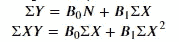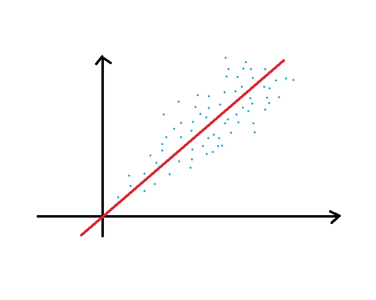

**最佳拟合线**

在上图中，我们可以看到最佳拟合线和我们的数据点。最佳拟合线的截距值为零，红线的斜率为 B1，即 x 的系数。要创建回归模型，我们必须找到这些系数值，这些系数值可通过使用**最小二乘法标准找到。**必须计算最佳拟合线，使误差平方和或残差的**最小化。**

> ***残差=实际值—预测值***

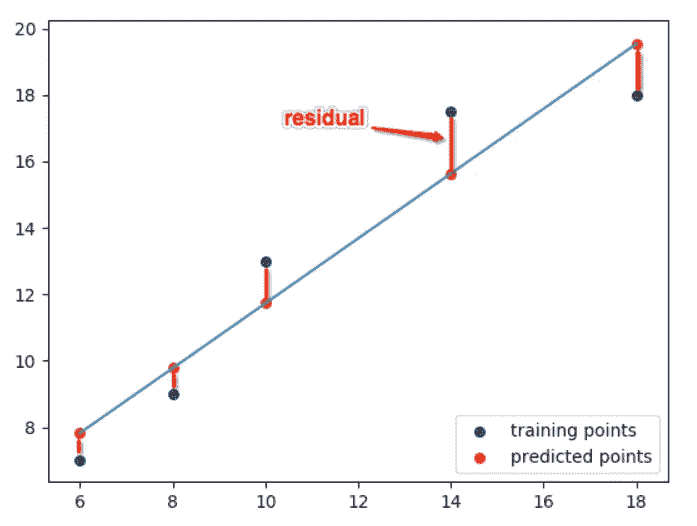

**具有最佳拟合线的残差**

> 红点是 x 和 y 的观测值。红线是残差，天蓝色线是最小二乘法线或最佳拟合线。
> 
> 我们可以通过解最小二乘方程来求出回归系数。

***你怎么知道这是最佳拟合线？***

回答:为了决定我们的线是否是最佳拟合的，我们需要最小残差。在上图中，红线表示所有数据点的剩余距离应该最小化。用数学术语来说，应该达到函数的最小值。我们可以使用梯度下降算法来获得最小值。梯度下降本身就是一个需要讨论的大话题。从现在起，我们将通过它的使用。如果我们有一个因变量和一个自变量的方程，那么形状将看起来像 2D 抛物线，其中最小值点在最低曲率处。如果我们考虑 2 个独立变量，那么形状和极小点看起来如下:

资料来源:wordpress.com

在进入实施部分之前，我们必须考虑一些重要的假设:

1.  残差的平均值为零。
2.  误差项彼此不相关。
3.  同方差性:误差项具有恒定的方差。
4.  外生性:自变量与残差项不相关。
5.  无多重共线性:自变量之间不应相互关联或相互影响，否则精度会降低。
6.  误差项呈正态分布。

现在我们将开始我们的实现部分:

**问题陈述:**该数据是关于通过电视、报纸、广播等不同渠道投放广告的金额。在这里，我们的目标是预测费用如何影响销售，并研究每个功能对销售的影响。所有数值都以美元为单位。

**步骤 1:** 导入包并读取数据

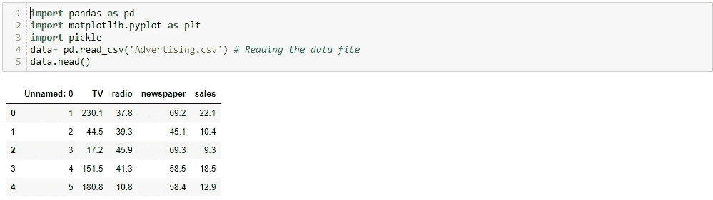

读取数据和导入包

**步骤 2:** 数据汇总并检查空值

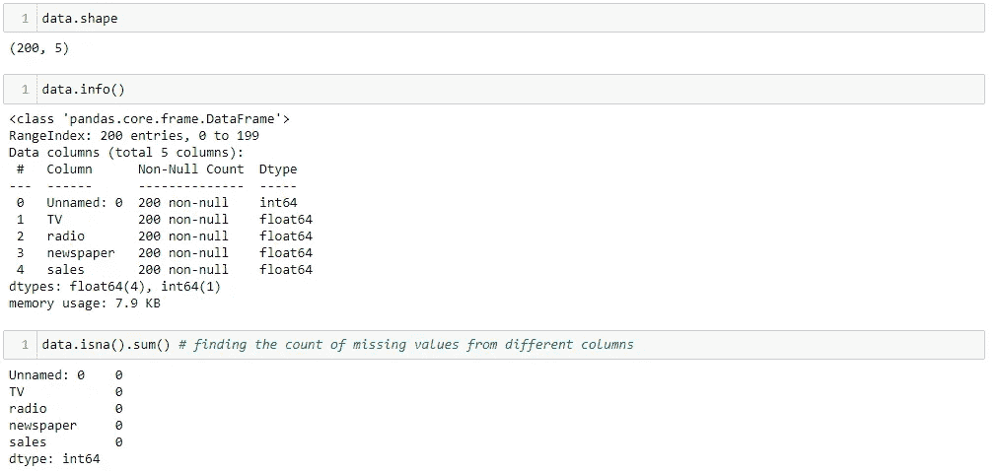

数据汇总和检查空值

**步骤 3:** 使用散点图可视化特征和响应之间的关系

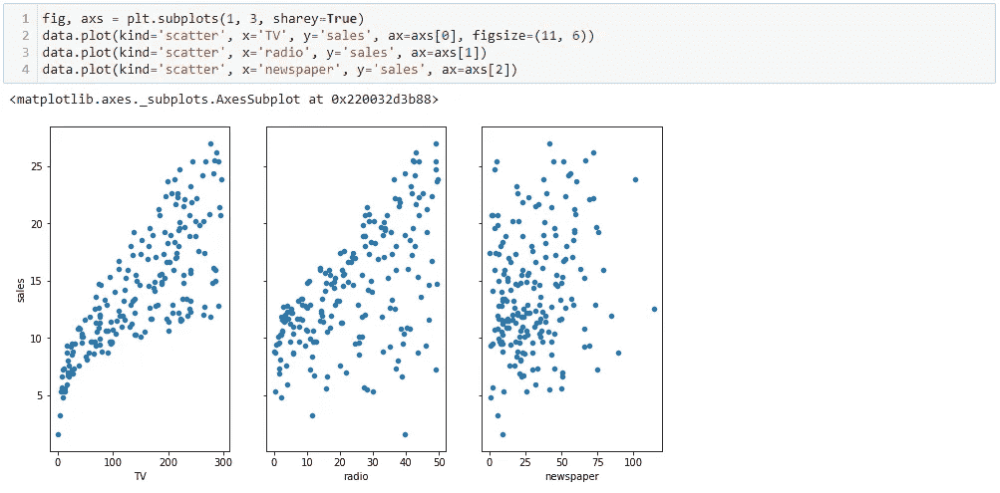

我们在这里使用简单的 matplotlib 来绘制特征与目标标签的散点图。通过可视化数据，我们可以回答许多问题，例如数据是否是线性分布的？每个参数如何影响销售变量？这种关系有多突出？

**步骤 4:模型创建**

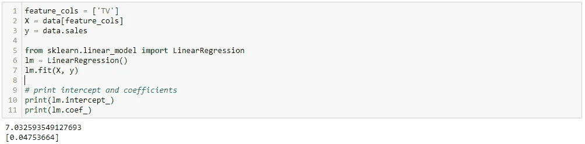

在这里，为了实现简单的线性回归，我们只考虑一个特征“电视”，即 X，用于预测“销售”，即 y。然后，我们定义我们的模型，并将我们的数据拟合到从“sklearn”导入的回归模型中。打印最佳拟合线的截距和系数值。

解释这个模型:通过查看截距和系数值，我们可以说电视广告支出增加一个“单位”与销售额增加 0.04753 个“单位”相关，1000 美元的销售额大约增加 47 美元。

**步骤 5:** 检查我们的预测:在这种情况下，我们可以使用简单的回归方程手动检查预测值，即

> **y = ax + b**
> 
> **以 40 美元的费用检查销售情况(用于电视)**
> 
> **预测 y = 7.032594+0.047537 * 40 = 8.93407**

我们将使用 python 代码验证这一点:

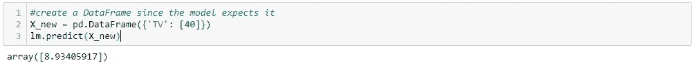

**步骤 6:** 绘制 OLS 线:由于模型需要数据帧，因此我们将其作为 Tv 的最小和最大值，并绘制分散点和最佳拟合线。

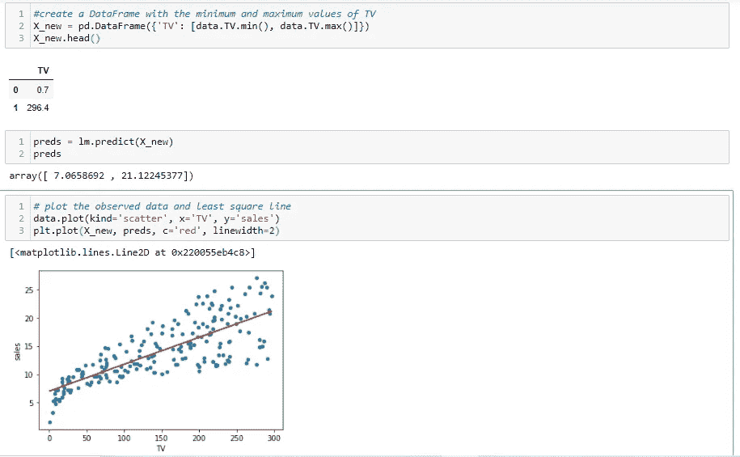

这是使用一个特性的基本线性回归实现。我们可以进一步研究两个或更多功能对目标标签“销售”的影响，但在进一步实施之前，有几件事情需要介绍。

要检查我们训练过的模型是否表现良好，有一些方法可以做到。其中一个重要的是假设检验，我们需要做出一些假设，并且这些假设必须被证明。要阅读关于假设检验的更多信息，请点击[此处](https://www.section.io/engineering-education/hypothesis-testing-data-science/)。

***p 值:*** 一般来说，p 值是拒绝或接受空/备择假设的度量。如果 p 值为正，那么我们可以拒绝该特定特征的零假设。未能拒绝零假设并不意味着我们直接接受替代假设。置信区间和 p 值在这里起着重要的作用。如果 p 值小于 0.05，即某一特征的置信度为 95%，那么我们可以认为该特征是显著的。

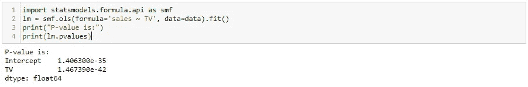

小于 0.05 的 p 值是一种确定所考虑的特征和响应之间是否存在任何关系的方法。在这种情况下，电视广告的 p 值远小于 0.05，因此我们认为电视广告和销售之间存在联系。我们一般忽略截距的 p 值。

***R 统计:*** 它提供 0 到 1 之间的拟合度。它代表了我们的模型解释了多少数据。例如，如果 R 值为 0.80，那么我们可以说我们的模型适合总数据集的 80%。如果 R 值为负，则模型更差。

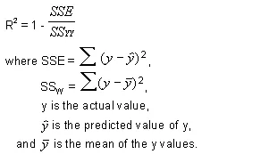

来源:谷歌图片

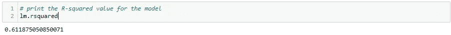

为了评估线性模型的拟合度，我们计算 R 平方值。r 平方解释了方差的比例，即模型解释的观测数据中方差的比例。通常，它位于 0 到 1 之间，接近 1 的值被认为是好值，因为它解释了更多的数据差异。它也用于比较不同的模型，但不是最可靠的方法。调整 R 是更好的方法。

***调整后的 R 统计:*** 随着等式中自变量数量的增加，R 值增加，但这并不意味着新的自变量与输出变量有任何相关性，因此 R 不是评估模型的好参数。Adj. R 惩罚模型复杂性，以控制过度拟合。交叉验证是更好的特征选择方法。

可使用以下公式计算调整系数 R:

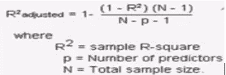

来源:谷歌图片

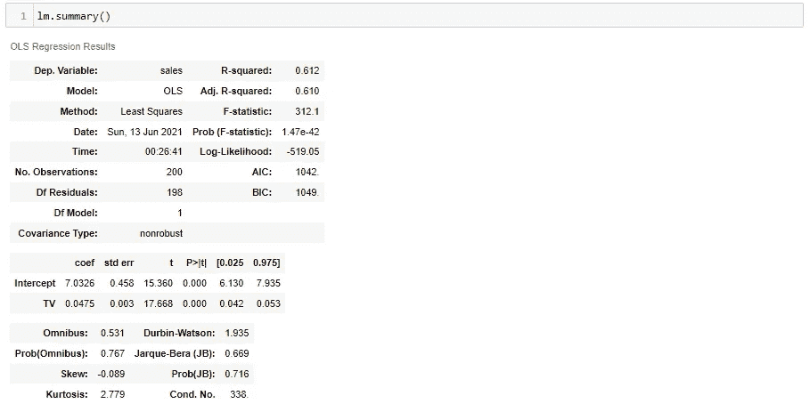

在上图中，我们可以看到带有调整值的模型的整体统计分析。R 值和 Adj. R 值之间没有太大差异，这表明我们没有因为使用这一特征(TV)而受到惩罚。

***多重共线性:*** 这是处理回归问题时最重要的准则之一。正如我们在上面使用回归的假设中所看到的，如果我们想要使用回归进行建模，就不应该存在多重共线性。这是一种多个特征(独立变量)相互依赖的情况，或者换句话说，我们可以说特征之间不应该有很强的相关性。要检查数据是否存在多重共线性，我们可以使用 VIF 值或使用热点图检查相关性。如果存在多重共线性，那么我们可以移除这些特征并仅保留一个特征，或者我们可以使用 PCA 来移除多重共线性。

***总结:*** 在本文中，我们通过一个简单的例子以及使用 python 的实现，了解了什么是线性回归。还介绍了一些对分析回归模型有用的回归术语。还有其他一些概念，比如正则化，我们将在以后的博客中研究。