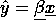

# 线性回归—3 分钟概述

> 原文：<https://medium.com/codex/linear-regression-an-overview-in-3-minutes-3db55622fec1?source=collection_archive---------13----------------------->

由 [Liel Anapolsky](https://unsplash.com/@lielan?utm_source=medium&utm_medium=referral) 在 [Unsplash](https://unsplash.com?utm_source=medium&utm_medium=referral) 上拍摄的照片

# 概观

假设您想要访问两个因变量( *Y* )和自变量( *X* )之间的关系，以便预测因变量的值。这将估计线性方程的系数，其中可能有一个或多个自变量能够最好地预测因变量的值。

线性回归模型拟合一条线，使实际值和预测值之间的偏差/分离最小化。一种被称为最小二乘法的方法被用于获得配对数据组之间的最佳拟合线。

# 线性模型

线性回归模型

在上述等式中，变量如下:

预测值

偏差/截距项

模型参数/特征权重

# 用例

众所周知，线性回归相对容易解释，可以作为基线预测。这是一个众所周知的统计过程，它的特性允许它被很好地理解和快速地训练。

企业可以使用线性回归，通过发现数据集中的模式和关系来获得更深入的见解。例如，分析支持中心中的支持票据数据可以帮助您发现热门产品发布期间的特定支持需求模式(例如，当公司发布即将推出的产品时，例如每季度一次，对该产品的查询会激增)。这种洞察力可以帮助公司更好地提前计划，为预期的高需求时期做准备。

# 如何训练线性模型

由于这是一个监督回归问题，一个常见的首选措施是均方根误差(RMSE)。在训练模型时，我们寻求获得最小化 RMSE 的模型参数值。在我们进一步描述训练过程之前，让我们以矢量化的形式表示该模型，以便更容易解释和可视化某些概念。

矢量化形式

因此，对 RMSE 的评估如下:

使用真实 y 值对观测值进行评估时的 RMSE

还需要注意线性模型的一些**关键假设**:

*   观察是独立的
*   因变量和自变量之间存在线性关系
*   残差必须呈正态分布
*   因变量分布的方差对于自变量的所有值都是常数

为了获得最小化 RMSE 成本函数的模型参数值，我们寻求获得正规方程的封闭形式解:

正规方程

在哪里

是最小化成本函数的估计模型参数的向量，以及

是成本函数中目标值的向量。

寻找最佳模型参数的另一种方法是通过优化算法，例如梯度下降。梯度下降的思想是迭代地调整参数以最小化成本函数。

# 参考

[1] Geron，A. (2019)。使用 Scikit-Learn、Keras 和 TensorFlow 进行机器学习:构建智能系统的概念、工具和技术。).奥赖利。

[2]阿 Ng (2020)。斯坦福 CS229 课堂讲稿。检索自[https://see . Stanford . edu/materials/aimlcs 229/cs 229-notes 1 . pdf](https://see.stanford.edu/materials/aimlcs229/cs229-notes1.pdf)