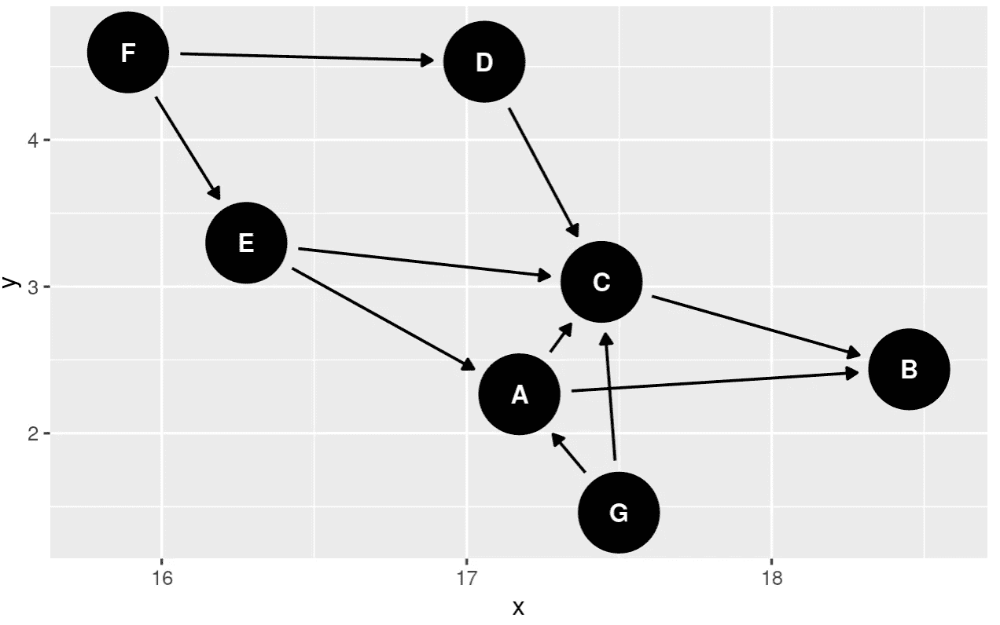
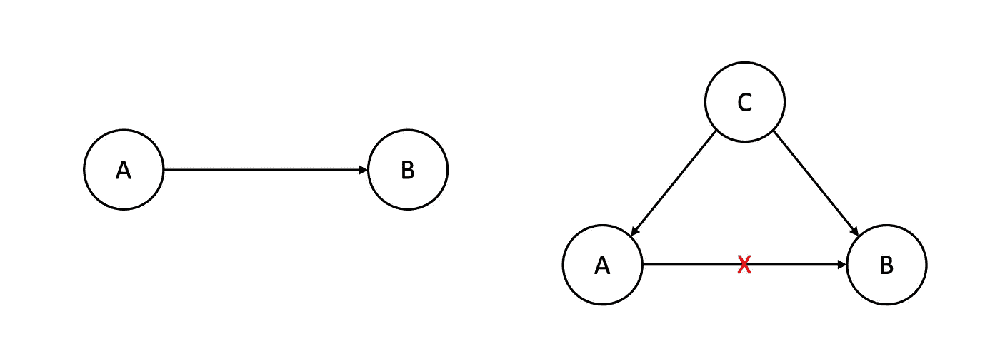
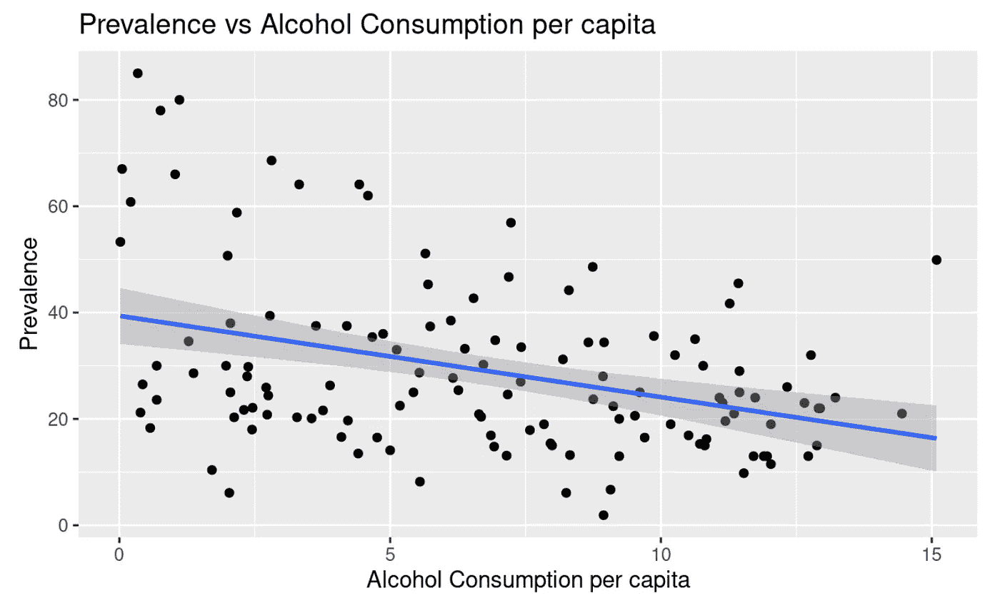
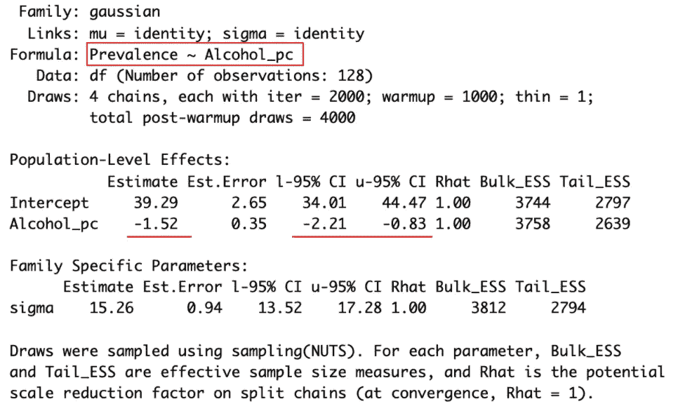
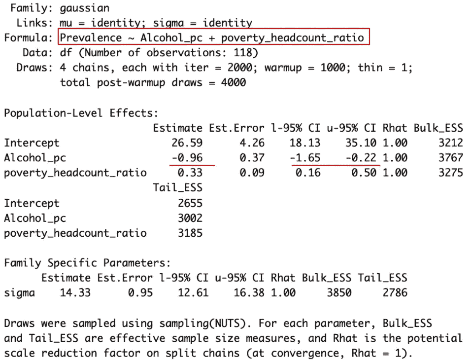
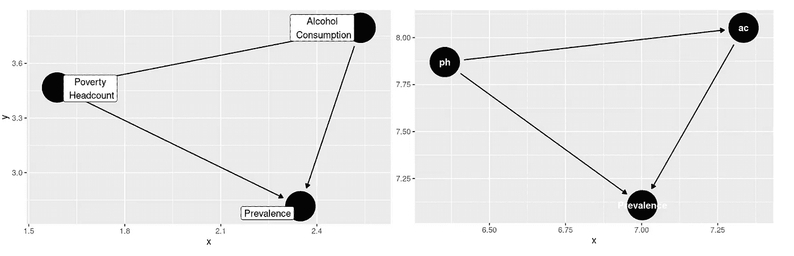

# 因果推断的线性回归

> 原文：<https://medium.com/codex/linear-regression-for-causal-inference-242da2a01086?source=collection_archive---------6----------------------->

## 深入探究相关性和因果关系。


照片由 [Unsplash](https://unsplash.com?utm_source=medium&utm_medium=referral) 上的 [Sunder Muthukumaran](https://unsplash.com/@sunder_2k25?utm_source=medium&utm_medium=referral) 拍摄

相关性并不意味着因果关系。

是的，你可能已经听过很多次了。在我的数据科学本科培训中，我一次又一次地听到，它已经在我的灵魂中留下了永恒的印记。但事实证明，线性回归不仅仅可以预测(利用相关性)。它还能帮助我们做出*因果推论*！也许相关性和因果关系之间的关系比我们最初想象的更复杂。

在这篇博客中，让我们来看看:

*   如何解读因果图，
*   混淆和虚假的关系是什么，和
*   如何通过 r 中的一个简单例子用线性回归进行因果推断。

# 因果图

我们可以用因果[有向无环图](https://en.wikipedia.org/wiki/Directed_acyclic_graph) (DAG)或[因果图](https://en.wikipedia.org/wiki/Causal_graph)来表示因果关系。例如，这是一个因果 DAG。


作者图片

a 和 B 是两个变量。从 A 到 B 的箭头表示 A 导致 B，差不多就是这样。Dag 清晰地描绘了你对变量之间因果关系的假设。在你知道之前，因果图会变得非常复杂。

```
# a bit of R code
library(dagitty) 
library(ggdag)  
dag <- dagitty("dag{ A -> B; C -> B; A -> C; D -> C; E -> C; F -> E; F -> D; G -> A; G -> C; E -> A; }")
ggdag(dag)
```



作者图片

然而，正如有向无环图(DAG)这个名字所暗示的，无论因果图变得多么复杂，都有两条规则:

1.  任何边都只能是**单向**，或者单向的，意思是 A 和 B 不能互为因果。因为时间只能单向流动。A 和 b 之间总是有一个时序。然而，有时可能存在双向弧，但这意味着这两个变量是相关的，但*原因不清楚*【1】。
2.  图中没有**循环**，意味着不可能是 A 导致 B，B 导致 C，然后 C 导致 A(或者任何涉及更多变量的循环)。出于与上述相同的原因，如果 A 首先发生，C 最后发生，则不可能有从 C 指向 A 的边

因此，对于相关但不一定有因果关系的变量，因果图中的边可能存在，也可能不存在。如果有，方向未定。如果我们确实相信一种相关性可以导致一种可能的因果关系，我们通常有一个强大的理论基础来支持我们的假设。

现在，我们可以用因果图来理解混杂和虚假的关系。

# 混杂和虚假的关系

*混杂变量*，或[混杂变量](https://www.scribbr.com/methodology/confounding-variables/)/因子，是影响自变量和因变量的第三个变量。实际上并不存在的自变量和因变量之间的虚假关系因此被称为 [*虚假关系*](https://en.wikipedia.org/wiki/Spurious_relationship) 。

这里，我们引入变量 C 作为自变量 A 和因变量 B 的唯一混杂因素，假设 C 引起 A 和 B，那么我们可以去掉 A 和 B 之间的边缘。



作者图片

但是，很多时候，A 和 B 之间的边缘并不是那么容易跨出去的。正常情况下，不会有唯一的混淆因素。从 C1 到中国会有一长串混杂因素，我们很难找到所有的混杂因素。

一个经典的例子是，A =冰淇淋销量，B =犯罪率。统计数据显示，冰淇淋的销量与犯罪率高度相关，但这是否意味着卖出更多的冰淇淋会导致更多的犯罪？你的理智可能会告诉你不，不会的。那么，在这种情况下，混杂因素 C 是什么呢？

答案:***炎热的夏天天气里的炎热*** *。*


作者图片

很容易看出热量是如何导致冰淇淋销量上升的。至于犯罪率，也许人们在天气炎热时更容易冲动，因此更容易犯罪。我们可以推测，但很难证明。这就是为什么因果图是我们假设的代表。不做实验，光靠观察数据，我们说不出多少肯定的话。然而，因果图是简单而有用的，足以区分人类逻辑的关键过程。

# 带 R 的示例

终于可以开始编码了。在这个[项目](https://github.com/AlisonYao/Violence-Against-Women)中，我们调查了饮酒和暴力侵害妇女行为之间的关系。这里涉及的数据集有:

1.  [暴力侵害妇女行为的普遍程度](https://github.com/AlisonYao/Violence-Against-Women/blob/main/Data/prevalence.csv)来自 [2019 年经合组织研究](https://data.oecd.org/inequality/violence-against-women.htm#indicator-chart)
2.  [酒精消费数据](https://github.com/AlisonYao/Violence-Against-Women/blob/main/Data/alcohol.csv)来自[世界银行](https://data.worldbank.org/indicator/SH.ALC.PCAP.LI)
3.  [贫困人口统计数据](https://github.com/AlisonYao/Violence-Against-Women/blob/main/Data/poverty_cleaned.csv)来自[世界银行](https://data.worldbank.org/indicator/SI.POV.NAHC)



作者图片

剧情挺奇怪的。我们预计更多的酒精消费会导致暴力侵害妇女行为的增加，甚至会导致暴力侵害妇女行为的增加，但这条线的斜率是负的，表明情况正好相反。

更准确地说，我们可以进行一元线性回归。

```
reg_uni <- brm(formula = Prevalence ~ Alcohol_pc,                              
               data=df,                        
               refresh = 0,                        
               seed = 123) # stabilize outcome for reproducibility 
summary(reg_uni)
```



作者图片

我们预计酒精会导致更多针对女性的暴力行为，但数据显示情况并非如此。这让我们怀疑是否有一个混杂变量导致了这种虚假的关系。

在做了一些文献回顾后，我们选择贫困作为我们的目标，并使用贫困人口比率作为贫困的指标。这一指标显示了每个国家生活在国家贫困线以下的人口百分比。我们认为，针对每个国家的指标比全球指标更好，因为它考虑到了每个国家对贫困的不同定义。现在，我们可以使用多元线性回归来看看贫困人口比率是否是一个混杂因素。

```
reg_multi <- brm(formula = Prevalence ~ Alcohol_pc + 
                 poverty_headcount_ratio,                  
                 data=df,                  
                 refresh = 0,                  
                 seed = 123) # stabilize outcome for reproducibility 
summary(reg_multi)
```



作者图片

这一次，我们的最佳估计显示，总酒精消费量每增加 1 升，患病率就会下降 0.96 个百分点，不确定性区间为-1.65 至-0.22。

与早先的估计相比，包括贫困人口比率在内的因素使关联的规模减少了大约三分之一(1.52 比 0.96)。因此，**最初的关联可以通过将 poverty _ head _ ratio 作为控制变量来部分解释。**

为了绘制因果图，我们可以运行下面的代码。

```
library(dagitty) 
library(ggdag) 
vaw_dag <- dagify(Prevalence ~ ph + ac,
                  ac ~ ph, 
                  labels = c("Prevalence" = "Prevalence", 
                             "ph" = "Poverty Headcount", 
                             "ac" = "Alcohol Consumption")                       
                  ) 
# ggdag(vaw_dag, text = FALSE, use_labels = "label") # left graph 
ggdag(vaw_dag, text = TRUE) # right graph
```



作者图片

每次运行代码时，图形都会略有不同。两个版本我都不完全满意。左边的标签遮住了箭头，右边的文字不完整。您可以运行几次，尝试找到最完美的版本。

# 参考

[1][https://en.wikipedia.org/wiki/Causal_graph](https://en.wikipedia.org/wiki/Causal_graph)

[2][https://en.wikipedia.org/wiki/Directed_acyclic_graph](https://en.wikipedia.org/wiki/Directed_acyclic_graph)

> *该项目的所有代码都可以在这个*[*GitHub Repo*](https://github.com/AlisonYao/Violence-Against-Women)*中找到。*

特别感谢 Kubinec 教授向我介绍了因果关系，感谢我出色的队友 Oscar 帮助我实施项目。

感谢您的阅读！希望这对你有帮助。