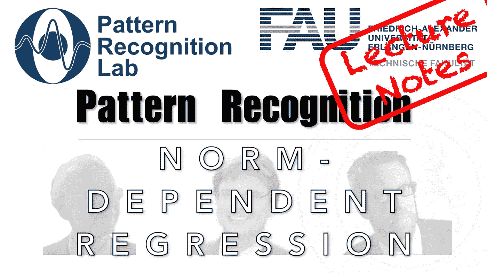

# 线性回归&基于范数的正则化:从封闭解到非线性问题

> 原文：<https://medium.com/codex/linear-regression-norm-based-regularization-from-closed-form-solutions-to-non-linear-problems-40621c342294?source=collection_archive---------3----------------------->

## 模式识别中的 FAU 讲义

## 依赖规范的回归

来自[模式识别讲座](https://www.youtube.com/playlist?list=PLpOGQvPCDQzsWvT_bqmexrJ359RTQQuMO)的 [CC BY 4.0](https://creativecommons.org/licenses/by/4.0/) 下的图片

**这些是 FAU 的 YouTube 讲座“** [**模式识别**](https://www.youtube.com/playlist?list=PLpOGQvPCDQzsWvT_bqmexrJ359RTQQuMO) **”的讲义。这是讲座视频&** [**配套幻灯片**](https://doi.org/10.5281/zenodo.4429576) **的完整抄本。**的来源…