# 多元线性回归

> 原文：<https://medium.com/codex/linear-regression-on-multiple-variables-1893e4d940b1?source=collection_archive---------8----------------------->

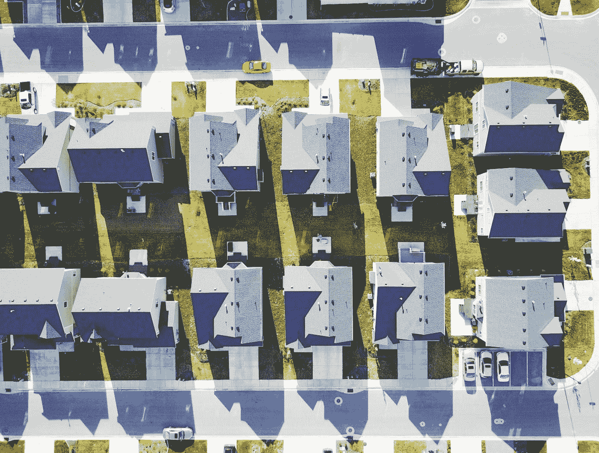

布莱克·惠勒在 [Unsplash](https://unsplash.com?utm_source=medium&utm_medium=referral) 上拍摄的照片

理解在 sci-kit 这样的流行库的幕后发生了什么来实现各种机器学习算法，是任何数据科学家旅程中最困难的部分之一。所以，我今天想到了另一个机器学习算法。在这篇文章中，我们将深入了解这种方法，对其进行编码，然后将其作为预测模型来应用。

## 什么是多元线性回归？

多变量线性回归(对多个变量的线性回归)类似于简单线性回归模型或单变量线性回归模型 *(* [***点击此处***](/codex/linear-regression-on-single-variable-f35e6a73dab6) *(如果你还没有查看我关于单变量线性回归的博客的话)*，但是由于有多个自变量贡献于因变量，导致要计算许多系数，并且由于额外的变量而导致更复杂的计算。

## 模型表示


记号

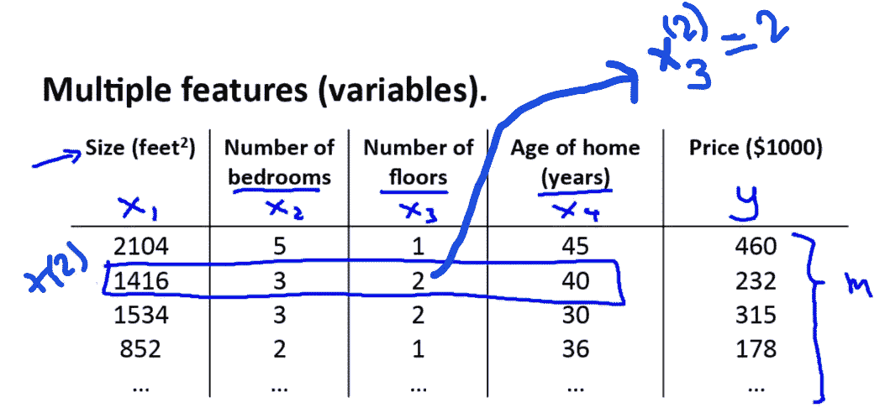

## 加载数据

假设你正在出售你的房子，你想知道一个好的市场价格是多少。一种方法是首先收集最近出售的房屋信息，并制作一个房价模型。考虑一个包含俄勒冈州波特兰房价的数据集。

让我们导入所需的库并将数据集加载到 Pandas 数据框架中:

```
import numpy as np
import pandas as pd
import matplotlib.pyplot as plt
```

```
house_data = pd.read_csv('ex1data2.txt', header=None)
house_data.head()
```

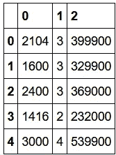

输出:house_data.head()

这里的 ***第一栏*** 是 的 ***面积(平方英尺)，第 ***第二栏*** 是 ***卧室数*** ， ***第三栏*** 是 ***房价*** 。这里 n = 2 ( **即**房间的大小和数量)***

```
house_data.describe()
```

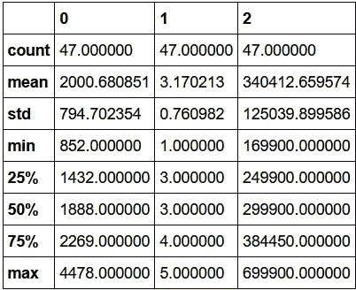

输出:data.describe()

## 特征标准化

在我们着手解决一个问题之前，我们必须首先检查和分析数据。这一步乍一看似乎很简单，但如果没有正确完成，它会非常痛苦。

数据规范化(特征缩放)的目的是什么？
这是因为我们的一些特性可能在 0–1 范围内，而其他特性可能在 0–1000 范围内。如果您按原样输入数据，您可能会遇到不合适的风险。

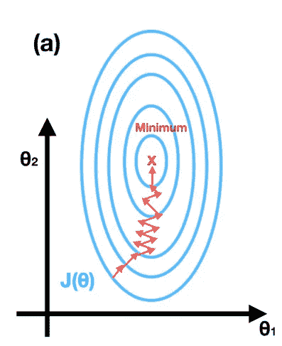

无特征缩放

从上面的图像中我们可以看到，如果没有特征缩放，我们的轮廓将被拉长，导致梯度下降过程在大量迭代后找到最小值，减慢了我们的方法，有时很难识别最小值。

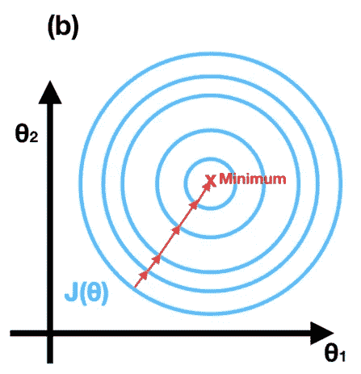

使用特征缩放

从上图我们可以发现，特征缩放后，梯度下降以较少的步数找到最小值。这加快了我们的算法。

我们将使用**均值归一化**以相似的比例缩放我们的特征，

将 xᵢ替换为 xᵢ-μᵢ，使特征的平均值约为零(不适用于 x₀)

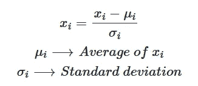

均值归一化

示例:


特征缩放前

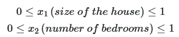

特征缩放后

```
def featureNormalize(X):
    mean = np.mean(X, axis=0)
    std = np.std(X, axis=0)

    X_norm = (X - mean)/std
    return X_norm, mean, stdmod_house_data = house_data.values
m2 = len(mod_house_data[:, 2])
X2 = mod_house_data[:, :2].reshape(m2, 2)
y2 = mod_house_data[:, 2].reshape(m2, 1)X2, mu, sigma = featureNormalize(X2)
X2 = np.column_stack((np.ones((m2, 1)), X2))
```

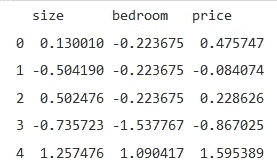

标准化后

## 多元回归假设

在多元回归中，我们将使用多个变量来预测输出，因此我们的假设是，

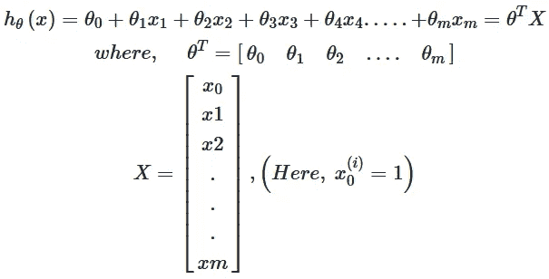

假设

这里， **θᵗ(Theta 转置)**是包含θᵢ(ℝⁿ⁺的大小，n =特征数/列数)所有值的行向量， **X** (注:这里“x”代表矩阵或列向量)是包含 **xᵢ** 所有值的列向量(ℝⁿ⁺的大小)(注:这里'xᵢ'代表数据集中的每一列)。

## 价值函数

目标是设置参数，使 h(x)接近每个 x 的 y 值。例如，选择θ₀和θ₁，使 h(x)接近每个 x 的 y 值。
该条件可以用数字表示如下:

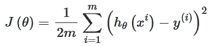

价值函数

了解更多关于代价函数的知识( [***点击此处***](/codex/linear-regression-on-single-variable-f35e6a73dab6)**了解我上一篇文章中更多关于代价函数的知识)。**

```
*def compute_cost(X, y, theta):
    m = len(y)
    h_theta = X.dot(theta)
    J = 1/(2*m) * np.sum((h_theta-y)**2)
    return Jtheta2 = np.zeros((3, 1))
compute_cost(X2,y2,theta2)*
```

## *多元回归的梯度下降*

*在我们之前的文章中，我们已经在单变量回归上实现了梯度下降。现在唯一的区别就是 matrix X 里多了一个特征(想了解更多渐变下降 [***点击这里***](/codex/linear-regression-on-single-variable-f35e6a73dab6) )*

*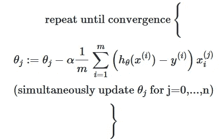*

*更新规则*

## *选择学习率*

*Alpha 或学习率决定了算法达到最小成本值(即，给出最小成本值的参数值)所需的步长。*

*现在，我们将为数据集尝试不同的学习速率，并找到一个快速收敛的学习速率。*

*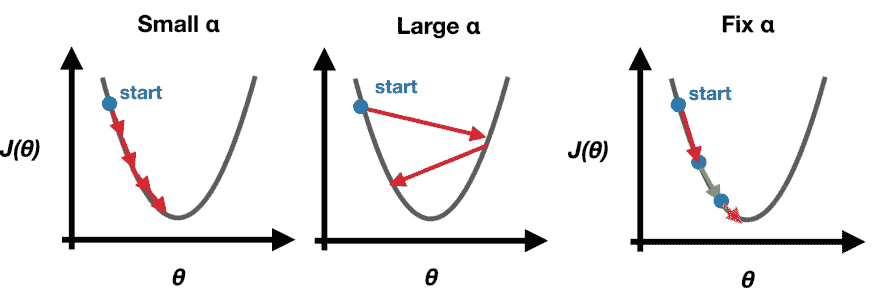*

*当α较小时，梯度下降需要更多的时间来收敛，而当α较大时，梯度下降会过冲而无法收敛。我们可以通过尝试不同的α值来找到一个好的学习率(α)。我建议尝试对数标度上的α值，大约是前一值的 3 倍(即 0.3、0.1、0.03、0.01 等)。*

```
*lr = [0.01, 0.03, 0.09, 0.1, 0.3, 0.9]
J_histories = []
for x in lr:
    theta2, J_history = gradientDescent(X=X2, y=y2, theta=theta2, alpha=x, n_iters=100, graph=False)
    J_histories.append(J_history)*
```

*针对不同的学习速率可视化 J(θ),*

```
*len_J = len(J_histories[0])
for x in range(len(lr)):
    plt.plot(J_histories[x], label=lr[x])
plt.xlabel("No. of Iterations")
plt.ylabel("J(theta)")
plt.title("Cost function using Gradient Descent")
plt.title('Learning rates')
plt.legend(loc=1)*
```

*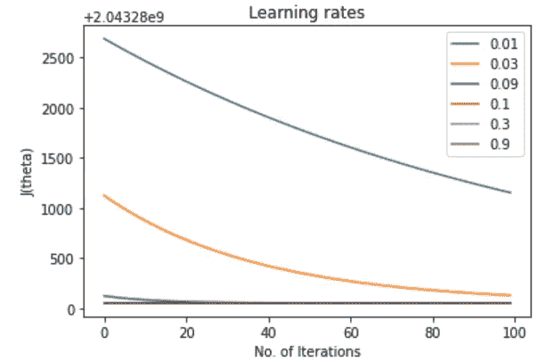*

*J(θ)表示不同的学习速率(α)*

*从上图可以看出，α=0.01 是不错的选择。因此，我们使用 0.01 作为学习率来训练我们的模型。*

```
*theta2, J_history2 = gradientDescent(X2, y2, theta2, 0.01, 400)
print(f"h(x) ={round(theta2[0,0],2)}+{round(theta2[1,0],2)}x1 + {round(theta2[2,0],2)}x2")*
```

*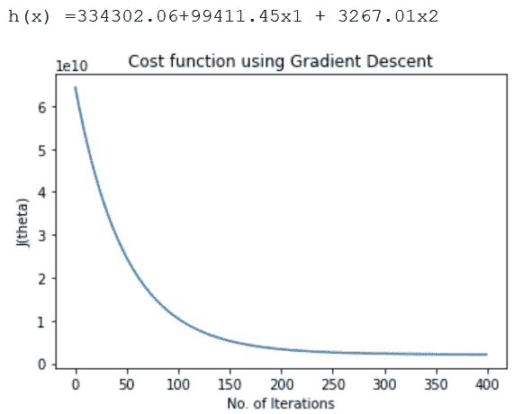*

## *预言*

*公式保持不变，*

*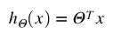*

```
*def predict(X, theta):
    predictions = np.dot(theta.T, X)
    return predictions[0]*
```

*在使用它进行预测之前，不要忘记对值进行归一化，*

```
*x_sample = featureNormalize(np.array([1650, 3]))[0]
x_sample = np.append(np.ones(1),x_sample)
predict3 = predict(x_sample, theta2)
print(f”For size of house = 1650, Number of bedroom = 3, we predict a house value of ${round(predict3,0)}”)*
```

*输出:对于房屋大小= 1650，卧室数量= 3，我们预测房屋价值为 430447.0 美元*

## *结论*

*今天，我们看到了假设、成本函数和多变量回归的梯度下降背后的概念。然后使用 python 的 numpy、pandas 和 matplotlib 从头开始创建它。数据集和最终代码上传到 github。*

*点击这里查看[线性回归](https://github.com/jagajith23/Andrew-Ng-s-Machine-Learning-in-Python/tree/gh-pages/Linear%20Regression)。*

# *如果你喜欢这篇文章，那么看看我在这个系列中的其他文章*

## *1.[什么是机器学习？](/@jagajith23/what-is-machine-learning-daeac9a2ceca)*

## *2.[机器学习有哪些类型？](/codex/what-are-the-types-of-machine-learning-53360b7db8b4)*

## *3.[一元线性回归](/codex/linear-regression-on-single-variable-f35e6a73dab6)*

## *4.[逻辑回归](/@jagajith23/logistic-regression-eee2fd028ffd)*

## *5.[什么是神经网络？](/@jagajith23/what-are-neural-networks-3a0965e2ebfb)*

## *6.[使用神经网络的数字分类器](/@jagajith23/digit-classifier-using-neural-networks-ad17749a8f00)*

## *7.[利用 K 均值聚类进行图像压缩](/@jagajith23/image-compression-with-k-means-clustering-48e989055729)*

## *8.[使用 PCA 对人脸进行降维](/@jagajith23/dimensionality-reduction-on-face-using-pca-e3fec3bb4cee)*

## *9.[使用异常检测来检测网络上的故障服务器](https://jagajith23.medium.com/detect-failing-servers-on-a-network-using-anomaly-detection-1c447bc8a46a)*

# *最后做的事*

*如果你喜欢我的文章，请鼓掌👏一个追随者会是📈回归的和媒体宣传这篇文章是有帮助的，这样其他人也可以阅读它。我是 Jagajith，我会在下一个里抓住你。*