# 一元线性回归

> 原文：<https://medium.com/codex/linear-regression-on-single-variable-f35e6a73dab6?source=collection_archive---------13----------------------->


艾萨克·史密斯在 [Unsplash](https://unsplash.com?utm_source=medium&utm_medium=referral) 上拍摄的照片

大家好。今天我们将步入我们的第一个监督学习算法。线性回归是游戏的名字。在这篇文章中，我们将编码我们的算法，然后用它作为我们的预测模型。

## 什么是线性回归？

线性回归是一种统计监督学习技术，使用一个或多个独立特征建立线性关系来预测因变量。它也被称为“最佳拟合线”。线性回归的基本思想是找到一条符合数据点集的直线。

## 模型表示

**符号:**

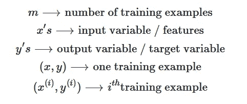

记号

一般来说，回归过程由下面的流程图解释:

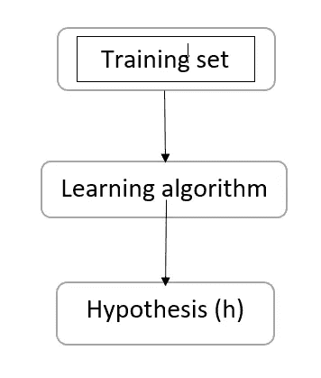

为了生成假设(线)，将训练数据植入学习过程。假设是使用输入数据预测输出值的函数。假设(h)是一个将 x 映射到 y 的函数。

在线性回归的情况下，假设(h)由以下等式表示:

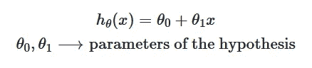

一元回归公式

参数的图形表示:

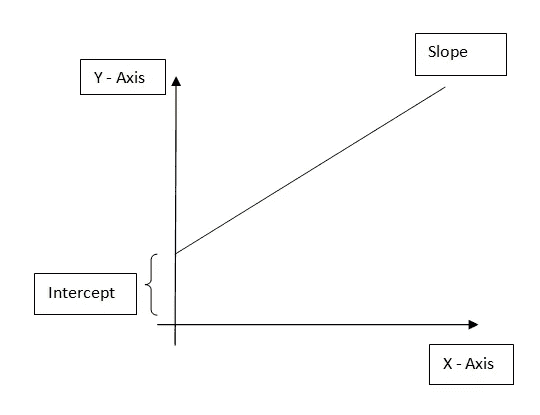

假设的图示:

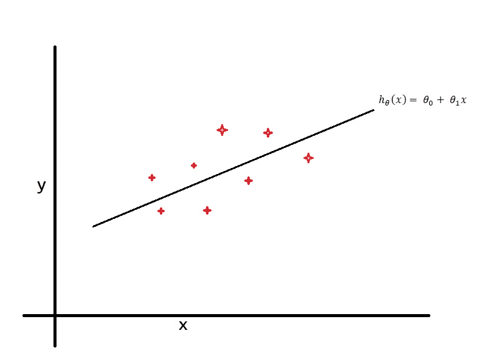

假设

从上图中，我们可以清楚地见证，有一个线性的趋势。随着“x”值的增加，“y”值也会增加。

这里，x 是独立变量，y 是输出变量，θ₀是截距，截距是常数，θ₁是斜率。

考虑一个数据集，其中包含基于城市人口的快餐车利润信息。

让我们导入所需的库:

```
import numpy as np
import pandas as pd
import matplotlib.pyplot as plt
```

并将数据集加载到熊猫数据框架中

```
data = pd.read_csv('ex1data1.txt', header=None)
data.head()
```

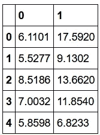

输出:data.head()

这里 0( 即 x， ***万人城市的*** 是输入变量)和 1(即 y， ***万元利润*** 是输出变量)

```
data.describe()
```

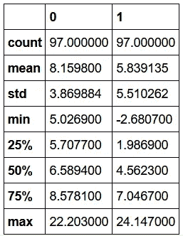

输出:data.describe()

在开始任何任务之前，通过可视化来理解数据通常是有用的。对于这个数据集，我们将使用散点图来可视化数据，因为它只有两个属性可以绘制(利润和人口)。我们在现实生活中遇到的许多其他问题都是多维的，不能用二维图来表示。

```
plt.scatter(data[0], data[1], marker="x", c='red', alpha=0.5)
plt.xticks(np.arange(5, 30, step=5))
plt.yticks(np.arange(-5, 30, step=5))
plt.xlabel("Population of a city(10,000s)")
plt.ylabel("Profit($10,000)")
plt.title("Profit vs. Population")
```

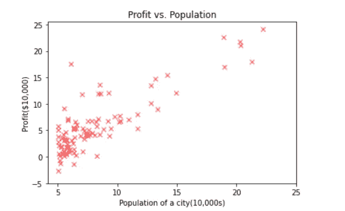

输出:散点图

从这张图中我们可以看到线性趋势，随着人口的增加，利润也增加。

因为我们用的是线性回归，假设类似于直线的方程。为了拟合数据，我们也可以使用任何一种函数作为假设(***【h(x)】***)。

## 如何为假设选择好的参数？

目标是设置参数，使 h(x)接近每个 x 的 y 值。例如，选择θ₀和θ₁，使 h(x)接近每个 x 的 y 值。
该条件可以用数字表示如下:

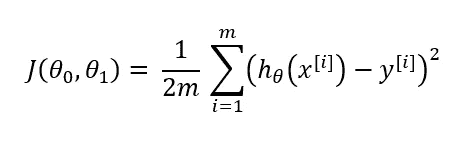

价值函数

这个表达式叫做成本函数，损失函数，等等…这个表达式的结果叫做成本，损失，等等…最终，一切都是一样的。有许多类型的成本函数可用。均方差(MSE)成本函数是回归问题中通常使用的函数，如上所示。

好与坏假设的图示:

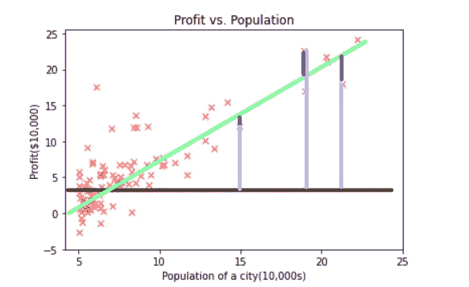

好与坏的假设

从上图我们可以推断，点与棕色线之间的距离彼此较远，点与绿色线之间的距离彼此较近。因此，绿线将具有最小成本( ***好假设*** )，而棕色线将具有最大成本( ***坏假设*** )。上面的等式将试图找到减少 h(x)损失的线。

让我们进一步分析成本函数:

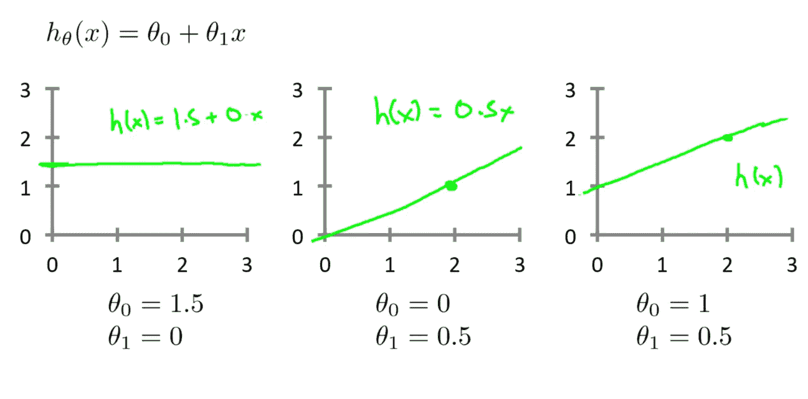

资料来源:吴恩达

```
def compute_cost(X, y, theta):
    m = len(y)
    h_theta = X.dot(theta)
    J = 1/(2*m) * np.sum((h_theta-y)**2)
    return J
```

```
mod_data = data.values
m = len(mod_data[:,-1])
X = np.column_stack((np.ones((m, 1)), mod_data[:, 0].reshape(m, 1)))
y = mod_data[:, 1].reshape(m, 1)
theta = np.zeros((2, 1))

iterations = 1500
alpha = 0.01
J = compute_cost(X, y, theta)
```

## 最小化成本函数的梯度下降

梯度下降法是一种流行的最小化代价函数损失的算法。

*   J(θ₀、θ₁)有某种功能
*   目标:

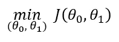

*   从θ₀，θ₁.开始
*   不断改变θ₀，θ₁，以减少 J(θ₀，θ₁)，直到我们有希望在最低限度结束。

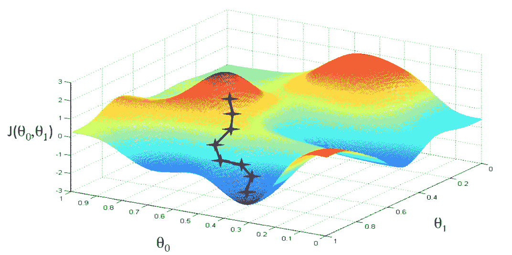

资料来源:吴恩达

更新参数规则:

*   找到假设→ h(x) = θ₀ + θ₁x
*   然后使用假设和数据中的输出变量来计算成本:


*   然后更新 theta，如下所示:

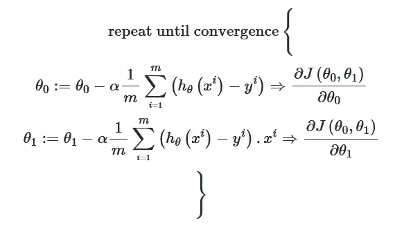

Alpha 或学习率决定了算法达到最小成本值(即，给出最小成本值的参数值)所采取的步长。我们必须注意的非常重要的细节是，我们必须**同时更新θ₁和θ₀**。我们不应该更新θ₀，然后升级成本函数，然后θ₁，这不是我们想要的工作方式。

```
def gradientDescent(X, y, theta, alpha, n_iters, graph=True):
    m = len(y)
    J_history = []

    for i in range(n_iters):
        h_theta = X.dot(theta)
        err = np.dot(X.T, (h_theta - y))
        descent = alpha * 1/m * err
        theta -= descent

        J_history.append(compute_cost(X, y, theta))
    if graph:
        plt.plot(J_history)
        plt.xlabel("No. of Iterations")
        plt.ylabel("J(theta)")
        plt.title("Cost function using Gradient Descent")

    return theta, J_historytheta, J_history = gradientDescent(X, y, theta, alpha, iterations)
print(f"h(x)= {round(theta[0, 0], 2)} + {round(theta[1, 0], 2)} x1")
```

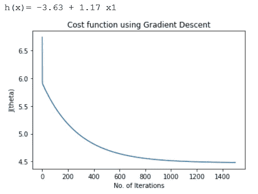

参数的初始值被设置为零。学习率设置为 0.01。最多允许 1400 个重复或时期。相对于迭代次数绘制成本函数给出了良好的下降趋势，表明梯度下降实现在降低成本函数方面起作用。

现在，有了优化的θ值，我将把预测值(最佳拟合线)一起绘制成图

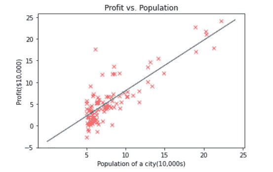

## 预言

要进行预测:

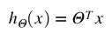

```
def predict(X, theta):
    predictions = np.dot(theta.T, X)
    return predictions[0]
```

```
predict1 = predict(np.array([1,3.5]),theta)*10000
print(f'For population=35000, we predict a profit of ${round(predict1, 0)}')
```

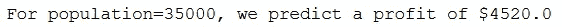

```
predict2 = predict(np.array([1,7]),theta)*10000
print(f'For population=70000, we predict a profit of ${round(predict2, 0)}')
```

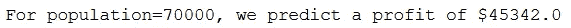

## 结论

今天，我们看到了假设、成本函数和单变量线性回归的梯度下降背后的概念，并使用上述概念在房价数据集的要素上构建了一条回归线。然后使用 python 的 numpy、pandas 和 matplotlib 从头开始创建它。数据集和最终代码上传到 github。

点击这里查看[线性回归](https://github.com/jagajith23/Andrew-Ng-s-Machine-Learning-in-Python/tree/gh-pages/Linear%20Regression)。

# 如果你喜欢这篇文章，那么看看我在这个系列中的其他文章

## 1.[什么是机器学习？](/@jagajith23/what-is-machine-learning-daeac9a2ceca)

## 2.[机器学习有哪些类型？](/codex/what-are-the-types-of-machine-learning-53360b7db8b4)

## 3.[多元线性回归](/@jagajith23/linear-regression-on-multiple-variables-1893e4d940b1)

## 4.[逻辑回归](/@jagajith23/logistic-regression-eee2fd028ffd)

## 5.[什么是神经网络？](/@jagajith23/what-are-neural-networks-3a0965e2ebfb)

## 6.[使用神经网络的数字分类器](/@jagajith23/digit-classifier-using-neural-networks-ad17749a8f00)

## 7.[利用 K 均值聚类进行图像压缩](/@jagajith23/image-compression-with-k-means-clustering-48e989055729)

## 8.[使用 PCA 对人脸进行降维](/@jagajith23/dimensionality-reduction-on-face-using-pca-e3fec3bb4cee)

## 9.[使用异常检测来检测网络上的故障服务器](https://jagajith23.medium.com/detect-failing-servers-on-a-network-using-anomaly-detection-1c447bc8a46a)

# 最后做的事

如果你喜欢我的文章，请鼓掌👏一个追随者将会是惊人的和它有助于媒体推广这篇文章，以便其他人可以阅读它。我是 Jagajith，我会在下一个里抓住你。