# 线性回归:简单线性回归的 Pythonic 方法

> 原文：<https://medium.com/codex/linear-regression-pythonic-approaches-to-simple-linear-regression-93a75e70c520?source=collection_archive---------15----------------------->

正如我之前提到的，我是学习、保持和测试我的知识的数据营课程的忠实粉丝。然而，真正让我不知所措的事情之一是不同的课程会使用各种不同的包和方法，有时是为了实现相同的目标。因此，作为我上一篇文章的延续，我想借此机会总结一下我已经开始用于线性回归项目的两个包:Statsmodels 和 Scikit Learn。我将使用美国住房数据集来讲述如何使用这两者，你可以在这里找到[笔记本](https://github.com/iban121/Linear-Regression-/blob/main/Linear%20Regression.ipynb)。

# 数据

样本数据集有 5000 个条目，包含 7 个特征:平均地区收入、平均地区房屋年龄、平均房间数量、平均卧室数量、地区人口、价格和地址。它可供公众使用，所以绝对可以自由地[查看](https://www.kaggle.com/datasets/vedavyasv/usa-housing)并亲自玩一玩。我将探究房屋的特征和价格之间是否存在线性关系。那么，我们如何知道应该关注哪些特征呢？

我发现配对图是在做任何事情之前快速可视化数据的好方法，因为它让我快速了解数据集中存在哪些明显的趋势。如果你想了解更多，请查看这篇关于结对图的文章[。](/analytics-vidhya/pairplot-visualization-16325cd725e6)

我使用 Seaborn 的配对图来可视化数据，因为它会自动识别哪些特征是数字特征，并创建一个网格来显示数字特征之间的配对关系。另一个有趣的特性是，在网格的对角线上，它绘制了单变量分布(每个特性的数据看起来如何)。

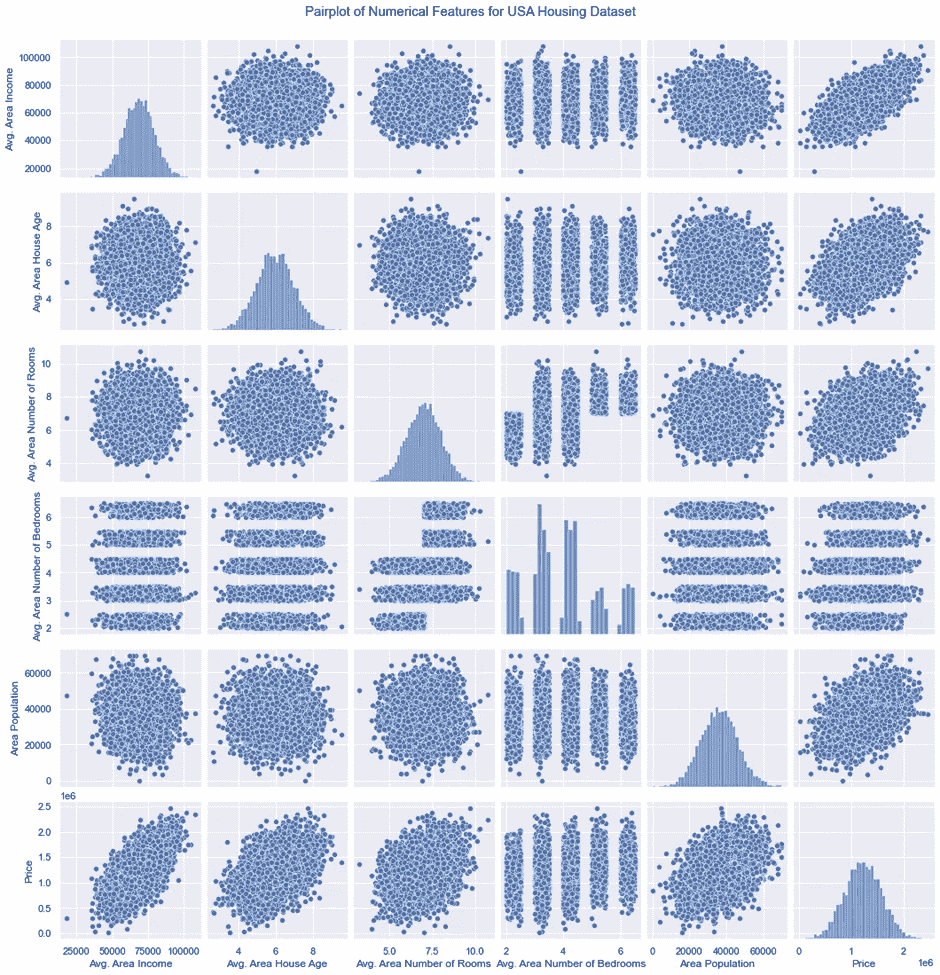

从这里我们可以看到，有一些特征似乎呈现出某种程度的正相关关系:平均面积收入与价格，平均房龄与价格，平均面积房间数与价格，面积人口与价格。

现在，如果仔细观察这四幅图(最后一行的第一、第二、第三和第四幅图),我们可以看到，虽然它们的趋势有相似之处，但平均地区收入和价格图的数据点比其他三幅图紧密得多。这就是特征的“相关程度”问题出现的地方——我们将在了解如何进行简单的线性回归后探讨这个问题！

# 清理数据

像许多统计包一样，如果我们的数据不完整，大多数 python 包的线性回归模型会很困难或者根本不起作用。我不会在这里深入讨论关于数据清理的大量细节，但是需要注意的是，您没有丢失数据，并且您想要对其执行线性回归的数据是数值型的，并且以数值形式存储。我用熊猫来快速检查数据是否适合线性回归。

我推荐熊猫。info()方法，这是检验数据类型的一种非常简单的方法。我们可以看到，除了一列之外，所有的列都是数字的(下图)，正如所料，地址不是。我在这里删除了地址栏。

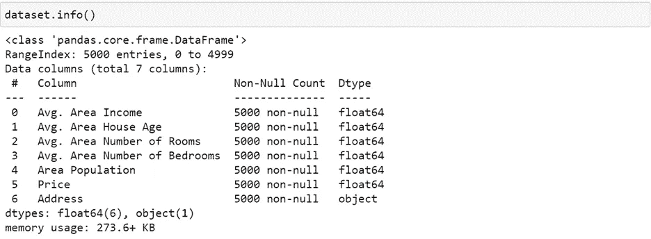

此外，还有两个方法:isnull()。当 sum()链接在一起时，将给出缺失数据列的快速汇总。

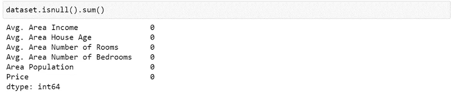

太好了！没有丢失数据，所以我们现在可以进行回归分析。

# 拆分数据

通常的做法是将数据分成两组:训练集和测试集。这里的想法是先用训练集建立一个模型。想象一下，我们把所有有序的数据点(每个平均面积收入及其对应的房价)放进一个袋子里。我们随机选择其中的 80%并绘制一个散点图，现在试着画出我们的最佳拟合线，一条回归线，只用这些点。这基本上被称为训练“模型”。对于线性回归，比如说对于房价和平均地区收入，我们期望得到一个等式:

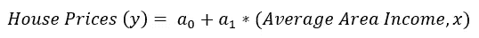

这里第一项是直线的 y 截距，第二项是系数。

线是怎么获得的？有很多不同的方法，但最常见的方法，也是我使用的方法，是[最小二乘回归](/@indrani.banerjee121/linear-regression-an-introduction-5310f3668668)。一旦我们有了回归线的方程，我们就取剩下的 20%的数据集，将平均地区收入值(x 值)代入方程，记录回归线给出的房价。最后，我们可以比较回归线预测的价格和实际价格，以衡量我们的线性回归模型的质量:我们的线的预测能力！

将数据分成这两组的最简单方法是使用 Scikit Learn 的“训练-测试-分割”:

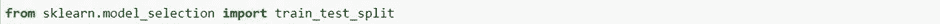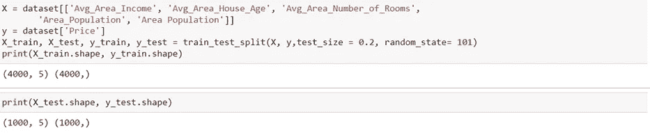

# 现在，我们线性回归！

正如我前面提到的，我想通过这篇文章了解什么时候使用 Statsmodel，什么时候 Scikit Learn 更合适。因为我们要看一个简单的线性回归，所以只有一个特征，我只看平均地区收入作为特征，以及它如何影响房价。

# Scikit 学习

使用 Scikit 了解有几件事需要设置。我已经选择了“平均地区收入”列，并将其设置为我们想要探索的功能。如果我们在看多元线性回归，我们会使用整个 X_train 集合，但是为了简单起见，我们现在只关注一个特性。

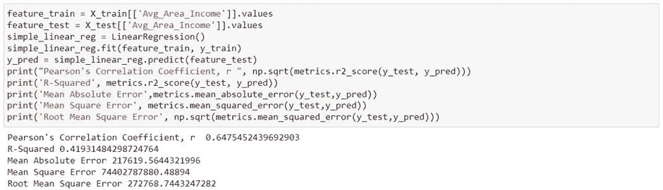

这个模型非常容易拟合，只有几行代码给出了我们模型的度量。

使用 Scikit Learn 很容易获得线性模型的系数和截距:

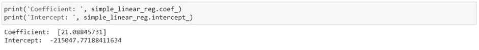

现在，让我们来看一个回归图，我们可以将实际房价与我们的模型预测的房价进行比较。这些都很容易做到，请随意查看我的[笔记本](https://github.com/iban121/Linear-Regression-/blob/main/Linear%20Regression.ipynb)的代码。

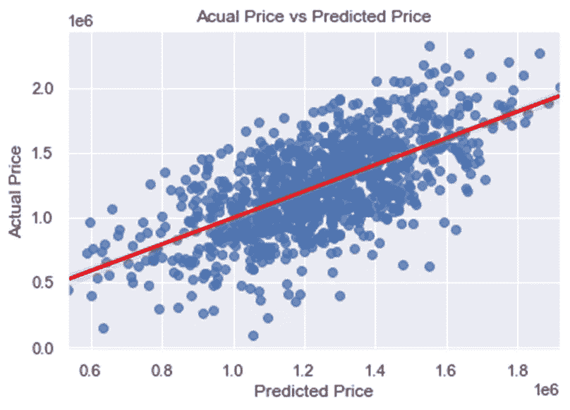

我们确实看到，在中心附近，大多数点都分散在非常靠近红线的位置，这表明大多数预测的房价与数据集中的实际房价非常接近。我们确实在末端附近看到了更多的偏差，所以这个模型并不适用于我们拥有的整个数据范围。

让我们来看看残差图，看看线性模型是否合适。

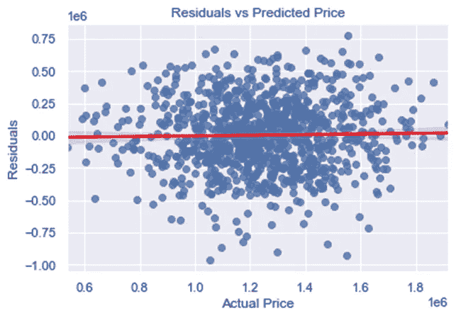

我们在这里看不到任何明显的模式，这表明线性模型是数据集的合适模型。

# 统计模型

让我们看看如何使用 Statsmodel 进行与之前相同的分析。我是 Statsmodels 的忠实粉丝，因为我发现当你只想了解数据集时，起诉要方便得多。

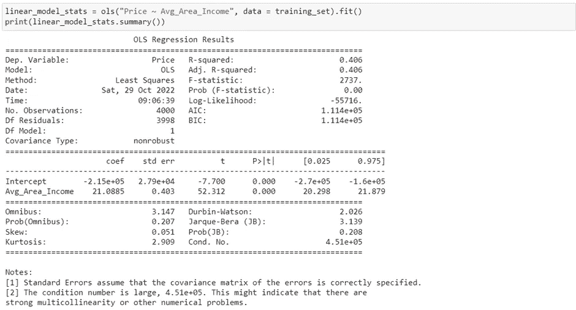

需要注意的是，代码之间有细微的差别。对于 statsmodels 普通最小二乘(OLS)模型，我们需要使用“因变量~自变量”)格式。的。summary()方法非常好，因为它只需要几秒钟就可以提供非常详细的数据信息。我想花一些时间来讨论所有这些输出的意义和它们的相关性，但我将把它留给另一篇文章。现在，我想强调 R 平方值，线性回归模型的系数和截距。如果我们现在想看看剩余的图，statsmodel 图形模块使这变得非常方便。

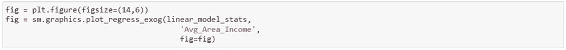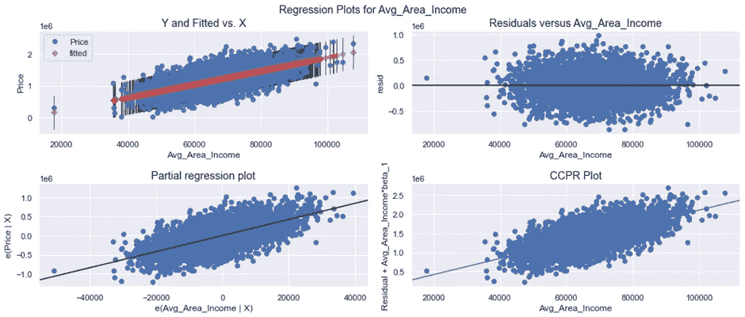

从统计分析的角度来看，这里有很多东西需要解开，这超出了本文的范围。我希望这篇文章的真正收获是看到 Scikit Learn 和 Statsmodel 如何在统计分析方面有非常清晰但不同的侧重点:Scikit Learn 在预测方面更有效、更方便，而 Statsmodel 在尝试获得更深入的数据洞察力方面则非常出色。请继续关注，当我们下周研究解释线性回归时，我将重点解释这两个包向我们抛出的各种不同的度量标准！