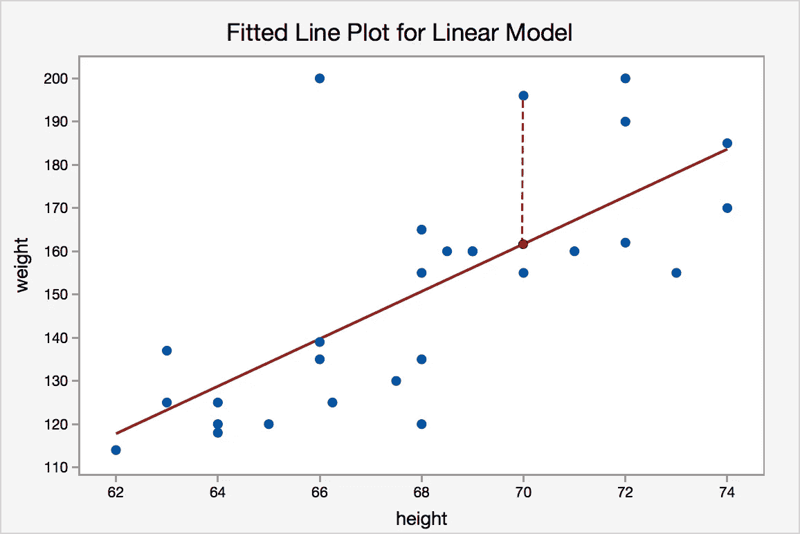
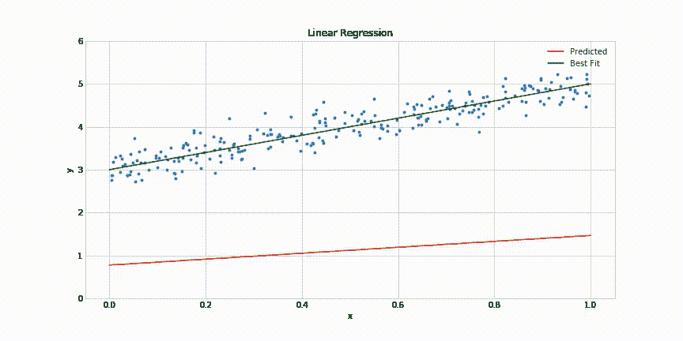
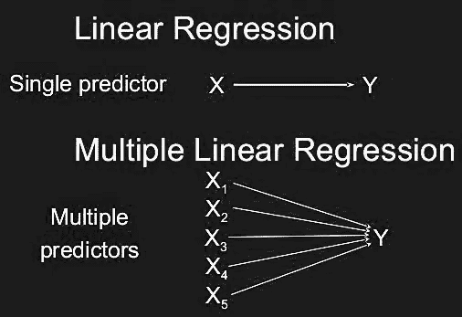
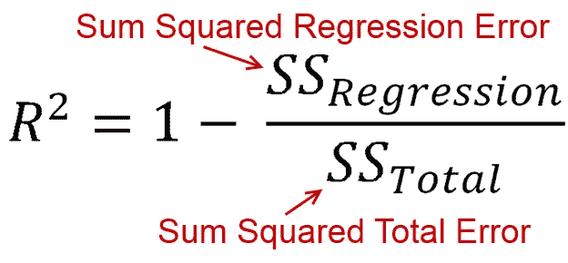
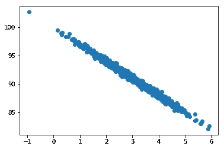
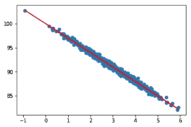

# 简化线性回归

> 原文：<https://medium.com/codex/linear-regression-simplified-386de63c5bd7?source=collection_archive---------12----------------------->


## 线性回归:用一条直线拟合一组观察值。

就是这样。

这是回归分析最简单的形式

**例子**

我测量了一群人，这些人的两个特征是他们的体重和高水平。

*明确 x 轴上的权重和 y 轴上的高等级。*

绘制人们的**体重与身高的对比图。**和我看到的有线性关系。



我给它画一条直线怎么样？我可以用那条线来 ***预测新的值*** 。

您正在创建一条线，以根据过去的观测值预测新值，时间向后推移。

# 为什么叫回归？

所以回归分析没有什么特别“回归”的。这只是对弗朗西斯·高尔顿的误解。欲知更多有趣的阴谋，请阅读其起源:

[*https://blog . minitab . com/en/statistics-and-quality-data-analysis/so-why-it-called-regression-anyway*](https://blog.minitab.com/en/statistics-and-quality-data-analysis/so-why-is-it-called-regression-anyway)*。*


# 线性回归是如何工作的？

在内部，它使用了一种叫做**最小二乘法**的技术

它的工作方式是试图*最小化每个点和直线之间的平方误差*。误差就是每个点和你的直线之间的距离。

斜率就是两个变量的相关性乘以 y 方向的标准差，再除以 x 方向的标准差。



请记住，最小二乘法可以最小化从每个点到直线的误差平方和。考虑线性回归的另一种方式是，定义一条线，代表观察线的最大可能性。所以，人们有时称之为最大似然估计。

如果你听到有人谈论**最大似然估计，**他们实际上是在谈论回归。

# 线性回归的类型

1.  **简单线性回归:**找出**单个自变量**(输入)和**一个对应因变量(输出)之间的关系。**
2.  **多元线性回归:**寻找 **2 个或 2 个以上自变量(输入)**与对应因变量(输出)之间的关系。



# 用 R 平方测量效率

r 平方也被称为决定系数。它是你的模型捕捉到的 y 总变化的一部分。



解释 r 平方的方法，你会得到一个范围从 0 到 1 的值。

*   0(零)意味着你的拟合很差，它没有捕捉到你的数据中的任何变化。
*   *1(一)是一个完美的拟合，所以你的数据中的所有变化都被这条线捕获。*

所以低的 r 平方值意味着不适合；高 r 平方值意味着它是一个很好的拟合。

您可以使用 r 平方作为给定回归对一组数据点有多好的定量度量，然后使用它来选择最适合您的数据的模型。

> ***“梯度衡量的是如果你稍微改变输入，函数的输出会改变多少。”—莱克斯·弗里德曼(麻省理工)***

# 关于线性回归的 Python 实践示例

让我们以一些数据为例，这些数据显示了页面速度和购买量之间的大致线性关系:

```
%matplotlib inline
import numpy as np
from pylab import *pageSpeeds = np.random.normal(3.0, 1.0, 1000)purchaseAmount = 100 - (pageSpeeds + np.random.normal(0, 0.1, 1000)) * 3scatter(pageSpeeds, purchaseAmount)
```

输出:



所以你可以看到*绝对是线性关系。*

因为我们只有两个特性，所以我们可以保持简单，只使用*scipy . state . Lin regression*:

```
from scipy import statsslope, intercept, r_value, p_value, std_err = stats.linregress(pageSpeeds, purchaseAmount)
```

毫不奇怪，我们的 R 平方值显示了非常好的拟合:

让我们使用从回归中得到的斜率和截距来绘制预测值**和观察值**:

```
import matplotlib.pyplot as pltdef predict(x):
    return slope * x + interceptfitLine = predict(pageSpeeds)plt.scatter(pageSpeeds, purchaseAmount)
plt.plot(pageSpeeds, fitLine, c='r')plt.show()
```

输出:



感谢你阅读这篇文章，我希望你喜欢并且今天学到了一些新的东西。如果您有任何问题，请随时通过我的博客联系我，我将非常乐意帮助您。

保持安全和愉快的学习！