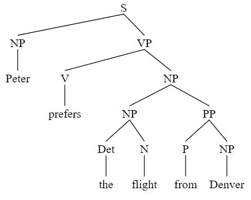
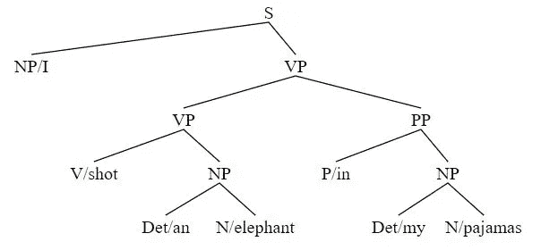
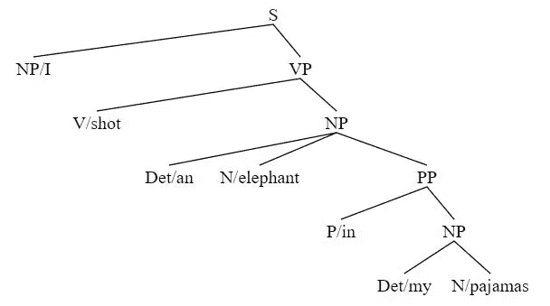

# Python 语言建模技术

> 原文：<https://medium.com/codex/linguistic-modelling-techniques-with-python-de3baf4bb752?source=collection_archive---------2----------------------->


爱德华·乔佩蒂亚在 [Unsplash](https://unsplash.com?utm_source=medium&utm_medium=referral) 上拍摄的照片

## 什么是语言建模？

语言建模是一种系统或模型，可以处理语言输入，并给出类似于人类语言处理输出的东西。

*   找到一些语言数据(例如语料库数据)
*   发展一些假设
*   测试假设。

## 为什么我们需要语言模型？

简单来说，一些基本原因是:

*   更容易识别特定的分析。
*   我们可以找出它的预测，排除替代分析。
*   形式理论可以由计算机处理。

语言建模中还包括一些常用术语。

**句法:**在语言学中，句法是指某种特定语言中定义句子结构的一些规则。它包括语序、语法、层次结构、一致、次范畴化。

**短语结构:**当单词的组合形成一个短语时，可以定义短语结构。可以是名词短语(NP)、动词短语(VP)、介词短语(PP)等。

**选区&依存:**选区由单词或单词序列组成。依赖是指一个单词依赖于另一个单词。例如，限定词(DT)和形容词(ADJ)可以依赖于名词(N)。

**句法分析:**句法分析向我们展示了单词或记号之间的联系。这是通过某种计算算法完成的。将讨论 Python 的一些自然语言处理(NLP)包用于语法分析。

由于相同单词的不同句子结构可以产生不同的含义，句法分析可以帮助理解文本。

## 词性标注

众所周知，词性标注是语言建模的第一个核心部分。这可以通过以下两个简单的步骤来实现:

*   通过识别标点符号将文本分割成句子。
*   标记化:在单词边界分割句子。

**单词的词类或词汇类别**

*   实词(公开课):名词、动词、形容词、副词
*   虚词(封闭类):限定词、代词、形容词、连词、虚拟语气

根据单词的形式，不同的单词可以归入不同的词性类别。

## 使用自然语言处理工具进行词性标注

这里，我们将在 NLTK 包的帮助下使用 python 编程在给定的句子中进行词性标注。

```
# import of nltk
import nltk# some further components for segementation, tokenization
nltk.download('punkt')
nltk.download('averaged_perceptron_tagger')# download the universal tagset
nltk.download('universal_tagset')# import the word_tokenize class
from nltk.tokenize import word_tokenize# apply the word-tokenizer to a text string and find the POS tagnltk.pos_tag(word_tokenize("In the present study, we examine the outcomes of such a period of no exposure on the neurocognition of L2 grammar:"), tagset='universal')
```

## 短语结构语法

在不改变句子意思的情况下替换一系列单词。并且该单词序列将被认为是一个成分。一些基本规则是:

*   NP -> DET N
*   VP -> V NP
*   S -> NP VP

一些具体规则:

*   NP -> (Det)(AdjP+) N
*   NP -> NP (PP+)
*   NP -> PP CP
*   AdjP-->(AdvP)Adj
*   AdvP-->(AdvP)Adv
*   PP -> P NP
*   VP -> V
*   VP -> (AdvP+) V (AdvP+)
*   VP->(AdvP+)V(NP)(NP)(AdvP+)(PP+)(AdvP+)

“+”号表示一次或多次出现。

## 绘制语法树

为了绘制句子结构的语法树，遵循自底向上的方法。这些步骤是:

*   为一个句子中的所有单词分配词性标签。
*   找到短语
*   反向构建树。
*   用规则检查树。

例如，下面给出了以下句子的语法树:*彼得更喜欢丹佛*的航班:

```
Peter -> NP
prefers -> V
the -> Det
flight -> N
from -> P
Denver -> NP
NP -> Det N
NP -> NP PP
PP -> P NP
VP -> V NP
S -> NP VP
```

使用 NLTK 检查解决方案:

```
import nltk
from nltk import Production, CFG# grammar
cgrammar = nltk.CFG.fromstring("""
S -> NP VP
VP -> V NP
PP -> P NP
NP -> NP PP | Det N | 'Peter' | 'Denver'
V -> 'prefers'
P -> 'from'
N -> 'flight'
Det -> 'the'
""")# print grammar
print(cgrammar, '\n')sent = ['Peter', 'prefers', 'the', 'flight', 'from', 'Denver']# Using Chart Parser
cparser = nltk.ChartParser(cgrammar)for tree in cparser.parse(sent):
  print(tree)# drawing trees
import svgling
svgling.draw_tree(tree)
```



语法树的输出

## 模糊语法

不同类型的歧义可以出现在一个句子中。比如:

*   词汇歧义
*   词性歧义
*   结构歧义
*   依恋歧义
*   配位歧义

NLTK 可以用来检测两个不同的歧义句子树。这里的句子*我射杀了一只穿着睡衣的大象*被用来证明这种歧义。

```
import nltka_grammar = nltk.CFG.fromstring("""
S -> NP VP
PP -> P NP
NP -> Det N | Det N PP | 'I'
VP -> V NP | VP PP
Det -> 'an' | 'my'
N -> 'elephant' | 'pajamas'
V -> 'shot'
P -> 'in'
""")sent = ['I', 'shot', 'an', 'elephant', 'in', 'my', 'pajamas']parser = nltk.ChartParser(a_grammar)for tree in parser.parse(sent):
  print(tree)
```

产出是:

```
(S
 (NP I)
 (VP
  (VP (V shot) (NP (Det an) (N elephant)))
  (PP (P in) (NP (Det my) (N pajamas)))))(S
 (NP I)
 (VP
  (V shot)
  (NP (Det an) (N elephant) (PP (P in) (NP (Det my) (N pajamas))))))
```

要绘制树:

```
import os
import svgling
from nltk.tree import Tree
from nltk.draw.tree import TreeView# using the string format
t1 = Tree.fromstring('(S(NP/I)(VP(VP(V/shot)(NP(Det/an)(N/elephant)))(PP(P/in)(NP(Det/my)(N/pajamas)))))')svgling.draw_tree(t1)
```



第一棵树的输出

```
t2 = Tree.fromstring('(S(NP/I)(VP(V/shot)(NP(Det/an)(N/elephant)(PP(P/in)(NP(Det/my)(N/pajamas))))))')svgling.draw_tree(t2)
```



第二棵树的输出

## 上下文无关文法

上下文无关语法是在像英语这样的自然语言中建模成分结构的最广泛使用的形式系统，例如，它们也被称为短语结构语法。

以下是句子的上下文无关语法的规则生成:

*   *男人写了一封信，女孩买了一件礼物。*
*   祖母烤了一个蛋糕和一个面包。

```
S -> S CONJ S | NP VP
NP -> Det N | NP CONJ NP
VP -> V NP
Det -> "the" | "a"
N -> "man" | "letter" | "girl" | "present" | "grandmother" | "cake" | "bread"
V -> "wrote" | "bought" | "baked"
CONJ -> "and"
```

## 解析 CFG

有两种方法可以从给定的语法中解析字符串。

*   自上而下
*   自下而上

在自上而下的方法中，我们从 S 开始，逐步推导出句子。另一方面，我们从句子开始，通过使用自底向上方法中的逆向归约方式来得到 S。

**Shift Reduce 解析器:**Shift Reduce 解析器在 NLTK 中实现，类似于自底向上的解析器。它分两步工作。它移动堆栈中的一个输入，并用一个单独的项替换顶部的项。它将继续下去，直到找到 s 为止。Shift Reduce 解析器的局限性是它不能解析一个有歧义的句子。

```
import nltk
from nltk import CFGgrammar = nltk.CFG.fromstring("""
S -> S CONJ S | NP VP
NP -> Det N | NP CONJ NP
VP -> V NP
Det -> "the" | "a"
N -> "man" | "letter" | "girl" | "present" | "grandmother" | "cake" | "bread"
V -> "wrote" | "bought" | "baked"
CONJ -> "and"
""")sr_parser = nltk.ShiftReduceParser(grammar, trace=2)sent1 = 'the man wrote a letter and the girl bought a present'.split()sent2 = 'the grandmother baked a cake and a bread'.split()print('sent1:')for tree in sr_parser.parse(sent1):
  print(tree)print('sent2:')for tree in sr_parser.parse(sent2):
  print(tree)
```

如果我们运行上面的代码，我们将看到解析器能够完美地解析第一句话。但是它不能解析第二个句子，因为它是一个歧义句。它不能回头去寻找替代的解决方案。在找到 NP 和 VP 之后，它简单地简化为 S，而不是找到其他的可能性。

为了克服这个问题，可以使用**图表解析器**。

```
import nltk
from nltk import CFGgrammar = nltk.CFG.fromstring("""
S -> S CONJ S | NP VP
NP -> Det N | NP CONJ NP
VP -> V NP
Det -> "the" | "a"
N -> "man" | "letter" | "girl" | "present" | "grandmother" | "cake" | "bread"
V -> "wrote" | "bought" | "baked"
CONJ -> "and"
""")chart_parser = nltk.BottomUpChartParser(grammar, trace=2)sent1 = 'the man wrote a letter and the girl bought a present'.split()sent2 = 'the grandmother baked a cake and a bread'.split()print('sent1:')for tree in chart_parser.parse(sent1):
  print(tree)print('sent2:')for tree in chart_parser.parse(sent2):
  print(tree)
```

## 概率分析

概率解析是另一种克服多重解析造成的歧义的方法。这与 CFG 非常相似，只是每个规则都有一个概率。特定短语(名词短语、动词短语等)的总概率。)必须是 1.0。

NLTK 中定义了两种 PCFGs(概率 CFG)算法。维特比 PCFG 分析器以更高的概率考虑结果。内部图表解析器显示不同概率的所有结果。

NLTK 中已经定义了一些 PCFGs。我们可以很容易地装载它们。

```
from nltk.grammar import PCFG, induce_pcfg, toy_pcfg1, toy_pcfg2# Printing toy PCFG that is already in NLTK
print(toy_pcfg1)# Viterbi Parser
from nltk.parse import ViterbiParsertokens = "I saw the man with the telescope".split()viterbi_parser = nltk.ViterbiParser(toy_pcfg1, trace=2)for tree in viterbi_parser.parse(tokens):
  print('Viterbi Parser:',tree)# Inside Chart Parser with queue ordering
from nltk.parse import pchartinch_parser = nltk.InsideChartParser(toy_pcfg1, trace=2)for tree in inch_parser.parse(tokens):
  print('InsideChartParser:',tree)
```

我们也可以创建自己的光子晶体光纤。我们只需要使用 nltk。PCFG.fromstring()的功能类似于我们使用 nltk 的方式。CFG.fromstring()。唯一的区别是这次语法会有一个概率。改变概率也会改变解析结果。

## 依存句法分析

这个概念背后的主要思想是，在一个句子中总是有一些依赖和独立的成分。例如，名词可以优于限定词或形容词。JetBlue 取消了我们今天早上已经晚点的航班。

```
from nltk.grammar import DependencyGrammar
from nltk.parse import NonprojectiveDependencyParsergrammar = DependencyGrammar.fromstring("""
'canceled' -> 'JetBlue' | 'flight' | 'morning'
'flight' -> 'our' | 'was'
'morning' -> 'this'
'was' -> 'which' | 'late'
'late' -> 'already'
""")# initialize Parser
dp = NonprojectiveDependencyParser(grammar)# parse sequence of words
g, = dp.parse(['JetBlue', 'canceled', 'our', 'flight', 'this', 'morning', 'which', 'was', 'already', 'late'])# print root element
print('Root: ', g.root['word'], '\n')# traverse tree and print dependents
for _, node in sorted(g.nodes.items()):
  if node['word'] is not None:
    print('{address} {word}: {d}'.format(d=node['deps'][''],**node))# print tree
print('\n Tree: \n',g.tree())
```

## 为什么解析很重要？

由于句法分析的任务是根据句子的语法找到句子的正确表示，因此它可以用于处理或生成句子结构的正确性。

一个常见的 NLP 任务是确定句子中正确的词性。例如，我们认为这两句话“*睡眠应保持*”和“*我们睡得早*”。

单词“ *sleeping* ”在第一句中是名词，但在第二句中是动词。为了确定正确的词性标签，可以使用句法分析，例如短语结构分析和依存性分析。这种解析可以确定单词之间的正确关系，从而确定正确的词性。