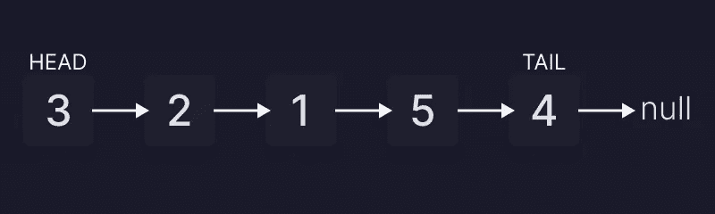
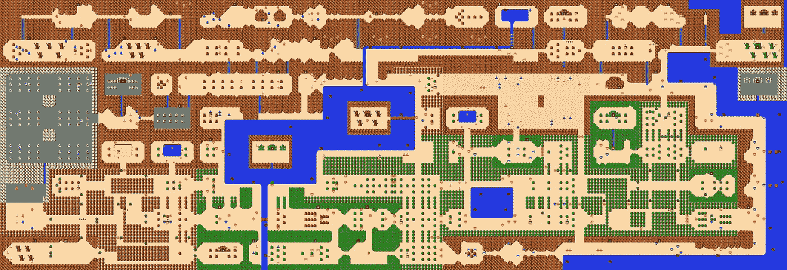

# 链表

> 原文：<https://medium.com/codex/linked-list-fa0eba0f4c0f?source=collection_archive---------7----------------------->


链接……任天堂的链接财产

在计算机科学中，数据结构是一个复杂的话题，在课堂上、训练营中谈论起来可能会很乏味，在技术面试中甚至会更有压力。毕竟，了解我们的代码将如何与我们的数据一起工作是至关重要的。我想这就是为什么他们称我们为软件工程师。

我们管理、组织和存储数据，这是对数据结构的描述。但更确切的含义是，[数据结构](https://dl.acm.org/doi/10.5555/1074100.1074312)是数据值、它们之间的关系以及可应用于数据的功能或操作的集合。现在我们知道了数据结构的百科含义，我们来谈谈其中的一种结构，链表。

[链表](https://www.30secondsofcode.org/articles/s/js-data-structures-linked-list)是一种线性数据结构，表示元素的集合，其中每个元素指向下一个元素。链表中的第一个元素是头，最后一个元素是尾。想象一下玩第一款《塞尔达传说》游戏，每个地牢都是不同的元素。没有支线任务，没有很多秘密要揭开，只是大约 8 个小时的游戏线性方法。这就是链表的工作方式，指针移动到下一个元素。第一个元素是头，最后一个元素是尾。



链接列表图形



想象一下给这张地图一个线性的方法。再说一次，没有支线任务。

现在我们知道了什么是链表，让我们深入研究一些编码和我们可以在链表类中实现的不同方法。

```
class Node {
  constructor(value) {
    this.value = value;
    this.next = null;
    this.prev = null
  }
}
```

首先，我们需要创建`node`类。一些编码人员更喜欢在每个方法中声明`Node`。创建`node`类，然后在`LinkedList`类的每个新方法中创建变量`const newNode = new Node(value);`，结果是一个更干净的代码。这两种方法都很好，这取决于编码者。

```
class LinkedList {
  constructor(value) {
    this.head = {
      value: value,
      next: null, 
    };
    this.tail = this.head; 
    this.length = 1;
  }
}
```

既然我们编写了`Node`类，那么让我们继续并开始处理`LinkedList`类。在这个类中，我们用`value`和`next`声明头部。接下来是`tail`，也就是`head`。我们将完成`LinkedList`类，声明`length`将从 1 开始。

```
append(value) {
    const newNode = new Node(value);
    this.tail.next = newNode; 
    this.tail = newNode; 
    this.length++;
    return this;
}
```

在创建包含一些元素的链表之前，我们需要添加一个附加值。我们正在创建的结构需要它的`head`和`tail`。首先，`newNode`将一辆新的`Node`载着`value`作为论据。`this.tail.next`和`this.tail`都会是`newNode`。在将两者都声明为`newNode`之后，我们增加长度，返回这个。

**注:**如有需要，请参考本[文档](https://developer.mozilla.org/en-US/docs/Web/JavaScript/Reference/Operators/this)中关于`this`操作员的内容。

现在，让我们创建链表，值将是 Link 和他的公主 Zelda。

首先，让我们创建`myLinkedList`变量，用一个包含值链接的字符串。

```
let myLinkedList = new LinkedList(“Link”);
```

现在，让我们通过添加塞尔达来用方法`append`调用它。

```
myLinkedList.append("Zelda");//output:
LinkedList {
  head: { value: 'Link', next: { value: 'Zelda', next: null } },
  tail: { value: 'Zelda', next: null },
  length: 2
```

添加了`append`方法后，我们来学习如何做`prepend`方法，并将其添加到我们的类中。

```
prepend(value) {
    const newNode = new Node(value);
    newNode.next = this.head;
    this.head = newNode;
    this.length++;
    return this 
}
```

您可能已经注意到了，`prepend`方法与`append`非常相似。不同之处在于`newNode.next`是`this.head`而`this.head`是`newNode`。

```
myLinkedList.prepend("Ganon");//output:
LinkedList {
  head: { value: 'Ganon', next: { value: 'Link', next: [Object] } },
  tail: { value: 'Zelda', next: null },
  length: 3
}
```

每个电子游戏都需要一个反派，所以让我们把加农放在名单的前面。

```
printList() {
    const array = [];
    let currentNode = this.head;
    while(currentNode !== null){
        array.push(currentNode.value)
        currentNode = currentNode.next
    }
    return array;
}
```

插入方法是所有方法中最复杂的。所以让我们休息一下，创造一些更简单的东西。方法将创建一个数组来显示链表中所有的值。

```
myLinkedList.printList()output:
[ 'Ganon', 'Link', 'Zelda' ]
```

好了，现在我们深吸一口气，该做插入方法了。

```
insert(index, value) {
    if (index >= this.length) {
      return this.append(value);
    }
    if (index === 0) {
      this.prepend(value);
      return this.printList();
    }
    const newNode = new Node(value);
    const leader = this.traverseToIndex(index - 1)
    const holdingPointer = leader.next;
    leader.next = newNode;
    newNode.next = holdingPointer;
    this.length++;
    return this.printList();
}
traverseToIndex(index) {
    let counter = 0;
    let currentNode = this.head;
    while (counter !== index) {
      currentNode = currentNode.next;
      counter++
    }
    return currentNode;
}
```


如前所述，这个变得复杂了。我将列举这些步骤，因为在这种方法中有许多要展开的内容。

1.  声明两个参数，我们将放置新值的索引和我们将添加的值。
2.  如果新添加的索引号大于或等于索引长度，则为新值`append`，如果新添加的索引号等于`0`，则为`prepend`的条件语句。如果没有这些语句，代码在这两种情况下都会中断。
3.  我们还创建了方法`traverseToIndex`(记住基础知识，计算机索引从数字`0`开始，而不是像人类计数一样从数字`1`开始)。
4.  我们以与前面方法相同的方式添加了一个新节点，并且还创建了一个`leader`，它将是从`1`和`holdingPointer`中减去的索引，T5 将紧挨着`leader`。
5.  `leader.next`将是`newNode`，`newNode.next`将是`holdingPointer`，索引长度递增，我们将使用方法`printList`返回。

有很多东西需要理解，但是不要担心，重复是理解的关键。我们继续，最后通过添加其他人来调用它。

```
myLinkedList.insert(2, "Luigi");//output:
[ 'Ganon', 'Link', 'Luigi', 'Zelda' ]
```

看看谁来了。似乎 Luigi 厌倦了生活在他哥哥的阴影下或者害怕闹鬼的房子。他的绿色衣服很容易隐藏在林克或任何绿色灌木后面，以免被海露尔发现。既然这不是 Super Smash Bros，那我们就把他从名单里剔除，送他回他该去的蘑菇王国吧。


对不起，路易吉，回你的豪宅去吧。

```
remove(index) {
    const leader = this.traverseToIndex(index-1);
    const unwantedNode = leader.next;
    leader.next = unwantedNode.next; 
    this.length--; 
    return this.printList();
}
```

移除方法将包括`leader`减去`1`的索引，`unwantedNode`为`leader.next`，`leader.next`为`unwantedNode`。当您编写自己的链表时，您会注意到与其他方法有很多相似之处，其他类似的代码行都是递减索引长度，而不是递增并通过使用`printList`方法返回结果来查看更简单的数组。

```
myLinkedList.remove(2);output//
[ 'Ganon', 'Link', 'Zelda' ]
```

我们使用索引`2`运行 remove 方法，Luigi 从索引`2`中消失。

**注:**我们可以随时`console.log(myLinkedList)`以便知道整个列表是什么样子的。

以下是完整代码，供您参考:

所以我们有它，这是很多，但它值得努力。记得练习，阅读，寻找更多的参考资料，如果你被要求创建一个链表，拿出你最好的一面。


不久，我将解释如何创建一个双向链表。

编码快乐！

# 总结:

1.  数据结构介绍
2.  什么是链表
3.  用一个附加类对整个链表类进行编码，以创建节点和以下方法:
4.  附加
5.  预先考虑
6.  插入
7.  返回一个数组
8.  遍历到索引
9.  去除

# 参考资料:

1.  [数据结构](https://dl.acm.org/doi/10.5555/1074100.1074312)，1987。Horowitz 和 s . Sahni，*Pascal 语言的数据结构基础*，第二版。马里兰州洛克维尔:计算机科学出版社。
2.  30 秒代码，[链表](https://www.30secondsofcode.org/articles/s/js-data-structures-linked-list)
3.  MDN 网络文档，[本](https://developer.mozilla.org/en-US/docs/Web/JavaScript/Reference/Operators/this)