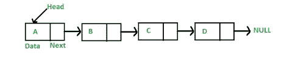

# C++中链表的实现

> 原文：<https://medium.com/codex/linked-list-implementation-in-c-287a50ced9b6?source=collection_archive---------7----------------------->


照片由 [JJ 英](https://unsplash.com/@jjying?utm_source=medium&utm_medium=referral)在 [Unsplash](https://unsplash.com?utm_source=medium&utm_medium=referral)



https://www.geeksforgeeks.org/data-structures/linked-list/图片由[提供](https://www.geeksforgeeks.org/data-structures/linked-list/)

链表是一种数据结构，它通过指向下一个元素的指针来连接元素。每个节点实际上都由这两样东西组成，数据本身和指针。

现在我们已经定义了内部节点结构，我们需要创建一个模板 LinkedList 类。与我们将声明保存在头文件中并将定义保存在 cpp 文件中的常见做法不同，在模板中，编译器需要实例化不同版本的代码。它实际上是为我们使用的每种类型生成一个新的类。因此，定义应该保存在头文件中，或者为我们需要的每种类型显式实例化。对于这个实现，我们将做第一个。

当构建 LinkedList 时，我们保存一个指向第一个节点的 head 指针来标识第一个元素。因为 push_back 函数在列表容器的末尾添加了一个新元素，所以我们需要遍历所有的元素，直到到达最后一个元素并放入新的条目。

现在让我们创建迭代器。迭代器只不过是链表类中的一个内部结构，它包含一个指向节点的指针和一些操作符重载。将一个元素与另一个元素进行比较或返回 operator*上的数据。对于更多的初级开发人员来说，当一切都放在一起时，它可能会更有意义。

这将使我们能够浏览容器中的内容。下面使用 begin() the end() the not equals(！=)运算符、前缀递增(+i)和取消引用*i 来获得元素的实际值。如果不使用迭代器，这是不可能的。

接下来，我们将添加擦除功能，并对其进行一些测试。尽管 std::list 是由一个双向链表组成的，而我们的是一个单向链表，我们还是会尽量让它接近 std::list。因此，正如标题中所定义的，erase 函数有两个重载。

```
iterator erase (const_iterator position);
iterator erase (const_iterator first, const_iterator last);
```

一个函数接受一个迭代器并删除该元素，同时返回被函数调用删除的最后一个元素之后的元素，另一个函数删除两个迭代器指定的范围。

先说第一个。有三种情况。在第一种情况下，也就是说，我们删除只有一个节点的链表中的第一个元素，我们应该确保将头节点标记为 nullptr，并删除分配给该节点的内存。在第二种情况下，我们删除 linkedlist 中有更多节点的第一个元素，我们应该确保将头连接到第二个节点。最后但同样重要的是，在最后一种情况下，我们删除了中间的某个元素，甚至是最后一个元素。在这种情况下，我们应该确保我们保留了一个先前的迭代器，这样我们就可以将这个节点的下一个连接到即将被删除的节点的下一个。

接下来，我们应该添加一些测试。这一次我使用了 Google C++测试框架。要安装，请在您的 Linux 机器上键入以下内容。

添加您需要做的测试。对于 push_back 函数，我们只是添加几个节点，并确保一切如预期的那样。对于擦除测试，我们将测试这三种情况中的每一种，并确保所有内容都按照预期被擦除。我们应该增加对不同类型的测试，并尝试用 nullptr 迭代器进行擦除。

最后，相应地更新主函数并创建一个 CMakeLists.txt 文件

执行下面的命令运行所有的 g++测试。

虽然本文没有完全解释所有的内容，但是已经给出了基本指南，您应该能够理解项目的其余部分。请随时提问或在评论区给出反馈。

完整的项目在 GitHub[https://github.com/nikkaramessinis/LinkedList](https://github.com/nikkaramessinis/LinkedList)上

如果你喜欢的内容，请考虑以下。对于任何更正或补充，您可以[创建一个新问题](https://github.com/nikkaramessinis/LinkedList/issues/new)或通过发送一个[拉动请求](https://github.com/nikkaramessinis/LinkedList/pulls)与您的改进一起为项目做出贡献。