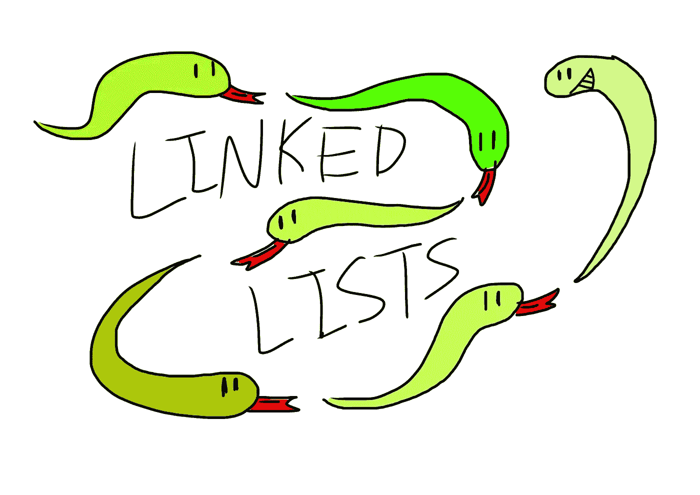

# 为初学者讲解的链表+基本操作

> 原文：<https://medium.com/codex/linked-lists-explained-for-beginners-basic-operations-dc841d2e4c45?source=collection_archive---------9----------------------->

一旦你对 Python 的基础有所掌握，你就可以进入数据结构和算法的世界了。我的许多学生很难掌握的一种数据结构是链表。在本文中，我希望尽可能简单地解释链表，并提供关于如何在链表中进行一些基本操作的见解。