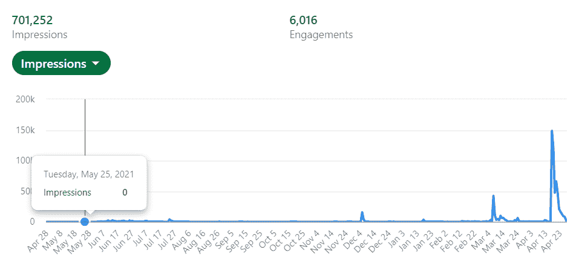

# LinkedIn Analytics:一个数据故事@withsaikat

> 原文：<https://medium.com/codex/linkedin-analytics-a-data-story-withsaikat-6bdc9420bbe5?source=collection_archive---------14----------------------->

## 数据工程 101

## 数据可以揭开许多秘密:你需要做的就是观察

我坚信数据真的可以帮助揭开很多谜团。同样的信念让人们查询他们的数据，试图找到价值。同样的价值让数据科学成为本世纪最性感的工作。

> 然而，人们很快意识到，在试图理解数据之前，他们需要提高数据的质量。因此，最近数据工程师的招聘趋势。

现在，一旦数据工程师为您提供了高质量的数据，您仍然需要等待，直到数据科学家能够实际构建一个模型来自动交付价值。然而，在此期间，数据分析师的角色变得至关重要。

在这个阶段，分析师可以帮助您理解数据，并让您了解不同参数的表现。

对于数据分析师来说，他/她能够清晰地表达研究结果是很重要的。那么只有领导层能够做出正确的决定。对于小企业来说，这是跟踪和衡量进展的方法。

我用同样的原则来理解我的内容做得如何。在过去的 2-3 个月里，我一直在尝试写我作为一名数据工程师的经历。我还创建了一些内容来帮助早期专业人员和学生迁移到数据工程领域。

当 LinkedIn 宣布新的分析功能时，这提供了一个很好的方法来轻松分析我在 LinkedIn 上的表现。我可以利用结果进行调查，了解哪些有效，哪些无效。

这篇文章将带你通过同样的分析，并试图找出他们讲述的故事，他们帮助解开的见解。

**如何找到写作的思路？**

我进行了一项民意调查，以了解人们在开始成为数据工程师时面临的挑战。结果很有启发性。Benjamin Rogojan 在 Youtube 上做了一个类似的调查。结果是相似的。

**投票结果:**

正如你在上面的调查中看到的，大多数人都面临着挑战，没有一个清晰的路线图，不知道如何学习和如何成为一名数据工程师。这是一个需要解决的明显差距。这并不是说互联网上没有路线图，但仍有许多人有这种感觉。

因此，我创建了一个简明而全面的路线图和学习计划。由于这解决了一个真正的痛点，这个帖子和路线图真的像病毒一样传播开来。仅在 LinkedIn 上就已经有超过 50 万人，在其他平台上甚至更多。

 [## LinkedIn 上的 Saikat Dutta 数据工程#数据工程师#数据科学| 171 条评论

### 我如何开始我的数据工程师职业生涯？在 LinkedIn 上，我经常被问到这个问题。我收到多个 DM…

www.linkedin.com](https://www.linkedin.com/feed/update/urn:li:activity:6921326000622497792) 

**解决一个问题，它就会变得流行。**

看高峰，讲的是印象怎么突然增加的。因为，我上面提到的帖子解决了一个真正的问题，它联系了很多人。

**永不松懈的专注:**

病毒式的帖子不是一天造成的。人们会因为你的一次成功而注意到你，但重要的是你花了很多年去准备的努力。你会有很多年没有任何结果，但是那会教会你最终获得成功所需要的东西。

如果我们不坚持，成功永远不会到来。看上面的结果，全年几乎持平，但最终导致了巨大的峰值。

现在让我们来看看我是否达到了听众的目标。我想通过我的帖子接触到以下人群:

1.  年轻的 IT 专业人士
2.  有抱负的数据工程师
3.  寻求发展的数据工程师。

所以，让我们来看看我的观众的人口统计数据。

44%是入门级专业人员。34%是高年级。

54%来自 IT

13%来自计算机软件

12%是数据工程师

9%是软件工程师(有志 DE？)

这三个形象化的例子很好地证实了我可能走在正确的道路上，我的内容到达了正确的受众群。

**孟加拉鲁鲁的故事:**

我从加尔各答写信，我的大部分联系也应该来自加尔各答(随着时间的推移而变化)。然而，当我查看上面的听众位置条形图时，我大吃一惊。他们中的大多数人来自本加卢鲁。

甚至个别帖子也是如此，即使是最受欢迎的帖子也有很多人从孟加拉鲁鲁访问。

> 这可能会告诉你一个故事，在不同的创业公司和更大的公司的发展方面，Bengaluru 如何落后于所有其他主要的大都市。

因此，总结我的 LinkedIn 帖子的分析数据不仅告诉我我在正确的轨道上。或许数据还告诉我，具体来说，孟加拉国和广义上的印度也在正确的轨道上发展。

基础已经打好，我们现在只能全力以赴了。我确信下一个十年将再次属于印度，因为我们将看到大量的增长。Bengaluru 肯定会暴跳如雷。

如果你想阅读更多这样的数据故事，请考虑订阅时事通讯。

如果你是一名学生，希望以数据工程师或初级/高级专业人员的身份开始你的职业生涯，希望提高数据工程的技能并讨论它的不同方面，请在 LinkedIn 或 Medium [上关注我这里](/@withsaikat)，如果你愿意，你可以下载免费的[数据工程路线图](https://withsaikatdt.gumroad.com/l/DE2022)学习计划。这是免费的，但是如果你想的话，你可以在下载的时候给我买杯咖啡。