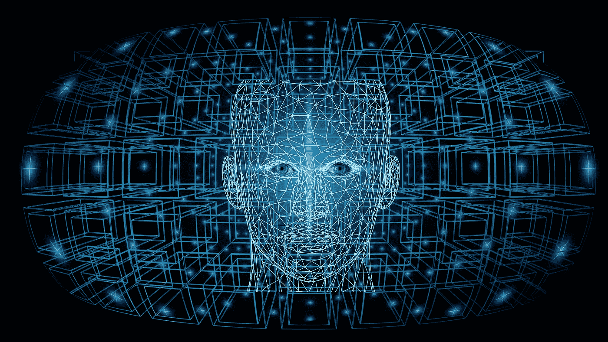

# 根据研究，LinkedIn 充斥着人工智能生成的虚假个人资料

> 原文：<https://medium.com/codex/linkedin-is-inundated-with-fake-ai-generated-profiles-according-to-research-356882fdbc30?source=collection_archive---------11----------------------->

## 公司可能会在网上广泛撒网，而不加强自己的销售人员，或者通过使用虚假资料来超越 LinkedIn 的信息限制。

图片:[https://pix abay . com/插图/人工智能-区块链-4115193/](https://pixabay.com/illustrations/artificial-intelligence-blockchain-4115193/)