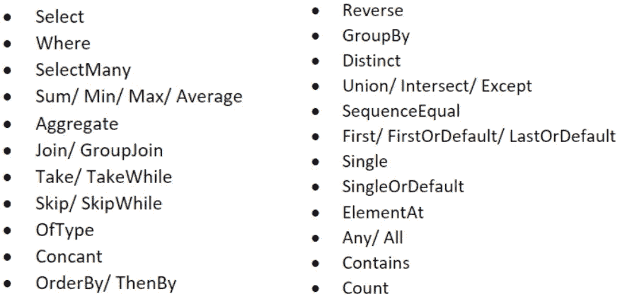
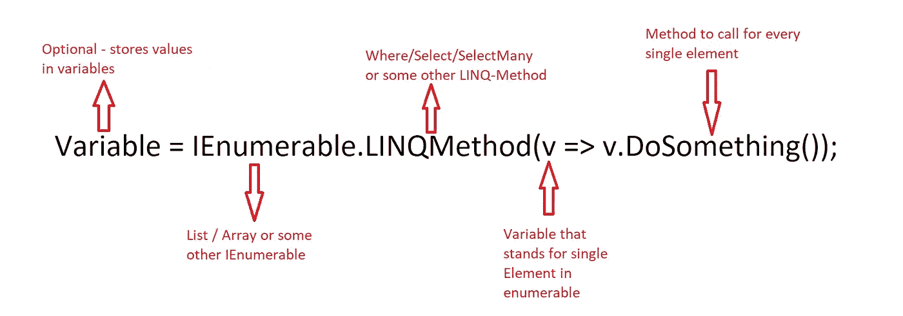

# LINQ——如何避免 C#中的嵌套循环

> 原文：<https://medium.com/codex/linq-how-to-avoid-nested-loops-in-c-ed4ae19886e4?source=collection_archive---------2----------------------->

编写代码可能非常令人兴奋，但如果您的代码是基于嵌套循环的，也会非常令人沮丧。迭代仍然是编码中最重要的部分之一。那么我们如何避免在代码中使用难看的嵌套循环呢？

[https://unsplash.com/photos/9-dkDEXWGzI](https://unsplash.com/photos/9-dkDEXWGzI)

# LINQ —语言综合查询

微软语言开发人员提供了一种直接用他们的语言表达查询的方法。LINQ 通过添加类似于 SQL 查询的查询表达式扩展了该语言。

**LINQ 语法通常不如 foreach 循环**有效。在使用 LINQ 时，最好能意识到任何可能发生的性能折衷。另一方面，这是提高代码可读性的最有效的方法。

# 使用 LINQ 的好处

*   **开发者可以在不了解新技术的情况下接触到它们**
*   LINQ 提供了一种基于对象的、语言集成的方式来查询数据，不管数据来自哪里。所以通过 LINQ，我们可以查询数据库、XML 以及集合。
*   **用更少的代码创建完整的应用**
*   **用更少的时间和更少的错误开发应用**
*   **组合数据源，无需借助奇怪的编程技巧**
*   **让新开发人员更快地工作**
*   **编译时语法检查**
*   **允许您使用应用程序的本地语言(如 VB 或 C#)查询数组、可枚举类等集合，就像使用 SQL 查询数据库一样**

> “也许 LINQ 最重要的方面，也是我希望其他 API 设计者采纳的方面，就是复杂的查询是如何由许多小构件构建而成的。它的特别之处在于，应用每个构建块的结果不会因为您之后对它做的任何事情而改变。
> 
> 当然，LINQ 没有强制不变性——你可以从一个可变列表开始，并在任何时候改变它的内容，例如，或者改变其中引用的一个对象的属性，或者传入一个有副作用的委托——但是 *LINQ 本身*不会引入副作用。"(双向飞碟，2018 年 3 月)

# 方法:

# 使用索引循环

使用 LINQ 最常见的错误之一是，开发人员认为不可能替换基于索引调用方法的 for 循环。这里有一些例子来说明如何做。

# 使用 Linq 的嵌套循环

## 第一个例子大约有 17 行。第二个只有 3。

假设我们需要使用 EPPlus 在 Excelworksheet 中导航。使用循环访问每个单元总是非常昂贵。这里经常使用嵌套的 for-loops，占用了大量的空间，使得阅读变得复杂。让我们看看如何避免嵌套循环:

# 结论

总而言之，Linq 利大于弊。速度的损失与清晰的可读性、更快的编写速度以及基于 SQL 的语言的应用表明，使用 Linq-expressions 为开发人员提供了强大的优势。

# 更多示例:

在这里您可以找到一些其他的例子:

 [## LINQ 查询示例

### 在本节中，您将学习一些复杂的 LINQ 查询。我们将使用以下学生和标准集合…

www.tutorialsteacher.com](https://www.tutorialsteacher.com/linq/sample-linq-queries) 

# 请查看我的其他文章:

*   [。Net C# —干净的架构&依赖倒置原则](/dev-genius/net-c-clean-architecture-dependency-inversion-principle-7ea64f586c58)
*   [编程范例——简介](/dev-genius/programming-paradigms-a-very-short-brief-5324908640bd)
*   [C# —面向对象编程](/codex/c-object-oriented-programming-oop-2d92a5cd336f)
*   [c#——简单解释的单一责任](/@sebastianstreng96/c-single-responsibility-easily-explained-e3fabbf0d877)
*   [OCP——真正重要的是什么](/@sebastianstreng96/ocp-what-really-matters-610159d600dc)
*   [提高程序员积极性的 8 大技巧](/@sebastianstreng96/top-8-tips-to-improve-your-motivation-as-programmer-be63b2baaf7e)
*   [对网络的简要了解](/codex/a-brief-insight-into-networks-2171f1e9aea1)
*   [发送&接收—7 层 OSI 模型](/codex/send-receive-the-7-layer-osi-model-e475829b999)
*   [七层网络协议浅显易懂](/@sebastianstreng96/7-layer-network-protocols-easily-explained-e11e3e09f34d)

## 来源:

 [## 语言综合查询-维基百科

### 编辑描述

en.wikipedia.org](https://en.wikipedia.org/wiki/Language_Integrated_Query)  [## C#中的语言集成查询(LINQ)

### 语言集成查询(LINQ)是一组基于查询功能集成的技术的名称…

learn.microsoft.com](https://learn.microsoft.com/en-us/dotnet/csharp/linq/)  [## 老板应该知道的关于微软 LINQ 的五件事

### 你可能没听说过微软的新创意，语言集成查询(LINQ)。如果你真的听说了…

www.cio.com](https://www.cio.com/article/276569/net-five-things-the-boss-should-know-about-microsoft-s-linq.html)  [## Edulinq - Jon Skeet 的编码博客

### 我很高兴地宣布，我已经第一次把美味系列的博客文章转换成电子书了…

codeblog.jonskeet.uk](https://codeblog.jonskeet.uk/category/edulinq/)  [## C#中的 LINQ

### C#中的 LINQ 用于处理来自对象、数据集、SQL Server 和 XML 等源的数据访问。LINQ 站在…

www.c-sharpcorner.com](https://www.c-sharpcorner.com/UploadFile/72d20e/concept-of-linq-with-C-Sharp/)  [## 代码检查:循环可以转换成 LINQ 表达式| ReSharper

### 您可以抑制此检查以忽略特定问题，更改其严重性级别以使问题更少或更多…

www.jetbrains.com](https://www.jetbrains.com/help/resharper/LoopCanBeConvertedToQuery.html)