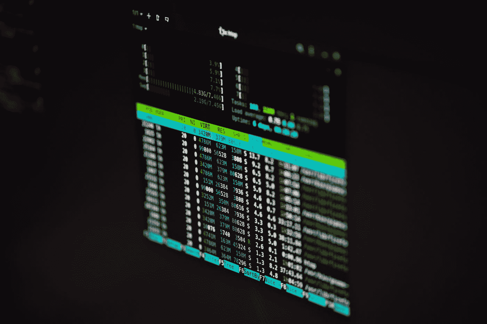

# 虚拟机枪战的 Linux 桌面环境

> 原文：<https://medium.com/codex/linux-desktop-environment-for-vm-shootout-f10f1f9d5f1c?source=collection_archive---------2----------------------->

由 [Lukas](https://unsplash.com/@lukash?utm_source=medium&utm_medium=referral) 在 [Unsplash](https://unsplash.com?utm_source=medium&utm_medium=referral) 拍摄的照片

## 我为什么需要它？

我需要为我的宠物项目开发一些环境。我通常从事小型项目，使用 JavaScript 和 Python。我最喜欢的 IDE 是 Visual Studio 代码。最好能在任何地方使用。由于我的项目并不大，它不应该是一个现代最快的电脑，有很多千兆赫和千兆字节，以及一个复杂的冷却系统，产生…