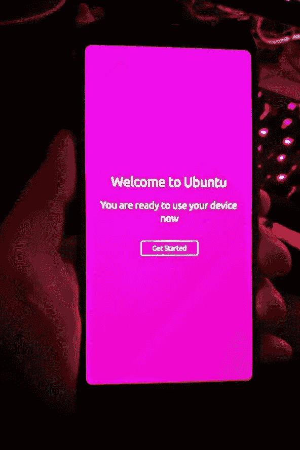

# 智能手机的 Linux

> 原文：<https://medium.com/codex/linux-for-smartphones-2eca6340f43f?source=collection_archive---------1----------------------->

## 在一个由苹果和谷歌主宰的世界里，Linux 在哪里？

当一切开始的时候

# 我做了什么？

我在易贝发现了一个很好的二手谷歌 Pixel 3a XL，并冲动购买。话虽如此，这是我的第三部手机；我有一部漂亮的三星 Galaxy 旗舰手机，工作给了我一部 iPhone 11(我只在工作中使用)。像素实际上是在优秀的…