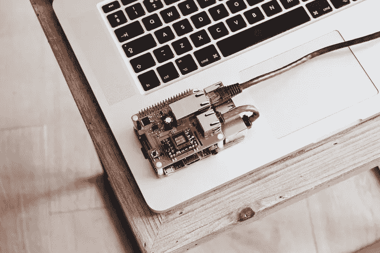

# Linux 终端命令基础

> 原文：<https://medium.com/codex/linux-terminal-commands-basics-8190798fac18?source=collection_archive---------7----------------------->

路易斯·里德的照片

最近似乎越来越多的人转向 Linux。但是在用户能够充分利用这个流行的开源操作系统之前，他们需要学习一些基本的终端命令。

这篇文章将介绍 Linux 环境中一些最常用的命令。使用 Linux，不仅可以从终端内部导航文件系统，而且用户可以…