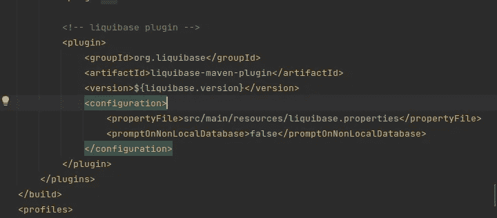

# Liquibase 教程

> 原文：<https://medium.com/codex/liquibase-tutorial-3ea08691a7a9?source=collection_archive---------2----------------------->

## 带 Liquibase 的弹簧启动应用程序:

## 简介:

有时我们需要创建一个数据库并将假数据放入其中，当运行应用程序时，我们可以使用 **SQL 命令**手动完成，但这种方式非常传统，因此我们将使用 **Liquibase 技术**来完成。

## Liquibase 一般是什么？

Liquibase 是一个开源的独立于数据库的库，用于跟踪、管理和应用数据库模式变化。

Liquibase 通过跟踪、版本控制和部署数据库更改，使您能够更快地实现流程自动化。

## **它是如何工作的？**

运行应用程序后， **Liquibase** 将在数据库中创建两个表，第一个表名为`DataBaseChangeLog` & `DataBaseChangeLogLock`每个表都有自己的工作，Liquibase 使用它来处理自己的工作。

*   `DataBaseChangeLog`:这个表将跟踪变更集，这个文件的作者是谁，这个文件的 Id 是什么，文件的位置在哪里。

下图显示了包含变更集相关信息的表


*   `DataBaseChangeLogLock`:这将确保一次只有一个 Liquibase 实例在运行，这样在迁移过程中就不会发生冲突。

下图显示了该表及其相关信息


## 怎么设置？

*   我们需要在 **POM.xml** 文件中添加下面的**依赖关系**

> 我使用版本 **4.16.1** 和最新版本的 **Liquibase** 。

```
<!-- [https://mvnrepository.com/artifact/org.liquibase/liquibase-core](https://mvnrepository.com/artifact/org.liquibase/liquibase-core) -->
<dependency>
    <groupId>org.liquibase</groupId>
    <artifactId>liquibase-core</artifactId>
    <version>{{liquibase.verion}}</version>
</dependency><!-- [https://mvnrepository.com/artifact/org.liquibase/liquibase-maven-plugin](https://mvnrepository.com/artifact/org.liquibase/liquibase-maven-plugin) -->
<dependency>
    <groupId>org.liquibase</groupId>
    <artifactId>liquibase-maven-plugin</artifactId>
    <version>{{liquibase.verion}}</version>
</dependency>
```

*   我们需要在 **POM.xml** 文件中添加下面的**插件**

```
<plugin>
   <groupId>org.liquibase</groupId>
   <artifactId>liquibase-maven-plugin</artifactId>   
   <version>${liquibase.version}</version>
   <configuration>    
      <propertyFile>${liquibase.propertyFile}</propertyFile>
      <promptOnNonLocalDatabase>false</promptOnNonLocalDatabase>    
   </configuration>
</plugin>
```

`${liquibase.propertyFile}`:我们将用 liquibase 属性文件路径替换它，如下图所示。



*   我们需要在 liquibase.properties 中填充数据，这是在项目的资源文件中定义该文件夹的公共路径。

在这个文件中，我们将定义关于数据库的信息。

`username` `databaseUrl` `password` `changeLog file location`现在我们来填充数据

```
url=${your urlPath}
username=$${your username}
password=${your password}
driver=${your data base driver} eg: org.postgresql.Driver
changeLogFiles= ${your change log file path} cahngelog_master path
```

## liquibase 中的变更日志与变更集

> 要创建变更日志和变更集，我们需要知道这些文件的含义。

*   **变更日志**

更改日志是一个 YAML 文件，我们在里面写，我们希望如何运行 liquibase 环境，以及我们希望如何在运行时排序我们的 SQL 文件

**cahnageLog.yaml 结构**

```
databaseChangeLog:
  - include:
      file: src/main/resources/db/changelog/0001/changelog.yaml
```

*   **变更集**

changeLog 文件将运行 cahngeSet 文件，cahnge set 可以是`sql` `xml` `json`并使用 changeLog 文件运行查询。

**变更集结构:**

```
--liquibase formatted sql
--changeset author:idCREATE TABLE ...INSERT QUERY ... etc ....-- rollback DROP TABLE ...;
```

**与上述结构类似**

*   在第一行，我们需要定义变更集文件的语法。
*   在第二行，我们需要定义谁是作者。
*   之后，我们将像上面的例子一样编写语法。
*   最后，我们将编写一个回滚查询。

## 我们如何一起使用变更日志和变更集文件？

第一步，为了组织我们的应用程序，我将在 resource 文件夹中创建一个名为 DB 的文件夹。

现在我们需要创建一个名为`changelog-master.yaml`的文件

*   `changelog-master.yaml`:主**文件。其中的内容，所有的日志操作符按顺序运行。使用它我们可以运行**变更日志**或**变更集**文件。**

例如`changelog-master.yaml`:

```
databaseChangeLog:
  - include:
      file: src/main/resources/db/changelog/0001/changelog.yaml
```

> **现在我们将创建另一个名为 0001 的包，我们将在其中创建文件。**

*   第一个文件叫做 **cahngelog.yaml** :

它是`0001`包的 cahgneLog 文件，也是`0001 package`的主文件。

它将使用这个顺序调用 SQL 文件。

```
databaseChangeLog:
  - include:
      file: src/main/resources/db/changelog/0001/createUserTable.sql
  - include:
      file: src/main/resources/db/changelog/0001/insertUsers.sql
```

*   第二个文件叫做`**createUserTable.Sql**`

```
--liquibase formatted sql
--changeset abed:0001-01
CREATE TABLE IF NOT EXISTS user_tb (id integer PRIMARY KEY AUTO_INCREMENT,
first_name VARCHAR(255),
last_name VARCHAR(255),
mobile_number VARCHAR(255)
);-- rollback DROP TABLE user_tb;
```

*   第三个文件叫做 **insertUsers.sql**

```
--liquibase formatted sql
--changeset abed:0001-02

INSERT INTO user_tb
(
 first_name,
 last_name,
 mobile_number
)
VALUES
    ('USER_FIRST_A','USER_LAST_A','99625541'),
    ('USER_FIRST_B','USER_LAST_B','99625511'),
    ('USER_FIRST_C','USER_LAST_C','99625555');

-- rollback DELETE FROM product WHERE first_name IN ('USER_FIRST_A', 'USER_FIRST_B', 'USER_FIRST_C');
```

我们需要更新 **application.yml** 并添加以下命令，以便在运行您的应用程序时允许 liquibase。

```
spring:
  liquibase:
    enabled: true
    drop-first: true
    change-log: classpath:db/changelog/changelog-master.yml
    default-schema: public
```

您可以在这个[存储库](https://github.com/abdalrhmanAlkraien/Liquibase-and-springboot)中找到代码，如果运行这个应用程序，您可以使用以下链接[进入 H2 控制台 http://localhost:8085/H2-console](http://localhost:8085/h2-console)用户名&密码是 admin，并使用以下查询检查名为 USER_TB 的表。

```
SELECT * FROM USER_TB
```

并且结果必须类似于下图。


## 按功能组织变更集

我通常组织`changesets`的方式是为每个新特性创建一个文件夹，文件夹由特性 id 标识，这样每个特性都有自己的`changelog`文件。


## 结论:

有时我们需要初始测试数据或数据库中的一些列，为了节省时间，您可以在准备好您的变更日志和变更集之后，使用 **liquibase** 来完成。

不要忘记在文章上拍手，每篇文章可以拍手 50 次。还有你在这里找到我的[**LinkedIn**](https://www.linkedin.com/in/abd-alrhman-alkraien-83a93a1b1/)

## 参考资料:

*   [https://docs . liqui base . com/concepts/introduction-to-liqui base . html](https://docs.liquibase.com/concepts/introduction-to-liquibase.html)
*   [https://Elie dhr . medium . com/evolving-your-database-in-a-spring-boot-application-with-liqui base-709 aad 8336 c8](https://eliedhr.medium.com/evolving-your-database-in-a-spring-boot-application-with-liquibase-709aad8336c8)
*   [https://en.wikipedia.org/wiki/Liquibase](https://en.wikipedia.org/wiki/Liquibase)