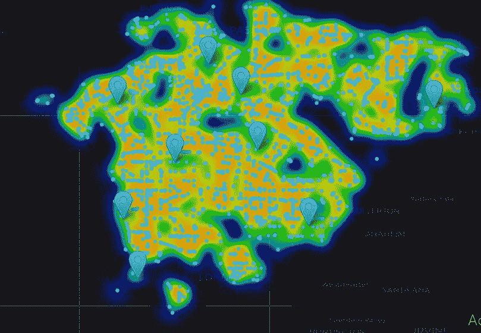

# 生活更健康…使用 Foursquare API 和 leav

> 原文：<https://medium.com/codex/living-healthier-with-foursquare-api-and-folium-9ae8e8fefaa9?source=collection_archive---------17----------------------->

## 我们在哪里锻炼重要吗？


图为[塔邦](https://unsplash.com/@lindokuhle?utm_source=medium&utm_medium=referral)在 [Unsplash](https://unsplash.com?utm_source=medium&utm_medium=referral)

> 仅在美国就有超过 196，000 家快餐店。尽管有 2020 年的疫情，但自那时起，该行业的增长率为 [1.1%](https://www.ibisworld.com/industry-statistics/number-of-businesses/fast-food-restaurants-united-states/) 。仅去年一年就新开了 2000 多家餐馆。

# **背景**

最近，我参加了涵盖 [10 门课程](https://www.coursera.org/professional-certificates/ibm-data-science)的 IBM 数据科学认证。走进去，我认为这将是一个公园散步，因为在此之前，我有一些在该地区的背景。然而，它比我预期的更吸引人，也更耗时。现在终于完成了，感觉真好。最后的顶点允许我们自由探索任何需要使用 Foursquare API 的问题。这让我开始思考潜在的想法，然后我偶然发现了它。

**食物。**

## 迫切的问题

像你们许多人一样，我喜欢❤️食物。一直都是，我很感激它有这么多美妙的味道、形状和大小！这些年来，我对快餐一直是又爱又恨。我是说，谁能拒绝美味的汉堡呢？

via GIPHY

然而，虽然我的大脑很喜欢尝试广告中的新特餐，但我的身体会在一段时间内默默无闻，没有任何抵抗，直到它达到无法再保持沉默的地步。

美国是快餐的发源地。我在世界的东部长大，直到我踏上美国的土地，我才知道这有多讨厌。仅在 2012 年，这个行业就花费了 46 亿美元向你宣传他们的产品。那是十年前的事了。鉴于我们看到的增长，人们可以认为这些数字在今天可能是保守的。


照片由[埃里克·麦克莱恩](https://unsplash.com/@introspectivedsgn?utm_source=medium&utm_medium=referral)在 [Unsplash](https://unsplash.com?utm_source=medium&utm_medium=referral) 拍摄

不要误会我的意思，我仍然时不时地享受一顿好的快餐，但是这些年来，我已经学会对我的身体更加有意识和关心。

这让我想到… **在当今广告充斥的世界，尤其是在美国，生活在任何地方的人如何保持健康？？**

听起来不可能——除非，你让自己经历荒谬的自我决定，或者像汤姆·汉克斯一样去偏远的小岛生活。

你走出门，到处都是广告牌和诱惑！只是想用这些庞大公司的营销团队精心设计的词语来吸引你。当然，你可以抗拒一段时间，但是想象一下每天醒来都是这样。


由 [RealKina](https://unsplash.com/@realkina?utm_source=medium&utm_medium=referral) 在 [Unsplash](https://unsplash.com?utm_source=medium&utm_medium=referral) 上拍摄的照片

更糟糕的是当你试图向健康狂热屈服时。你决定健身，然后去当地的健身房锻炼。在一次激烈的训练后，你离开了健身房。你上了车，准备回家，然后你看到了这个..

你决定屈服，因为在经历了所有的痛苦之后，这是你应得的。然而，你很少意识到，你刚刚消耗的不仅超过了你刚刚投入的所有工作，而且现在，还让你变得更不健康。

## 思维

所有这些让我思考。如果我能在这个充满诱惑的世界里更好地导航呢？认为我可以完全避免快餐广告是不现实的，但是如果我选择住在哪里，更具体地说，我选择在哪里锻炼，会对我以后是否会放弃渴望产生影响。

**进入 Foursquare API &叶子。**

[开发者| four square——独立位置数据平台](https://developer.foursquare.com/)

Foursquare API 是一个独立的全球性的基于位置的平台，它通过应用程序和其他公共兴趣点的来源收集用户生成的信息，并将其整合到一个简化的数据库中。开发人员可以通过在他们的平台上创建一个帐户来访问这些数据。
我使用 API 返回基于地理空间数据(纬度、经度)的公共场馆信息。

[叶子-叶子 0.12.1 文档(python-visualization . github . io)](http://python-visualization.github.io/folium/)

> `folium`建立在 Python 生态系统的数据优势和`leaflet.js`库的映射优势之上。用 Python 处理你的数据，然后通过`folium`在活页地图上可视化。

# 个案研究

安娜今年 24 岁，来自北卡罗来纳州罗利，从事医疗保健工作。她喜欢东海岸的生活，但正在考虑转移到西海岸进行职业生涯的下一步，并渴望体验其他地方的生活。像我们许多人一样，安娜多年来一直在广告的诱惑中挣扎，并希望过上更健康的生活。
她不太知道在洛杉矶搬去哪里比较好。她来找我们寻求帮助。

> 我们的目标是找到培养健康行为的理想社区。

# 构建解决方案

出于这个项目的目的，我们将依靠 Python 来帮助 Anna 计算洞察力。

基于我们的问题，在选择社区时，我们需要考虑几个因素。

1.  社区的位置在哪里？它是在一个提倡更健康生活的区域吗？
2.  该地区快餐店和健身中心的数量——附近将有多少家？他们会干涉她健康生活的目标还是促进它？
3.  历史信息-她的新邻居生活怎么样？他们喜欢更健康的生活方式还是久坐不动的生活方式？是否涉及其他因素，如设施使用受限？

**数据来源:**

除了我们将从 Foursquare API 获得的公共场所数据之外，我们还需要更多可量化的信息来可视化地构建我们的解决方案。

*   [*洛杉矶街区列表*](http://maps.latimes.com/neighborhoods/) *—《洛杉矶时报》整理了一份洛杉矶所有街区和地区的准确列表。*
*   [*公共卫生部门数据，洛杉矶县*](http://publichealth.lacounty.gov/)*——每个街区都有可能对我们有价值的历史信息。洛杉矶县存储可供公众使用的健康数据集。我们将关注的两个主要指标是肥胖率和符合身体活动推荐指南的成年人的百分比。*
*   *洛杉矶的地理空间数据——基于我们导入的社区数据，我们还将使用*`[geopy](https://geopy.readthedocs.io/en/stable/)`[](https://geopy.readthedocs.io/en/stable/)**和* `[opencage](https://opencagedata.com/)` *包收集纬度和经度信息。**
*   **洛杉矶县的 GeoJSON 数据——为了在 Folium 中创建 choropleth 地图，我们需要洛杉矶的 GeoJSON 数据，我们将从*[*UCLA geo portal*](https://apps.gis.ucla.edu/geodata/dataset/93d71e41-6196-4ecb-9ddd-15f1a4a7630c/resource/6cde4e9e-307c-477d-9089-cae9484c8bc1/download/la-county-neighborhoods-v6.geojson)*获取这些数据。**

*那都是满嘴的话。好的，让我们把它们都装进去。*

*via GIPHY*

## *数据导入*

*为了从洛杉矶时报导入邻居列表，我们将使用能够从 HTML 和 XML 文件中提取数据的`[BeautifulSoup](https://www.crummy.com/software/BeautifulSoup/bs4/doc/)`包。*

*漂亮的进口货*

**

*洛杉矶的街区列表——作者图片*

*花在数据处理上的大部分时间都围绕着清理杂乱的数据，并确保这些数据可以被处理。跳过这一步只会导致我们以后的分析不准确。*

*公共卫生数据可以下载到`.xlsx`文件中，然后我们可以使用`pandas.`导入这些文件*

*如前所述，我们想要关注的两个关键指标是**肥胖率**和**健康成年人百分比**(或符合身体活动建议指南的成年人百分比)。幸运的是，公共卫生部将这些数据按照指标进行了分类。我们所要做的就是把它们带进来并结合起来。*

*导入洛杉矶县的肥胖率和健康成人百分比*

**

*洛杉矶县公共卫生数据-作者图片*

*接下来，我们需要得到边界。
geo JSON 是一种 JSON 格式，以字典的形式存储，其中包含将形成任何地理区域边界的多边形的坐标数据，本质上是任何位置的空间和非空间属性的混合。在我们的情况下，这将是洛杉矶县。*

*提取 GeoJSON*

*从这些来源得到的数据有点混乱。经过几年的修补(这里我就不详细介绍了)和盯着屏幕看，我们已经能够很好地表现它了。*

## *获取地理坐标*

*为了在一张地图上显示洛杉矶，我们首先需要得到它的坐标。这就是`geopy` 和`geocoder`派上用场的地方。这些软件包能够将地理位置名称转换成它们各自的纬度值。非常方便。我们的数据帧也包含了邻居的名字。让我们通过一个包的循环来运行它们，以获得必要的空间值。*

*获取纬度和经度值*

****

*纬度-经度值-按作者分类的图像*

## *Foursquare 的魔力*

*Foursquare API 是一个巨大的数据库，包含您可能知道的每个公共兴趣点，尤其是美国的公共兴趣点。当涉及到为任何行业生成见解时，拥有这些信息都是一个有价值的工具。*

*要开始使用 API，您需要首先在平台上创建一个 Dev 帐户。登录后，该平台将允许您创建一个新的应用程序。这个新的应用程序将会给你两个关键的信息，`CLIENT_ID` & `CLIENT_SECRET`，你需要稍后将它们复制到你的代码中。*

*`CLIENT_ID`*

*`CLIENT_SECRET = This will be your Foursquare Secret`*

*更多关于设置的信息可以在[这里](https://developer.foursquare.com/docs/places-api/getting-started/)找到。*

*现在来看 API 调用。*

*一旦我们声明了所需的信息，我们需要进行 API 调用来从服务器获取场地信息。使用以下 url，您可以通过一个简单的调用获得一组特定坐标的所有场馆*

```
*url = [https://api.foursquare.com/v2/venues/explore?&client_id={}&client_secret={}&v={}&ll={},{}&radius={}&limit={}](https://api.foursquare.com/v2/venues/explore?&client_id={}&client_secret={}&v={}&ll={},{}&radius={}&limit={})*
```

*如果您想过滤数据并获得特定类型的场所，比如在我们的例子中，快餐店和健身中心，您可以参考它们的场所类别[文档](https://developer.foursquare.com/docs/build-with-foursquare/categories/)，其中列出了每个类别的所有 ID。
然后，您可以更改 url 以包含每个类别类型。*

```
*url = [https://api.foursquare.com/v2/venues/explore?categoryId={}&intent=browse&client_id={}&client_secret={}&v={}&ll={},{}&radius={}&limit={}](https://api.foursquare.com/v2/venues/explore?categoryId={}&intent=browse&client_id={}&client_secret={}&v={}&ll={},{}&radius={}&limit={})*
```

*其中`categoryid={}` 允许您指定想要请求的 ID。*

*哦，还有一件事要记住，API 对你每天在沙盒层账户上的调用次数有一个限制。对于大型数据集，请记住这一点。*

*设置完成后，您的代码应该类似于下面这样。*

*Foursquare API 调用*

*我们来看看收到的 API 数据。*

**

*洛杉矶县的健身中心——作者图片*

*干得好！你已经成功地解决了所有棘手的问题。现在开始有趣的部分。*

*via GIPHY*

# *用叶子绘制地图*

*对于地理空间数据来说,`folium`是一个非常棒的可视化工具。我喜欢它的一点是，你可以很容易地用多种方式可视化你的信息。*

*我们来看一个用`folium`生成的简单地图。还有几种地图类型，`folium`称之为图块。它们在美学上或功能上都有不同的用途。
例如，雄蕊地形有助于可视化每个位置的植被水平，而雄蕊调色剂可以在陆地和水体之间引入鲜明的对比。*

**

*洛杉矶底图—图片由作者提供*

*从我们的数据开始，让我们用 follow 绘制一个简单的地图，只使用我们数据帧中所有邻域的经度值。*

**

*视觉化的洛杉矶街区——作者图片*

*我们可以看到每个街区是如何在地图上展开的。更好的是，我们可以为每个点创建一个自定义标签，就像我们在西城区的 Bel-Air 附近看到的那样。*

*现在，让我们更深入地看看我们的案例研究。
安娜想在搬到洛杉矶后保持健康的生活方式。然而，在考虑社区时，快餐店和健身中心的位置可能不是她首先想到的。*

*但是，考虑到我们已经看到在美国到处都是广告牌，很多广告牌都在快餐店前面，我们想避开快餐店密度高的地区。我们也不一定要寻找健身中心密度高的地区。因为，一个社区可能有高密度的健身中心，也可能有同样高密度的快餐店。这将与我们的方法适得其反。*

> *我们希望隔离出快餐店密度低、至少有几个健身中心的区域。*

*我们的方法基于两个假设*:**

1.  *在更多快餐店附近访问和离开健身中心**降低了参与者返回健身中心的动机**或者**增加了锻炼后访问快餐店的概率**。*
2.  *拥有大量快餐店的社区有更高的肥胖率。*

*让我们看看数据显示了什么。*

*现在，在地图上标出每一个小的快餐店和健身房可能会让我的电脑爆炸。因此，我们从 API 获得了一个较小的样本量。*

**

*洛杉矶快餐店和健身中心的样本量——图片由作者提供*

*蓝色的点代表健身中心，红色的点代表快餐店。*

*仅从这一初步观察，我们可以看到一些明显的差异在机构的分布方式。*

**

*理想社区的可能位置-作者图片*

*我们看到了五个可能的社区，与其他社区相比，它们的快餐选择密度较低。*

*圣莫尼卡|曼哈顿海滩|贝尔德斯牧场|洛杉矶市中心|南帕萨迪纳*

*获取此地图的代码:*

*快餐店和健身中心——树叶代码*

*现在，很容易显示一张地图，显示我们收集的肥胖率或健康成人的百分比。我们甚至可以告诉`folium`控制地图上出现的每个点的大小。我们可以有更高的比率来显示为更大，如下图所示。*

**

*洛杉矶县健康成人百分比可视化-图片由作者提供*

*这太棒了。
但是`folium`真正出彩的地方是在 Choropleth 地图上。*

*什么是 Choropleth 地图？*

> ***choropleth 地图**(来自[希腊语](https://en.wikipedia.org/wiki/Greek_language) *χῶρος choros* 地区/区域和 *πλῆθος plethos* 人群)是一种[主题地图](https://en.wikipedia.org/wiki/Thematic_map)，其中一组预定义的区域按照统计变量的比例进行着色或图案化，该统计变量表示每个区域内地理特征的汇总，例如[人口密度](https://en.wikipedia.org/wiki/Population_density)或[人均收入](https://en.wikipedia.org/wiki/Per-capita_income)。*

*是的，that^说的。*

*这是直观查看数据在地图上分布情况的好方法。*

*但是，为了创建一个 Choropleth 地图，我们需要洛杉矶边界的数据。幸运的是，我们之前通过导入 GeoJSON 文件做到了这一点。*

*`folium` 无缝地处理地理空间数据和我们的数据框架，这样我们就可以得到一个可视化的功能地图。
在叶子结构中填充的一个关键元素是`key_on`参数。`key_on`参数将是我们的 GeoJSON 文件中的一个位置，在该位置选择要在地图上表示的列。通常，它是边界的名称，并在类似于`feature.properties.name`
的结构位置中找到。探索您的 GeoJSON 以了解它可能在哪里。*

*Choropleth 地图代码*

*让我们来看看洛杉矶的肥胖率和健康成年人的百分比是如何变化的。你可以看到`folium` 也自动为我们创建了一个图例。*

****

*洛杉矶县肥胖率与健康成人百分比-图片由作者提供*

*从肥胖率数据中，我们可以看出:*

*这些社区的肥胖率最高*

*   *卡森港|康普顿，东南部|拉米拉达，东南部|瓦林达，圣盖博谷*

*这些社区的肥胖率最低*

*   *阿卡迪亚、圣盖博谷|圣盖博、圣盖博谷|曼哈顿海滩、南湾|太平洋栅栏、西区*

*有趣的..**圣盖博谷**似乎在两个光谱上都出现尖峰。此外，洛杉矶南部似乎是一个我们可能想要避免的地区。
另一方面，**曼哈顿海滩**和**西区**我们第一印象中看到的可能的理想地点似乎与我们的肥胖数据相关。*

*从健康成人的数据中，我们可以看出:*

*这些社区的健康成人比例最高*

*   *比佛利山庄，西区|西好莱坞，洛杉矶中部|曼哈顿海滩，南湾|圣莫尼卡，西区*

*这些社区的健康成人比例最低*

*   *罗斯米德，圣盖博谷|蒙特利公园，圣盖博谷|塞里托斯，东南部|罗兰高地，圣盖博谷*

*这是曼哈顿海滩的第三次打击！这是安娜的理想位置吗？其他西区似乎也很有希望。*

*最后，我们再来看看`folium`的一个比较酷的功能。*

*热图。*

*是的，你没听错。不知道为什么，我从小就对热图很着迷。也许这是他们在许多电影中被美化的用法，我们是看着他们长大的。它们也简单易懂，这对于帮助我们的受众与数据联系起来非常重要。*

*为了使用热图获得更准确的视觉效果，我们运行了另一个 API 调用，以获得更大的样本量，仅包括健身房/健身中心和快餐店的场馆类别。这将使用隔离类别 ID 的方法。请记住较大的加载时间，并相应地保存您的工作。*

*热图代码*

**

*洛杉矶热图——图片由作者提供*

*请注意，`folium` 还允许您创建交互式标记，您可以在地图生成后将其放置在地图上。这将有助于确定我们理想的热图热点。让我们并排比较一个底图和两个热图——一个显示洛杉矶快餐店的密度，另一个显示相同的，但健身中心。*

**

*洛杉矶地图—作者图片*

****

*(左)洛杉矶快餐店热图，(右)洛杉矶健身中心热图-图片由作者提供*

*在快餐连锁店的热图中，一些突出的社区是:*

*   *西好莱坞|英格尔伍德|南帕萨迪纳|唐尼|洛斯阿拉米斯|曼哈顿海滩|帕罗斯贝尔德斯牧场*

**注意:我们正在寻找绿色景点，因为我们希望安娜的快餐连锁店密度更低。**

*健身点热点地图中的一些突出街区是:*

*   *西好莱坞|英格尔伍德|托兰斯|唐尼|圣盖博谷|曼哈顿海滩|长滩*

# *建议和结论*

*根据我们的观察，很明显有几个社区非常适合安娜。*

*一些理想的选择是洛杉矶西部的社区，如圣莫尼卡地区、好莱坞山、兰乔帕洛斯贝尔德斯、曼哈顿海滩，或者更南部的长滩地区，或者北部的南帕萨迪纳地区。*

*这些社区的居民肥胖率低，身体活动率高，这促使安娜更多地采用更健康的生活方式。他们也倾向于选择较少的快餐，同时也有相当多的健身选择。这将使她开车去/从一个锻炼可能较少被大量的机构分心，这些机构可能阻碍她的健康目标。*

*如果安娜能负担得起更昂贵的生活方式，她可以选择搬到圣莫尼卡或好莱坞山等地区。如果她想降低成本，她可以考虑曼哈顿海滩、南帕萨迪纳或贝尔德斯牧场等地区。*

> *总的来说，曼哈顿海滩(T2)似乎是她第一次搬到洛杉矶的最佳地点*

**

*丹尼尔·弗雷塔斯在 [Unsplash](https://unsplash.com?utm_source=medium&utm_medium=referral) 上的照片*

*我们采取的方法肯定可以进一步发展或重新考虑。一些需要考虑的其他事项:*

1.  *您可以从 Foursquare 收集的场地数量增加了您获得更好结果的准确性。美国以外的一些地方可能不会像洛杉矶那样覆盖广泛*
2.  *我们高度报道了洛杉矶。人们可以进一步探索洛杉矶的每个地区*
3.  *另一种方法可以是查看安娜可能去健身中心或从健身中心出来的路线。这条路线可以优化，以尽量减少快餐店。我们有每个机构的长期价值。这些可以在这个场景中使用。*
4.  *可能还有比肥胖率更相关的其他因素，如每个社区获得更健康的食物选择。*
5.  *我们从 Foursquare 中提取的场地数据各包含一个类别类型:快餐店和健身房。还有其他类别我们没有考虑到，如其他形式的可能不健康的食品机构，如甜甜圈店或比萨饼店，或除健身房以外的其他健身选择，如室外区域、游泳池、网球/篮球场等。包括这些将导致更准确的结果。*

*Foursquare API 允许对许多地理空间问题进行大量分析。在回答问题时，它可能有用的其他情况包括识别企业(如餐馆)的理想位置，识别最安全的居住区域，等等。*

# *谢谢你*

*感谢您花时间通读这篇文章。喜欢就留下掌声！我真的很感谢大家的评论，我一直在努力改进，所以如果你想联系我，你可以通过 [LinkedIn](https://www.linkedin.com/in/thomthomas/) 或 [Twitter](https://twitter.com/__tomthomas) 联系我*

*via GIPHY*

# *参考*

1.  *[树叶—树叶 0.12.1 文档(python-visualization . github . io)](http://python-visualization.github.io/folium/)*
2.  *[Choropleth 地图——维基百科](https://en.wikipedia.org/wiki/Choropleth_map)*
3.  *源代码: [tomthomas/Coursera_Capstone:使用 FourSquare API 的 IBM Capstone 项目(github.com)](https://github.com/tomthomas/Coursera_Capstone)*