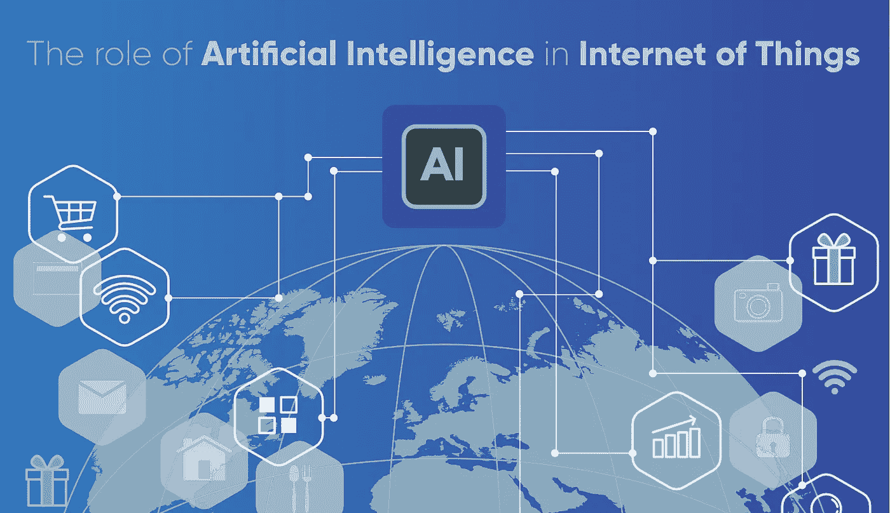
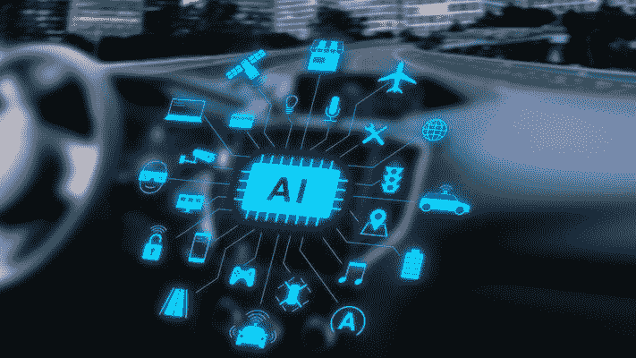
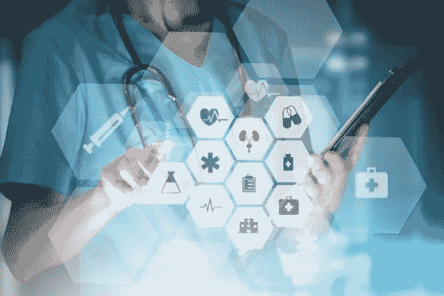
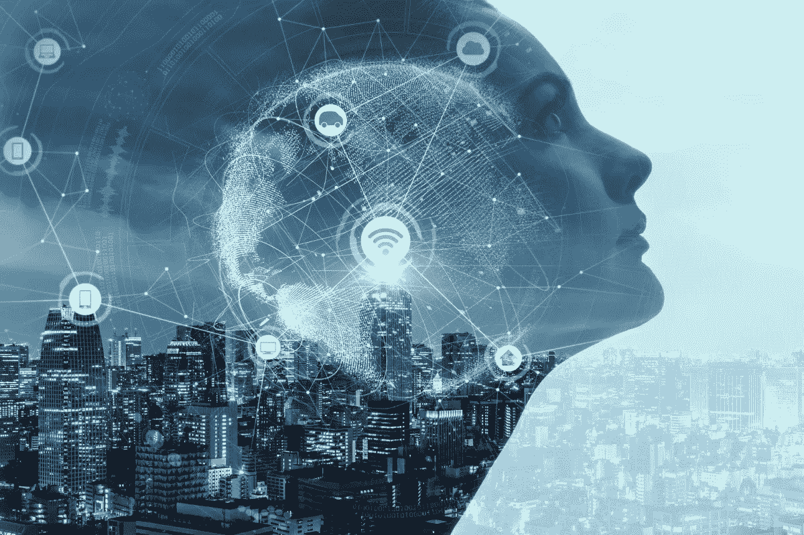
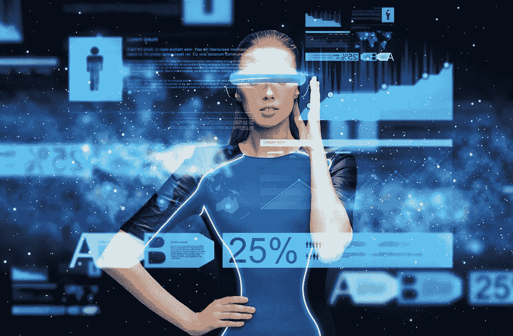
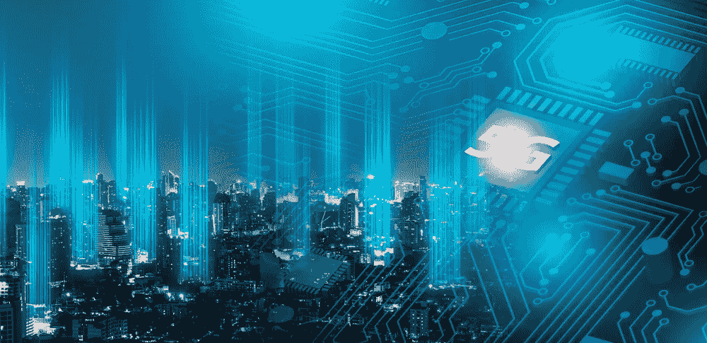

# 生活在 AIOT 革命时代？

> 原文：<https://medium.com/codex/living-in-the-aiot-revolution-times-436dbb88f480?source=collection_archive---------15----------------------->

## **物联网中人工智能的卓越方式正在影响我们的世界**

*投资全球最受欢迎的* ***人工智能认证*** *，让 AIoT 成为一项更加便利的技术。从智能医疗体验到便捷的事物自动化，让 AIoT 成为一项家用技术是博学* ***AI 专业人士*** *的目标。他们将最新的* ***人工智能技术*** *运用到工作中，让所有人的生活都变得便利而充实！*

物联网已经不是一个新概念了。我们过去通过设备互联生活的日子没有被遗忘很久，现在我们很幸运地在日常生活中与人工智能的现实一起蓬勃发展。简单地说，物联网是互联设备和技术的集合网络，有助于智能设备和云网络之间以及设备本身之间的轻松通信。这不仅彻底改变了我们计划日常日程的方式；但也让执行这一切变得轻而易举。随着智能技术创新的出现，我们这一代人正在走向一个世界，在这个世界中，我们不仅过着便捷的生活，而且使业务流程和决策变得更简单、更有意义。

将人工智能引入物联网是未来几代人非常需要的一次进化。AIoT 的目标一直是满足高效物联网运营、即兴人机交互以及增强数据管理和分析的需求。物联网和人工智能是当今的热门话题，因为它们得到了有事业心的技术专家和学者的广泛认可🔗 [**AI 专业人士**](https://www.usaii.org/artificial-intelligence-certifications) 。

人工智能和物联网的融合将重新定义全球工业、商业和经济的运行方式。最新的人工智能技术与物联网结合在一起，创造出能够模拟智能行为的智能机器，并在几乎可以忽略不计的人工干预下协助做出有洞察力的决策。

> 最近的统计显示，到 2027 年，*全球 AIoT 市场*预计将达到*836 亿美元*，作为服务解决方案的*物联网数据*将达到*91.3 亿美元*。

成为增长最快的部分🔗 [**人工智能技术**](https://www.usaii.org/ai-insights/artificial-neural-network-an-overview) ，这种技术诀窍的增强将使越来越智能的边缘设备、数据交换和数据驱动的决策大脑能够工作。

技术革命是由 5G 网络推动的，5G 网络分散在各个行业的最新发明中，包括机器人、自动驾驶汽车、量子力学、纳米技术、生物技术、自动代客泊车和 3d 打印。AIoT 的好处可以在世界经济的各种行业和部门中感受到，让我们依次理解它们:

👉*对员工和资产的实时监控*

👉*提高互联设备的可扩展性，优化现有流程*

👉*利用预测分析发展风险管理*

👉*提升消费者体验*

👉*更好的资源管理和环境保护程序*

👉*支持 AIoT 的设备控制温度并自动控制灯和门的功能*

👉*为产品监管和服务提供更多定制服务*

👉*通过自动化任务和流程降低劳动力成本*

👉*增强的个性化购物体验*

👉*欺诈防范*

👉*轻松监控患者健康状况，预测疾病爆发，并自动提出治疗建议*

不仅如此，人工物联网正以多种方式普及到世界经济。AIoT 影响着我们日常生活的各个方面，通过使当代设备智能化，它还具有许多额外的优势，即:

# **1。** **智能家居**

通过**人工智能技术**连接恒温器、照明物体、安全摄像机等家用设备。

# **2。** **智能汽车**

自动驾驶汽车(无人驾驶汽车)是人工智能过程渗透到互联设备世界的一个巨大例子。如今，汽车可以通过互联网连接到您的移动设备，为您提供最新的 GPS 技术，并预测交通和路况更新。

# **3。** **智慧医疗**

领先的人工智能技术使我们的医疗保健变得更加智能，通过处理医学图像来数字诊断疾病，向医生发出有关患者关键重要统计数据更新的警报，帮助开发新的高效药物等。

# **4。** **智慧城市**

AIoT 在改善交通拥堵管理、优化能源使用从而提高公共安全方面发挥着关键作用。

# **5。** **可穿戴技术**

每个人都希望生命中的每一秒都与**人工智能技术**联系在一起。这使得技术爱好者有必要开发新颖的可穿戴技术，这些技术可以方便地随身携带，甚至可以由普通大众穿戴。智能手表、健身追踪器、AR-VR 头戴式设备、身体传感器是这种创新的几个精彩例子，使技术变得方便，并以各种可能的方式可用。

# **6。** **5G 联网技术**

5G 一直是世界各国努力付诸行动的技术。今天，我们生活在一个 5G 网速为我们周围的智能设备提供支持的时代，使互联网接入变得方便。它已经使 AR-VR、3D 打印、药物控制中的纳米技术、遗传学和基因疗法、智能机器人自动化等成为活生生的现实。

人工智能的力量是深远的。它很容易解读什么有效，什么在消费者窗口爆炸，同时理解微妙的市场需求和深刻的发现。人工智能需要经过认证的人工智能专业人员🔗 [**麻省理工**、斯坦福、哈佛、USAII、乔治亚理工**等国际知名 AI 选手提供的 AI 认证**](https://www.usaii.org/artificial-intelligence-certifications) 。这种专业知识使上述人工智能技术在物联网中的应用成为现实，对关键行业的增长产生了多方面的积极影响。

# ***希望你发现这一点很有见地！如果你喜欢这篇文章，别忘了分享它！***