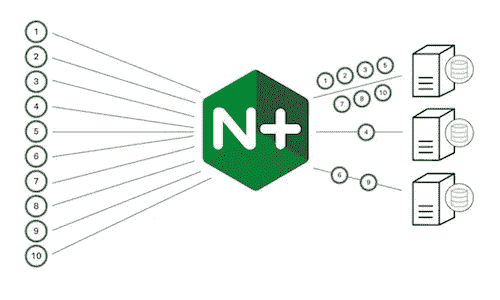
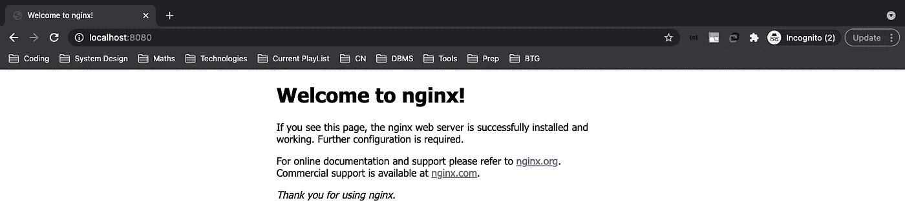
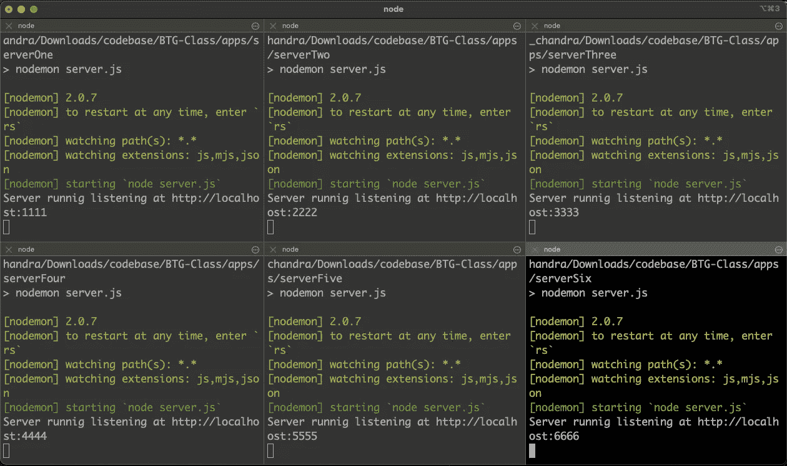
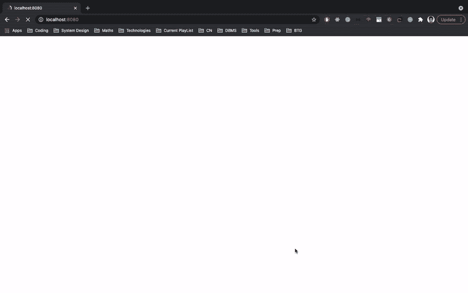
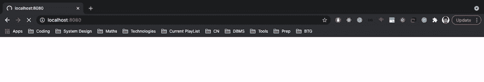

# 使用 Nginx 实现负载平衡

> 原文：<https://medium.com/codex/load-balancing-with-nginx-7d1bb4c24d5d?source=collection_archive---------1----------------------->

## 不要只是试图去理解它。感受一下。



使用 Nginx 实现负载平衡

在本文中，我们将讨论如何在一台拥有多台服务器的本地机器上使用 Nginx 实现第 7 层(应用层)负载平衡，提供相同的内容。在我深入细节之前，对于那些不知道 Nginx 是什么的人

> **NGINX** 是一款免费、开源、高性能、功能丰富、配置简单、资源消耗低的 web 服务器，还可以充当反向代理、负载均衡器、邮件代理、HTTP 缓存等等。

# 步骤 1:安装并运行 Nginx

我用 brew 在我的机器上安装 Nginx。

```
brew install nginx
```

检查它是否安装成功。

```
nginx -v
```

你应该看到 Nginx 的版本。

```
nginx version: nginx/1.19.9
```

现在启动 Nginx 服务器

```
brew services start nginx
```

Nginx 服务器已启动。导航到 [http://localhost:8080](http://localhost:8080/) 。您应该会在浏览器中看到下面的响应。



Nginx 默认消息

# 步骤 2:创建 NodeJs 服务器

为了分配负载，让我们创建几个简单的 nodejs 服务器。下面的要点是一个模板，旋转几台服务器。如果你知道 docker，那么你可以使用一个图像旋转多个容器。我正在创建 6 个节点应用程序。



只要把端口和消息改成你想要的就行了。我正在运行我的六个服务器，如上图所示。

# 步骤 3:请求分发

导航到`/usr/local/etc/nginx`用下面的要点替换 Nginx 默认配置文件`nginx.conf`。

现在导航到 [http://localhost:8080](http://localhost:8080/) 并不断刷新浏览器。请注意，每次您发出请求时，请求都会以循环方式被重定向到这 6 台服务器。



以循环方式路由的请求

现在让我们试着理解配置文件。在 http 指令中，我们创建了一个包含 6 台服务器的上游指令。在服务器指令中，我们定义每当有人试图访问 [http://localhost:8080](http://localhost:8080) 时，我们将这些请求代理到我的后端服务器组。由于在上游指令中没有指定如何平衡请求的算法，Nginx 默认使用**循环**算法。这样，向 [http://localhost:8080](http://localhost:8080) 发出的每个请求都由这六个服务器以循环方式提供服务。

根据上面的配置，我们可以理解，如果有人试图访问`http://localhost:8080/profile`[http://localhost:8080/profile](http://localhost:8080)，服务器会返回 404 错误。所有的`[http://localhost:8080/stories](http://localhost:8080/profile)` 请求将被重定向到 storyService 组，这些请求在端口 3333 和 4444 上运行的服务器之间循环。所有的`[http://localhost:8080/newsfeed](http://localhost:8080/profile)`请求都将被重定向到 newsfeedService 组，这些请求在运行于端口 1111 和 2222 的服务器之间循环。除了 stories 和 newsfeed 之外的任何其他请求都被重定向到 wholeBackend 组，这些请求在运行于端口 5555、6666、7777 和 8888 上的服务器之间循环。

## 服务器重量

默认情况下，每个服务器的权重为 1。例如，如果您将第二台服务器的权重设置为 5，那么在发出的 10 个请求中，有 5 个(但不是按顺序)被重定向到第二台服务器，其余 5 个被重定向到其余的服务器。



通过分配给服务器的权重实现负载平衡

## 服务器慢速启动

服务器慢速启动功能可防止最近恢复的服务器因连接过多而不堪重负，这可能会超时并导致服务器再次被标记为失败。

在 NGINX Plus 中，slow-start 允许上游服务器在恢复或变得可用后，逐渐将其权重从`0`恢复到其标称值。这可以通过`server`指令的`slow_start`参数来实现:

```
**upstream** mybackend {
    **least_conn**;
    **server** 127.0.0.1:1111 slow_start=30s;
    **server** 127.0.0.1:2222 weight=5;
}
```

时间值(这里是`30`秒)设置 NGINX Plus 将服务器连接数量提升到最大值的时间。

请注意，如果一个组中只有一台服务器，则`server`指令的`max_fails`、`fail_timeout`和`slow_start`参数将被忽略，并且该服务器永远不会被视为不可用。

# 负载平衡方法

NGINX 开源支持四种负载平衡方法，NGINX Plus 又增加了两种方法。我们已经看到了默认的循环法。其他负载平衡方法

*   least_conn:请求被发送到活动连接数最少的服务器，同样考虑服务器权重。

```
**upstream** mybackend {
    **least_conn**;
    **server** 127.0.0.1:1111;
    **server** 127.0.0.1:2222 weight=5;
}
```

*   ip_hash:请求发送到的服务器由客户端 ip 地址决定。在这种情况下，要么使用 IPv4 地址的前三个八位字节，要么使用整个 IPv6 地址来计算哈希值。该方法保证来自同一地址的请求到达同一服务器，除非该服务器不可用。

```
**upstream** mybackend {
    **ip_hash** $request_uri consistent;
    **server** 127.0.0.1:1111;
    **server** 127.0.0.1:2222 weight=5;
}
```

如果需要从负载平衡循环中临时删除其中一台服务器，可以使用`down`参数对其进行标记，以保留客户端 IP 地址的当前哈希。将由该服务器处理的请求自动发送到组中的下一个服务器。

*   哈希:也称为通用哈希。请求发送到的服务器由用户定义的密钥确定，该密钥可以是文本字符串、变量或它们的组合。例如，密钥可以是成对的源 IP 地址和端口，或者是 URI，如下例所示:

```
**upstream** backend {
    **hash** $request_uri consistent;
    **server** backend1.example.com;
    **server** backend2.example.com;
}
```

`hash`指令的可选参数`consistent`支持 [ketama](https://www.last.fm/user/RJ/journal/2007/04/10/rz_libketama_-_a_consistent_hashing_algo_for_memcache_clients) 一致散列负载平衡。请求根据用户定义的散列键值均匀分布在所有上游服务器上。如果上游服务器被添加到上游组或从上游组中删除，则只有几个键被重新映射，这在负载平衡缓存服务器或其他累积状态的应用程序的情况下最大限度地减少了缓存未命中。

*   least_time:对于每个请求，NGINX Plus 选择具有最低平均延迟和最低活动连接数的服务器，其中最低平均延迟是基于包含以下`least_time`指令的哪个参数来计算的:

```
**upstream** backend {
    **least_time** header;
    **server** backend1.example.com;
    **server** backend2.example.com;
}
```

*   `header`–从服务器接收第一个字节的时间
*   `last_byte`–从服务器接收完整响应的时间
*   `last_byte inflight`–从服务器接收完整响应的时间，包括未完成的请求

# 结论

这个话题还有很多我们没有涉及到的内容，这确实是一个令人着迷的讨论。

如果我遗漏了什么，或者你觉得有什么不对，请在下面写下回复，让我知道。非常感谢任何建议或意见。

如果你有兴趣，可以在 [LinkedIn](https://www.linkedin.com/in/prathapchandra) 、 [Twitter](https://twitter.com/prathapmoola/) 或 [Instagram](https://www.instagram.com/prathap_chandra/) 上与我联系。

*感谢阅读！！*