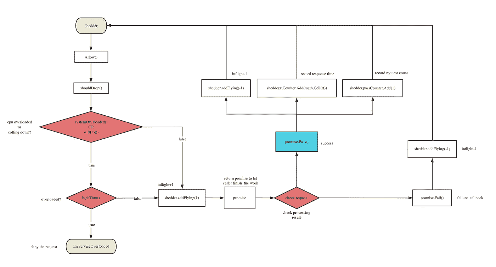

# 繁忙服务的减载

> 原文：<https://medium.com/codex/load-shedding-governance-on-busy-services-38193ed4888b?source=collection_archive---------6----------------------->

# 为什么我们需要减载

在微服务集群中，调用链是复杂的，作为服务提供者，它需要一种机制来保护自己不被无意识的调用所淹没，并确保自己服务的高可用性。

最常见的保护机制是限流机制，使用限流器的前提是要知道自己能处理的最大并发数，通常是在上线前通过压力测试得到最大并发数，而在日常的请求过程中每个接口的限流参数都是不同的，而系统一直在不断迭代，其处理能力会经常变化，每次上线前都要进行压力测试，然后调整限流参数，变得非常繁琐。

那么有没有更简洁的限流机制，可以实现最大程度的自我保护呢？

# 什么是自适应减载？

自适应减载是保护服务本身的一种非常智能的方式，并根据服务本身的系统负载动态地确定是否需要减载。

设计目标。

1.  以确保系统不会崩溃。
2.  在系统稳定的前提下保持系统吞吐量。

关键是如何测量服务本身的负载？

判断高负载要看 CPU 是否过载。如果 CPU 过载，自适应减载将被激活。

还需要注意的是，高并发场景的 cpu 负载和并发往往波动较大，我们从数据上称这种现象为毛刺，可能会导致频繁的 auto-download 操作，所以我们一般会获取一段时间内指标的平均值，使指标更加平滑。可以通过准确记录一段时间内的指标，然后直接计算平均值来实现，但是会占用一些系统资源。

有一种统计算法:指数移动平均，可以用来估计变量的局部平均值，使得变量的更新与一段时间内的历史值相关，不需要记录所有的历史局部变量就可以估计出平均值，节省了宝贵的服务器资源。

[**滑动平均算法的原理**](https://www.cnblogs.com/wuliytTaotao/p/9479958.html) 参见本文获得非常清晰的解释。

变量 V 记为 t 时刻的 Vt，θt 为 t 时刻的变量 V 值，即不使用滑动平均模型时 Vt=θt，使用滑动平均模型后，Vt 由下式更新。

`Vt=β⋅Vt-1+(1-β)⋅θt`

*   β = 0 时 Vt = θt
*   β = 0.9，约为最后 10 θt 值的平均值
*   β = 0.99，约为最后 100 θt 值的平均值

# 代码实现

接下来，让我们看看 go-zero 自适应负载减少的代码实现。

`core/load/adaptiveshedder.go`



自适应减载接口定义。

```
// callback function
Promise interface {
    // This function is called back when the request succeeds
    Pass()
    // Callback when the request fails
    Fail()
}
​
// Drop the interface definition
Shedder interface {
    // Drop check
    // 1\. Allow the call, you need to manually execute Promise.accept()/reject() to report the actual execution task structure
    // 2\. Reject the call and it will return err: Service overloaded error ErrServiceOverloaded
    Allow() (Promise, error)
}
```

接口定义非常简洁，这意味着它实际上使用起来非常简单，向外界公开了一个“Allow()(Promise，error)。

归零用法示例。

该业务只需要调用该方法来判断是否 dowload，如果 dowload 则直接结束流程，否则该业务的执行最后使用返回值承诺根据回调结果执行即可。

```
func UnarySheddingInterceptor(shedder load.Shedder, metrics *stat.Metrics) grpc.UnaryServerInterceptor {
    ensureSheddingStat()
​
    return func(ctx context.Context, req interface{}, info *grpc.UnaryServerInfo,
        handler grpc.UnaryHandler) (val interface{}, err error) {
        sheddingStat.IncrementTotal()
        var promise load.Promise
        // Check if it should be dropped
        promise, err = shedder.Allow()
        // drop the load and record the relevant logs and metrics
        if err ! = nil {
            metrics.AddDrop()
            sheddingStat.IncrementDrop()
            return
        }
        // Final callback execution result
        defer func() {
            // Failed to execute
            if err == context.DeadlineExceeded {
                promise.Fail()
            // Execution succeeded
            } else {
                sheddingStat.IncrementPass()
                Promise.Pass()
            }
        }()
        // Execute the business method
        return handler(ctx, req)
    }
}
```

接口实现类定义。

有三种主要类型的属性

1.  cpu 负载阈值:超过这个值意味着 cpu 处于高负载状态。
2.  冷却期:如果服务之前已经被下载，那么它将进入冷却期，目的是防止负载在下载过程中被下载并立即加压导致来回抖动。因为降低负载需要一些时间，所以在冷却期你要继续检查并发数是否超过限制，超过限制就继续丢弃请求。
3.  并发:当前正在处理的并发数，当前正在处理的平均并发数，以及最近一段时间的请求数和响应时间，以此来计算当前正在处理的并发数是否大于系统所能承载的最大并发数。

```
// option parameter pattern
ShedderOption func(opts *shedderOptions)
​
// Optional configuration parameters
shedderOptions struct {
    // sliding time window size
    window time.Duration
    // Number of sliding time windows
    buckets int
    // cpu load threshold
    cpuThreshold int64
cpuThreshold int64 }
​
// adaptiveShedder struct, need to implement Shedder interface
adaptiveShedder struct {
    // cpu load threshold
    // higher than the threshold means high load needs to be down loaded to ensure service
    cpuThreshold int64
    // How many buckets in 1s
    windows int64
    // number of concurrent
    flying int64
    // Number of concurrent sliding smoothing
    avgFlying float64
    // Spin lock, one service shares one drop
    // Lock must be applied when counting the number of requests currently being processed
    // lossless concurrency, improves performance
    avgFlyingLock syncx.SpinLock
    // Last rejection time
    dropTime *syncx.AtomicDuration
    // whether it has been rejected recently
    droppedRecently *syncx.AtomicBool
    // request count statistics, with a sliding time window to record metrics for the most recent period
    passCounter *collection.RollingWindow
    // response time statistics, with a sliding time window to record metrics over the most recent period
    rtCounter *collection.RollingWindow
}
```

自适应 dropload 构造函数。

```
func NewAdaptiveShedder(opts . .ShedderOption) Shedder {
    // To ensure code uniformity
    // return the default empty implementation when the developer closes, to achieve code uniformity
    // go-zero uses this design in many places, such as Breaker, the logging component
    if !enabled.True() {
        return newNopShedder()
    }
    // options mode sets optional configuration parameters
    options := shedderOptions{
        // Default statistics for the last 5s
        window: defaultWindow,
        // default bucket count of 50
        buckets: defaultBuckets,
        // cpu load
        cpuThreshold: defaultCpuThreshold,
    }
    for _, opt := range opts {
        opt(&options)
    }
    // Calculate the interval for each window, default is 100ms
    bucketDuration := options.window / time.Duration(options.buckets)
    return &adaptiveShedder{
        // cpu load
        cpuThreshold: options.cpuThreshold,
        // How many sliding window units are contained in 1s of time
        windows: int64(time.Second / bucketDuration),
        // last rejection time
        dropTime: syncx.NewAtomicDuration(),
        // whether it has been rejected recently
        droppedRecently: syncx.NewAtomicBool(),
        // qps statistics, sliding time window
        // ignore the current writing window (bucket), incomplete time period may lead to data exceptions
        NewRollingWindow(options.buckets, bucketDuration.), // passCounter: collection,
            IgnoreCurrentBucket()),
        // Response time statistics, sliding time window
        // Ignore the current writing window (bucket), incomplete time period may lead to data exceptions
        rtCounter: collection.NewRollingWindow(options.buckets, bucketDuration,
            collection.IgnoreCurrentBucket()),
    }
}
```

跌落检查`Allow()`。

检查当前请求是否应该被丢弃，如果被丢弃，业务侧需要直接中断请求以保护服务，这也意味着在进入冷却期时减载生效。如果释放，则返回承诺，并等待业务方执行回调函数来执行指标统计。

```
// Drop check
func (as *adaptiveShedder) Allow() (Promise, error) {
    // Check if the request was dropped
    if as.shouldDrop() {
        // Set the drop time
        as.dropTime.Set(timex.Now())
        // Recently dropped
        as.droppedRecently.Set(true)
        // return overloaded
        return nil, ErrServiceOverloaded
    }
    // Add 1 to the number of requests being processed
    as.addFlying(1)
    // Each allowed request here returns a new promise object
    // promise holds the drop pointer object internally
    return &promise{
        start: timex.Now(),
        shedder: as,
    }, nil
}
```

检查是否`shouldDrop()`。

```
// whether the request should be dropped or not
func (as *adaptiveShedder) shouldDrop() bool {
    // The current cpu load exceeds the threshold
    // The service should continue to check the load and try to drop the request while it is on cooldown
    if as.systemOverloaded() || as.stillHot() {
        // Check if the concurrency being processed exceeds the current maximum number of concurrency that can be hosted
        // Discard the request if it exceeds it
        if as.highThru() {
            flying := atomic.LoadInt64(&as.flying)
            as.avgFlyingLock.Lock()
            avgFlying := as.avgFlying
            as.avgFlyingLock.Unlock()
            msg := fmt.Sprintf(
                "dropreq, cpu: %d, maxPass: %d, minRt: %.2f, hot: %t, flying: %d, avgFlying: %.2f",
                stat.CpuUsage(), as.maxPass(), as.minRt(), as.stillHot(), flying, avgFlying)
            logx.Error(msg)
            stat.Report(msg)
            return true
        }
    }
    return false
}
```

cpu 阈值检查`systemOverloaded()`。

cpu 负载值计算算法使用滑动平均算法来防止出现毛刺。每 250ms 采样β为 0.95，大致相当于历史上 20 次 cpu 负载的平均值，时间段约为 5s。

```
// whether the cpu is overloaded
func (as *adaptiveShedder) systemOverloaded() bool {
    return systemOverloadChecker(as.cpuThreshold)
}
​
// cpu checker function
systemOverloadChecker = func(cpuThreshold int64) bool {
        return stat.CpuUsage() >= cpuThreshold
}
​
// cpu sliding average
curUsage := internal.RefreshCpu()
prevUsage := atomic.LoadInt64(&cpuUsage)
// cpu = cpuᵗ-¹ * beta + cpuᵗ * (1 - beta)
// sliding average algorithm
usage := int64(float64(prevUsage)*beta + float64(curUsage)*(1 - beta))
atomic.StoreInt64(&cpuUsage, usage)
```

检查系统是否处于冷却期`stillHot`:

确定当前系统是否处于冷却期，如果是，它应该继续尝试检查请求是否被丢弃。主要目的是防止系统在从过载恢复的过程中负载还没有降下来，就立即再次增加压力从而导致来回抖动，此时应该尝试继续丢弃请求。

```
func (as *adaptiveShedder) stillHot() bool {
    // No requests have been dropped recently
    // means the service is fine
    if !as.droppedRecently.True() {
        return false
    }
    // Not on cooldown
    dropTime := as.dropTime.Load()
    if dropTime == 0 {
        return false
    }
    // cool down time defaults to 1s
    hot := timex.Since(dropTime) < coolOffDuration
    // not in the cool off period, normal processing of requests in progress
    if !hot {
        // reset the drop record
        as.droppedRecently.Set(false)
    }
​
    return hot
}
```

检查当前正在处理的并发数`highThru()`。

一旦**当前并发被处理>并发承载极限**则进入下载状态。

为什么我们需要在这里添加锁？因为全局使用自适应降级来确保并发平均值是正确的。

为什么我们需要在这里添加自旋锁？因为并发处理可以在不阻塞其他 goroutine 执行任务的情况下完成，使用无锁并发来提高性能。

```
func (as *adaptiveShedder) highThru() bool {
    // locking
    as.avgFlyingLock.Lock()
    // Get the sliding average
    // update at the end of each request
    avgFlying := as.avgFlying
    // Unlock
    as.avgFlyingLock.Unlock()
    // Maximum number of concurrent requests at this point in the system
    maxFlight := as.maxFlight()
    // whether the number of concurrent processes and the average number of concurrent processes is greater than the system's maximum number of concurrent processes
    return int64(avgFlying) > maxFlight && atomic.LoadInt64(&as.flying) > maxFlight
}
```

我如何获得正在处理的并发数与平均并发数的比值？

目前的并发计数其实很简单:每个允许的请求+1 并发，请求完成后的 promise 对象回调-1 并发，平均并发可以用滑动平均算法求解。

```
type promise struct {
    // request start time
    // count the time spent on request processing
    start time.
    shedder *adaptiveShedder
shedder *adaptiveShedder }
​
func (p *promise) Fail() {
    // End of request, -1 for the number of requests currently being processed
    p.shedder.addFlying(-1)
}
​
func (p *promise) Pass() {
    // response time in milliseconds
    rt := float64(timex.Since(p.start)) / float64(time.Millisecond)
    // end of request, number of requests currently being processed -1
    p.shedder.addFlying(-1)
    p.shedder.rtCounter.Add(math.Ceil(rt))
    p.shedder.passCounter.Add(1)
}
​
func (as *adaptiveShedder) addFlying(delta int64) {
    flying := atomic.AddInt64(&as.flying, delta)
    // After the request ends, count the concurrency of requests currently being processed
    if delta < 0 {
        as.avgFlyingLock.Lock()
        // Estimate the average number of requests for the current service over the recent time period
        as.avgFlying = as.avgFlying*flyingBeta + float64(flying)*(1-flyingBeta)
        as.avgFlyingLock.Unlock()
    }
}
```

仅仅获得当前的系统计数是不够的，我们还需要知道系统可以处理的最大并发请求数，即最大并发请求数。

通过一个滑动窗口来实现请求的传递数量和响应时间，可以在`Adaptive Fuse`文章中实现。

当前系统的最大并发数=窗口单位时间的最大通过次数*窗口单位时间的最小响应时间。

```
// Calculate the maximum concurrency of the system per second
// max concurrency = max requests (qps) * min response time (rt)
func (as *adaptiveShedder) maxFlight() int64 {
    // windows = buckets per second
    // maxQPS = maxPASS * windows
    // minRT = min average response time in milliseconds
    // maxQPS * minRT / milliseconds_per_second
    // as.maxPass() * as.windows - maximum qps per bucket * number of buckets contained in 1s
    // as.minRt()/1e3 - the smallest average response time of all buckets in the window / 1000ms here to convert to seconds
    return int64(math.Max(1, float64(as.maxPass()*as.windows)*(as.minRt()/1e3)))
}    
​
// Sliding time window with multiple buckets
// find the one with the highest number of requests
// Each bucket takes up internal ms
// qps refers to the number of requests in 1s, qps: maxPass * time.Second/internal
func (as *adaptiveShedder) maxPass() int64 {
    var result float64 = 1
    // The bucket with the highest number of requests in the current time window
    as.passCounter.Reduce(func(b *collection.Bucket) {
        if b.Sum > result {
            result = b.Sum
        }
    })
​
    return int64(result)
}
​
// Sliding time window with multiple buckets
// Calculate the minimum average response time
// because it is necessary to calculate the maximum number of concurrency the system can handle in a recent period of time
func (as *adaptiveShedder) minRt() float64 {
    // default is 1000ms
    result := defaultMinRt
​
    as.rtCounter.Reduce(func(b *collection.Bucket) {
        if b.Count <= 0 {
            return
        }
        // request average response time
        avg := math.Round(b.Sum / float64(b.Count))
        if avg < result {
            result = avg
        }
    })

    return result
}
```

# 参考

[谷歌 BBR 拥塞控制算法](https://queue.acm.org/detail.cfm?id=3022184)

[滑动平均算法原理](https://www.cnblogs.com/wuliytTaotao/p/9479958.html)

[归零自适应减载](https://go-zero.dev/cn/loadshedding.html)

# 项目地址

[https://github.com/zeromicro/go-zero](https://github.com/zeromicro/go-zero)

随时用`go-zero`和**明星**支持我们！