# 利用决策树和随机森林进行贷款预测

> 原文：<https://medium.com/codex/loan-prediction-using-decision-tree-and-random-forest-about-project-c48d6fd5f438?source=collection_archive---------12----------------------->

**关于项目**
对于这个项目，我们将探索来自“LendingClub.com”的公开可用数据。Lending Club 把需要钱的人(借款人)和有钱的人(投资人)联系起来。希望作为一个投资者，你会希望投资于那些表现出很有可能回报你的人。我们将尝试创建一个模型来帮助预测这一点。

Lending club 在 2016 年度过了非常有趣的一年，让我们来看看他们的一些数据，并记住上下文。这些数据是他们上市前的数据。

**PYTHON 库导入**
一个库，它是我们包含在 PYTHON 代码中的函数集合，在需要时调用。使用库，可以导入预先存在的函数，这将有效地扩展代码性能。对于这个项目，我将导入以下库 pandas，numpy，matplotlib，seaborn，sklearn e.t.c .然后设置%matplotlib inline，因为我使用的是 Jupiter 笔记本

**获取数据**
我们将使用 2007 年至 2010 年的贷款数据，并尝试对借款人是否全额偿还贷款进行分类和预测。你可以从[这里](https://drive.google.com/file/d/1kFqKBvjE5OTOPss7Fw_xxw9_JyH-BcCR/view?usp=drivesdk)下载数据。

***下面是各列所代表的内容:***

*   credit.policy:如果客户符合 LendingClub.com 的信用核保标准，则为 1，否则为 0。
*   目的:贷款的目的(取值“信用卡”、“债务合并”、“教育”、“主要购买”、“小型企业”和“所有其他”)。
*   int.rate:贷款的利率，以比例表示(11%的利率将存储为 0。11).被 LendingClub.com 判断为风险更高的借款人会被分配更高的利率。
*   分期付款:借款人所欠的每月分期付款，如果贷款是有资金的。
*   log.annual.inc:借款人自报年收入的自然日志。
*   dti:借款人的债务收入比(债务额除以年收入)。
*   fico:借款人的 FICO 信用评分。
*   days.with.cr.line:借款人拥有信用额度的天数。
*   revol.bal:借款人的循环余额(信用卡账单周期结束时未支付的金额)。
*   revol.util:借款人的循环额度利用率(相对于可用信贷总额的已用信贷额度)。
*   inq.last.6mths:最近 6 个月内债权人对借款人的查询次数。
*   拖欠 2 年:在过去的 2 年中，借款人拖欠还款超过 30 天的次数。
*   pub.rec:借款人的贬损公共记录数量(破产申请、税收留置权或判决)。

**程序**
采取了很多程序，我将逐一讨论它们。

1.  ***读入贷款数据集***
    读入文件有几种方法。在这个项目中，我使用了熊猫图书馆。它允许你用几个分隔符读取文件。

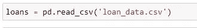

2.***info()方法***

它返回关于数据帧的基本信息。

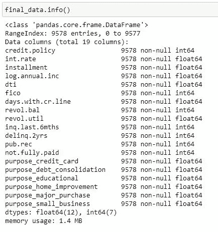

**执行一些探索性数据分析(EDA)**
然后开始创建我的模型并做出相应的预测。我对数据做了一些探索性的数据分析，以使用可视化技术进一步探索数据，并使用图形表示检查假设。我将只使用 csv 文件的数字数据。

1.  创建了两个 FICO 分布的直方图，每个分布对应一个信贷政策结果。从下面的直方图可以看出:

I .拥有“信用政策= 1”的人比拥有“信用政策= 0”的人多。我们还可以看到，根据 FICO 得分，FICO 得分较低的人倾向于“信用政策= 0”，因此这意味着 FICO 得分低于 650 的人自动不符合 lendingClub 的信用标准。

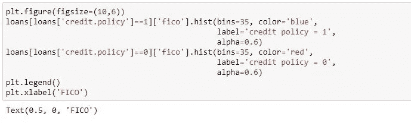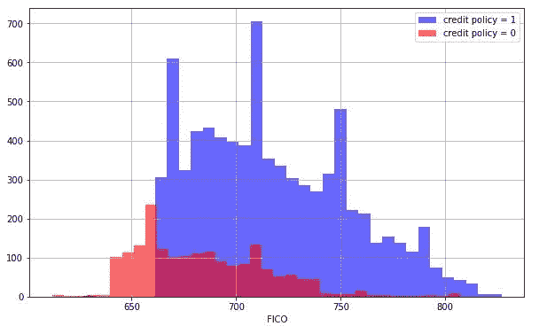

2.使用 seaborn 创建了一个 countplot，按用途显示贷款计数，颜色色调由 not . full . payed 定义。从下面的可视化结果中，我们可以看到“债务合并”是想要贷款的普遍原因。

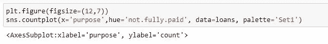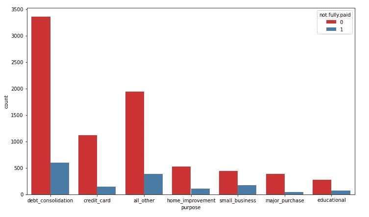

3.我们来看看 FICO 评分和利率的走势。
从下面的趋势中我们可以看到，随着 FICO 分数的增加，利率趋于降低。

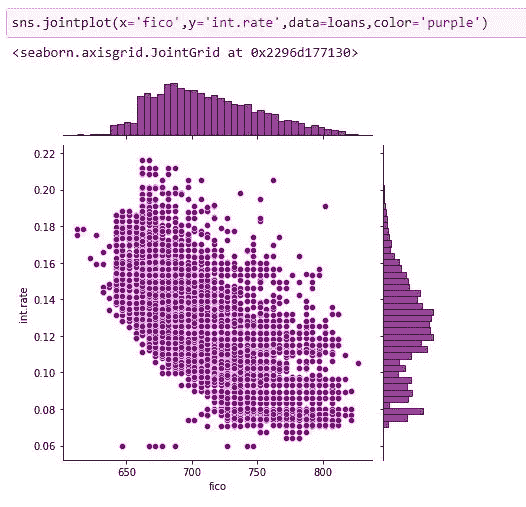

4.创建了以下图表，以查看“未全额支付”和“信贷政策”之间的趋势是否不同。下面我们可以看到，无论是贷款没有全部还清，还是他们被拒绝了信贷政策，行为都是相对相同的。

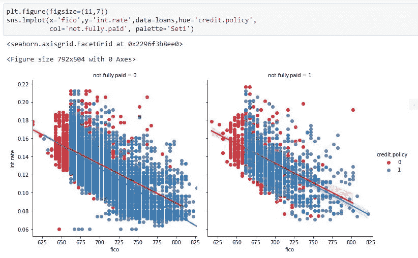

**设置数据**

让我们准备好为决策树和随机森林分类模型设置数据吧！

***再查 loans.info()*** 。

您会注意到，我们需要处理一个分类列，即“目的”列。

**转换分类特征**

请注意，purpose 列是分类特性。这意味着我们需要使用虚拟变量来转换它们，这样 sklearn 就能够理解它们。让我们使用 pd.get_dummies 一步完成。让我们向您展示一种处理这些列的方法，如果有必要，可以将这些列扩展为多个分类特征。

1.  创建包含字符串“purpose”的 1 个元素的列表。称这个列表为 cat_feats。

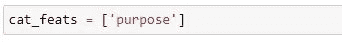

2.现在，让我们创建一个固定的更大的数据帧，该数据帧包含带有虚拟变量的新功能列。将此数据帧设置为 final_data。

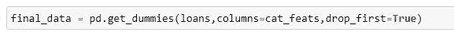

**列车试分裂**

现在是时候将我们的数据分成训练集和测试集了！探索数据之后，我进一步将数据分成训练集和测试集。我将变量 X 设置为等于其他特征，将变量 y 设置为等于“未完全支付”列的预测变量。此时，我导入了 Sklearn 模型，可以使用 sklearn 中的 model _ selection . train _ test _ split 将数据拆分为训练集和测试集，并设置 test_ size=0.3 和 random_state=101

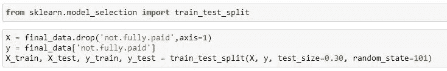

**训练决策树模型**

先从训练单个决策树开始吧！

导入决策树分类器

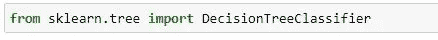

创建名为 dtree 的 DecisionTreeClassifier()实例，并使其适合定型数据。

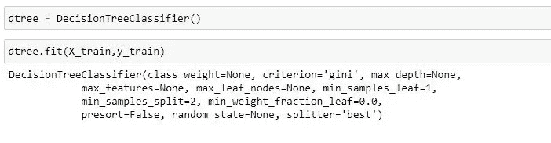

**决策树预测评估**

从测试集创建预测，创建混淆矩阵和分类报告。

**决策树的混淆矩阵**
该表有助于访问模型中的错误所在，通常是在分类问题中。这些行代表结果应该是什么样的实际类。而柱子代表我们所做的预测。使用此表，很容易确定哪些预测是错误的。

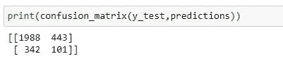

**决策树的分类报告**
由于我们已经成功制作了混淆矩阵，我们将使用分类报告来检查精确度、召回率、f1 分数，从而量化我们模型的质量。

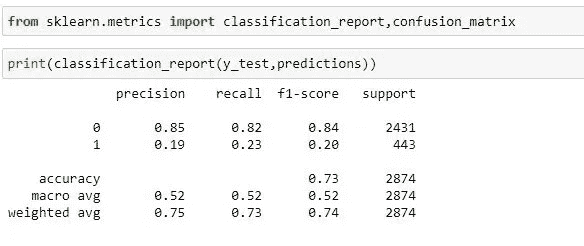

**训练随机森林模型**
创建 RandomForestClassifier 类的一个实例，并使其符合上一步的训练数据。

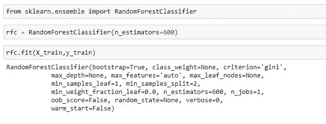

**预测和评估**
让我们预测出 y_test 值并评估我们的模型。我们还将预测非的类。X_test 数据的全额支付。

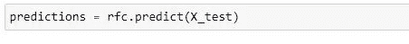

**随机森林的混淆矩阵**

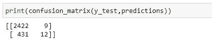

**随机森林分类报告**

现在根据结果创建一个分类报告。

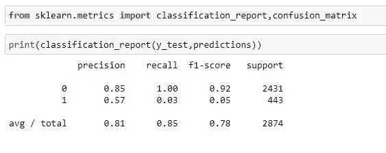

**成绩说明**

***精度***
它倾向于测量正的预测值，以知道哪个百分比是真正的正。它不能衡量正确预测的负面结果。
真阳性/(真阳性+假阳性)

***【回忆(敏感度)***
它衡量模型在预测正面方面的好坏。这意味着它查看真阳性和假阴性(即被错误预测为阴性的阳性)。回忆擅长于理解模型如何预测某事是积极的。

真阳性/(真阳性+假阴性)

***-F1-Score***
它代表了精确和回忆的调和平均值。它倾向于考虑假阳性和假阴性两种情况，可用于检测不平衡数据集。它没有考虑真正的负值。2*(精度*召回)/(精度+召回))

**观察结果**
当我们查看单决策树模型的召回时，类 1 的“0.23”优于随机森林的“0.02”。同样的观察结果也适用于 F1 分数，但当我们看整体平均值时，随机森林做得更好。

感谢您通读，非常感谢您的意见和建议，您可以在评论环节留下您的意见，直接发电子邮件给我[这里](http://usangajonah@gmail.com)或者通过下面我的其他社交媒体平台联系我。

[领英](https://www.linkedin.com/in/jonahusanga)

[推特](https://twitter.com/Jobenofficial?t=6TktOENT1z8spq8ct1WUyw&s=09)

[数据集](https://drive.google.com/file/d/1kFqKBvjE5OTOPss7Fw_xxw9_JyH-BcCR/view?usp=drivesdk)

[完整代码](https://github.com/Usangajonah/Loan-Prediction-/blob/main/Loan_Prediction.ipynb)

[投资组合网站](https://usangajonah.github.io/)