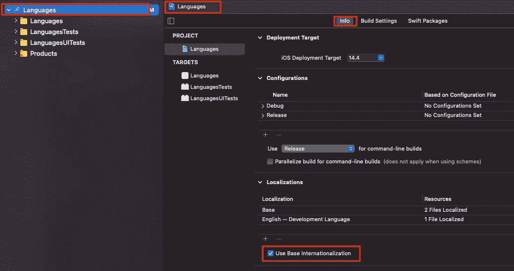
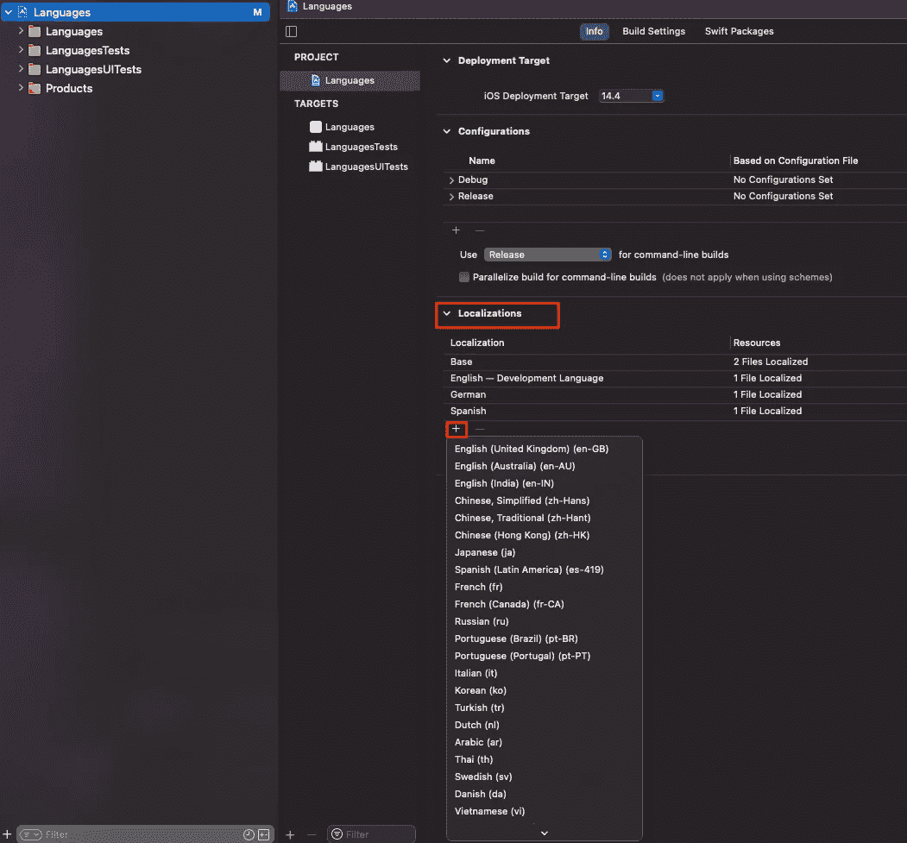
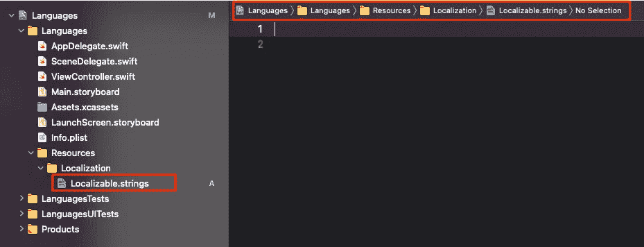
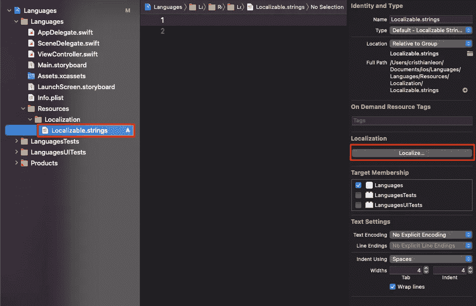
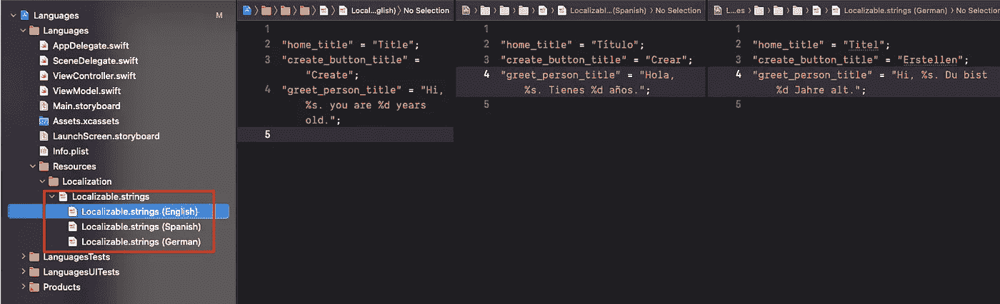
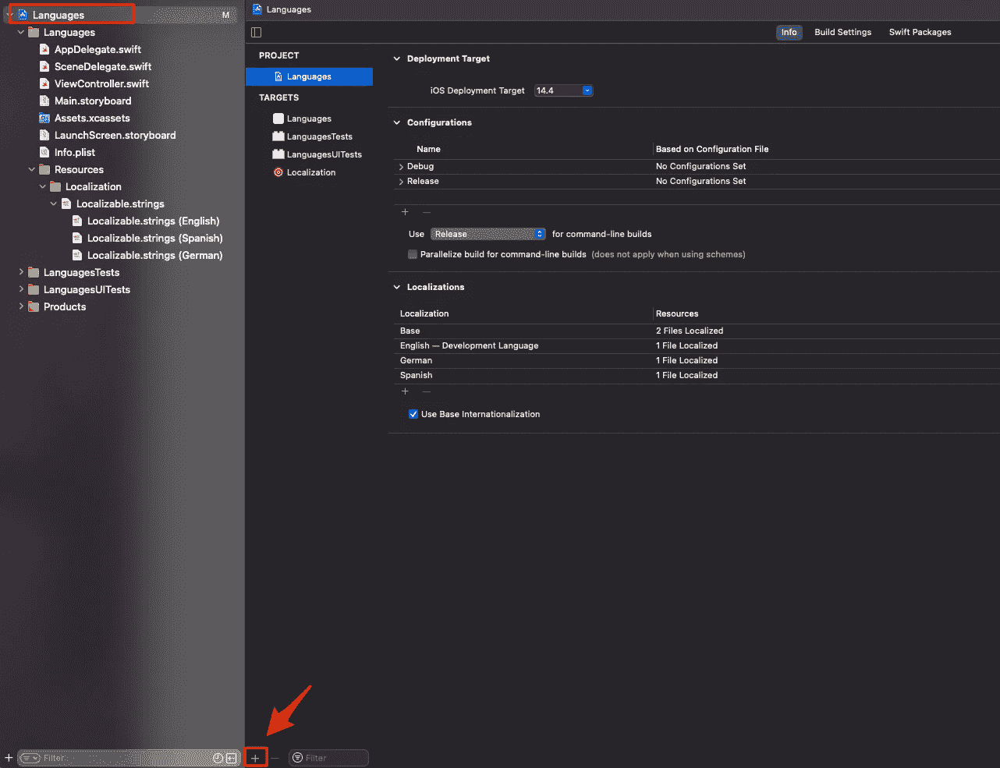

# iOS 中的本地化工作流程

> 原文：<https://medium.com/codex/localization-workflow-in-ios-9f96b7f4388c?source=collection_archive---------3----------------------->

## 使用 SwiftGen 和[短语]


照片由[杰奎琳·布兰德韦恩](https://unsplash.com/@lajaxx?utm_source=unsplash&utm_medium=referral&utm_content=creditCopyText)在 [Unsplash](https://unsplash.com/s/photos/languages?utm_source=unsplash&utm_medium=referral&utm_content=creditCopyText) 拍摄

在本文中，我将向您展示我最喜欢的一个用于 iOS 应用程序的本地化流程。您可能已经知道，本地化是几乎每个 iOS 应用程序的重要组成部分，但不幸的是，它通常被推迟到后期阶段，有时为时已晚，因此非常昂贵且难以重构。有了我将要详述的这个流程(以及互联网上的许多其他流程)，就有可能很容易地隔离在本地化方面发生的事情(拉字符串、生成常量文件等等)，并且还使维护更顺利，更容易出错。事不宜迟，我们开始吧。

## 设置项目

[ *如果您已经知道如何本地化 iOS 项目*，请跳到下一步]

首先，让我们创建一个新的 Xcode 项目，并启用 base，为此，打开。xcodeproj 文件，选择项目并在选项卡 Info 下选择 Use Base Internationalization。



在 Xcode 项目中启用基本国际化。

我们现在可以添加我们想要本地化应用程序的语言。在同一个项目设置中，转到本地化，单击加号按钮并从下拉列表中选择语言。



向项目本地化设置中添加语言。

为了完成项目的基本设置，我们需要添加一个字符串文件，对于本文，我将它命名为`Localizable.strings`，它将位于`Resources > Localization > Localizable.strings`



Localizable.strings 文件位置。

要将我们的 Localizable.strings 文件实际本地化为之前添加的所有语言，请单击`file > Localize…`,当提示出现时，选择所需的语言。



本地化 Localizable.strings 文件。

现在，为了本教程，让我们手动添加一些字符串到我们的 Localizable.strings 文件，在本文的后面，我们将通过使用`Phrase`和一个漂亮的脚本来改进它。



添加带占位符和不带占位符的本地化字符串。

## 聚合目标+脚本阶段

一旦启用了语言并将可本地化的文件添加到我们的项目中，让我们添加一个称为聚合目标的东西，它将允许我们添加构建阶段脚本(和许多其他东西),使其与主目标分开，主目标通常会增长得非常快。

*   转到项目文件。
*   单击加号按钮添加新目标。
*   在“其他”选项卡下，选择“聚合”。
*   命名目标本地化。



从项目设置中添加新目标。

现在，我们可以向之前创建的聚合目标添加一个运行脚本。

*   转到项目设置。
*   选择本地化聚集目标。
*   选择“构建阶段”选项卡。
*   添加新的运行脚本阶段。
*   添加以下 bash 代码。

根据`SwiftGen`文档，我们可能需要向项目添加一个配置文件(swiftgen-localization.yml ),我们将在其中指定 Localizable.strings 文件的路径，以及生成的常量文件`L10n.swift`的路径

```
strings:
  inputs: ../Localization/en.lproj/Localizable.strings
  outputs:
    - templateName: structured-swift5
      output: ../Localization/L10n.swift
```

## 是时候建立目标了

编译聚合目标时可能出现的错误可能是文件路径不正确(这种情况我经常遇到)或者 SwiftGen 没有正确安装在您的计算机上——假设聚合目标已经正确编译，让我们选择主目标并编译它。因为我们还没有对它做任何事情，它不应该显示任何错误。最后，我们可以将 L10n.swift 文件添加到项目中，这样 SwiftGen 生成的常量文件对我们的整个项目都是可见的。

这是一个如何使用`L10n`常量文件的快速示例，它根本不是火箭科学，字符串被转换成静态变量，蛇的大小写被转换成骆驼的大小写，字符串占位符如`%s, %d`等。被方便地转换成函数中的参数，如下面的代码片段所示。

使用我们创建的 L10n.swift 常量文件的视图模型。

## 用短语管理字符串

为了完成本地化流程，我们需要用实际的字符串填充 Localizable.strings 文件。在这一步，我使用短语[2],因为它是我作为 iOS 开发人员使用最多的一个，但是它可以很容易地被任何其他工具所替代，这些工具提供 CLI(命令行界面)、curl 请求或者只是编写一个脚本来将`.csv`转换为`.strings`文件。然而，根据我在这个领域的经验，对于与翻译者和设计者工具的协作，短语提供了一个很好的工具。也就是说，这些是我在 iOS 项目中实现 phrase 的常规步骤。

*   创建一个短语帐户并创建一个项目。
*   向项目中添加区域设置和字符串。
*   创建一个 API 令牌从客户端获取短语。
*   在您的计算机上安装短语 CLI。
*   确保您从网站上复制了`locale_id’s, project_id, and API token`并将其粘贴到配置`.yml`文件中。(更多详情见[短语文档](https://help.phrase.com/help/configuration))。
*   **【重要】**向聚合目标添加一个新的运行脚本阶段，就在我们之前创建的阶段之前，并添加行短语 pull。

再说一次，Phrase 只是一个工具，它为我作为开发人员提供了良好的体验，但对你来说不一定是一样的。如果你的项目比较小，你只想使用电子表格，你可以下载`.csv`文件并使用`csv2strings`转换工具，或者你甚至可以使用开源翻译工具，这应该不会有太大的区别。

> 它总是根据您想要使用的工具和您想要实现它的方式而变化，但是不要让它支配您的项目的行为。

## 进一步阅读

*   [1] [SwiftGen](https://github.com/SwiftGen/SwiftGen)
*   【2】[短语](https://phrase.com)
*   [iOS 基础本地化](/lean-localization/ios-localization-tutorial-938231f9f881?source=collection_home---6------0-----------------------)
*   [本地化与国际化](https://www.w3.org/International/questions/qa-i18n)
*   [G11N、I18N、T9N 和 L10N 的区别](https://www.linkedin.com/pulse/difference-between-g11n-i18n-t9n-l10n-satish-singh/)

*感谢阅读。我希望你喜欢这个小教程，如果它对你有用，不要害羞👏关于这篇文章。下次见。*