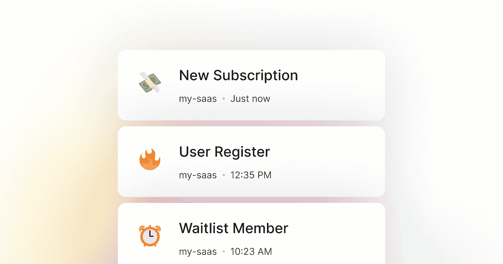
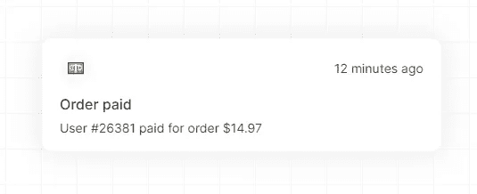
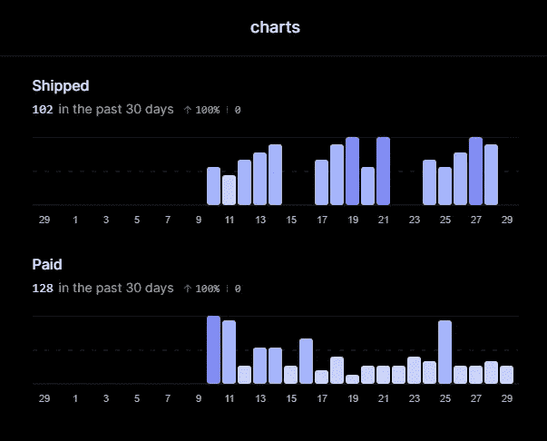
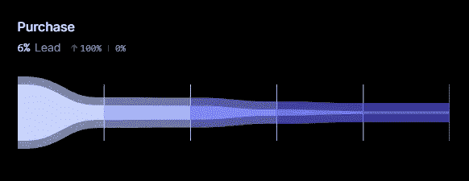
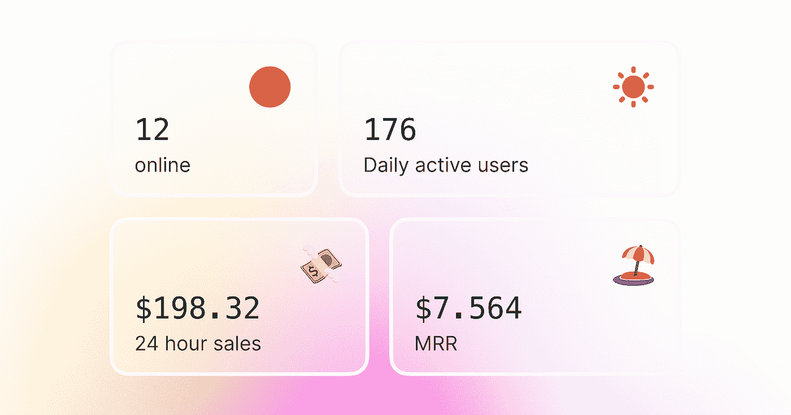
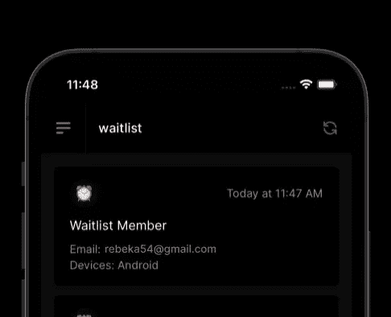
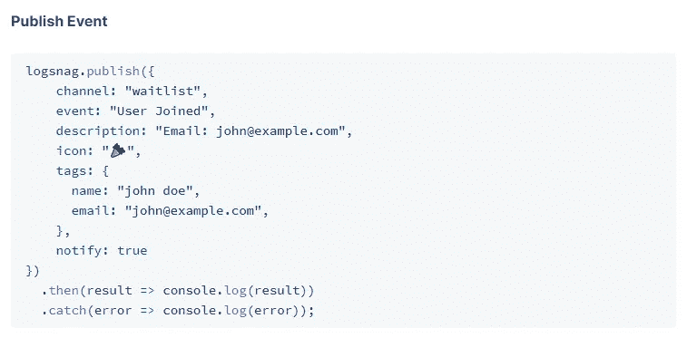

# 像专家一样记录你的应用程序

> 原文：<https://medium.com/codex/log-your-application-like-a-pro-ffceef2c160f?source=collection_archive---------16----------------------->

10 分钟安装工具还是自己编码好几天？

你肯定听说过:“不要重新发明轮子”这句话，在我将要展示的这个工具的上下文中，你应该更像是:“不要重新发明照相机”

LogSnag 是关于捕获整个时间内的日志，并向您展示关于您的应用程序的大图数据。

我使用 LogSnag 的用例是什么？

# 显示关于“需要操作”事件的通知

当我们的顾客付款时，我们需要尽快指派一名清洁女工。如果你必须每隔一段时间检查一次，这是不可能的。如果你只是在手机上收到通知，那就简单多了。

# 收集关于事件的统计数据

正如您可以实时看到的通知一样，您还可以选择以图形显示每个时间间隔的事件计数。我用这个来大致了解一下最近几天我们的活动有多成功。

# 监控销售漏斗

我们痴迷于数据。衡量转化率是最困难的事情之一。更复杂的是这些数据的可视化。LogSnag 对此有一个集成的特性。你只需输入数据，甚至可以在测量完所有数据后创建图表。

> 这帮助我们真正理解了用户在哪里被卡住了。这些信息对商业来说是无价的。

# 长期数据洞察

这个功能我没有用过。我已经在自己的应用程序中实现了类似的东西。但这是故事开头的重点。

> 不要把时间花在别人已经做得比你好 10 倍的功能上。

如果我能回到过去，我会 100%使用 LogSnag。当我打电话时，我会查看这些类型的统计数据。我的 web 应用程序没有针对移动设备进行优化…但是你猜怎么着，LogSnag 有适用于 Android 和 iPhone 的应用程序，这比一些水平滚动要好得多。

# 容易实现吗？

简而言之:是的。

长回答:认真的是的。LogSnag 比我过去用过的许多工具/API 都有更好的文档。只看代码，你只写你想显示的。

# 结论

如果你能想到任何适合你的应用的用例，就去做吧。我一直在寻找替代方案。我试着做我自己的日志。但最后，这就是我的结局。

编码快乐！

你可以在[https://logsnag.com/](https://logsnag.com/)找到 LogSnag

联系作者:[https://twitter.com/ImSh4yy](https://twitter.com/ImSh4yy)