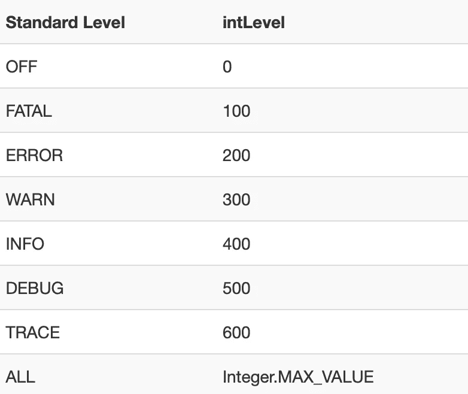
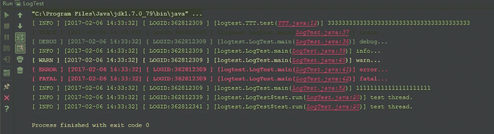

# Log4J2 |创建自定义日志级别以及如何使用它们

> 原文：<https://medium.com/codex/log4j2-create-custom-log-levels-and-how-to-use-them-48685e133fd1?source=collection_archive---------0----------------------->


照片由[稍微有用的](https://unsplash.com/@usefulcollective?utm_source=medium&utm_medium=referral)在 [Unsplash](https://unsplash.com?utm_source=medium&utm_medium=referral)

昨天我遇到了问题，我需要用不同的日志风格(不同的颜色，其他的信息顺序)记录我的应用程序的一些事件。我仍然想使用同一个记录器，不想为每种风格创建一个新的。怎么做呢？具有自定义日志级别。

# 什么是日志级别？

[日志级别](https://logging.apache.org/log4j/2.x/manual/customloglevels.html)用于根据重要性区分不同的日志。log4J 已经预定义了一些非常有用的日志级别。



如您所见，数字越大，记录的信息就越多。如果为 null，则无论使用什么日志级别来记录，都不会记录任何内容。这些日志的重要性也基于 intLevel。日志级别越高越重要。例如，致命性非常重要，很少被记录。

# 创建自定义日志级别

首先，我们需要在 build.gradle 文件中添加 Log4J2 作为依赖项。

我们需要 log4J 的核心和 api，我们可以从配置 log4j2.xml 文件开始。

Log4J 会在你的项目中寻找不同的文件。我们可以配置不同类型的文件，但是在我们的例子中，我们将坚持使用 log4j2.xml 文件。它用于配置记录器和日志级别。

就在文件的顶部，我们创建了一个新的自定义级别，名为 SUCCESS，intLevel 为 350。如果您将这个 intLevel 与上面的表进行比较，您可以看到，每当至少 info 级别处于活动状态时，都会记录这个日志级别。

第二部分是我们的 appender 的定义。在这种情况下，我们只使用普通的 SYSTEM_OUT 作为控制台。模式布局也很重要，并且易于使用。在这种配置中，只有消息以高亮颜色打印出来。这些颜色是为每个日志级别定义的。例如，错误被打印为红色。

最后一部分是配置记录器本身。记录器将具有它在其中被实例化的类的名称。您可以设置默认日志级别和[相加性](https://logging.apache.org/log4j/2.x/manual/configuration.html#Additivity)。这通常被设置为 false，因为如果它被设置为 true，您将从根日志记录器和您定义的日志记录器接收两次每个日志事件。Appender Ref 定义了日志应该放在哪里。在我们的例子中，只是命令行。

# 使用日志级别

为了使用我们上面定义的[自定义日志级别](https://logging.apache.org/log4j/2.x/manual/customloglevels.html#Defining%20Custom%20Log%20Levels%20in%20Code)，我们必须为日志记录器创建一个扩展函数。这是成功等级的样子:

## 创建记录器的实例

使用日志记录器最简单的方法是用 LogManager 创建一个新的日志记录器，并从那里调用日志级别。

这种方式经常被使用，因为它真的很容易使用，第一次眨眼就能理解。现在我将向你展示另一种方法。

## 使用 Kotlin 代理

因为我们使用的是 Kotlin，所以我们有机会使用 Kotlin Delegate，这在本例中非常有用。如果你不知道 Kolin Delegate 是什么或者它做什么，请阅读[这篇关于它的](/yellowme/delegation-pattern-in-kotlin-a0ce5c5bb89f)文章。它帮助我很好地理解它。

请注意带有的部分

```
Logger by LogManager.getLogger()
```

这将 LogManager.getLogger()委托给我自己的类，使它能够立即使用信息或成功日志记录，而不必实际创建对象。委托也不依赖于基类。

这些日志的输出可能如下所示。这取决于 log4j2.xml 文件中的配置。



# 反射

## 什么进展顺利

log4j2 本身的使用非常简单快捷。此外，配置的可能性几乎是无限的。配置这些日志的输出也有很多可能性，但是我选择了 log4j2.xml 文件，因为它对我来说是最容易理解的。

## 什么需要改进

开始时，我在使用正确的日志级别来注销我的自定义日志级别时遇到了一些麻烦。我遇到的另一个问题是使用 Kotlin 委托。最后，并没有那么复杂，我只是忘记了实现中的一个小细节，正因为如此，它总是失败。

我希望这篇文章对你有用😃