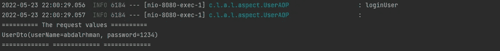

# 使用方面对象编程记录 Spring 请求

> 原文：<https://medium.com/codex/logging-spring-requests-using-aspect-bf11bb3382da?source=collection_archive---------0----------------------->

## 简介:


詹姆斯·哈里逊在 [Unsplash](https://unsplash.com?utm_source=medium&utm_medium=referral) 上拍摄的照片

在任何 web 应用程序中，我们都需要记录请求和响应，我们可以在 java 中使用 Log4j 来做到这一点，但在这种技术中，我们将在业务角色中编写日志，这很好，但我们有更好的行为。

在本文中，我们将使用 spring boot Restful API 和方面编程方法来记录请求。

我们将看看我们如何能做到这一点。以及为什么我们需要编写方面方法来完成它。

要查看 java 和 spring boot 中方面对象编程的概述，可以点击下面的链接。

1.[用 Spring boot 进行方面对象编程(上)](/codex/aspect-object-programming-with-spring-boot-part-one-4544a58d6a4c)

2.[用弹簧靴编程的特征对象示例(零件牵引)](/codex/aspect-object-programing-with-spring-boot-example-a2d0bf8f1578)

## 外观配置:

在创建新的 spring boot 项目后的第一步中，我们需要将我们的配置放在 **pom.xml** 文件中。

我们有一个简单的依赖关系来运行 spring boot 应用程序。

```
<?xml version="1.0" encoding="UTF-8"?>
<project  xmlns:xsi="http://www.w3.org/2001/XMLSchema-instance"
         xsi:schemaLocation="http://maven.apache.org/POM/4.0.0 https://maven.apache.org/xsd/maven-4.0.0.xsd">
    <modelVersion>4.0.0</modelVersion>
    <parent>
        <groupId>org.springframework.boot</groupId>
        <artifactId>spring-boot-starter-parent</artifactId>
        <version>2.7.0</version>
        <relativePath/> <!-- lookup parent from repository -->
    </parent>
    <groupId>com.logging.aspect</groupId>
    <artifactId>logging-spring-RestApi-using-aspect-object-programming</artifactId>
    <version>0.0.1-SNAPSHOT</version>
    <name>logging-spring-RestApi-using-aspect-object-programming</name>
    <description>logging-spring-RestApi-using-aspect-object-programming</description>
    <properties>
        <java.version>11</java.version>
    </properties>
    <dependencies>
        <dependency>
            <groupId>org.springframework.boot</groupId>
            <artifactId>spring-boot-starter-web</artifactId>
        </dependency>

        <dependency>
            <groupId>org.projectlombok</groupId>
            <artifactId>lombok</artifactId>
            <optional>true</optional>
        </dependency>
        <dependency>
            <groupId>org.springframework.boot</groupId>
            <artifactId>spring-boot-starter-test</artifactId>
            <scope>test</scope>
        </dependency>
    </dependencies>

    <build>
        <plugins>
            <plugin>
                <groupId>org.springframework.boot</groupId>
                <artifactId>spring-boot-maven-plugin</artifactId>
                <configuration>
                    <excludes>
                        <exclude>
                            <groupId>org.projectlombok</groupId>
                            <artifactId>lombok</artifactId>
                        </exclude>
                    </excludes>
                </configuration>
            </plugin>
        </plugins>
    </build>

</project>
```

现在我将在这个项目中向活动方面添加方面依赖。

```
<!-- enable aspect -->
<dependency>
    <groupId>org.springframework</groupId>
    <artifactId>spring-aop</artifactId>
    <version>5.3.18</version>
</dependency>

<dependency>
    <groupId>org.aspectj</groupId>
    <artifactId>aspectjrt</artifactId>
    <version>1.9.9.1</version>
</dependency>

<dependency>
    <groupId>org.aspectj</groupId>
    <artifactId>aspectjweaver</artifactId>
    <version>1.9.9.1</version>
</dependency>
```

上述依赖关系是在任何 maven 项目中激活 AOP 的重要依赖关系。

## 为应用程序编写业务逻辑

这个项目中我们需要什么？

实际上，在这个项目中，我们需要一些特性来完成你对 AOP 的设想。

1.  简单控制器:我们需要它来处理来自客户端的请求
2.  简单服务:我们需要它将请求从控制器传递到 DTO
3.  简单的 DTO:我们需要在终端中使用 AOP 包登录
4.  简单枚举:我们需要创建一个枚举来知道我们需要记录什么数据**请求，响应**

让我们去做吧。

1.  创建控制器:

我们的控制器叫做 Usercontroller，我们将在一个叫做 Controller 的包中创建它来安排我们的代码。

```
package com.logging.aspect.loggingspringrestapiusingaspectobjectprogramming.controller;

import com.logging.aspect.loggingspringrestapiusingaspectobjectprogramming.model.UserDto;
import com.logging.aspect.loggingspringrestapiusingaspectobjectprogramming.service.UserService;
import org.springframework.http.ResponseEntity;
import org.springframework.web.bind.annotation.PostMapping;
import org.springframework.web.bind.annotation.RequestBody;
import org.springframework.web.bind.annotation.RequestMapping;
import org.springframework.web.bind.annotation.RestController;

import java.net.URI;

@RestController
@RequestMapping("user")
public class UserController {
    private UserService userService;

    public UserController(UserService userService){
        this.userService=userService;
    }

    @PostMapping("/login")
    public ResponseEntity<UserDto> loginUser(@RequestBody UserDto userDto) throws Exception {
        return ResponseEntity.*ok*().body(userService.login(userDto));
    }
}
```

您可以通过 [UserController](https://github.com/abdalrhmanAlkraien/logging-spring-RestApi-using-aspect-object-programming/blob/main/src/main/java/com/logging/aspect/loggingspringrestapiusingaspectobjectprogramming/controller/UserController.java) 在 git hub 中看到 DataType enum

2.创建服务:

我们的服务叫做 Userservice，我们将在一个叫做 Service 的包中创建它来安排我们的代码。

```
package com.logging.aspect.loggingspringrestapiusingaspectobjectprogramming.service;

import com.logging.aspect.loggingspringrestapiusingaspectobjectprogramming.model.UserDto;
import org.springframework.stereotype.Service;

@Service
public class UserService {

    public UserDto login(UserDto userDto) throws Exception {
        if(userDto.getUserName().equals(userDto.getPassword())){
            throw new Exception();
        }
        return userDto;
    }
}
```

您可以通过 [UserService](https://github.com/abdalrhmanAlkraien/logging-spring-RestApi-using-aspect-object-programming/blob/main/src/main/java/com/logging/aspect/loggingspringrestapiusingaspectobjectprogramming/service/UserService.java) 在 git hub 中看到 DataType enum

3.创建用户到:

我们的 UserDto 被称为 **UserDto** ，我们将在一个名为 model 的包中创建它来安排我们的代码。

```
package com.logging.aspect.loggingspringrestapiusingaspectobjectprogramming.model;

import lombok.Data;

@Data
public class UserDto {
  private String userName;
  private String password;
}
```

您可以通过[userdo](https://github.com/abdalrhmanAlkraien/logging-spring-RestApi-using-aspect-object-programming/blob/main/src/main/java/com/logging/aspect/loggingspringrestapiusingaspectobjectprogramming/model/UserDto.java)在 git hub 中查看数据类型 enum

4.枚举数据类型:在这个枚举中，我们有两种类型**请求**和**响应，**我将创建一个**实用程序**包来安排我们的项目。

```
package com.logging.aspect.loggingspringrestapiusingaspectobjectprogramming.utile;

public enum DataType {
    *REQUEST*,*RESPONSE* }
```

您可以通过[数据类型](https://github.com/abdalrhmanAlkraien/logging-spring-RestApi-using-aspect-object-programming/blob/main/src/main/java/com/logging/aspect/loggingspringrestapiusingaspectobjectprogramming/utile/DataType.java)在 git hub 中看到数据类型枚举

现在，在完成业务逻辑之后，我们需要通过 AOP 方法跟踪请求和响应。

## **方面-对象编程(AOP)**

第一步，我们需要创建一个名为 **aspect 的新包，**这个包将有 aspect 类。这个包中的第一个类叫做 **UserAOP。**

在这堂课中，我们将编写一个代码来完成以下过程。

1.  我们需要捕捉所有的请求并记录下来。
2.  我们需要捕捉所有的响应并记录下来。
3.  我们需要捕捉任何异常并记录错误及其位置。

让我们去做吧。

我将在下面的代码块中解释重要的代码。

在课程的第一步，我们需要毫无问题地定义和运行。您可以看到下面的代码，并阅读注释行以便更好地理解。

```
package com.logging.aspect.loggingspringrestapiusingaspectobjectprogramming.aspect;

import com.logging.aspect.loggingspringrestapiusingaspectobjectprogramming.utile.DataType;
import lombok.extern.log4j.Log4j2;
import org.aspectj.lang.JoinPoint;
import org.aspectj.lang.annotation.Aspect;
import org.aspectj.lang.annotation.Before;
import org.aspectj.lang.annotation.Pointcut;
import org.springframework.stereotype.Component;

import java.util.Arrays;

*/**
 Component: The aspect class must be Component Bean inside the spring context.
 Aspect: We need to write @Aspect above the class to interrupt each advice inside it.
 Log4j2: from Lombok for logger any message and debug the code
 **/* @Component
@Aspect
@Log4j2
public class UserAOP {// our logic here }
```

**记录控制器收到的所有请求**

现在我们需要创建一个新的方法来捕获控制器将接收的所有请求。

下面的代码在注释行中解释了每一步

```
*/**
 * the following code will represent api Point cut value to set and reuse it inside any point cut method
 * log controller is a point cut method
 **/* private final String apiPointCut="execution(* com.logging.aspect.loggingspringrestapiusingaspectobjectprogramming.controller.*.*(..))";

@Pointcut(apiPointCut)
public void logController(){}

*/**
 *
 ** ***@param*** *joinPoint we can find inside it all the details of the method called inside the join point
 *
 * the AOP will execute this method before execute controller method
 */* @Before("logController()")
public void logRequest(JoinPoint joinPoint){
    // for log the controller name
    *log*.info(joinPoint.getSignature().getName());
    // for log the request attributes form client side
    *log*.info(createJoinPointForLogs(joinPoint,DataType.*REQUEST*));
}

*/**
 *
 ** ***@param*** *joinPoint we need to use it to see attributes in the original method
 ** ***@return*** *will return String after building all the attributes
 */* private String createJoinPointForLogs(JoinPoint joinPoint, DataType dataType) {
    */**
     * the joinPoint has arguments from the controller,
     * but we can see the args will receive here as an Array we need to check the length of it before making any Operations.
     */* if (joinPoint.getArgs().length < 1) {
        return joinPoint.getSignature().getName()
                .concat(" method don`t have parameters");
    }
    Object[] obj = joinPoint.getArgs();
    StringBuilder requestValue = new StringBuilder();
    if(dataType.equals(DataType.*REQUEST*)){
        requestValue.append("\r\n========== The request values ==========");
    }
    else {
        requestValue.append("\r\n========== The response values ==========");
    }
    Arrays.*stream*(obj).forEach(x -> {
        requestValue.append("\r\n");
        requestValue.append(x.toString());
    });
    requestValue
            .append("\r\n============= ======="
                    + "====== =============");
    return requestValue.toString();
}
```

**记录所有来自控制器的响应:**

在这一节中，我们需要实现代码来捕捉来自控制器的任何响应。

下面的代码在注释行中解释了每一步。

```
@AfterReturning("logController()")
public void logsResponse(JoinPoint joinPoint){
    // for log the controller name
    *log*.info(joinPoint.getSignature().getName());
    *log*.info(createJoinPointForLogs(joinPoint,DataType.*RESPONSE*));
}
```

实际上，我们只为响应后的日志添加了一个方法

**记录项目中的所有异常:**

在这一节中，我们需要实现代码来捕捉项目内部将发生的任何异常。

下面的实现将捕获并记录项目中的任何异常，从日志中我们将知道错误在哪里。

为了补充它，我们需要一个新的变量和新的方法。

下面的代码在注释行中解释了每一步。

```
*/**
 * the following point cut will scan all the project and catch any errors inside the project files
 */* private final String exceptionPointcut ="execution(* com.logging.aspect.loggingspringrestapiusingaspectobjectprogramming.*.*.*(..))";*/**
 * This method will print
 ** ***@param*** *joinPoint we can find inside it all the details of the method called inside the join point
 ** ***@param*** *exception from here we can know more details about the exception like exception type and exception message
 */* @AfterThrowing(value = exceptionPointcut ,throwing = "exception")
public void logsErrors(JoinPoint joinPoint, Throwable exception){
    *log*.info("========================== We have Error here ==========================");
    // for log the controller name
    *log*.info(joinPoint.getSignature().getName());
    // for know what the exception message
    *log*.info(exception.getMessage());
    *log*.info("==========================================================================");
}
```

您可以使用下面的链接在 git hub 上找到这个项目。

[https://github . com/abdalrhmanAlkraien/logging-spring-RestApi-using-aspect-object-programming](https://github.com/abdalrhmanAlkraien/logging-spring-RestApi-using-aspect-object-programming)

**使用 PostMain 和 IDEA 终端日志测试代码**

为了测试代码，我将使用 postman，并通过 IDEA 终端查看日志。您可以使用任何其他工具。

**我们去测试代码吧。**

实际上，此时我们有一个 Post 方法 URI[http://localhost:8080/user/log in](http://localhost:8080/user/login)。

请看下图，看看邮递员将如何工作。


当发送此请求时，您必须看到类似下面的请求图像。



现在，当返回响应时，会出现类似下图的请求。


**现在如果试图为用户名和密码发送相同的值，将会抛出一个新的异常。**

在发送具有相同的用户名和密码值**的请求后，**将会看到类似下图的日志。


您可以看到，当使用方面时，您可以用一个日志实现创建许多 API。

## 结论:

使用方面方法，您可以记录许多事情，而不需要在每个类中编写日志代码。您可以从**冗余中保存代码。**

使用方面方法，您的业务日志有自己的一面，而您的日志和跟踪代码有另一面。这意味着你的代码在未来保持有序，没有任何随机性。

使用 spring-boot 的方面对象编程为开发人员提供了许多提高代码质量的特性。例如，使用注释来记录特定的方法和许多其他特性。

您可以使用下面的代码在 git hub 上看到项目代码。

[](https://github.com/abdalrhmanAlkraien/logging-spring-RestApi-using-aspect-object-programming) [## GitHub-abdalrhmanAlkraien/logging-spring-RestApi-using-aspect-object-programming:logging all…

### 此时您不能执行该操作。您已使用另一个标签页或窗口登录。您已在另一个选项卡中注销，或者…

github.com](https://github.com/abdalrhmanAlkraien/logging-spring-RestApi-using-aspect-object-programming) 

**别忘了在文章上拍手，每篇文章可以拍手 50 次。还有你在这里找到我的**[**LinkedIn**](https://www.linkedin.com/in/abd-alrhman-alkraien-83a93a1b1/)

## 参考资料:

[https://github.com/abdalrhmanAlkraien/Aspect-example](https://github.com/abdalrhmanAlkraien/Aspect-example)